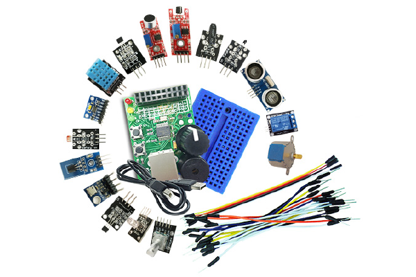

Introduction to IoT
===================

The first course will touch on the fundamentals of IoT. After a short history of the creation of IoT, the course will explain briefly what IoT is and why it is important.

<youtube>IIgDQbp2-dY</youtube>

The term “Internet of Things” was coined by Kevin Ashton in 1999. 
Ashton, who was working in supply chain optimization, wanted to attract senior management’s attention to a new exciting technology called RFID. 
Because the internet was the hottest new trend in 1999, he called his presentation “Internet of Things”.

The internet of things is an extension of the current internet, further into the physical world.
We can collect data from the physical world using sensors and also effect changes in the physical world using actuators or effectors.

IoT is increasingly becoming popular because of advances in smartphone technology, internet connectivity, wearables and its relationship with open source, big data, security and privacy and software-defined networking.

The applications of IoT are wide: wearables, smart home automation, precision agriculture, smart city...
It is pervasing both consumer industrial worlds.

Finally, the challenges facing IoT are the security, the lack of strong regulations, availability of skilled talent, compatibility, bandwidth and customer expectations.

IoT Architecture
================

There is no single consensus on an architecture for IoT, which is agreed on universally.
However, different architectures have been proposed by different researchers.
The 3 and 5 layer architectures are the most widely used. However the 3 layer is the most commonly used so in this lecture we will look at the 3 layer architecture. The three first layers are: 
- *The perception layer* has sensors for sensing and gathering information about the environment.
- *The transport layer* allows to connect together to the smart things, network devices, and servers. It also transmits and processes sensor data.
- *The application layer* delivers application specific services to the user. It defines various applications in which the Internet of Things can be deployed.

Additionally, we sometimes add two more layers:
- *The business layer* manages the whole IoT system, including applications, business and profit models, and users’ privacy.
- *The processing layer*, also known as the middleware or edge layer, allows to process, store and analyze sensor data.

In Waziup, we divide the architecture in three layers:

WaziDev is a development platform, capable of sending data through LoRaWAN to the WaziGate.
The WaziGate processes locally the data and forwards it to the WaziCloud, were the user applications lives.
More on this in Waziup module!

Protocols
=========

Protocols are systems of rules and procedures that allow two or more entities to communicate.
The TCP/IP protocol stack is at the heart of the Internet, which is the “I” in IoT, or course!
It can be represented using the OSI seven-layer reference model.

Here are few protocols used with IoT:
- *HTTP* is the foundation of the client-server model used for the Web. The more secure method to implement HTTP is to include only a client in your IoT device, not a server
- *WebSocket* is a protocol that provides full-duplex communication over a single TCP connection between client and server.
- *CoAP* is for use with low-power and constrained networks. CoAP is a RESTful protocol.
- *MQTT* is a publish/subscribe messaging transport that is extremely lightweight and ideal for connecting small devices to constrained networks.

