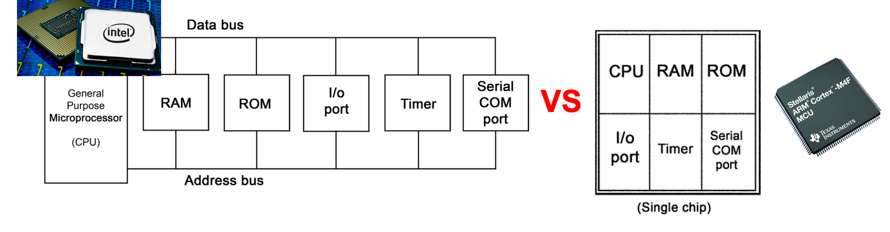
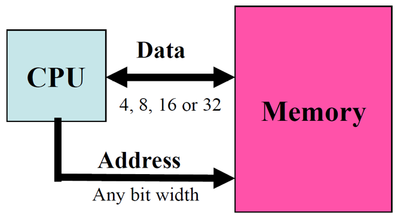
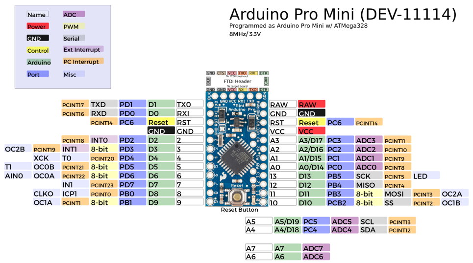

In this lesson, we'll learn what is a microcontroller.



## Microcontroller vs Microprocessor

A microprocessor unit (MPU) is a processor on one silicon chip. A microcontroller unit (MCU) is a microprocessor with some added circuitry on one silicon chip. A microcontroller can therefore be used standalone, without the need of any additional component to be able to function. Microcontrollers are used in embedded computing and most IoT devices are based on microcontrollers.

As indicated previously, a microcontroller can be standalone but, it is usually mounted on a board with additional **non-critical**
electronic parts: LEDs, voltage regulators, header pins for easy access to microcontroller pins, reset button, serial-USB interface,... Below, an Arduino Pro Mini based on the ATmega328P microcontroller.

//TODO: fix treeview
treeview />}}

## Bit definition

The number of bits describing the data path defines the MCU bit definition. As a general rule of thumb, the more bit definition, the more powerful, or fast, the MCU. "Old" microcontrollers are usually 8-bit. More recent microcontrollers are usually 32-bit. Note that the bit definition does not really limit the "functionalities" of the microcontroller, but rather its speed. Even with an 8-bit microcontroller, you can do floating point operation on 32-bit word, but it will take longer.  

## Common memory types in MCUs

### RAM

Most microcontrollers have little amount of internal RAM (embedded in MCUs). For instance, the ATmega328P has only 2 Kbytes and this is a common amount, although some more powerfull microcontrollers can have more.

RAM is typically used to store variables (global, local, stack,...) and data of your program. **So use the small amount of RAM wisely** and avoid declaring large static arrays of bytes.

### EEPROM

EEPROM stands for Electrically-Erasable-and-Programmable ROM. Internally, they are similar to EPROMs, but the erase operation is accomplished electrically, rather than by exposure to ultraviolet light. They usually have a higher cost and their write cycles are also significantly longer than RAM. EEPROM are typically used to store permanent data such as configuration parameters for an IoT device that can be obtained after the node has booted and that need to be restored/used when the node reboots.

### Flash memory

The flash memory is usually for storing the program itself. Note that in many cases, it is possible to store static strings in the flash memory in order to use the very limited amount of RAM. Typical amount of flash memory can be of several KB, from 32KB to 256KB or more for advanced microcontrollers. For instance, the ATmega328P has 32 Kbytes of flash memory to store the program.

## MCU ports/pins: the interface to the physical world

A microcontroller has a number of ports or pins to interact with other electronic components. We will see later in the [`Sensors`](/sensors) section that those ports can be connected to physical sensors in order to interact with the physical world, which is one of the unique features of IoT.

A pin can be at `LOW` level (usually 0V), `HIGH` level (5V or 3.3V depending on the operating voltage of the board) or something in between. 

Pins can be either `INPUT`, when you want to take information into the MCU, or `OUTPUT` when you want to change the state of something outside the MCU (turn a led/motor ON or OFF, etc.). For instance, you can power a low-power physical sensor with a pin configured as OUTPUT, and set the pin to HIGH. Usually, pins default to input direction on power-up or reset. Your program can set or change the directionality of a pin at any time.

Some pins are called analog pins because they have an embedded analog-to-digital converter in which case you will be able to read a digital value from the analog pin to convert that digital value into the original voltage applied to that pin. This is usually how a program can get data from an analog sensor.

{}
Be careful when applying voltage to a pin. While many microcontroller boards can be tolerant regarding the pin input voltage, i.e. accepting 5V to into a 3.3V pin, you must still pay attention to use the appropriate voltage. Also note that a microcontroller pin can usually deliver a very limited current, usually from 30mA to 50mA in most cases. Pins delivering more than 100mA are usually dedicated pins.
{}

{}
If you need to power control a power-hungry device such as a GPS sensor for instance, it is recommended to use a MOSFET transistor that will be driven by the microcontroller pin. To work with much higher voltage, i.e. 220V, or electrical power, the microcontroller pins will typically be used to control so-called relay modules.
{}

## Example: the ATmega328p

> The Atmel 8-bit AVR RISC-based microcontroller combines 32 KB ISP flash memory with read-while-write capabilities, 1 KB EEPROM, 2 KB SRAM, 23 general-purpose I/O lines, 32 general-purpose working registers, 3 flexible timer/counters with compare modes, internal and external interrupts, serial programmable USART, a byte-oriented 2-wire serial interface, SPI serial port, 6-channel 10-bit A/D converter (8 channels in TQFP and QFN/MLF packages), programmable watchdog timer with internal oscillator, and 5 software-selectable power-saving modes. The device operates between 1.8 and 5.5 volts. The device achieves throughput approaching 1 MIPS/MHz.
>
> Quoted from [wikipedia](https://en.wikipedia.org/wiki/ATmega328)

## From microcontroller to microcontroller board

### Arduino boards with ATmega328p

The ATmega328p microcontroller is used in the Arduino [Uno](https://docs.arduino.cc/hardware/uno-rev3), Arduino [Nano](https://docs.arduino.cc/hardware/nano) and Arduino [Pro Mini](https://docs.arduino.cc/retired/boards/arduino-pro-mini) boards.

### Pin schematic of the Arduino Pro Mini

## The growing ecosystem

Since the revolution created by the first iconic [Arduino boards](https://www.arduino.cc/en/Main/Products) the microcontroller ecosystem is growing at a fast rate! There are now plenty of nice boards from many manufacturers, with a wide range of functionalities, from very low-power to very powerful to boards, even embedding micro Python programming environment, there are a board for every usage!

See for instance this article presenting [10 Boards to Start IoT Development in 2021](https://medium.com/vacatronics/10-boards-to-start-iot-development-a3f8cb085366).

Advanced architectures
======================

## ARM Cortex-M

When it comes to more powerful microcontroller boards, a vast majority uses the [ARM](https://en.wikipedia.org/wiki/ARM_architecture) Cortex-M processor core family because they are low-cost and energy-efficient integrated circuits. 

> The ARM Cortex-M is a group of 32-bit RISC ARM processor cores licensed by Arm Holdings. These cores are optimized for low-cost and energy-efficient integrated circuits, which have been embedded in tens of billions of consumer devices. Though they are most often the main component of microcontroller chips, sometimes they are embedded inside other types of chips too. The Cortex-M family consists of Cortex-M0, Cortex-M0+, Cortex-M1, Cortex-M3, Cortex-M4, Cortex-M7, Cortex-M23, Cortex-M33, Cortex-M35P, Cortex-M55.
>
> Quoted from [wikipedia](https://en.wikipedia.org/wiki/ARM_Cortex-M).

ARM company is only designing the processor core architecture so you will probably read something similar to:

> The board is powered by Atmel’s SAMD21 MCU, which features a 32-bit ARM Cortex® M0+ core.
>
> Quoted from [Arduino Zero page](https://store.arduino.cc/products/arduino-zero).

which means that the Atmel manufacturer designed their SAMD21 MCU based on the ARM Cortex® M0+ core design.

### Cortex-M0, Cortex-M0+, Cortex-M1, Cortex-M3, ...

The family variants M0, M0+, M1, ... correspond to a given architecture and instruction set. For instance:

> The Cortex-M0 / M0+ / M1 implement the ARMv6-M architecture, the Cortex-M3 implements the ARMv7-M architecture, the Cortex-M4 / Cortex-M7 implements the ARMv7E-M architecture, the Cortex-M23 / M33 / M35P implement the ARMv8-M architecture, and the Cortex-M55 implements the ARMv8.1-M architecture.
>
> Quoted from [wikipedia](https://en.wikipedia.org/wiki/ARM_Cortex-M#Instruction_sets).

More details can be found on the [wikipedia page](https://en.wikipedia.org/wiki/ARM_Cortex-M#Instruction_sets).

### ARM Cortex-M board examples

Here are some boards using these families of ARM microcontrollers. There are plenty of them.

- [Arduino Zero](https://store.arduino.cc/products/arduino-zero) and [Adafruit Feather M0](https://www.adafruit.com/product/2772):
	- These boards are powered by Atmel’s SAMD21 MCU, which features a 32-bit ARM Cortex® M0+ core
	
	
	
- [Teensy boards](https://www.pjrc.com/teensy/)
	- The Teensy 3.2 board is powered by NXP Semiconductors/Freescale MCU, which features a 32-bit ARM Cortex® M4 core
	

- STM32 Nucleo 32
	- The board is powered by an STM32F303K8T6 MCU, which features a 32-bit ARM Cortex® M4F core
	
	
- Raspberry Pico
	- The board is powered by RP2040, which features a 32-bit ARM Cortex® M0 core
		
	
## ESP8286/ESP32

Another famous microcontroller branch is the ESP8286/ESP32 from Expressif. The ESP8266 is a low-cost Wi-Fi microchip, with built-in TCP/IP networking software, and microcontroller capability. The ESP32 is the successor of the ESP8286 and "employs either a Tensilica Xtensa LX6 microprocessor in both dual-core and single-core variations, Xtensa LX7 dual-core microprocessor or a single-core RISC-V microprocessor and includes built-in antenna switches, RF balun, power amplifier, low-noise receive amplifier, filters, and power-management modules", quoted from [wikipedia](https://en.wikipedia.org/wiki/ESP32). They are therefore not following and using the ARM Cortex-M architecture but the Tensilica Xtensa LX6/7 architecture.

Many ESP8286/ESP32-based boards are available on the market and their embedded WiFi make them very easy to be connected to the Internet. Below are the Heltec WiFi LoRa 32 with a small embedded OLED screen and the more common Node-MCU based on ESP32-WROOM.

Look at the [`Advanced boards/Boards with WiFi`](board_with_wifi) section for an example on how to use the embedded WiFi features.

IC2/SPI buses
=============

## Introduction

Dedicated bus technologies are useful to connect peripheral to the host microcontroller. When dealing with digital sensors instead of analog sensors, these data buses are almost mandatory. In the microcontroller world, there are usually 3 types of buses: 1-wire, I2C and SPI.

## 1-wire

1-Wire is a device communications bus system designed by Dallas Semiconductor Corp. that provides low-speed (16.3 kbit/s) data, signaling, and power over a single conductor. It is typically used to communicate with very simple and low-speed devices such as simple digital sensors.

More details on the 1-wire protocol on the [wikipedia page](https://en.wikipedia.org/wiki/1-Wire).

{}
See the [DS18B20](/sensors/temperature/ds18b20/) example for connecting a temperature sensor with 1-wire bus protocol.
{}

## I2C bus

I2C (Inter-Integrated Circuit) is one of the most popular communication protocol used in embedded systems. It has been designed by Philips for simple audio-video appliances controlled by the microcontroller.

There are many chips that can be connected to the processor with this interface which uses SDA (data) and SCL (clock) pins:
- EEPROM memory chips 
- RAM memory chips 
- AD/DA converters 
- Real-time clocks 
- Sensors
- OLED screens
- ...

In an I2C bus, each device (slave) has an assigned address to allow the master (microcontroller) to indicate which I2C slave it is communicating with.

Note that on many microcontrollers, SDA and SCL lines are usually mapped to pre-defined pins. For instance, on Arduino boards using the ATmega328P microcontroller, SDA is usually pin A4 and SCL is usually pin A5. **You need to check the board's schematic!**

Being a low-speed bus technology, it is possible to use other pins for SDA and SCL lines provided that the software library allows so.

More details on the I2C bus and the [wikipedia page](https://en.wikipedia.org/wiki/I%C2%B2C).

{}
See the [OLED](/sensors/oled) example for connecting a small I2C OLED screen.
{}

## SPI bus

SPI (Serial Peripheral Interface) is a synchronous serial interface and protocol that can transmit data with speed up to 20Mbps.

To communicate SPI uses three lines common to all of the connected devices, and one enabling line for every slave element.

More details on the SPI bus on the [wikipedia page](https://en.wikipedia.org/wiki/Serial_Peripheral_Interface).

SPI bus is usually for high-speed devices such as SD card reader, radio modules,... that need faster communications with the host microcontroller. Below is an example of a LoRa radio module using the SPI bus.

Note that on many microcontrollers, MISO, MOSI and SCK lines are mapped to pre-defined pins. SS line can be freely chosen although there can be a default pin for that purpose. **You need to check the board's schematic!**

