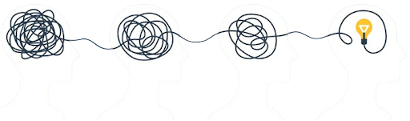

Design Thinking & Prototyping 101
=================================

What is covered in this course?
-------------------------------
- Intro to Design Thinking
- Problem Framing
- User Research
- Ideation Techniques
- Prototyping
- Testing and Feedback

What is Design Thinking?
------------------------
Design Thinking is a user-centered approach to innovation and problem-solving that involves following:
1. Understanding the users' challenges and needs.
2. Digesting problems to identify solutions that may not be obvious.
3. Collaboration to build, test, evaluate, and iterate.

There are five design thinking stages and they are as follows:

1. **Empathize**: Understand the users' needs, challenges, and experiences through observation, interaction, and research to gain deep insights.

2. **Define**: Clearly articulate the problem by synthesizing the insights gathered during the empathy stage, framing it as a problem statement.

3. **Ideate**: Brainstorm and generate a wide range of creative ideas and potential solutions without judgment or constraints.

4. **Prototype**: Create simple, tangible representations of ideas (e.g., models, sketches, or simulations) to explore, test, and iterate on potential solutions.

5. **Test**: Evaluate prototypes by gathering user feedback, identifying what works and what doesn’t, and refining the solution for improvement.

Why is Design Thinking Important?
---------------------------------
Simply put, when design thinkinng principles are not utilised, there is high chance any of the following could occur:
- Failure to address real user problems leading to poor user adoption.
- Missed opportunities for innovation.
- Inefficient resource use.

The issues oulined above can also be seen in the image below. With design thinking, the constructors could have placed a fountain in the middle of the circle or used a raised sitting structure for instance to ensure users went around the circle, instead of through it.

Lets take it from the Beginning with an Activity
------------------------------------------------
**What problem or challenge are you trying to address?** 

 

Write it out as clearly as possible.

*This activity should last about 10 minutes*

Problem Framing
===============

The whole point of a problem framing is to understand what is happening and why it is happening.

**Problem Tree**: A problem tree is a tool to systematically analyze the cause and effect relationships with reference to a core problem. All statements in a problem tree are negative or bad news.

**Problem Tree - Here's how to create one:**
----------------------------------------------
*This activity should last about 45 minutes*

   - Summarize the problem into a short, concise statement.
   - Outline the possible causes of the problem (these are known as primary causes).
   - Outline the effects of the stated problem.

You can also state the causes of the primary causes, these are known as secondary causes.

Below is an example of a problem tree with the core problem of "frequent power outages".

You guessed it! If there is a problem tree, then surely there might be a solution tree as well.

**Solution Tree**: a solution tree is developed by reversing the negative statements from the problem tree into positive ones.

**Solution Tree - Here's how to create one:**
------------------------------------------------
*This activity should last about 45 minutes*

   - While looking at your problem tree, remake the entire structure, however, you should only write the positive versions of your statements. 

Its essential that all statements in your solution tree are positive. See the example below.

**NOTE:** When you are done with the solutions tree, core problem becomes a "**goal**" and the primary and secondary causes become "**interventions/possible solutions**".

To complete the problem framing phase:
------------------------------------- 
 Take a look at all the intervention statements and **select one intervention**. Make sure to consider your available resources like the skill set of your team members, finances and available time to complete the chosen intervention.

User Research
=============

The User research phase seeks to discover which stakeholders are involved and what their needs and challenges might be.

Lets start by asking a simple question:
---------------------------------------

 **Who is your solution for?**  
Identify the potential users, organizations, or groups your solution target or concern. 

*This activity should last about 30 mins*

Stakeholder Analysis
--------------------

At this point, our goal is to understand which of the stakeholders we listed in the previous activity should be at the top of our priotity list, this process is called Stakeholder Analysis. Here are a few key reasons why a stakeholder analysis is important: 

- Identifies key influencers.
- Ensures diverse perspectives.
- Promotes alignment and buy-in.
- Mitigates potential conflicts and risks.

**How to Perform Stakeholder Analysis:**
- Place each stakeholder in one of the boxes in the matrix based on their influence versus interest with regard to your proposed solution (your chosen intervention from the solution tree). 

*This activity should last about 45 mins*

Here’s a detailed explanation of the four categories in a stakeholder analysis matrix, along with examples for each:

   1. Keep Satisfied (Low Interest, High Influence):
      
      These stakeholders have significant influence or power over the solution but low personal interest in its outcomes. While they may not be actively engaged, their influence means their concerns or opinions can affect the solution significantly. Keeping them satisfied ensures they remain supportive or at least neutral toward the solution.

      *Example:* 

      **Government Regulators:** They may have the power to approve or block the solution but are not directly involved in its execution or outcomes.

   2. Monitor (Low Interest, Low Influence)
      
      These stakeholders have minimal influence and little interest in the solution. They are unlikely to impact the solution significantly. However, it’s still essential to monitor them occasionally to ensure they do not unexpectedly shift to a more critical category.

      *Example:*

      **General Public in a Remote Area:** They might be tangentially aware of the solution but lack interest and influence unless directly affected.

   3. Keep Informed (High Interest, Low Influence)
      
      These stakeholders care deeply about the solution's outcomes but have limited influence over its direction. Regularly communicating with them keeps them engaged and ensures their concerns and feedback are addressed, as they can act as advocates for the solution in their sphere of influence.

      *Example:*

      **End Users of a New Product:** They are interested in how the product benefits them but may not directly influence its development.

   4. Manage Closely (High Interest, High Influence)
      
      These stakeholders are critical to the solution’s success. They are highly invested in the solution’s outcomes and have substantial influence over its direction or resources. Actively engaging and collaborating with them ensures their support and mitigates risks.

      *Example:*

      **Major Investors or Sponsors:** They have a financial stake in the solution’s success and significant power to influence decisions.

   This structured approach helps prioritize communication and engagement strategies for different stakeholders, ensuring the solution's success while minimizing potential risks from unaddressed concerns.

User Persona
------------

A user persona is a tool for understanding the needs, behaviors, and goals of your target users. This understanding is typically achieved through methods such as:

1. **Interviews**  
Interviews involve having one-on-one conversations with users to gain deep insights into their needs, challenges, preferences, and goals. By asking open-ended questions, you can explore their thoughts, feelings, and motivations in detail. This method is especially useful for uncovering qualitative insights and unique user perspectives.

      **Example Questions:**  
      - What challenges do you face with [specific task/product]?  
      - How do you currently solve this problem?  
      - What features or improvements would make your experience better?*

2. **Surveys**  
Surveys are structured questionnaires distributed to a broader audience, making them a scalable way to collect quantitative data. They help you identify patterns and trends across a large user base. Surveys can include a mix of closed-ended (e.g., multiple-choice, ratings) and open-ended questions to gather both numerical data and textual feedback.

      **Best Practices:**
      - Keep surveys concise to encourage completion.  
      - Use clear and specific questions.  
      - Employ tools like Google Forms, SurveyMonkey, or Typeform.  

3. **Observation**  
Observation involves watching users interact with a product, service, or system in their natural environment. This method provides unfiltered insights into their behaviors, pain points, and how they actually use the product (often different from what they might describe). It’s particularly effective for identifying usability issues or workflow inefficiencies.

      **Types of Observation:**  
      - **Passive Observation**: Watching users without interfering.  
      - **Active Observation**: Asking questions or clarifying behaviors during the session.  

      **Tools**:  
      - Video recordings, usability testing platforms, or simple in-person sessions.

4. **Analytics**  
Analytics involves using data to understand user behaviors and preferences on a larger scale. By analyzing metrics like user engagement, conversion rates, bounce rates, or time spent on specific features, you can identify what’s working and what needs improvement. Analytics complements qualitative methods by providing hard evidence of user trends.

      **Common Tools:**
      - Google Analytics for website behavior.  
      - Heatmaps (e.g., Hotjar) to track user interactions.  
      - Product analytics tools like Mixpanel or Amplitude to measure feature usage.

Ideation Techniques & Concept Development
=========================================

The Ideation state is where we figure out the how we want to implement our chosen intervention or solution. Lets look at three ways to come up with ideas on how to bring a solution into existence.

First up: *Brainstorming by Rapid Fire*
--------------------------------------

***NOTE:*** During this activity, it is important to promote an environment where all ideas are welcomed.

Now here is how to generate ideas by Rapid Fire
1. Have all members involved sit around a table.
2. Place a blank sheet in front of each person.
3. Each person is to write one approach to implement the chosen. intervention on the sheet infront of them.
4. Start a countdown clock for 2 minutes and rotate sheets when the clock hits 0.
5. for every round after the first, participants are only allowed to build upon the ideas already on the sheets infron of them, not introduce totally new ideas.
6. Repeat until the original sheet returns to the author or the position it started from.

The more participants are in the activity, the higher the number and diverse the generated ideas will be. 

Second: Idea Generation Using Design Requirements
--------------------------------------------------

In this approach, the goal is to define a clear design requirement and generate ideas that will lead to achieving it. This process focuses on breaking down the requirement into actionable components and exploring innovative solutions for each.

**Example**:  
For a design requirement such as *"a low-cost, power-efficient room sensor that lasts 1 year per charge"*, the idea generation process could involve:

- **Materials and Components**: Identifying affordable and durable materials or parts to ensure the sensor remains low-cost.  
- **Communication Technologies**: Exploring options like Bluetooth Low Energy (BLE), Wi-Fi, LoRa, or Zigbee to balance power efficiency and connectivity requirements.  
- **Sensor Selection**: Choosing sensors that align with power and performance needs, such as low-power temperature, motion, or humidity sensors.
- **PCB Design**: Choosing a pcb layout and number of layers that make it easy to manufacture and assembly parts. 

   This structured approach allows teams to focus their creativity on specific aspects of the design, ensuring that the final product meets both the technical and practical needs of the requirement.

---

*Guideline for idea generation using Design Requirement:*

1. **Define Clear Objectives:** Establish specific, measurable goals for the solution (end-user’s needs and preferences).
2. **Prioritize Feasibility:** Consider technical and functional requirements (practical feasibility) early in the process.
3. **Think Incrementally:** Break down large problems into manageable parts.
4. **Explore Alternatives:** Generate multiple solutions for each requirement.
5. **Document Ideas:** Record all ideas and insights for future reference and iteration.

Third: Idea Generation by Building on Existing Solutions
--------------------------------------------------------

As the name suggests this approach focuses on generating ideas by searching for and taking inspiration from similar solutions that already exist on the market.

Here are some guidelines on how to build on existing solutions:

1. **Review Existing Solutions**: Understand current solutions and their limitations.

2. **Identify Gaps**: Look for unmet needs or areas for improvement.

3. **Think Outside the Box**: Challenge assumptions and consider unconventional ideas.

4. **Combine Ideas**: Merge elements from multiple solutions to create a new approach.

5. **Document Everything**: Keep a record of all ideas and discussions for future reference.

Prototyping
===========

**Definition**: Prototyping involves creating a simplified version of a product to test and validate ideas before full-scale development. Since products can generally be divided into two categories namely services or physical products, there are equally two categories of prototypes as well.

Here is a simplified guide to how to develop a service based prototype:

#### Service-Based Prototyping

1. **Concept Visualization**: Sketch initial ideas.

2. **Wireframes**: Outline structure and layout.
3. **Low-Fidelity Prototypes**: Focus on functionality.
   - Tools: Pencil & Paper, Miro, Figma.

   

4. **Interactive Mockups**: Develop detailed digital representations.
   - Tools: Figma, Adobe XD.

   

#### Physical Product Prototyping

1. Sketch concepts using pen and paper.

2. Create detailed schematics and flowcharts.

3. Build high-fidelity 3D models and prototypes.
   - Tools: Fusion 360, Solidworks, Blender, EasyEDA, KiCad.

   

4. Acquire needed parts and build actual product.

Keep in mind that above steps are overly simplified to make the course easier to follow. For instance in order to acquire the needed parts to build the physical product, one may need to first develop a bill of materials (BOM).

Testing and Feedback
====================

At this point, the objective is to test the product to validate it's functionality, usability, and effectiveness. Testing ensures the design meets user needs, identifies potential issues early and provides feedback for improvement, ultimately increasing the likelihood of success and user satisfaction.

Here are some guides for testing:

1. Perform functional and stress tests on prototypes.
2. Test in real use-case environments or put the product in the hands of the potential users.
3. Validate designs against your initial design requirements or industry standards.
4. Document the entire process and results.
5. Incorporate findings into the next iteration of the product.

---
