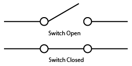

Current, voltage, wires… IoT is, at its base, just electronics. In this course, we will learn the basics that you need to know to start building IoT prototypes. First of all, we’ll learn what an electric signal is, analogous or digital. We then learn about the electronics laws: Ohm’s law and Kirchhoff’s law. We’ll introduce basic components such as resistors and capacitors. Finally, two very useful circuits will be introduced: the Voltage Divider and Current limiter. 

Electric signals
================

A signal is a function that conveys information about a phenomena.

A signal can be represented in two ways:
- an *analog* representation would match the original signal, 
- a *digital* representation would create steps.

The representation of a signal is a stream of measurements.
The precision of the measurements depends on two important factors:
- The *number of bits* of the measurements,
- The *sampling rate* of the measurements.

The *number of bits* assigned to a measurement will either improve or damage the quality of the received signal.
The signal as a whole is recomposed after gathering multiple samples.
For each sample, or measurement, the hardware can allocate one or more bits.
A one-bit sample will split the signal's values in two: above half and under half.
The former will transform to 1 and the latter to 0.
This signal's representation will be far from accurate.
Now, if there is a larger scale of bits, the hardware can adapt the signal closer to the original one.
Supposing you have n bits to represent your signal, when taking a sample, the hardware decides which of the values from 0 to 2^n-1 to assign to the measurement.

The *sampling rate* is just as important as the number of bits.
The samples will be taken from time to time. In the interval between measurements the signal is lost. 
This way, the signal can be more or less approximated. The ideal case is when the sampling is made frequently, so little signal is missed.

The time intervals will be shown on the graphics, following the horizontal axes.

Nyquist theorem says that in order to reproduce an accurate signal, you need to sample at least twice faster than the highest frequency of the signal.
This means that if the bandwidth is lower than the highest frequency, the signal will be altered. 

Basic laws
==========

Ohm's law
---------

The Ohm’s law states that in a circuit the current (I) is directly proportional to the applied voltage (U) and inversely proportional to the resistance (R) of the circuit.
I = U * R (1) 

Kirchhoff's laws
----------------

**Kirchhoff’s First Law** states that in a node, the sum of the currents incoming and outgoing is 0. 
∑ik = 0 (2)
Please keep in mind that currents have directions.
Currents incoming have negative values, while currents outgoing have positive values. 

**Kirchhoff’s Second Law** states that the sum of the voltage in a circuit loop is equal to the power source voltage.
∑RkIk (3) 

  

You have a 3V source and three resistors of different resistance. The sum of voltage drops on each of them is equal to the source voltage.

R1 + R2 + R3 = VCC1 ⇒ 0.25v + 1.25v + 1.5v = 3v (4) 

Buttons
=======

This section explains how to correctly connect a button to a board. A button, also called a switch, is an electric component that can break an electrical circuit by interrupting the current. When used in schematics, there are multiple possible symbols to depict it.

When the button is pressed, it acts like a wire and it will let the current flow through the circuit. If the button is not pressed, the circuit is interrupted. When a button is connected to a board, you can tell if the button was pressed by looking at the pin’s value.

Let’s see how you can connect a button to the Edison board. The first possibility would be the one in the next figure, but it is wrong. 

Why is it wrong? If the button is pressed, everything works fine. The value of pin would be HIGH and you can say “Yes, the button is definitely pressed”. But what happens when the button is off? It is important to know that a logic level can be: LOW (or 0), HIGH (or 1) and also UNKNOWN (or high impedance). When the button is not pressed you cannot say for sure what logical level the pin has: it could be 0 as well as 1 because the wire is not connected neither to Ground nor to a power supply. Let’s give it another try. 

This is also incorrect. When the switch is off the button’s pin value is HIGH. The big problem appears when the button is pressed. It will create a short circuit: the ground is directly connected to VCC which is very bad because you do not have any resistor and the electric current is not limited. The correct way to connect a button to a board is this. 

This time you will not have a short circuit because if the button is pressed there is the R resistor. The R resistor is called a pull up resistor and the whole system is called a voltage divider. If the button is pressed our pin’s value will be LOW.

You can also connect the resistor to the Ground. Now you have a pull-down resistor and the pin’s value will be HIGH when the button is pressed and low otherwise. 

Leds
====

This chapter explains how to correctly connect an LED to a board. First of all, you need to know what a diode is. A diode is an electronic component that has a positive and a negative side and it basically allows the current to flow only in one direction, from positive to negative. The LED is also a diode. When current is flowing through the LED, it lights up. So in order to light up a LED you need to put the high voltage at the anode and the low voltage at the cathode. 

Taking into account the theory stated previously, you would build a circuit like the one in next figure to light up an LED. 

You must take into account that the power source depicted will be replaced in the projects you are going to build with the Edison. There is only one tiny problem with the schematics in previous figure: it is a short circuit. That means there is no resistance to limit the current because the diode does not have any resistance at all. It just allows the current to flow. That can cause big problems (you can damage your Raspberry Pi, for example). To fix this, you need a resistor to limit the current flow.

Resistors
=========

Resistors are electronic components which have a specific, never-changing electrical resistance. The resistor's resistance limits the flow of electrons through a circuit.

They are passive components, meaning they only consume power (and can't generate it). Resistors are usually added to circuits where they complement active components like op-amps, microcontrollers, and other integrated circuits. Commonly resistors are used to limit current, divide voltages, and pull-up I/O lines.

All resistors have two terminals, one connection on each end of the resistor. When modeled on a schematic, a resistor will show up as one of these two symbols:

The terminals of the resistor are each of the lines extending from the squiggle (or rectangle). Those are what connect to the rest of the circuit.

The resistor circuit symbols are usually enhanced with both a resistance value and a name. The value, displayed in ohms, is obviously critical for both evaluating and actually constructing the circuit. The name of the resistor is usually an R preceding a number. Each resistor in a circuit should have a unique name/number. For example, here's a few resistors in action on a 555 timer circuit:

In this circuit, resistors play a key role in setting the frequency of the 555 timer's output. Another resistor (R3) limits the current through an LED.

The voltage divider
-------------------

A voltage divider is a circuit which turns a large voltage into a smaller one, using two resistors and an input voltage.
This way we can obtain an output voltage. 

One of the resistors should always differ from zero, otherwise we will have a short circuit.
The output voltage can be calculated using the following equation:

Source: https://learn.sparkfun.com/tutorials/resistors/types-of-resistors

Capacitors
==========

A capacitor is a two-terminal, electrical component. Along with resistors and inductors, they are one of the most fundamental passive components we use. You would have to look very hard to find a circuit which didn't have a capacitor in it.

What makes capacitors special is their ability to store energy; they're like a fully charged electric battery. Caps, as we usually refer to them, have all sorts of critical applications in circuits. Common applications include local energy storage, voltage spike suppression, and complex signal filtering.

There are two common ways to draw a capacitor in a schematic. They always have two terminals, which go on to connect to the rest of the circuit. The capacitors symbol consists of two parallel lines, which are either flat or curved; both lines should be parallel to each other, close, but not touching (this is actually representative of how the capacitor is made. Hard to describe, easier to just show:

(1) and (2) are standard capacitor circuit symbols. (3) is an example of capacitors symbols in action in a voltage regulator circuit.

Not all capacitors are created equal. Each capacitor is built to have a specific amount of capacitance. The capacitance of a capacitor tells you how much charge it can store, more capacitance means more capacity to store charge. The standard unit of capacitance is called the farad, which is abbreviated F.

It turns out that a farad is a lot of capacitance, even 0.001F (1 milifarad -- 1mF) is a big capacitor. Usually you'll see capacitors rated in the pico- (10-12) to microfarad (10-6) range.

When you get into the farad to kilofarad range of capacitance, you start talking about special caps called super or ultra-capacitors.

**How a Capacitor Works**

Electric current is the flow of electric charge, which is what electrical components harness to light up, or spin, or do whatever they do. When current flows into a capacitor, the charges get "stuck" on the plates because they can't get past the insulating dielectric. Electrons -- negatively charged particles -- are sucked into one of the plates, and it becomes overall negatively charged. The large mass of negative charges on one plate pushes away like charges on the other plate, making it positively charged.

The positive and negative charges on each of these plates attract each other, because that's what opposite charges do. But, with the dielectric sitting between them, as much as they want to come together, the charges will forever be stuck on the plate (until they have somewhere else to go). The stationary charges on these plates create an electric field, which influence electric potential energy and voltage. When charges group together on a capacitor like this, the cap is storing electric energy just as a battery might store chemical energy.

**Charging and Discharging**

When positive and negative charges coalesce on the capacitor plates, the capacitor becomes charged. A capacitor can retain its electric field -- hold its charge -- because the positive and negative charges on each of the plates attract each other but never reach each other.

At some point the capacitor plates will be so full of charges that they just can't accept any more. There are enough negative charges on one plate that they can repel any others that try to join. This is where the capacitance (farads) of a capacitor comes into play, which tells you the maximum amount of charge the cap can store.

If a path in the circuit is created, which allows the charges to find another path to each other, they'll leave the capacitor, and it will discharge.

For example, in the circuit below, a battery can be used to induce an electric potential across the capacitor. This will cause equal but opposite charges to build up on each of the plates, until they're so full they repel any more current from flowing. An LED placed in series with the cap could provide a path for the current, and the energy stored in the capacitor could be used to briefly illuminate the LED.

**Capacitors in Series/Parallel**

Much like resistors, multiple capacitors can be combined in series or parallel to create a combined equivalent capacitance. Capacitors, however, add together in a way that's completely the opposite of resistors.

When capacitors are placed in parallel with one another the total capacitance is simply the sum of all capacitances. This is analogous to the way resistors add when in series.

So, for example, if you had three capacitors of values 10µF, 1µF, and 0.1µF in parallel, the total capacitance would be 11.1µF (10+1+0.1).
Capacitors in Series

Much like resistors are a pain to add in parallel, capacitors get funky when placed in series. The total capacitance of N capacitors in series is the inverse of the sum of all inverse capacitances.

[Source](https://learn.sparkfun.com/tutorials/capacitors)

Transistor
==========

Transistors make our electronics world go 'round. They're critical as a control source in just about every modern circuit. Sometimes you see them, but more-often-than-not they're hidden deep within the die of an integrated circuit. In this tutorial we'll introduce you to the basics of the most common transistor around: the bi-polar junction transistor (BJT).

In small, discrete quantities, transistors can be used to create simple electronic switches, digital logic, and signal amplifying circuits. In quantities of thousands, millions, and even billions, transistors are interconnected and embedded into tiny chips to create computer memories, microprocessors, and other complex ICs.

**Symbols, Pins, and Construction**

Transistors are fundamentally three-terminal devices. On a bi-polar junction transistor (BJT), those pins are labeled collector (C), base (B), and emitter (E). The circuit symbols for both the NPN and PNP BJT are below:

The only difference between an NPN and PNP is the direction of the arrow on the emitter. The arrow on an NPN points out, and on the PNP it points in. A useful mnemonic for remembering which is which is: **N**ot **P**ointing **I**n. Backwards logic, but it works!

**Water Analogy**

If you've been reading a lot of electricity concept tutorials lately, you're probably used to water analogies. We say that current is analogous to the flow rate of water, voltage is the pressure pushing that water through a pipe, and resistance is the width of the pipe.

Unsurprisingly, the water analogy can be extended to transistors as well: a transistor is like a water valve -- a mechanism we can use to control the flow rate.
There are three states we can use a valve in, each of which has a different effect on the flow rate in a system.
A valve can be completely opened, allowing water to flow freely -- passing through as if the valve wasn't even present.
This corresponds to the "On" status: Short Circuit.

When it's closed, a valve can completely stop the flow of water.
This this the "Off" status: Open Circuit.

In the same way, a transistor can be used to create an open circuit between the collector and emitter pins.

Finally, with some precise tuning, a valve can be adjusted to finely control the flow rate to some point between fully open and closed.

A transistor can do the same thing: linearly controlling the current through a circuit at some point between fully off (an open circuit) and fully on (a short circuit).

From our water analogy, the width of a pipe is similar to the resistance in a circuit. If a valve can finely adjust the width of a pipe, then a transistor can finely adjust the resistance between collector and emitter. So, in a way, a transistor is like a variable, adjustable resistor.

**Amplifying Power**

There's another analogy we can wrench into this. Imagine if, with the slight turn of a valve, you could control the flow rate of the Hoover Dam's flow gates. The measly amount of force you might put into twisting that knob has the potential to create a force thousands of times stronger. We're stretching the analogy to its limits, but this idea carries over to transistors too. Transistors are special because they can amplify electrical signals, turning a low-power signal into a similar signal of much higher power.

Kind of. There's a lot more to it, but that's a good place to start! 

**Applications I: Switches**

One of the most fundamental applications of a transistor is using it to control the flow of power to another part of the circuit -- using it as an electric switch. Driving it in either cutoff or saturation mode, the transistor can create the binary on/off effect of a switch.

Transistor switches are critical circuit-building blocks; they're used to make logic gates, which go on to create microcontrollers, microprocessors, and other integrated circuits. Below are a few example circuits.

Transistor Switch

Let's look at the most fundamental transistor-switch circuit: an NPN switch. Here we use an NPN to control a high-power LED:

Our control input flows into the base, the output is tied to the collector, and the emitter is kept at a fixed voltage.

While a normal switch would require an actuator to be physically flipped, this switch is controlled by the voltage at the base pin. A microcontroller I/O pin, like those on an Arduino, can be programmed to go high or low to turn the LED on or off.

When the voltage at the base is greater than 0.6V (or whatever your transistor's Vth might be), the transistor starts saturating and looks like a short circuit between collector and emitter. When the voltage at the base is less than 0.6V the transistor is in cutoff mode -- no current flows because it looks like an open circuit between C and E.

The circuit above is called a low-side switch, because the switch -- our transistor -- is on the low (ground) side of the circuit.

**Digital Logic**

Transistors can be combined to create all our fundamental logic gates: AND, OR, and NOT.

(Note: These days MOSFETS are more likely to be used to create logic gates than BJTs. MOSFETs are more power-efficient, which makes them the better choice.)
Inverter

Here's a transistor circuit that implements an inverter, or NOT gate:

Here a high voltage into the base will turn the transistor on, which will effectively connect the collector to the emitter. Since the emitter is connected directly to ground, the collector will be as well (though it will be slightly higher, somewhere around VCE(sat) ~ 0.05-0.2V). If the input is low, on the other hand, the transistor looks like an open circuit, and the output is pulled up to VCC

**AND Gate**

Here are a pair of transistors used to create a 2-input AND gate:

If either transistor is turned off, then the output at the second transistor's collector will be pulled low. If both transistors are "on" (bases both high), then the output of the circuit is also high.

**OR Gate**

And, finally, here's a 2-input OR gate:

In this circuit, if either (or both) A or B are high, that respective transistor will turn on, and pull the output high. If both transistors are off, then the output is pulled low through the resistor.

There is much more to know about transistors: bridges, oscillators, amplifiers...
[Source and know more](https://learn.sparkfun.com/tutorials/transistors)

Sources: https://ocw.cs.pub.ro/courses/iot/courses/02

