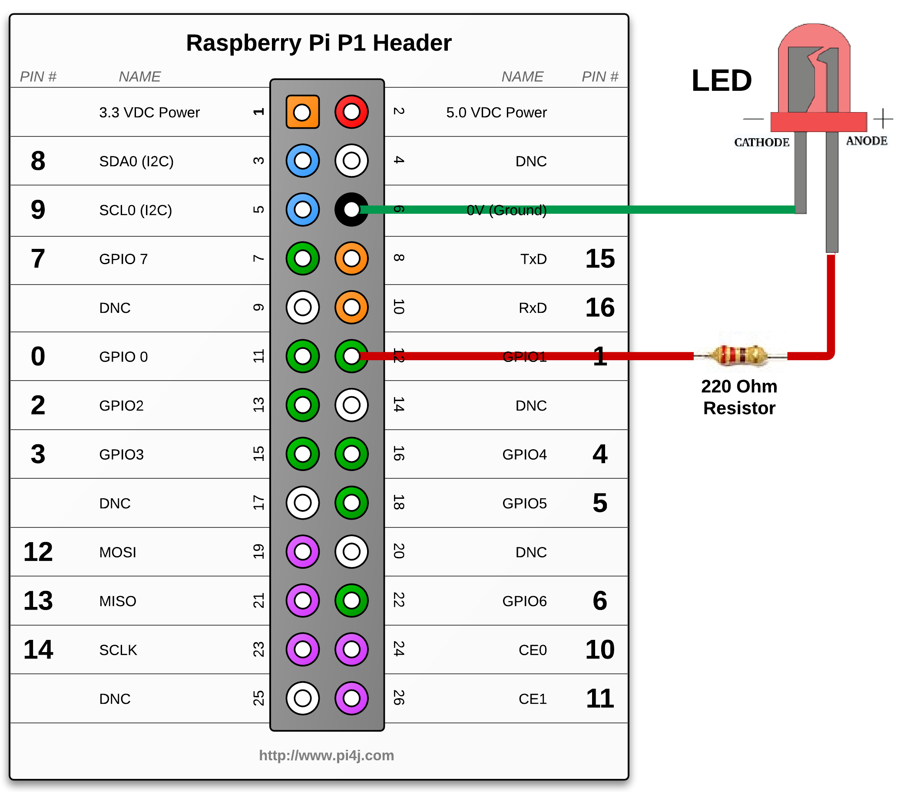
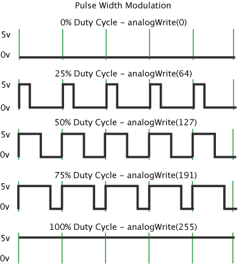
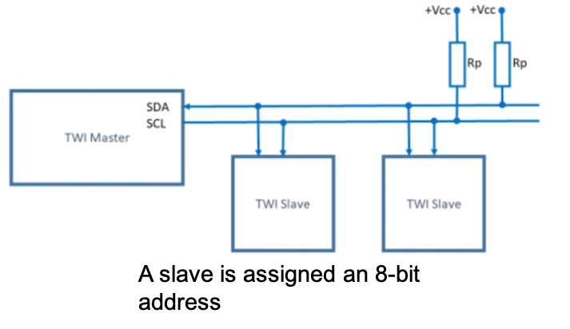
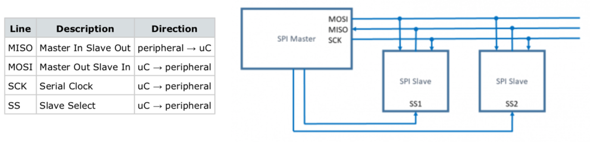
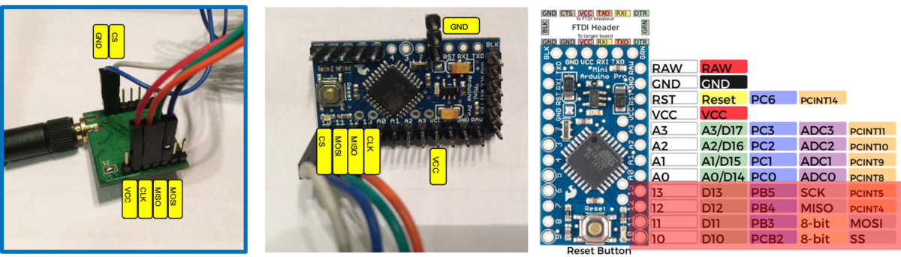

In this course, we’ll study several extremely common communication protocols for electronic boards. In the IoT world, GPIO is very used, such as with the Raspberry PI. I2C, SPI and UART will also be explained.

GPIO
====

A general-purpose input/output (GPIO) is a digital signal pin on an electronic circuit board.
It may be used as an input or output, or both, and is controllable by software. 

**Input pins** act like a voltage meter. They can be either digital or analog:

- *Digital pins* will send 0 for a voltage under half of the maximum expected and 1 for values above the half.
- *Analog pins*, on the other hand, will send values from 0 to 1024, depending on what the respective sensor is detecting.

**Output pins** can also be *digital* or *analog*. Digital pins will output 5V or 3.3V if given the value 1.
The voltage depends on the type of the board. The WaziDev ouput is 3.3V, but some Arduino boards like Arduino UNO outputs 5V.
For the Raspbery PI, the GPIO pins output 3.3 V.

In a nutshell, output pins have the functionality of a battery, like you can see in the previous figure.
The anode of the LED is connected through the resistor to the output pin. The cathode will be connected to the ground.

A lot of boards does not have a DAC (Digital to Analog Converter), and thus cannot perform directly an analog output.
In this case, we use a method to simulate the analog output called PWM (Pulse With Modulation).

PWM
---

Pulse with modulation is generating signals like this:

Pins capable of generating PWM are generating quadratic periodical signals.
PWM comes from the duty cycle of the pulse: how much of the period of the signal is one and how much is 0.
PWM pins are controled with numbers between 0 to 255.
If we ask for a signal of 0 it will generate a line with 0, which is similar to a GPIO writing Low.
If we go to 255 the signal must be 1 the whole period. In between, it depends.
For example if you have 64 , 25% of the time the signal will be 1 and so on.

I2C bus
=======

I2C (Inter-Integrated Circuit) is one of the most popular communication protocol used in embedded systems.
It has been designed by Philips for simple audio-video appliances controlled by the microcontroller.

There are many chips that can be connected to the processor with this interface which uses SDA (data) and SCL (clock) pins:

- EEPROM memory chips 
- RAM memory chips 
- AD/DA converters 
- Real-time clocks 
- Sensors
- OLED screens

In an I2C bus, each device (slave) has an assigned address to allow the master (microcontroller) to indicate which I2C slave it is communicating with.

Note that on many microcontrollers, SDA and SCL lines are usually mapped to pre-defined pins. For instance, on Arduino boards using the ATmega328P microcontroller, SDA is usually pin A4 and SCL is usually pin A5. **You need to check the board's schematic!**

Being a low-speed bus technology, it is possible to use other pins for SDA and SCL lines provided that the software library allows so.

{}
See the [OLED](/resources/waziup/oled-display) example for connecting a small I2C OLED screen.
{}

SPI bus
=======

SPI (Serial Peripheral Interface) is a synchronous serial interface and protocol that can transmit data with speed up to 20Mbps.
To communicate SPI uses three lines common to all of the connected devices, and one enabling line for every slave element.

SPI bus is usually for high-speed devices such as SD card reader, radio modules,... that need faster communications with the host microcontroller. Below is an example of a LoRa radio module using the SPI bus.

Note that on many microcontrollers, MISO, MOSI and SCK lines are mapped to pre-defined pins. SS line can be freely chosen although there can be a default pin for that purpose. **You need to check the board's schematic!**

1-wire
======

1-Wire is a device communications bus system designed by Dallas Semiconductor Corp. that provides low-speed (16.3 kbit/s) data, signaling, and power over a single conductor.
It is typically used to communicate with very simple and low-speed devices such as simple digital sensors.

