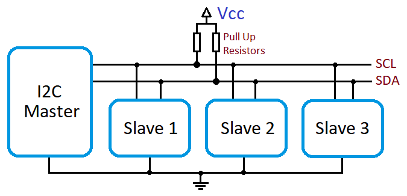
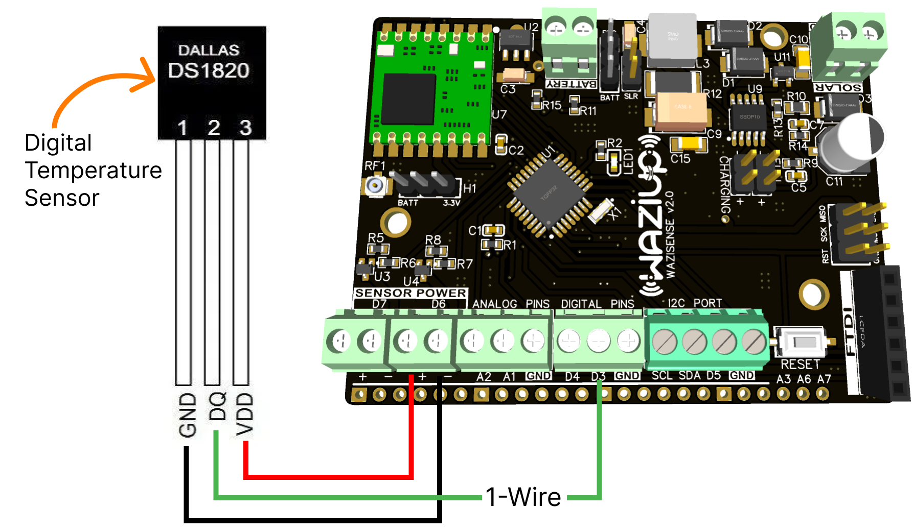
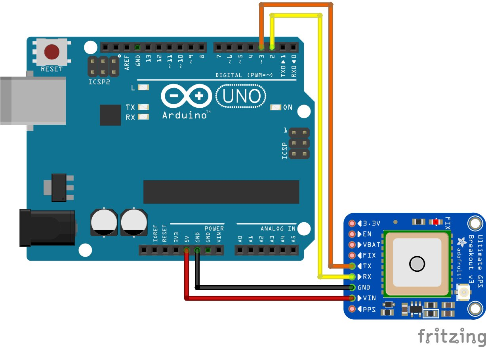

Introduction
============

In this course, we will explore widely used communication protocols for electronic boards in the context of the Internet of Things (IoT). In the IoT realm, General Purpose Input/Output (GPIO) pins play a crucial role in connecting prototyping boards such as Arduino, Raspberry Pi, or WaziSense to peripherals. These GPIOs often come equipped with special features that enable seamless communication between prototyping boards and the sensors or devices they are connected to. The course will delve into key protocols like I2C, SPI, and UART, shedding light on their functionalities and applications in IoT scenarios.

GPIO
====

A general-purpose input/output (GPIO) is a digital signal pin on an electronic circuit board.
It may be used as an input or output, or both, and is controllable by software. 

**Input pins** act like a voltage meter. They can be either digital or analog:

- *Digital pins* will send 0 for a voltage under half of the maximum expected and 1 for values above the half. Therefore a 5v board will have 0-2.5v as 0 or OFF and values greater than 2.5-5v as 1 or ON.
- *Analog pins*, on the other hand, will send values from 0 to 1024, depending on what the respective sensor is detecting.

**Output pins** can also be *digital* or *analog*. Digital pins will output 5V or 3.3V if given the value 1.
The voltage depends on the type of board. The WaziDev's ouput is 3.3V, but some Arduino boards like Arduino UNO outputs 5V.
For the Raspbery PI, the GPIO pins output 3.3 V.

In a nutshell, output pins have the functionality of a battery, like you can see in the previous figure.
The anode of the LED is connected through the resistor to the output pin. The cathode will be connected to the ground.

A lot of boards do not have a DAC (Digital to Analog Converter), and thus cannot perform directly output an analog signal.

In this case, we use a method called PWM (Pulse With Modulation) to simulate the analog signals output.

PWM
---

Pulse with modulation is used to generat signals like this:

Pins capable of generating PWM are generat quadratic periodical signals.
PWM comes from the duty cycle of the pulse: how much of the period of the signal is 1 and how much is 0.

PWM pins are controled with numbers between 0 to 255.
If we ask for a signal of 0 it will generate a line with 0, which is similar to a GPIO writing Low.

If we go to 255, the signal will be 1 the whole period.
For example if you have 64 , 25% of the time the signal will be 1 and so on. This means that if you for instance have an LED connected to that output pin with the PWM, the LED will be at approximately 25% of its brightness as well.

I2C bus
=======

I2C (Inter-Integrated Circuit) is one of the most popular communication protocol used in embedded systems.
It was designed by Philips for simple audio-video appliances controlled by the microcontroller.

There are many chips that can be connected to the processor with this interface which uses SDA (data) and SCL (clock) pins:

- EEPROM memory chips 
- RAM memory chips 
- AD/DA converters 
- Real-time clocks 
- Sensors
- OLED screens

In an I2C bus, each device (slave) has an assigned address to allow the master (microcontroller) to indicate which I2C slave it is communicating with.

Note that on many microcontrollers, SDA and SCL lines are usually mapped to pre-defined pins. For instance, on Arduino boards using the ATmega328P microcontroller, SDA is usually pin A4 and SCL is usually pin A5. **You need to check the board's schematic!**

Being a low-speed bus technology, it is possible to use other pins for SDA and SCL lines provided that the software library allows it.

See the [OLED](/resources/waziup/oled-display) example for connecting a small I2C OLED screen.

SPI bus
=======

SPI (Serial Peripheral Interface) is a synchronous serial interface and protocol that can transmit data with speed up to 20Mbps.
To communicate SPI uses three lines common to all of the connected devices, and one enabling line for every slave element.

SPI bus is usually for high-speed devices such as SD card reader, radio modules,... that need faster communications with the host microcontroller. Below is an example of a LoRa radio module using the SPI bus.

Note that on many microcontrollers, MISO, MOSI and SCK lines are mapped to pre-defined pins. SS line can be freely chosen although there can be a default pin for that purpose. **You need to check the board's schematic!**

1-wire
======

1-Wire is a communication protocol designed by Dallas Semiconductor, now a part of Maxim Integrated, to enable simple and efficient communication with devices using a single wire. This innovative technology allows data and power to be transmitted over a single wire, simplifying wiring and reducing complexity in various applications. Known for its ease of use and low-cost implementation, 1-Wire has found applications in diverse fields, including temperature sensing, authentication, and identification, making it a versatile solution for a wide range of embedded systems and IoT devices.

UART
======

UART (Universal Asynchronous Receiver/Transmitter) is a fundamental communication protocol extensively used in embedded systems, notably with popular platforms like Arduino. In the context of Arduino, UART serves as a crucial mechanism for serial communication between the microcontroller on the Arduino board and external devices. It allows for the transmission and reception of data in a sequential, bit-by-bit fashion. Arduino boards typically have dedicated pins labeled as RX (Receive) and TX (Transmit) for UART communication.

In some cases, one can also use software Libraries to define two pins as UART(TX and RX) if the microcontroller in choice allows it. For instance, in the example below, pin 2 and 3 are used as UART for interfacing a GPS module with an Arduino UNO.

Exercise 1: I2C Communication with MAX30102 Heart Rate Monitor
==========

**Task:**
Welcome to the I2C communication exercise using the MAX30102 Heart Rate Monitor! In this session, our primary goal is to learn and practice I2C communication by integrating the MAX30102 sensor, which utilizes this protocol. Please refer to the detailed guide on the XYZ page for step-by-step instructions.

**Expected Outcome:**
By the end of this exercise, you should have hands-on experience with I2C communication, specifically with the MAX30102 sensor. You'll gain insights into connecting I2C devices, installing libraries, and running code for heart rate measurement.

**What you need:**
- MAX30102 sensor module
- Arduino board
- Jumper wires
- Breadboard

**Safety Precautions**

- Ensure the voltage levels used are within the safe operating range of your components.
- Double-check connections to prevent short circuits.
- Use appropriate gear. Safety first!

**Instructions:**
1. **Refer to [MAX30102 Documentation](http://lab.staging.waziup.io/resources/waziup/max30102-heart-rate-and-proximity-sensor)
 Page:**
   - Go to the [MAX30102 Documentation](http://lab.staging.waziup.io/resources/waziup/max30102-heart-rate-and-proximity-sensor) page where detailed instructions for setting up the MAX30102 sensor through I2C communication are provided.
   - Follow the step-by-step guide for wiring connections and installing the MAX30102 library.

2. **Wiring for I2C:**
   - Connect the MAX30102 sensor to the Arduino, emphasizing the I2C pins.
   - Double-check the wiring to ensure proper I2C connections:
     - SDA: A4 of Arduino
     - SCL: A5 of Arduino

3. **Library Installation:**
   - Access the Arduino Library Manager from the Sketch menu: Sketch > Include Library > Manage Libraries.
   - Search for "MAX30102" and install the version provided by Adafruit, as shown in the XYZ guide.

4. **Code Example:**
   - Open the example specified in the [MAX30102 Documentation](http://lab.staging.waziup.io/resources/waziup/max30102-heart-rate-and-proximity-sensor)
   - Examine the code and understand how it leverages I2C communication for heart rate measurement.

5. **Upload and Monitor:**
   - Upload the code to your Arduino board.
   - Open the Serial Monitor (Tools > Serial Monitor) to observe the heart rate readings.

6. **Record and Reflect:**
   - Document your experience, any challenges faced, and observations during the I2C communication setup with MAX30102.

**Finish Line:**
Congratulations! You've successfully practiced I2C communication using the MAX30102 Heart Rate Monitor. Consider exploring more I2C-based sensors and devices to broaden your understanding of this widely used communication protocol in the realm of IoT. Stay curious and keep exploring!

Exercise 2: Exploring GPIOs with 5V Single Channel Relay Module
===========

**Task**

In this exercise, you will dive into the practical application of General Purpose Input/Output (GPIO) pins, focusing on the control of a 5V Single Channel Relay Module. The goal is to understand how GPIOs work, especially when interfacing with external devices. By following the detailed instructions on the provided [Relay Documentation](http://lab.staging.waziup.io/resources/waziup/5v-single-channel-relay) page, you'll be able to successfully control the relay using your Arduino.

**What You Need**

- Arduino Board with Power Cable: Any Arduino board with available GPIO pins.
- 5V Single Channel Relay Module: This will be the device you control using GPIOs.
- Jumper Wires: To establish connections between the Arduino and the relay module.

**What to Keep in Mind**

1. **GPIO Pins:** Understand the distinction between input and output pins.
   - *Input Pins:* Receive signals.
   - *Output Pins:* Transmit signals.

2. **Relay Functionality:** a relay functions as an electrical switch.
   - *Connecting to Arduino:* Follow the prescribed connections (VCC, GND, IN) for proper functioning.

3. **Code Example:** Familiarize yourself with the provided code example.
   - *RelayPin:* The designated pin for relay control in the code.

4. **Experimentation:** Feel free to experiment with different GPIO pins and code modifications.
   - *Task 1:* Connect the relay to a different digital pin.
   - *Task 2:* Adjust delay durations to observe the relay's switching frequency.

## Safety Precautions to Observe

- Ensure the voltage levels used are within the safe operating range of your components.
- Double-check connections to prevent short circuits.
- Use appropriate gear. Safety first!
- Relay Module: Handle the relay module with care, and avoid contact with its components while powered.

Now, let's get started! Head over to the [Relay Documentation](http://lab.staging.waziup.io/resources/waziup/5v-single-channel-relay) Page and follow the step-by-step guide to explore GPIOs.
