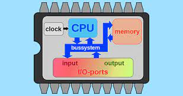
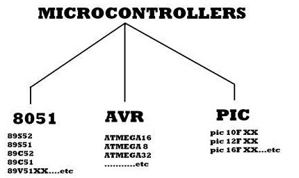
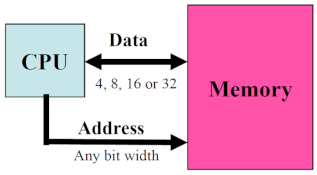
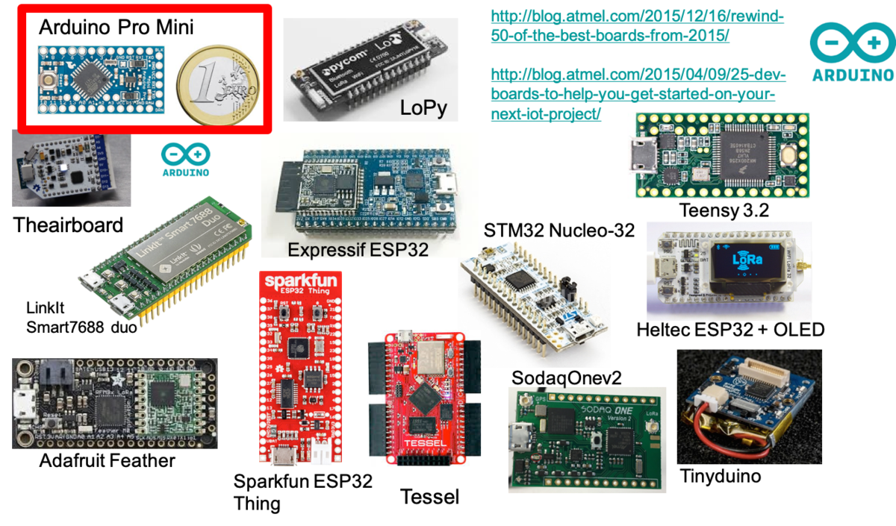

# Introduction

This course is designed to introduce you to the fundamentals of microcontroller programming and hardware, focusing on popular platforms such as Arduino boards and the versatile Atmega328P microcontroller. Throughout this course, you will delve into the intricacies of microcontroller architecture, programming techniques, and practical applications.

In electronics and embedded systems, microcontrollers serve as the fundamental building blocks, enabling applications spanning from basic sensor interfacing to complex IoT ecosystems. Understanding the core components and functionalities of these microcontrollers is crucial for engineers and hobbyists alike to harness their full potential.

A microcontroller's memory architecture plays a pivotal role in storing program instructions and data. From volatile RAM for runtime operations to non-volatile EEPROM and flash memory for data persistence and program storage, each memory type serves distinct purposes in the execution of embedded applications.

By understanding the microcontroller architectures and ecosystems, enthusiasts and professionals can navigate the landscape of embedded systems. This enables them to unlock endless possibilities for innovation and development in IoT, robotics, automation, and beyond

# Understanding microcontrollers

A microcontroller is a small, low-cost, and self-contained computer-on-a-chip that can be used as an embedded system. A few microcontrollers may utilize four-bit expressions and work at clock rate frequencies, which usually include:

- An 8 or 16-bit microprocessor.
- A little measure of RAM.
- Programmable ROM and flash memory.
- Parallel and serial I/O.
- Timers and signal generators.
- Analog to Digital and Digital to Analog conversion

Microcontrollers usually must have low-power requirements since many devices they control are battery-operated. Microcontrollers are used in many consumer electronics, car engines, computer peripherals, and test or measurement equipment. And these are well suited for long-lasting battery applications. The dominant part of microcontrollers being used nowadays is implanted in other apparatus.

**How Microcontrollers work**

The microcontroller chip is a high-speed device, but as compared with a computer it is slow. Thus each instruction will be executed within the microcontroller at a quick speed. Once the supply is turned ON, then the quartz oscillator will be activated through the control logic register. For a few seconds, as the early preparation is in development, then parasite capacitors will be charged.

Once the voltage level achieves its highest value & oscillator’s frequency turns into the stable process of writing bits over special function registers. Everything happens based on the CLK of the oscillator & overall electronics will start working. All this takes extremely few nanoseconds.

The main function of a microcontroller is, it can be considered like self-contained systems using a processor memory. Its peripherals can be utilized like an 8051 Microcontroller. When the microcontrollers majority in use at present are embedded within other kinds of machinery like telephones appliances, automobiles & computer systems peripherals.

# Micrcontroller classification

The microcontrollers are characterized regarding bus-width, instruction set, and memory structure. For the same family, there may be different forms with different sources. This article is going to describe some of the basic types of Microcontroller that newer users may not know about.

The types of the microcontroller are shown in the figure, they are characterized by their bits, memory architecture, memory/devices, and instruction set.

**Bit classification**

The bits in the microcontroller are 8-bits, 16-bits, and 32-bits microcontroller.

**Bit definition**

The number of bits describing the data path defines the MCU bit definition. As a general rule of thumb, the more bit definition, the more powerful, or fast, the MCU. "Old" microcontrollers are usually 8-bit. More recent microcontrollers are usually 32-bit. Note that the bit definition does not really limit the "functionalities" of the microcontroller, but rather its speed. Even with an 8-bit microcontroller, you can do floating point operation on 32-bit word, but it will take longer.

In an 8-bit microcontroller, the point when the internal bus is 8-bit then the ALU performs the arithmetic and logic operations. The examples of 8-bit microcontrollers are Intel 8031/8051, PIC1x, and Motorola MC68HC11 families.

The 16-bit microcontroller performs greater precision and performance as compared to the 8-bit. For example, 8-bit microcontrollers can only use 8 bits, resulting in a final range of 0×00 – 0xFF (0-255) for every cycle. In contrast, 16-bit microcontrollers with their bit data width have a range of 0×0000 – 0xFFFF (0-65535) for every cycle.

A longer timer’s most extreme worth can likely prove to be useful in certain applications and circuits. It can automatically operate on two 16 bit numbers. Some examples of the 16-bit microcontrollers are 16-bit MCUs are extended 8051XA, PIC2x, Intel 8096, and Motorola MC68HC12 families.

The 32-bit microcontroller uses the 32-bit instructions to perform the arithmetic and logic operations. These are used in automatically controlled devices including implantable medical devices, engine control systems, office machines, appliances, and other types of embedded systems. Some examples are Intel/Atmel 251 family, PIC3x.

**Memory classification**

**MCU memory**

The memory devices are divided into two types, they are

- Embedded memory microcontroller
- External memory microcontroller

_Embedded Memory Microcontroller_ - When an embedded system has a microcontroller unit that has all the functional blocks available on a chip is called an embedded microcontroller. For example, 8051 having program & data memory, I/O ports, serial communication, counters and timers and interrupts on the chip is an embedded microcontroller.

_External Memory Microcontroller_ - When an embedded system has a microcontroller unit that has not all the functional blocks available on a chip is called an external memory microcontroller. For example, 8031 has no program memory on the chip is an external memory microcontroller.

There are several types of memories in microcontrollers:

**RAM**

Most microcontrollers have little amount of internal RAM (embedded in MCUs). For instance, the ATmega328P has only 2 Kbytes and this is a common amount, although some more powerfull microcontrollers can have more.
RAM is typically used to store variables (global, local, stack,...) and data of your program. **So use the small amount of RAM wisely** and avoid declaring large static arrays of bytes.

**EEPROM**

EEPROM stands for Electrically-Erasable-and-Programmable ROM. Internally, they are similar to EPROMs, but the erase operation is accomplished electrically, rather than by exposure to ultraviolet light. They usually have a higher cost and their write cycles are also significantly longer than RAM. EEPROM are typically used to store permanent data such as configuration parameters for an IoT device that can be obtained after the node has booted and that need to be restored/used when the node reboots.

**Flash memory**

The flash memory is usually for storing the program itself. Note that in many cases, it is possible to store static strings in the flash memory in order to use the very limited amount of RAM. Typical amount of flash memory can be of several KB, from 32KB to 256KB or more for advanced microcontrollers. For instance, the ATmega328P has 32 Kbytes of flash memory to store the program.

# MCU ports

A microcontroller has a number of ports or pins to interact with other electronic components.
Those ports can be connected to physical sensors in order to interact with the physical world, which is one of the unique features of IoT.
A pins can be configured either as:

- `INPUT`, when you want to take information into the MCU
- `OUTPUT` when you want to change the state of something outside the MCU (turn a led/motor ON or OFF, etc.).

The level of a pin can be:

- `LOW` (usually 0V)
- `HIGH` (5V or 3.3V depending on the operating voltage of the board)
- something in between, for analog pins.

For instance, you can power a low-power physical sensor with a pin configured as OUTPUT, and set the pin to HIGH. Usually, pins default to input direction on power-up or reset. Your program can set or change the directionality of a pin at any time.

Some pins are called analog pins because they have an embedded analog-to-digital converter in which case you will be able to read a digital value from the analog pin to convert that digital value into the original voltage applied to that pin. This is usually how a program can get data from an analog sensor.

<alert type="warning">
Be careful when applying voltage to a pin. While many microcontroller boards can be tolerant regarding the pin input voltage, i.e. accepting 5V to into a 3.3V pin, you must still pay attention to use the appropriate voltage. Also note that a microcontroller pin can usually deliver a very limited current, usually from 30mA to 50mA in most cases. Pins delivering more than 100mA are usually dedicated pins.
If you need to power control a power-hungry device such as a GPS sensor for instance, it is recommended to use a MOSFET transistor that will be driven by the microcontroller pin. To work with much higher voltage, i.e. 220V, or electrical power, the microcontroller pins will typically be used to control so-called relay modules.
</alert>

## Example: the ATmega328p

The Atmel 8-bit AVR RISC-based microcontroller combines 32 KB ISP flash memory with read-while-write capabilities, 1 KB EEPROM, 2 KB SRAM, 23 general-purpose I/O lines, 32 general-purpose working registers, 3 flexible timer/counters with compare modes, internal and external interrupts, serial programmable USART, a byte-oriented 2-wire serial interface, SPI serial port, 6-channel 10-bit A/D converter (8 channels in TQFP and QFN/MLF packages), programmable watchdog timer with internal oscillator, and 5 software-selectable power-saving modes. The device operates between 1.8 and 5.5 volts. The device achieves throughput approaching 1 MIPS/MHz ([wikipedia](https://en.wikipedia.org/wiki/ATmega328))

# From microcontroller to dev board

### Arduino boards with ATmega328p

The ATmega328p microcontroller is used in the Arduino [Uno](https://docs.arduino.cc/hardware/uno-rev3), Arduino [Nano](https://docs.arduino.cc/hardware/nano) and Arduino [Pro Mini](https://docs.arduino.cc/retired/boards/arduino-pro-mini) boards.

Since the revolution created by the first iconic [Arduino boards](https://www.arduino.cc/en/Main/Products) the microcontroller ecosystem is growing at a fast rate!
There are now plenty of nice boards from many manufacturers, with a wide range of functionalities, from very low-power to very powerful to boards, even embedding micro Python programming environment, there are a board for every usage!

See for instance this article presenting [10 Boards to Start IoT Development in 2021](https://medium.com/vacatronics/10-boards-to-start-iot-development-a3f8cb085366).

# Advanced architectures

## ARM Cortex-M

When it comes to more powerful microcontroller boards, a vast majority uses the [ARM](https://en.wikipedia.org/wiki/ARM_architecture) Cortex-M processor core family because they are low-cost and energy-efficient integrated circuits.

The ARM Cortex-M is a group of 32-bit RISC ARM processor cores licensed by Arm Holdings. These cores are optimized for low-cost and energy-efficient integrated circuits, which have been embedded in tens of billions of consumer devices. Though they are most often the main component of microcontroller chips, sometimes they are embedded inside other types of chips too. The Cortex-M family consists of Cortex-M0, Cortex-M0+, Cortex-M1, Cortex-M3, Cortex-M4, Cortex-M7, Cortex-M23, Cortex-M33, Cortex-M35P, Cortex-M55 ([wikipedia](https://en.wikipedia.org/wiki/ARM_Cortex-M)).

### Cortex-M0, Cortex-M0+, Cortex-M1, Cortex-M3, ...

The family variants M0, M0+, M1, ... correspond to a given architecture and instruction set.
For instance, the Cortex-M0 / M0+ / M1 implement the ARMv6-M architecture, the Cortex-M3 implements the ARMv7-M architecture, the Cortex-M4 / Cortex-M7 implements the ARMv7E-M architecture, the Cortex-M23 / M33 / M35P implement the ARMv8-M architecture, and the Cortex-M55 implements the ARMv8.1-M architecture ([wikipedia](https://en.wikipedia.org/wiki/ARM_Cortex-M#Instruction_sets)).

### ARM Cortex-M board examples

Here are some boards using these families of ARM microcontrollers. There are plenty of them.

**Arduino Zero and Adafruit Feather M0**

These boards are powered by Atmel’s SAMD21 MCU, which features a 32-bit ARM Cortex® M0+ core.

**Teensy boards**

The Teensy 3.2 board is powered by NXP Semiconductors/Freescale MCU, which features a 32-bit ARM Cortex® M4 core.

**STM32 Nucleo 32**

The board is powered by an STM32F303K8T6 MCU, which features a 32-bit ARM Cortex® M4F core.

**Raspberry Pico**

The board is powered by RP2040, which features a 32-bit ARM Cortex® M0 core.

## ESP8286/ESP32

Another famous microcontroller branch is the ESP8286/ESP32 from Expressif.
The ESP8266 is a low-cost Wi-Fi microchip, with built-in TCP/IP networking software, and microcontroller capability.
The ESP32 is the successor of the ESP8286 and "employs either a Tensilica Xtensa LX6 microprocessor in both dual-core and single-core variations, Xtensa LX7 dual-core microprocessor or a single-core RISC-V microprocessor and includes built-in antenna switches, RF balun, power amplifier, low-noise receive amplifier, filters, and power-management modules", quoted from [wikipedia](https://en.wikipedia.org/wiki/ESP32).
They are therefore not following and using the ARM Cortex-M architecture but the Tensilica Xtensa LX6/7 architecture.

Many ESP8286/ESP32-based boards are available on the market and their embedded WiFi make them very easy to be connected to the Internet. Below are the Heltec WiFi LoRa 32 with a small embedded OLED screen and the more common Node-MCU based on ESP32-WROOM.

