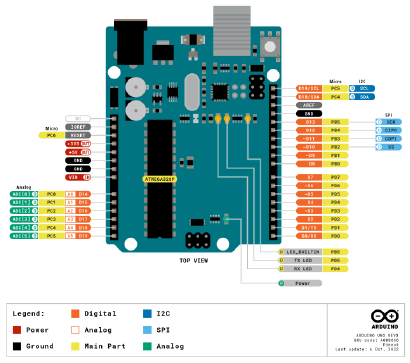

This course will go through the various IoT development boards available on the market.
In particular, we will review the Arduino Series boards, the NodeMCU ESP8266 & ESP32, the Wazi-Dev series, the Raspberry Pi.

Introduction
===
The constant need for innovation and connectivity in the rapidly evolving field of Internet of Things (IoT) development fuels the need for flexible and potent development platforms. Presenting a broad range of IoT development boards, each with specific features and capabilities to suit a variety of applications and projects.

Explore the world of IoT development boards and go on an innovative and exploratory trip with us. These boards present countless opportunities to realize your IoT ambitions, regardless of your level of experience as a developer or your level of enthusiasm.

IoT Development board Catagories : Arduino 
===

Arduino is an open-source electronics platform that consists of both hardware and software components. At its core, an Arduino development board is a physical computing platform designed to make it easy for hobbyists, students, and professionals to create interactive electronic projects. The development board provides a simple and flexible way to interface with sensors, actuators, and other electronic components.

Key features of Arduino development boards include:

1. **Microcontroller:** The heart of the Arduino board is a microcontroller, which is a small computer on a single integrated circuit. Different Arduino boards may use various microcontrollers, such as the popular Atmel AVR series or ARM-based processors.

2. **Input/Output (I/O) Pins:** Arduino boards typically have a set of digital and analog input/output pins that allow you to connect the board to various electronic components, such as sensors, LEDs, motors, and more. These pins can be programmed to read inputs or control outputs.

3. **USB Interface:** Arduino boards often come with a built-in USB interface, making it easy to connect the board to a computer for programming and communication. The USB interface is also used to power the Arduino board in many cases.

4. **Programming Environment:** Arduino uses a simplified programming language and integrated development environment (IDE) that is easy for beginners to learn. The language is based on C/C++ but is simplified for ease of use.

5. **Open-Source:** Arduino is open-source, meaning that the hardware designs and software code are freely available for anyone to use, modify, and distribute. This open nature has contributed to the widespread adoption of Arduino in the maker and electronics communities.

6. **Shields:** Arduino shields are additional boards that can be stacked on top of the main Arduino board to provide additional functionalities, such as WiFi connectivity, motor control, or GPS.

Arduino boards are versatile and widely used for a variety of projects, ranging from simple LED blinking exercises for beginners to complex robotics and home automation systems. They serve as an excellent platform for learning about electronics and programming, and their accessibility has contributed to the growth of the maker movement.

There are multiple versions of Arduino boards are available in the market. Some of them are explained here.

**Arduino Uno Rev3**
---
The Arduino UNO is the best board to get started with electronics and coding. If this is your first experience tinkering with the platform, the UNO is the most robust board you can start playing with. The UNO is the most used and documented board of the whole Arduino family.

Arduino Uno is a microcontroller board based on the ATmega328P [datasheet](https://ww1.microchip.com/downloads/en/DeviceDoc/Atmel-7810-Automotive-Microcontrollers-ATmega328P_Datasheet.pdf). It has 14 digital input/output pins (of which 6 can be used as PWM outputs), 6 analog inputs, a 16 MHz ceramic resonator (CSTCE16M0V53-R0), a USB connection, a power jack, an ICSP header and a reset button. It contains everything needed to support the microcontroller; simply connect it to a computer with a USB cable or power it with a AC-to-DC adapter or battery to get started.. You can tinker with your Uno without worrying too much about doing something wrong, worst case scenario you can replace the chip for a few dollars and start over again.

**Arduino Mega 2560 Rev3**
---

The Arduino Mega 2560 is a microcontroller board based on the ATmega2560 [datasheet](https://ww1.microchip.com/downloads/en/DeviceDoc/Atmel-2549-8-bit-AVR-Microcontroller-ATmega640-1280-1281-2560-2561_datasheet.pdf). It has 54 digital input/output pins (of which 15 can be used as PWM outputs), 16 analog inputs, 4 UARTs (hardware serial ports), a 16 MHz crystal oscillator, a USB connection, a power jack, an ICSP header, and a reset button. It contains everything needed to support the microcontroller; simply connect it to a computer with a USB cable or power it with a AC-to-DC adapter or battery to get started. The Mega 2560 board is compatible with most shields designed for the Uno and the former boards Duemilanove or Diecimila.

**Arduino Nano**
---

The Arduino Nano is a small, complete, and breadboard-friendly board based on the ATmega328 (Arduino Nano 3.x) [datasheet](https://ww1.microchip.com/downloads/en/DeviceDoc/Atmel-7810-Automotive-Microcontrollers-ATmega328P_Datasheet.pdf). It has more or less the same functionality of the Arduino Duemilanove, but in a different package. It lacks only a DC power jack, and works with a Mini-B USB cable instead of a standard one.

**Arduino Micro**
---
The Micro is a microcontroller board based on the ATmega32U4 [datasheet](https://ww1.microchip.com/downloads/en/DeviceDoc/Atmel-7766-8-bit-AVR-ATmega16U4-32U4_Datasheet.pdf), developed in conjunction with Adafruit. It has 20 digital input/output pins (of which 7 can be used as PWM outputs and 12 as analog inputs), a 16 MHz crystal oscillator, a micro USB connection, an ICSP header, and a reset button. It contains everything needed to support the microcontroller; simply connect it to a computer with a micro USB cable to get started. It has a form factor that enables it to be easily placed on a breadboard.

The Micro board is similar to the Arduino Leonardo in that the ATmega32U4 has built-in USB communication, eliminating the need for a secondary processor. This allows the Micro to appear to a connected computer as a mouse and keyboard, in addition to a virtual (CDC) serial / COM port.

**Arduino GIGA R1 WiFi**
---

The Arduino GIGA R1 WiFi is designed for ambitious makers who want to step up their game. It levels the playing field for gamers, artists, sound designers and anyone coming to the tech world with big ideas on a budget – because it packs advanced features into an accessible component, with the same form factor as our popular Mega and Due.

IoT Development board Catagories : NodeMCU ESP8266 & ESP32
===
IoT development boards are hardware platforms that facilitate the creation and prototyping of Internet of Things (IoT) projects. Two popular categories of IoT development boards are NodeMCU ESP8266 and ESP32.

**ESP8266**
---
The ESP8266 is a low-cost Wi-Fi chip developed by Espressif Systems. It can be used as a standalone device, or as a UART to Wi-Fi adaptor to allow other microcontrollers to connect to a Wi-Fi network. For example, you can connect an ESP8266 to an Arduino to add Wi-Fi capabilities to your Arduino board. The most practical application is using it as a standalone device.

With the ESP8266, you can control inputs and outputs as you would do with an Arduino, but with Wi-Fi capabilities. This means you can bring your projects online, which is great for home automation and internet of things applications.

**ESP32**
---
The ESP32 is a family of low-cost, low-power System on a Chip (SoC) microcontrollers by Espressif that has a dual-core processor, Bluetooth and Wi-Fi connectivity. If you are familiar with the ESP8266, the ESP32 is a feature-rich replacement that comes with a ton of more functionality.

### The following table shows the main differences between the ESP8266 and the ESP32 chips:

| **Features** | E**SP8266** | **ESP32** |
| ----------- | ----------- | --------- |
| MCU | Xtensa Single-core 32-bit L106 | Xtensa Dual-Core 32-bit LX6 with 600 DMIPS |
| 802.11 b/g/n Wi-Fi | HT20 | HT40 |
| Bluetooth | X | Bluetooth 4.2 and BLE |
| Typical Frequency | 80 MHz | 160 MHz |
| SRAM | X | ✓ |
| Flash | X | ✓ |
| GPIO | 17 | 34 |
| Hardware /Software PWM | None / 8 channels | None / 16 channels |
| SPI/I2C/I2S/UART | 2/1/2/2 | 4/2/2/2 |
| ADC | 10-bit | 12-bit |
| CAN | X | ✓ |
| Ethernet MAC Interface | X | ✓ |
| Touch Sensor | X | ✓ |
| Temperature Sensor | X | ✓(old versions) |
| Hall effect sensor | X | ✓ |
| Price | $ (3$ – $6) | $$ ($6 – $12) |

The choice between the two often depends on the specific requirements of the project. With ESP32 being preferred for more feature-rich and demanding applications, they are commonly used for projects requiring more computational power, higher data transfer rates, and additional connectivity options. Whereas in case of ESP8266, they are compact, cost-effective, and suitable for a variety of IoT projects such as home automation, sensor nodes, and Wi-Fi-enabled devices.

IoT Development board Catagories : Wazi-dev series
===
Waziup development boards, namely WaziDev, WaziSense and WaziAct

**WaziDev**

WaziDev is a Sensing and Actuation development board for IoT applications. It transmits data up to 7Km using the RFM95W LoRa module with an embedded LoRa antenna. It is easily programmable and customizable, using Arduino technology. Embedded is a Lipo battery charger for solar panels and low power options. An ideal solution for start-ups and entrepreneurs who want to rapidly prototype IoT applications.

**WaziSense**

The WaziSense is specifically engineered to tackle the special demands of agricultural and environmental monitoring applications in challenging outdoor deployment scenarios, it is a low-power development board.
With features like low power long range communication, multiple ports for simple connection to a variety of digital and analog sensors, and the ability to charge solar batteries, the WaziSense gives farmers, researchers, agricultural experts, and enthusiasts a flexible platform to effortlessly monitor, control, and optimize their operations.

**WaziHat Pro Single**

Wazihat sits on top of the raspberry pi to enable it to communicate with sensor nodes and actuators via LoRa. The wazihat pro single is fitted with a 0.96" OLED and an SX1276 chip. Beyond the waziup edge operating system of the raspberry pi, the wazihat is essentially the reason the raspberry pi can serve as a LoRa gateway.

**WaziAct**

WaziAct is designed to play as a production LoRa actuator node. It has an on board mechanical Relay which can be connected to an external circuit e.g. a water pump. It exposed a number of terminals which can be connected to other relays or even sensors; for example to check the vibration of a water pump to make sure it is turned on and send the status to the gateway.

IoT Development board Catagories : Raspberry Pi
===

The Raspberry Pi is a tiny yet powerful technology that allows hobbyists, enthusiasts, and amateurs to explore a wide range of opportunities. This credit card-sized computer was created by the Raspberry Pi Foundation with accessibility, affordability, and versatility in mind.

Fundamentally, the Raspberry Pi is a platform that promotes exploration and innovation rather than merely a tiny computer. The Raspberry Pi offers an easy way to get started with electronics, whether you want to learn to program, make electronic projects, set up a media center, or even build your own mini-server.

With its many features, including HDMI outputs, USB ports, and GPIO (General Purpose Input/Output) pins, the Raspberry Pi is like an empty canvas just waiting for your artistic interpretation.

Important Features
===
Here are some important features of each of the mentioned IoT development boards:

**Arduino Series Boards:**

- Ease of Use: Arduino boards are known for their beginner-friendly approach, making them accessible to users of all skill levels.
- Rich Ecosystem: Arduino boasts a vast ecosystem of libraries, shields, and community support, facilitating rapid prototyping and development.
- Cross-Platform Compatibility: Arduino IDE supports multiple operating systems, enabling seamless development across Windows, macOS, and Linux platforms.
- Wide Range of Models: Arduino offers a diverse range of boards catering to various project requirements, from compact microcontrollers to more powerful models with enhanced capabilities.
  
**NodeMCU ESP8266 & ESP32:**

- Built-in Wi-Fi Connectivity: NodeMCU boards come equipped with integrated Wi-Fi modules, enabling seamless connectivity to wireless networks and the internet.
- Low Power Consumption: ESP8266 and ESP32 chips are known for their energy efficiency, making them suitable for battery-powered IoT devices.
- Rich Peripheral Support: These boards feature a plethora of GPIO pins and hardware interfaces, facilitating interfacing with sensors, actuators, and other peripherals.
- Arduino IDE Compatibility: NodeMCU boards can be programmed using the Arduino IDE, leveraging the familiar Arduino ecosystem for development.
  
**Wazi-Dev Series:**

- Modularity and Expandability: Wazi-Dev boards are designed with modularity in mind, allowing developers to easily expand functionality through interchangeable modules and accessories.
- Versatility: These boards are versatile, supporting a wide range of sensors, communication protocols, and interfaces, making them suitable for diverse IoT applications.
- Open-Source Hardware and Software: Wazi-Dev embraces the principles of open-source development, providing transparent access to schematics, firmware, and documentation.
- Scalability: Wazi-Dev offers scalability, allowing developers to scale their projects from prototypes to production deployments seamlessly.
  
**Raspberry Pi:**

- Powerful Computing: Raspberry Pi boards feature powerful ARM-based processors, capable of handling a wide range of computational tasks.
- Extensive Peripheral Support: Raspberry Pi offers a plethora of GPIO pins, USB ports, HDMI output, and camera interfaces, enabling interfacing with a diverse array of peripherals and displays.
- Linux-based Operating System: Raspberry Pi runs on a variety of Linux-based operating systems, providing access to a vast software ecosystem and development tools.
- Community and Support: Raspberry Pi has a vibrant community and extensive online resources, making it easy for users to find support, tutorials, and project ideas.
  
These features collectively make each of these IoT development boards a compelling choice for building innovative IoT solutions.

Examples
===
