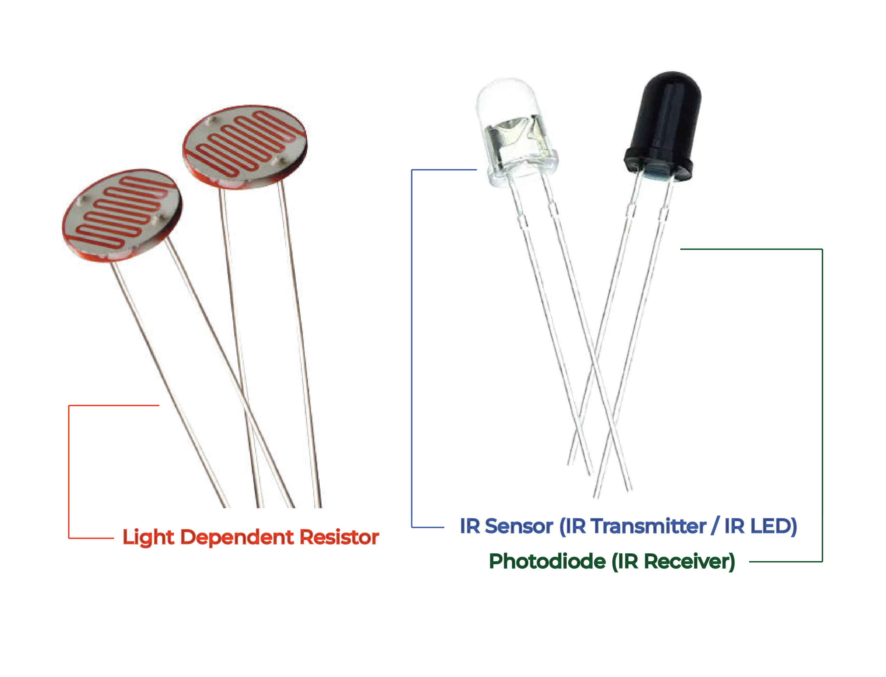
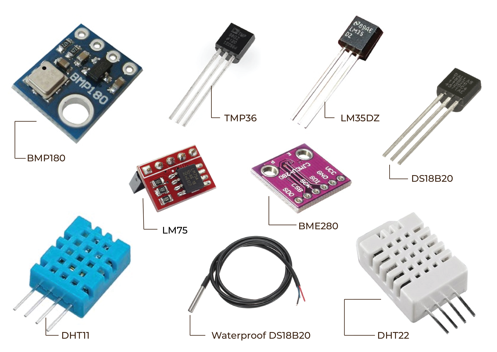
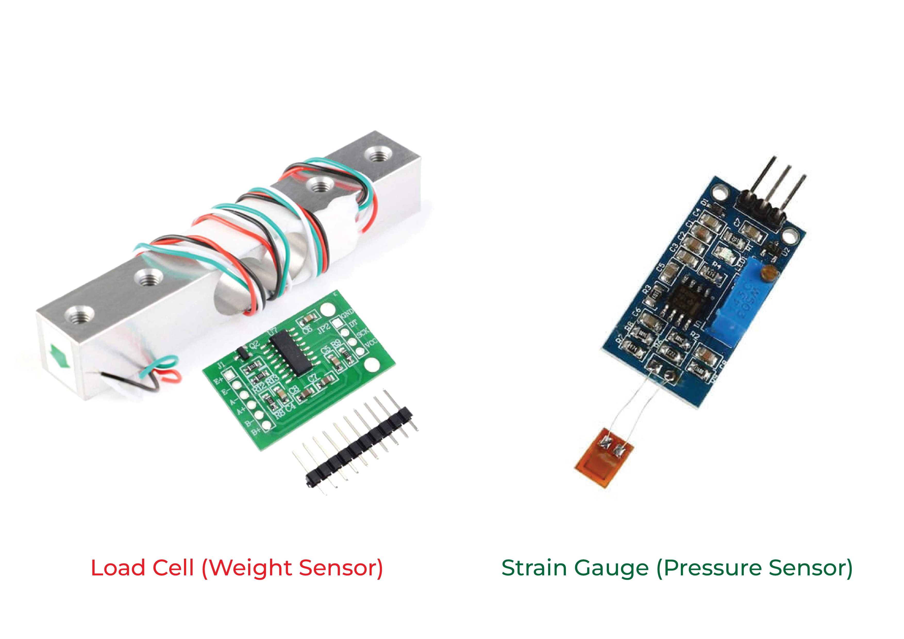
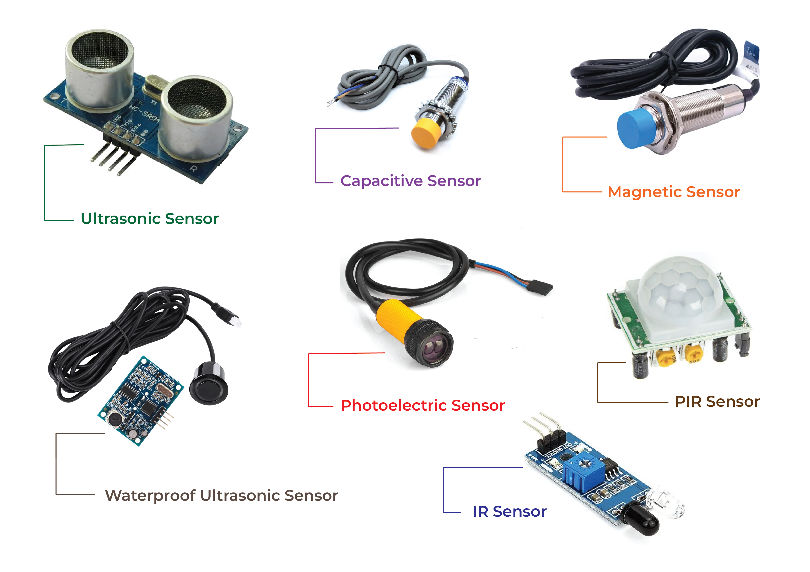
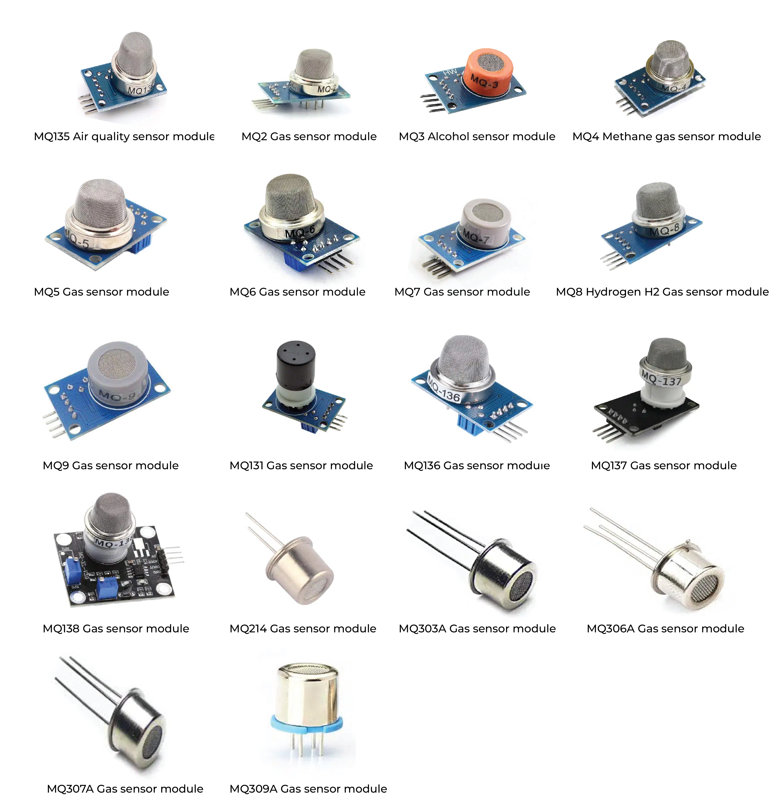
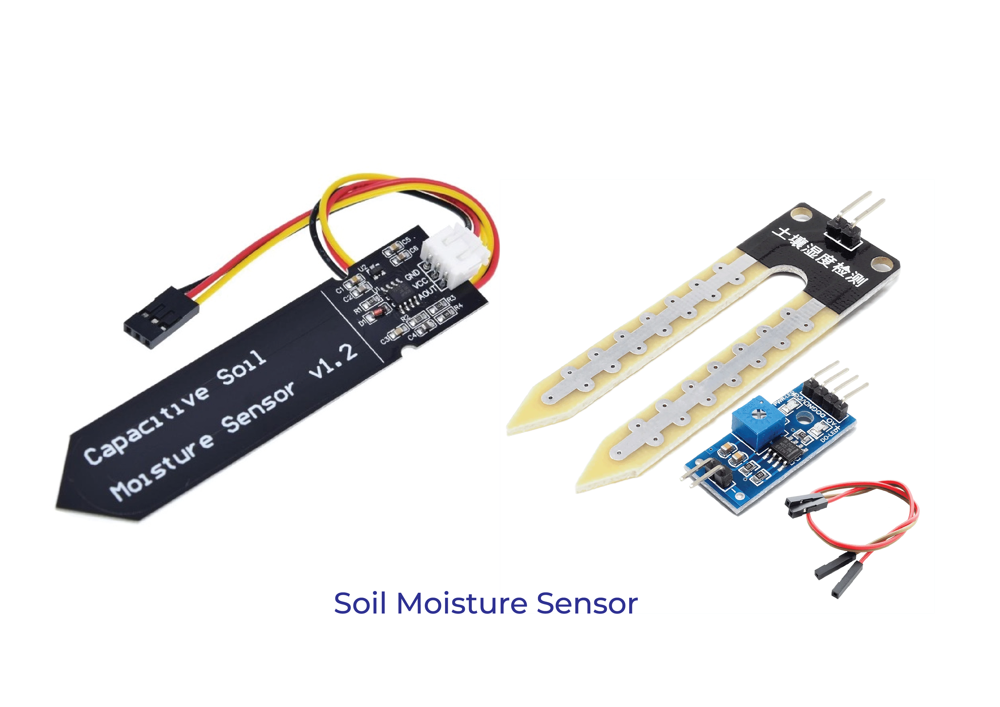
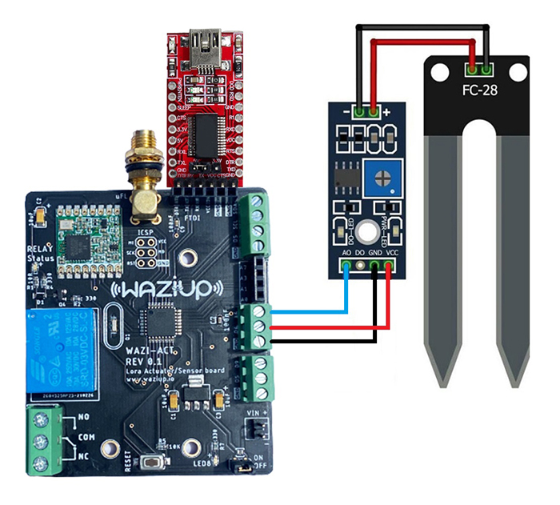
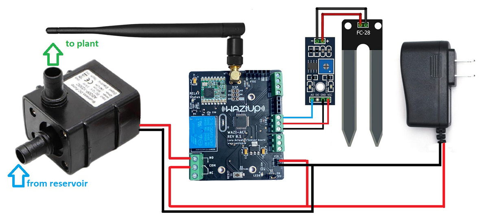
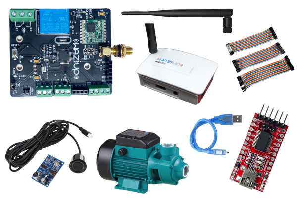

Sensors are a fundamental part of IoT. In this course, we will learn how to wire and program them. We will use several sensors as examples, such as DHT11, GPS, Soil moisture or Motion sensor.

Introduction
========
Human capability has been expanded in various ways by technology, and sensor technology has increased human perceptive range. Given the speed at which current technology is developing. IoT, big data, cloud computing, and related technologies are in high demand. It is extensively used in a variety of fields, including economics, national defense, science and technology, and daily life.


A device that provides a usable output in response to a specified measurement.The sensor attains a physical parameter and converts it into a signal suitable for processing (e.g. electrical, mechanical, optical) the characteristics of any device or material to detect the presence of a particular physical quantity. The output of the sensor is a signal which is converted to a human-readable form like changes in characteristics, changes in resistance, capacitance, impedance, etc. In various systems the transducer might be used as an actuator. The transducer helps to convert a signal from one physical structure to another or one type of energy into another type.


Overview of Various Sensors
=================
It's a jungle out there with countless sensor types. All of them, from basic temperature sensors to complex LiDAR systems, have specific functions in our technologically advanced society. Thus, knowing what sensors function is the initial step towards selecting the appropriate one.

Sensor's acts as the devices eyes and ears and gather important information from the outside environment. They keep an eye on external conditions, notice any changes, and communicate this information to other system components. Your choice of sensor will mostly depend on what you wish to measure.

A few of the most popular ones are shown here in brief:


1. Light Sensor: These detect light levels and are commonly used in automatic lighting systems and cameras.
   - IR Sensor (IR Transmitter / IR LED)
   - Photodiode (IR Receiver)
   - Light Dependent Resistor
  
  

2. Temperature Sensor: As the name suggests, these track temperature variations. They're the bread and butter of HVAC systems and many industrial processes.


1. Pressure/Force/Weight Sensor: Monitoring air or fluid pressure is their forte. You'll find them in vehicles, medical devices, and weather monitoring systems.
   - Strain Gauge (Pressure Sensor)
   - Load Cell (Weight Sensor)
  
  
  
4. Proximity Sensors: Handy for robotics and security systems, these sensors detect the presence or absence of an object within a certain range.
   - Ultrasonic proximity sensors
   - Photoelectric proximity sensors
   - Capacitive proximity sensors
   - Magnetic proximity sensors
   - IR and PIR proximity sensors
  


5. Gas Sensors: A gas sensor is an electronic device that is used to detect the presence and concentration of specific gases in the air. The most common types of gases that are detected by these sensors include carbon monoxide (CO), hydrogen (H2), methane (CH4), and propane (C3H8).



6. Soil Moisture Sensors: Soil moisture is basically the amount/content of water present in the soil. This can be measured using a soil moisture sensor either resistive or capacitive.



Wiring
====
Before programming we must be aware of how to wire them properly.
Wiring a sensor to a microprocessor typically involves connecting the sensor's output to one of the input pins on the microprocessor.


- **Understanding the Pinouts:** 
  Look at the datasheet or documentation for your sensor & processor to understand its pinout. Identify the pins for power (VCC), ground (GND), and signal/output.
- **Power Supply & Ground Connection:** 
  Connect the power pin (VCC) of the sensor to an appropriate power source on your microprocessor board. This is often a 5V or 3.3V pin, depending on the sensor's requirements.
  Connect the ground pin (GND) of the sensor to the ground (GND) pin on the microprocessor.
- **Signal/Output Connection:** 
  Connect the output pin of the sensor to one of the input pins on the microprocessor. This is typically a digital or analog pin, depending on the type of sensor.
- **Veryfying Wiring:**
  Double-check all connections to make sure they are secure and accurate. Incorrect wiring can lead to malfunction or damage.


Programming
========
For this section the first thing you need to do is installing [Arduino IDE](https://www.arduino.cc/en/software). Install the latest version from their official website. 

For in depth learning, please complete
[this course](https://lab.waziup.io/courses/5_5hHxJIBIk?topic=0).

Advanced topics: Communication Protocols
======

Both wired and wireless communication protocols are subsets of the communication protocols. To guarantee the efficient transport of data to the designated location, the communication protocol specifies the format that the data unit uses, the information and meaning that the information unit should have, the connection mode, and the timing when the information is delivered and received.

### Wireless Protocols
Wireless communication has become a crucial part of modern technology. From remote control toys to advanced industrial machinery, wireless protocols play a critical role. Here are some common ones:

1. RFID (Radio Frequency Identification)

2. Infrared

3. ZigBee

4. Bluetooth

5. GPRS (General Packet Radio Service)
6. 4G

7. Wifi

8. NB-IoT (Narrowband Internet of Things)

 
### Wired Protocols
Even in our wireless world, wired protocols still have a crucial role, particularly in industrial and high-data-rate applications.

1. MBus (Meter-Bus)

2. USB (Universal Serial Bus)
3. RS232

4. RS485

5. Ethernet

Selecting the appropriate protocol will largely depend on the application and the environment. Always consider factors like range, power consumption, data rate, and the type of devices being connected when making your choice.

Advanced topics: Calibration
======
There are a lot of good sensors these days and many are 'good enough' out of the box for many non-critical applications.  But in order to achieve the best possible accuracy, a sensor should be calibrated in the system where it will be used. 

There are different methods available for calibration but among them **one point calibration** is the simplest type of calibration. If your sensor output is already scaled to useful measurement units, a one point calibration can be used to correct for sensor offset errors.
To calibrate one point at a time:
1. Use your sensor to take a measurement.
2. Examine that measurement in relation to your benchmark.
3. To find the offset, subtract the sensor reading from the reference reading.
4. To get the calibrated value, add the offset to each sensor reading in your code.
  


A Complete Example 
====

### Here's what we will be learning from this example:

- What parts are needed
- How to wire up and read sensor values
- How to trigger an actuator
- How to use the actuator to control a water pump
- How to communicate to the cloud over LoRa


### What parts do we need?

You will need the following hardware and software:

Hardware
  - WaziAct
  - FT232 FTDI module with Mini USB Cable
  - Wazigate
  - Soil Moisture Sensor
  - Submersible Water Pump
  - Some Jumper Wires
  - Power Supply


Software
  - Please install the [Arduino IDE](https://www.arduino.cc/en/Main/Software) for the programming aspects.
  - Install the [WaziDev](https://github.com/Waziup/WaziDev/archive/master.zip) libraries for LoRa communication. Follow the guide [here](https://waziup.io/documentation/wazidev/user-manual/#install-the-wazidev-sketchbook)

## Step #1: Setting up the Soil Moisture Sensor

Soil moisture sensors measures the amount of water in the soil to maintain consistent and ideal soil conditions for plants.
They can be used to detect the moisture of soil or judge if there is water around the sensor. They can be very easy to use, 
just insert it into the soil and then read it.

### Schematics

There are only three pins that you need to worry about on most of these analog soil humidity sensors. The common principle is to power the sensor and get the output voltage on an analog pin. In our case, we are going to use pin A6.




NOTE: we are powering the soil moisture sensor from **pin D6**. Each digital pin can with stand **40mA** max current draw. The soil moisture sensor is rated for **35mA**.

Module interface:
1. VCC: Connect to the D6 pin of the WaziACT
2. GND: Connect to the GND pin of the WaziACT
3. IN: Connect to the WaziACT analog pin A6

Code Sample
------------
```c
/********************
 * Soil Moisture Tester
 * Read soil humidity by measuring its resistance.
 ********************/

int sensorPin = A6;
int sensorPow = 6;

void setup() {
  Serial.begin(38400);
  pinMode(sensorPow, OUTPUT);
  delay(100);
  digitalWrite(sensorPow, HIGH);
}

void loop() {
  int soilHumidity = analogRead(sensorPin);
  Serial.println(soilHumidity);
  delay(100);
}
```

## Step #2: Setting up the Actuator(Relay)


You may occasionally wish to manage appliances with AC power, such as lamps, fans, and other home appliances. The WaziACT, however, cannot directly control these higher voltage devices because it runs on 3.3 volts.

This is where the relay comes into play.The waziACT has a relay module to control the AC mains. In our case, we are controlling the 12 Volts supply of a water pump.

Code Sample
-----------
```c
/********************
 *  Program:  Relay Tester
 ********************/

//Declaring pin 10 as the control pin    
int RelayPin = 7;

void setup() {
  //Set RelayPin as an output pin
  pinMode(RelayPin, OUTPUT);
}

void loop() {
  // Let's turn on the relay...
  digitalWrite(RelayPin, LOW);

  //Lets wait for 5 seconds
  delay(5000);
	
  //Let's turn off the relay...
  digitalWrite(RelayPin, HIGH);

  //Lets wait for another 5 seconds
  delay(5000);
}
```


## Step #3: Combining Sensing and Actuation with Lora Communication


At this point, we want to trigger the relay to turn ON the water pump, when the soil moisture sensor detects a dry soil. The relay will then turn OFF when the soil moisture sensor reports the soil is wet. Also the WaziACT will constantly update Wazicloud with the current state of the soil through Wazigate.

**NOTE:** Make sure to have a configured gateway up and running before uploading this next code. Kindly see the lectures under **Module 5 Lecture 2** for how to setup a Waziup Gateway.

### Schematics



Code Sample
-----------
```c
#include <WaziDev.h>
#include <xlpp.h>
#include <Base64.h>

// NwkSKey (Network Session Key) and Appkey (AppKey) are used for securing LoRaWAN transmissions.
// You need to copy them from/to your LoRaWAN server or gateway.
// You need to configure also the devAddr. DevAddr need to be different for each devices!!
// Copy'n'paste the DevAddr (Device Address): 26011D00
unsigned char devAddr[4] = {0x26, 0x01, 0x1D, 0x00};

// Copy'n'paste the key to your Wazigate: 23158D3BBC31E6AF670D195B5AED5525
unsigned char appSkey[16] = {0x23, 0x15, 0x8D, 0x3B, 0xBC, 0x31, 0xE6, 0xAF, 0x67, 0x0D, 0x19, 0x5B, 0x5A, 0xED, 0x55, 0x25};

// Copy'n'paste the key to your Wazigate: 23158D3BBC31E6AF670D195B5AED5525
unsigned char nwkSkey[16] = {0x23, 0x15, 0x8D, 0x3B, 0xBC, 0x31, 0xE6, 0xAF, 0x67, 0x0D, 0x19, 0x5B, 0x5A, 0xED, 0x55, 0x25};

WaziDev wazidev;

//Declaring pin 7 as the control pin
int RelayPin = 7;

//Sensor Power Pin
int sensorPow = 6;

//Declaring pin A0 moisture sensing pin
int sensorPin = A6;

//Declaring dry and wet soil threshold values
int const dryThreshold = 800;
int const wetThreshold = 350;

void setup()
{
  Serial.begin(38400);
  wazidev.setupLoRaWAN(devAddr, appSkey, nwkSkey);

  pinMode(RelayPin, OUTPUT);
  pinMode(sensorPow, OUTPUT);
  delay(100);
  digitalWrite(sensorPow, HIGH);
}

XLPP xlpp(120);

void loop(void)
{
  int soilHumidity = analogRead(sensorPin);

  //Check if the soil moisture value is a number
  if (!(isnan(soilHumidity))) {
    if (soilHumidity > dryThreshold) { //Turn Pump ON
      digitalWrite(RelayPin, HIGH);
    } else if (soilHumidity <= wetThreshold) { //Turn Pump OFF
      digitalWrite(RelayPin, LOW);
    }
  }
  
  // 1
  // Create xlpp payload.
  
  xlpp.reset();
  
  xlpp.addRelativeHumidity(1, soilHumidity);
  
  // 2.
  // Send paload with LoRaWAN.
  serialPrintf("LoRaWAN send ... ");
  uint8_t e = wazidev.sendLoRaWAN(xlpp.buf, xlpp.len);
  if (e != 0)
  {
    serialPrintf("Err %d\n", e);
    delay(60000);
    return;
  }
  serialPrintf("OK\n");
  
  // 3.
  // Receive LoRaWAN message (waiting for 6 seconds only).
  serialPrintf("LoRa receive ... ");
  uint8_t offs = 0;
  long startSend = millis();
  e = wazidev.receiveLoRaWAN(xlpp.buf, &xlpp.offset, &xlpp.len, 6000);
  long endSend = millis();
  if (e != 0)
  {
    if (e == ERR_LORA_TIMEOUT){
      serialPrintf("nothing received\n");
    }
    else
    {
      serialPrintf("Err %d\n", e);
    }
    delay(60000);
    return;
  }
  serialPrintf("OK\n");
  
  serialPrintf("Time On Air: %d ms\n", endSend-startSend);
  serialPrintf("LoRa SNR: %d\n", wazidev.loRaSNR);
  serialPrintf("LoRa RSSI: %d\n", wazidev.loRaRSSI);
  serialPrintf("LoRaWAN frame size: %d\n", xlpp.offset+xlpp.len);
  serialPrintf("LoRaWAN payload len: %d\n", xlpp.len);
  serialPrintf("Payload: ");
  char payload[100];
  base64_decode(payload, xlpp.getBuffer(), xlpp.len); 
  serialPrintf(payload);
  serialPrintf("\n");
  
  delay(5000);
}
```

At this point, all we need to do is drop the water pump in a water resevoir and attach a pipe to the outlet of the pump, to the plant.

we can also setup notifications on WaziCloud, for when the relay turns ON or OFF. We can use the soil figures we used in the previous example. That is `800` for dry soil(Relay ON) and `350` for a wet soil(Relay OFF).


Exercise
===

In this part try to do a project using the following hardware and software.

Hardware
  - WaziACT
  - FTDI FT232
  - Mini USB Cable
  - Wazigate
  - SR04 Ultrasonic Sensor
  - Some Jumper Wires
  - Lora 868Mhz Antenna



Software
  - Install the [Arduino IDE](https://www.arduino.cc/en/Main/Software) for the programming aspects.
  - Install the [WaziDev](https://github.com/Waziup/WaziDev/archive/master.zip) libraries for LoRa communication. Follow the guide [here](https://waziup.io/documentation/wazidev/user-manual/#install-the-wazidev-sketchbook)


