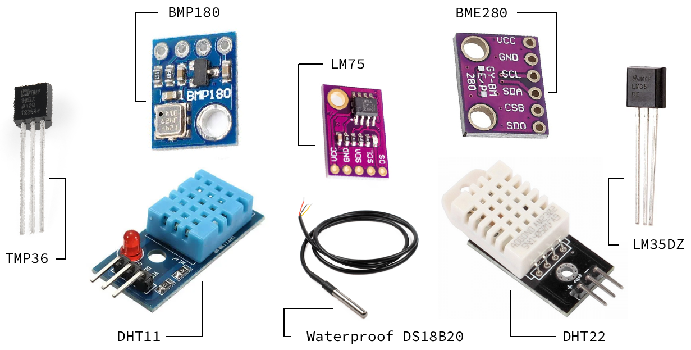
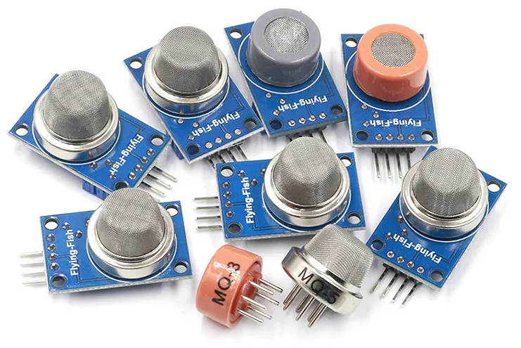
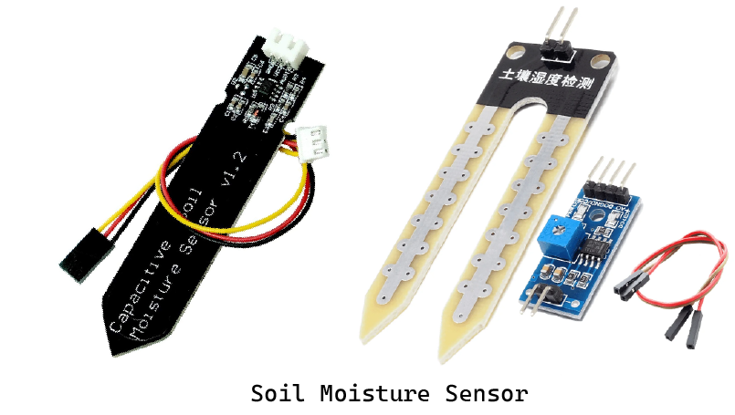
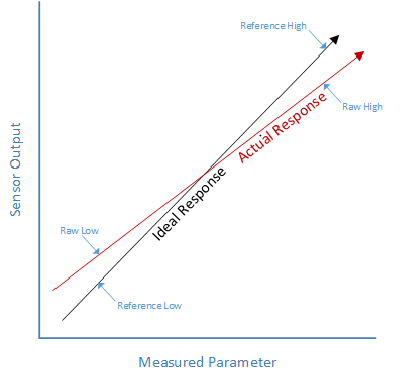

   ---
id: sensors_course
title: Wiring and programming sensors
description: In this course, we will learn how to wire and program sensors.
difficulty: intermediate
duration: 4h
---

Sensors are a fundamental part of the IoT. In this course, we will learn how to wire and program them. We will use several sensors as examples, such as DHT11, GPS, Soil moisture, or Motion sensors.

Introduction
========

A sensor is a device that provides a usable output in response to a specified measurement. The sensor acquires a physical parameter and converts it into a signal suitable for processing. The output of the sensor is a signal that is converted to a human-readable form, like changes in characteristics, changes in resistance, capacitance, impedance, etc. In various systems, the transducer might be used as an actuator. The transducer helps to convert a signal from one physical structure to another or one type of energy into another type. The following figure shows the working principle of sensors.


Overview of Various Sensors
===========================

It's a jungle out there with countless sensor types. All of them, from basic temperature sensors to complex LiDAR systems, have specific functions in our technologically advanced society. Thus, knowing what sensors function is the initial step towards selecting the appropriate one.

Sensors act as the device's eyes and ears and gather important information from the outside environment. They keep an eye on external conditions, notice any changes, and communicate this information to other system components. Your choice of sensor will mostly depend on what you wish to measure. A few of the most popular ones are shown here in brief:


## Light Sensor

These detect light levels and are commonly used in automatic lighting systems and cameras.
Some examples are:

- IR Sensor (IR Transmitter or IR LED)
- Photodiode (IR Receiver)
- Light Dependent Resistor (LDR)
  


## Temperature Sensor

As the name suggests, these track temperature variations. They're the bread and butter of HVAC systems and many industrial processes.

  

## Pressure/Force/Weight Sensor

Monitoring air or fluid pressure is their forte. You'll find them in vehicles, medical devices, and weather monitoring systems.
For example:
- Strain Gauge (Pressure Sensor)
- Load Cell (Weight Sensor)
   

 
## Proximity Sensors

Handy for robotics and security systems, these sensors detect the presence or absence of an object within a certain range.
For example:
- Ultrasonic proximity sensors
- Photoelectric proximity sensors
- Capacitive proximity sensors
- IR and PIR proximity sensors
  


## Gas Sensors

A gas sensor is an electronic device that is used to detect the presence and concentration of specific gases in the air. The most common types of gases that are detected by these sensors include carbon monoxide (CO), hydrogen (H2), methane (CH4), and propane (C3H8).



From the figure above, we can see that almost all the gas sensors are identical. So while choosing the right gas sensor, you must remember which types of gas they can measure and which types of gas you need to measure. Thus, you can select the appropriate gas sensor.

 The following table  shows the list of different types of Gas Sensors and what gases they sense.

| **Sensor Name** | **Gas to Measure** |
| ----------- | ----------- |
| MQ-2 | Methane, Butane, LPG, Smoke |
| MQ-3 | Alcohol, Ethanol, Smoke |
| MQ-4 | Methane, CNG Gas |
| MQ-5 | Natural Gas, LPG |
| MQ-6 | LPG, butane |
| MQ-7 | Carbon Monoxide |
| MQ-8 | Hydrogen Gas |
| MQ-9 | Carbon Monoxide and Flammable Gases |
| MQ-131 | Ozone |
| MQ-135 | Air Quality |
| MQ-136 | Hydrogen Sulphide Gas |
| MQ-137 | Ammonia |
| MQ-138 | Benzene, Toluene, Alcohol, Propane, Formaldehyde Gas, Hydrogen |
| MQ-214 | Methane, Natural Gas |
| MQ-216 | Natural Gas, Coal Gas |
| MQ-303A | Alcohol, Ethanol, Smoke |
| MQ-306A | LPG, Butane |
| MQ-307A | Carbon Monoxide |
| MQ-309A | Carbon Monoxide, Flammable Gas |

## Soil Moisture Sensors

Soil moisture is basically the amount or content of water present in the soil. This can be measured using a soil moisture sensor, either resistive or capacitive.
   



Wiring
====

Before programming, we must be aware of how to wire them properly.
Wiring a sensor to a microprocessor typically involves connecting the sensor's output to one of the input pins on the microprocessor.

The first thing to do is understand the pinouts. You should always look at the datasheet or documentation for your sensor & processor to understand their pinout. Identify the pins for power (VCC), ground (GND), and signal/output.

Next, connect the power pin (VCC) of the sensor to an appropriate power source on your microprocessor board. This is often a 5V or 3.3V pin, depending on the sensor's requirements.
Connect the ground pin (GND) of the sensor to the ground (GND) pin on the microprocessor.
Then, connect the output pin of the sensor to one of the input pins on the microprocessor. This is typically a digital or analog pin, depending on the type of sensor.

Finally, double-check all connections to make sure they are secure and accurate. Incorrect wiring can lead to malfunctions or damage.


## Example

Let's first look at the pinout of the WaziSense board and MQ2 gas sensor.


From the picture, we can see that the sensor has four pins:
- VCC
- GND
- Digital out
- Analog out

Now we have to connect the `sensor power pin (Vcc)` & `ground pin (Gnd)` to the dev board power port, which is the `+` and `-` pins of port D6.
- VCC -> +
- GND -> - 

Then, to get the output we have to connect the `output pin (Analog out)` to an `Analog Port` of the board, which can be A1 or A2. 

Programming
========

For this section, the first thing you need to do is to install the [Arduino IDE](https://www.arduino.cc/en/software). Install the latest version on their official website. To get started with programming, please complete [this course](https://lab.waziup.io/courses/5_5hHxJIBIk?topic=0).

This following example contains the bare minimum of code you will need for a sketch to compile properly on Arduino Software (IDE): the `setup()` method and the `loop()` method.
```c
void setup() {
  // put your setup code here, to run once:
}

void loop() {
  // put your main code here, to run repeatedly:
}
```
The `setup()` function is called when a sketch starts. Use it to initialize variables, pin modes, start using libraries, etc. The setup function will only run once, after each powerup or reset of the board.
The `loop()` function does precisely what its name suggests and loops consecutively, allowing your program to change and respond as it runs. Code in the loop() section of your sketch is used to actively control the board.

Any line that starts with `two slashes (//)` will not be read by the compiler, so you can write anything you want after it. The two slashes may be put after functional code to keep comments on the same line. Commenting on your code like this can be particularly helpful in explaining, both to yourself and others, how your program functions step by step.

The following example shows how to blink a LED with a delay. After wiring LEDs with Arduino, you may upload the following code, or you may also load it from the menu `File/Examples/01.Basics/Blink. `
```c
void setup() {
  // initialize digital pin LED_BUILTIN as an output.
  pinMode(LED_BUILTIN, OUTPUT);
}

// the loop function runs over and over again forever
void loop() {
  digitalWrite(LED_BUILTIN, HIGH);  // turn the LED on (HIGH is the voltage level)
  delay(1000);                      // wait for a second
  digitalWrite(LED_BUILTIN, LOW);   // turn the LED off by making the voltage LOW
  delay(1000);                      // wait for a second
}
```

The first thing you need to do is to initialize the LED_BUILTIN pin as an output pin with the line with the following command:

 `pinMode(LED_BUILTIN, OUTPUT);`

`LED_BUILTIN` is a constant that will always contain the number of your on-board LED.

In the main loop, to turn the LED ON, use the following command: 

`digitalWrite(LED_BUILTIN, HIGH);`

This supplies 5 volts to the LED anode. That creates a voltage difference across the pins of the LED and lights it up.
To turn the LED off, use the following command:
`digitalWrite(LED_BUILTIN, LOW);`
That takes the LED_BUILTIN pin back to 0 volts and turns the LED off. 

In between the on and the off, to get enough time for a person to see the change, the `delay()` command is used. When you use the `delay()` command, nothing else happens for that amount of time. 

Apart from the ones described above, there are a handful of new commands available. To learn more about these commands, please go through [this page](https://www.arduino.cc/reference/en/).


Calibration
======

We use various sensors to measure physical quantities, but accuracy can be affected by factors like temperature and humidity. Equipment calibration is essential to address errors in measurements. **Calibration compares expected and measured values**, identifying the difference as a structural error. There are a lot of good sensors these days, and many are 'good enough' out of the box for many non-critical applications.  But in order to achieve the best possible accuracy, a sensor should be calibrated in the system where it will be used. 

There are three standard calibration methods used for sensors. They are:

- One-point calibration.
- Two-point calibration.
- Multi-Point Curve Fitting.

Before knowing these methods, we have to know the concept of the characteristic curve. Every sensor has a characteristic curve that shows the response of the sensor to the given input value. In the calibration process, this characteristic curve of the sensor is compared with its ideal linear response. Some of the terms used with the characteristic curve are:

- **Offset**: This value tells us whether the sensor output is higher or lower than the ideal linear response.
- **Sensitivity or slope**: This gives the rate of change of sensor output. A difference in slope shows that the sensor output changes at a different rate than the ideal response.
- **Linearity**: Not all sensors have a linear characteristic curve over the given measurement range.

## One-point calibration

It is the simplest type of calibration. If your sensor output is already scaled to useful measurement units, a one-point calibration can be used to correct for sensor offset errors.
To calibrate one point at a time:
1. Use your sensor to take a measurement.
2. Examine that measurement in relation to your benchmark.
3. To find the offset, subtract the sensor reading from the reference reading.
4. To get the calibrated value, add the offset to each sensor reading in your code.
  


## Two-point calibration

A two-point calibration is a little more complex.  But it can be applied to either raw or scaled sensor outputs. A two-point calibration essentially rescales the output and is capable of correcting both slope and offset errors. To-point calibration can be used in cases where the sensor output is known to be reasonably linear over the measurement range.  
To perform a two-point calibration:

1. Take two measurements with your sensor:  One near the low end of the measurement range and one near the high end of the measurement range.  Record these readings as **"RawLow"** and **"RawHigh."**
2. Repeat these measurements with your reference instrument.  Record these readings as **"ReferenceLow"** and **"ReferenceHigh."**
3. Calculate **"RawRange"** as `RawHigh – RawLow`.
4. Calculate **"ReferenceRange"** as `ReferenceHigh – ReferenceLow`.
5. In your code, calculate the **"CorrectedValue"** using the formula below:
   
`CorrectedValue = (((RawValue – RawLow) * ReferenceRange) / RawRange) + ReferenceLow`



## Multi-Point Curve Fitting

Sensors that are not linear over the measurement range require some curve-fitting to achieve accurate measurements over the measurement range. A common case requiring curve-fitting is thermocouples at extremely hot or cold temperatures.  While they are nearly linear over a fairly wide range, they do deviate significantly at extreme temperatures.


## Example

This example demonstrates one technique for calibrating soil moisture sensors. Let's discuss it step-by-step.

**Required hardware:**

To do this example, you will need the following hardware:
1. Wazidev board
2. Soil moisture sensor
3. 2 types of soil samples (dry and saturated) 

**Steps:**

1. Connect your sensor to the dev board and upload the following code:

   **Module interface:**

   - VCC: Connect to the Vcc pin of the WaziDev.
   - GND: Connect to the GND pin of the WaziDev.
   - AnalogPin: Connect to the WaziDev analog pin A0.


**Code:**
````c
int sensor=A0, soil;

void setup() {
  // put your setup code here, to run once:
  Serial.begin(9600);
  Serial.println("Serial begin");
  delay(2000);

}

void loop() {
  // put your main code here, to run repeatedly:
  soil = analogRead(sensor);
  Serial.println(soil);
  delay(2000);
}
`````

2. Then collect the **Raw** values from the dry sample and the weight sample of soil. In my case, it was: 
   - Raw high( for dry soil ):  891
   - Raw Low( for wet soil ): 370

3. Then update your code like the following to map the calibrated values:

   **Code:**
````c
int sensor=A0, soil;

void setup() {
  // put your setup code here, to run once:
  Serial.begin(9600);
  Serial.println("Serial begin");
  delay(2000);

}

void loop() {
  // put your main code here, to run repeatedly:
  soil = analogRead(sensor);
  Serial.println(String("Soil Val: ") + soil);
  soil=map(soil, 891, 370, 0, 100);
  Serial.println(String(" Value after mapped: ")+soil);
  delay(2000);

}
`````
**OUTPUT:**

You will get to see the following types of output on your serial monitor. Now you can modify the code and add some conditions to get notified according to your needs.


A Complete Example 
====

Here's what we will be learning from this example:

- What parts are needed?
- How to wire up  
- How to read sensor values through  programming


You will need the following hardware and software:

**Hardware**
  - WaziDev board
  - FT232 FTDI module with Mini USB Cable
  - Soil Moisture Sensor
  - Some Jumper Wires


**Software**
  - Please install the [Arduino IDE](https://www.arduino.cc/en/Main/Software) for the programming aspects.
  - Install the [WaziDev](https://github.com/Waziup/WaziDev/archive/master.zip) libraries for LoRa communication. Follow the guide [here](https://waziup.io/documentation/wazidev/user-manual/#install-the-wazidev-sketchbook).


### Setting up the Soil Moisture Sensor

Soil moisture sensors measure the amount of water in the soil to maintain consistent and ideal soil conditions for plants.
They can be used to detect the moisture of the soil or judge if there is water around the sensor. They can be very easy to use; 
just insert them into the soil and then read them.

**Schematics**

There are only three pins that you need to worry about on most of these analog soil humidity sensors. The common principle is to power the sensor and get the output voltage on an analog pin. In our case, we are going to use pin A6.


NOTE: We are powering the soil moisture sensor from **pin D6**. Each digital pin can withstand a maximum current draw of **40 mA**. The soil moisture sensor is rated for **35 mA**.

Module interface:
1. VCC: Connect to the D6 pin of the WaziACT.
2. GND: Connect to the GND pin of the WaziACT.
3. IN: Connect to the WaziACT analog pin A6.

Code Sample

```c
/********************
 * Soil Moisture Tester
 * Read soil humidity by measuring its resistance.
 ********************/

int sensorPin = A6;
int sensorPow = 6;

void setup() {
  Serial.begin(38400);
  pinMode(sensorPow, OUTPUT);
  delay(100);
  digitalWrite(sensorPow, HIGH);
}

void loop() {
  int soilHumidity = analogRead(sensorPin);
  Serial.println(soilHumidity);
  delay(100);
}
```


Exercise
===

After completing this course, you should be able to do the following exercise by yourself.

**Task**

`
Use an Ultrasonic sensor and a WaziUp development board to measure the water level in a water tank.
`

**Hints**

*Required Hardware*

- WaziUp development board
- FT232 FTDI module with Mini USB Cable
- Wazigate
- SR04 Ultrasonic Sensor
- Lora 868Mhz Antenna
- Some Jumper Wires


*Required Software*

- Arduino IDE for the programming aspects
- WaziDev libraries for LoRa communication

*Module interface:*

1. VCC: Connect to the D5 pin of the development board
2. GND: Connect to the GND pin of the development board
3. Rx: Connect to the D3 pin of the development board
4. Tx: Connect to the D4 pin of the development board

**Solution:**

*Steps:*

1. Connect the hardwares like the following schematic:


2. Upload the following code: 

```c
//sensor pins
#define trigPin  9
#define echoPin  5

//sensor power pin
#define powerPin  4

  void setup() {
  Serial.begin(9600);
  
  //turning sensor on
  pinMode(powerPin, OUTPUT);
  delay(500);
  digitalWrite(powerPin, HIGH);
  
  //declaring sensor pin modes
  pinMode(trigPin, OUTPUT);
  //inputpull up to prevent noise on echo pin
  pinMode(echoPin, INPUT_PULLUP);
  
}

  void loop() {
  
  //reading sensor values
  unsigned long duration = 0;
  int distance = 0;
  int average = 0;
  
  //taking 100 distance samples
    while (average <= 100) {
    digitalWrite(trigPin, LOW);
    delayMicroseconds(5);
    digitalWrite(trigPin, HIGH);
    delayMicroseconds(10);
    digitalWrite(trigPin, LOW);
    
    duration = pulseIn(echoPin, HIGH, 1000);
    distance += duration * 0.034 / 2;
    average += 1;
    delay(30);
  }
  
  //finding the average of 100 samples
  distance = distance / average;
  
  //checking to be sure the current distance value is a number and greater than 0
    if (!(isnan(distance) || distance < 0)) {
    return;
  }
  
  Serial.print("Distance: ");
  Serial.print(distance);
  Serial.println(" cm");
  
  delay(10);
}

```