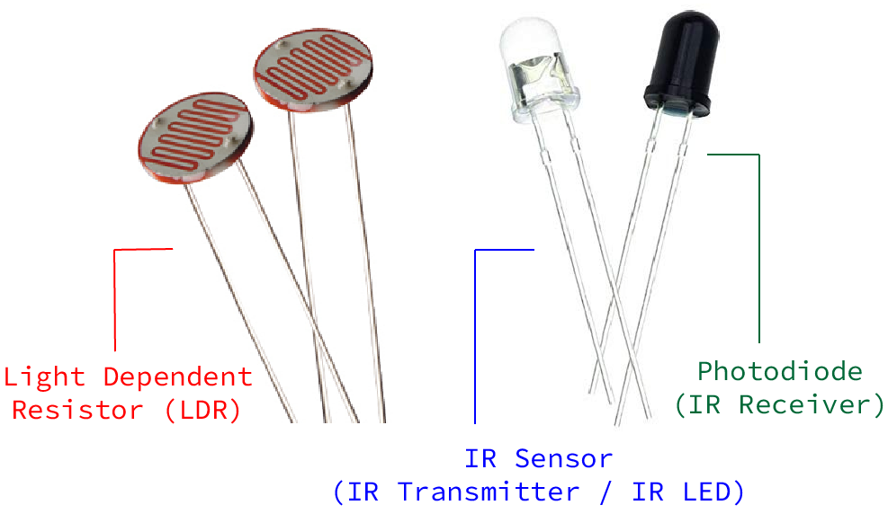
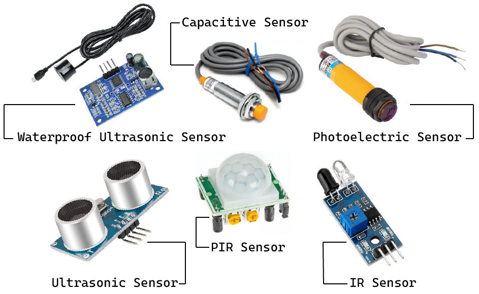
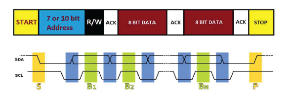
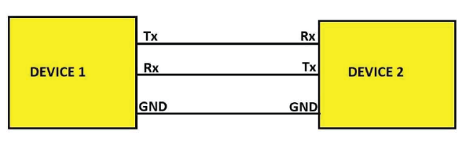
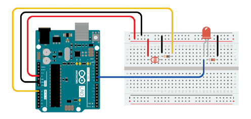
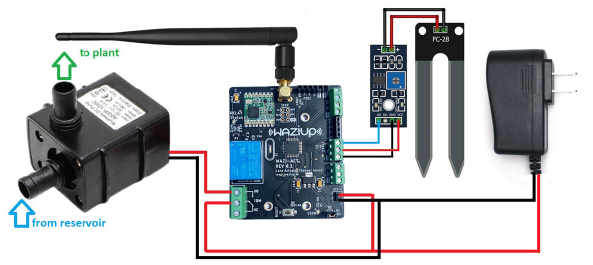

Sensors are a fundamental part of IoT. In this course, we will learn how to wire and program them. We will use several sensors as examples, such as DHT11, GPS, Soil moisture or Motion sensor.

Introduction
========
Human capability has been expanded in various ways by technology, and sensor technology has increased human perceptive range. Given the speed at which current technology is developing. IoT, big data, cloud computing, and related technologies are in high demand. It is extensively used in a variety of fields, including economics, national defense, science and technology, and daily life.


A device that provides a usable output in response to a specified measurement.The sensor attains a physical parameter and converts it into a signal suitable for processing (e.g. electrical, mechanical, optical) the characteristics of any device or material to detect the presence of a particular physical quantity. The output of the sensor is a signal which is converted to a human-readable form like changes in characteristics, changes in resistance, capacitance, impedance, etc. In various systems the transducer might be used as an actuator. The transducer helps to convert a signal from one physical structure to another or one type of energy into another type.


Overview of Various Sensors
=================
It's a jungle out there with countless sensor types. All of them, from basic temperature sensors to complex LiDAR systems, have specific functions in our technologically advanced society. Thus, knowing what sensors function is the initial step towards selecting the appropriate one.

Sensor's acts as the devices eyes and ears and gather important information from the outside environment. They keep an eye on external conditions, notice any changes, and communicate this information to other system components. Your choice of sensor will mostly depend on what you wish to measure.

A few of the most popular ones are shown here in brief:


- **Light Sensor :** These detect light levels and are commonly used in automatic lighting systems and cameras.
   
   - IR Sensor (IR Transmitter / IR LED)
   - Photodiode (IR Receiver)
   - Light Dependent Resistor
  
  

- **Temperature Sensor :** As the name suggests, these track temperature variations. They're the bread and butter of HVAC systems and many industrial processes.

  

- **Pressure/Force/Weight Sensor :** Monitoring air or fluid pressure is their forte. You'll find them in vehicles, medical devices, and weather monitoring systems.
   - Strain Gauge (Pressure Sensor)
   - Load Cell (Weight Sensor)
   
  
 
- **Proximity Sensors :** Handy for robotics and security systems, these sensors detect the presence or absence of an object within a certain range.
   - Ultrasonic proximity sensors
   - Photoelectric proximity sensors
   - Capacitive proximity sensors
   - Magnetic proximity sensors
   - IR and PIR proximity sensors
  

   


- **Gas Sensors :** A gas sensor is an electronic device that is used to detect the presence and concentration of specific gases in the air. The most common types of gases that are detected by these sensors include carbon monoxide (CO), hydrogen (H2), methane (CH4), and propane (C3H8).

   

- **Soil Moisture Sensors :** Soil moisture is basically the amount/content of water present in the soil. This can be measured using a soil moisture sensor either resistive or capacitive.
   
   


Wiring
====
Before programming we must be aware of how to wire them properly.
Wiring a sensor to a microprocessor typically involves connecting the sensor's output to one of the input pins on the microprocessor.


- **Understanding the Pinouts:** 
  
  Look at the datasheet or documentation for your sensor & processor to understand its pinout. Identify the pins for power (VCC), ground (GND), and signal/output.
- **Power Supply & Ground Connection:** 
  
  Connect the power pin (VCC) of the sensor to an appropriate power source on your microprocessor board. This is often a 5V or 3.3V pin, depending on the sensor's requirements.
  Connect the ground pin (GND) of the sensor to the ground (GND) pin on the microprocessor.
- **Signal/Output Connection:** 
  
  Connect the output pin of the sensor to one of the input pins on the microprocessor. This is typically a digital or analog pin, depending on the type of sensor.
- **Veryfying Wiring:**
  
  Double-check all connections to make sure they are secure and accurate. Incorrect wiring can lead to malfunction or damage.


**Example**
---
Lets first look at the pinout of WaziSense board and MQ2 gas sensor.


 Now we have to connect the `sensor power pin (Vcc)` & `ground pin (Gnd)` to dev board power port, which is `+` pin & `-` pin of port D7/D6. 

 Then for getting the output we have to connect the `output pin (Analog out)` to an `Analog port` of board, which can be A2/A1. 

Programming
========
For this section the first thing you need to do is installing [Arduino IDE](https://www.arduino.cc/en/software). Install the latest version from their official website. 

For getting started with programming, please complete
[this course](https://lab.waziup.io/courses/5_5hHxJIBIk?topic=0).

**Some most used functions are described below with examples:**

- This following example contains the bare minimum of code you will need for a sketch to compile properly on Arduino Software (IDE): the `setup()` method and the `loop()` method.
```c
void setup() {
  // put your setup code here, to run once:
}

void loop() {
  // put your main code here, to run repeatedly:
}
```
  1.  The `setup()` function is called when a sketch starts. Use it to initialize variables, pin modes, start using libraries, etc. The setup function will only run once, after each powerup or reset of the board.

  2. The `loop()` function does precisely what its name suggests, and loops consecutively, allowing your program to change and respond as it runs. Code in the loop() section of your sketch is used to actively control the board.

  3. Any line that starts with `two slashes (//)` will not be read by the compiler, so you can write anything you want after it. The two slashes may be put after functional code to keep comments on the same line. Commenting your code like this can be particularly helpful in explaining, both to yourself and others, how your program functions step by step.

-  The following example shows how to blink a LED with delay. After wiring LED with Arduino you may upload the following code or you may also load it from the menu `File/Examples/01.Basics/Blink . `
```c
void setup() {
  // initialize digital pin LED_BUILTIN as an output.
  pinMode(LED_BUILTIN, OUTPUT);
}

// the loop function runs over and over again forever
void loop() {
  digitalWrite(LED_BUILTIN, HIGH);  // turn the LED on (HIGH is the voltage level)
  delay(1000);                      // wait for a second
  digitalWrite(LED_BUILTIN, LOW);   // turn the LED off by making the voltage LOW
  delay(1000);                      // wait for a second
}
```

1. The first thing you need to do is to initialize LED_BUILTIN pin as an output pin with the line with the following command:
`pinMode(LED_BUILTIN, OUTPUT);`

2. In the main loop, to turn the LED on use the following command: 
`digitalWrite(LED_BUILTIN, HIGH);`
This supplies 5 volts to the LED anode. That creates a voltage difference across the pins of the LED, and lights it up.

3. To turn the LED off use the following command:
`digitalWrite(LED_BUILTIN, LOW);`
That takes the LED_BUILTIN pin back to 0 volts, and turns the LED off. 
4. In between the on and the off, to get enough time for a person to see the change, the `delay()` command is used. When you use the `delay()` command, nothing else happens for that amount of time. 


Apart from the ones described up there are a handful of new commands available.  To learn more about these commands please go through [this page.](https://www.arduino.cc/reference/en/)


Advanced topics: Communication Protocols
======

various communication protocols that are used by microcontrollers, microprocessors and ICs for communicating with various sensors, electronic drivers, input and output devices.

**Inter-Integrated Circuit (I2C) Protocol**

Allows the communication between devices or sensors connected via Two Wire Interface Bus.

I2C is also known as inter-integrated circuit, it is often called “I squared C” in short. I2C protocol was developed by Philips Semiconductors in 1982. I2C communication bus is primarily used for communication between ICs, sensors and peripherals etc. over a short distance within a circuit board.

It is a two wire communication which sends and receives data serially; the two bus lines are SDA – serial data and SCL – serial clock.

The communication mode is half duplex, meaning bi-directional communication but only one device can send data and other must receive and the receiver cannot send data to the other simultaneously. 

In I2C the data is synchronized using a clock bus which makes sure the data is sent and received properly.

I2C utilizes open collector / open drain configuration meaning the I2C bus can be only pulled LOW but cannot pull HIGH, so we need to connect two external pull-up resistors on SDA and SCL lines ranging from 4.7K to 10K depending on the specifications.

The I2C bus can have multiple master devices and multiple slave devices in the same two wire bus.

The maximum limit of the number of devices that can be connected to the bus depends on the address modes (length).

If the I2C uses 7-bit address for recognizing a master or slave device, then maximum 128 devices can be connected, if it uses 10-bit address, then 1024 devices can be connected on a same bus.  


Speed of I2C bus:

- Standard mode: 100 Kb/s.
- Full speed mode: 400 Kb/s.
- Fast mode: 1 Mb/s.
- High speed mode: 3.2 Mb/s.


Data framing of I2C & timing diagram:

- The communication begins with a start condition; the start condition is satisfied when SCL is at HIGH and SDA changes from HIGH to LOW, you can see in the timing diagram highlighted in yellow ( on left hand side).
- The next piece of data is device address. Every I2C device has an address (7 or 10 bits) so that we can write or read data from that particular I2C device. 
- The device addresses are transferred as individual bits just like any other protocols, a bit is allowed to change from HIGH to LOW or LOW to HIGH only when the SCL is at LOW (highlighted in blue). A bit is read by the receiver when SCL is at HIGH – highlighted in green, this is the same for all data chunks. Please note that in I2C the data bits are transmitted from MSB to LSB.
- The next bit is called read / write, the master decides whether the data need to be written or read from the slave device: 1 is for reading from slave, 0 is for writing data on salve.
- An acknowledgement bit is sent to the master device by a slave indicating that communication was successful and the intended slave device exists in the I2C bus. 
- Next data chunk is 1 byte of data (8 bits) in either direction (by master or slave) depending on the R/W bit. 
- After the one byte of data an acknowledgement bit is sent by the received device (master or slave). For every succeeding one byte of data in either direction, one acknowledgement bit is sent by the receiving device.
- Once the data transmission is completed a stop condition is initiated. Stop condition is initiated when SCL is at HIGH, SDA transitions from LOW to HIGH. Stop condition is monitored by all the masters in a bus so that they can initiate a new communication with a slave device in the same bus.



**Arduino & Serial Peripheral Interface (SPI):**

Serial Peripheral Interface (SPI) is a synchronous serial data protocol used by microcontrollers for communicating with one or more peripheral devices quickly over short distances.

SPI stands for Serial Peripheral Interface; it was developed by Motorola in 1980s. It is synchronous serial communication meaning it requires a clock signal to sync data between master and slave devices and it is full-duplex, meaning it can send and receive data simultaneously.

SPI protocol is single master multi-slave protocol, meaning there will be only one master device and may have two or more slave devices. SPI is also known as a four-wire serial bus.

The SPI protocol needs four wires to interface and operate between master and slave device. 

- SCLK – Serial clock – output from master device.
- MOSI – Master out slave in – data output from master device.
- MISO – Master in slave out – data input from salve device.
- SS / CS – slave select / chip select. The slave select is active low line and can be any general purpose I/O pin of a microcontroller.

Master & slave:


Multi-slave:


Timing diagram of SPI communication:


There are four modes of SPI communication:

Please refer to the above timing diagram while reading the explanation given below.


CPOL = 0 & CPHASE = 0: 
MODE 0: When CPOL is set to 0, the idle state of the clock is LOW and when CPHASE (CPHA) is set to 0, the data will be read when the clock is at rising edge and the data bit is allowed to change when the clock is falling edge. 

CPOL = 0 & CPAHSE = 1
MODE 1: When CPOL is set to 0, the idle clock state is LOW and when CPHASE (CPHA) is set to 1, the data will be read when the clock is at falling edge and the data bit is allowed to change when the clock at rising edge. 

CPOL = 1 & CPAHSE = 0
MODE 2: When CPOL is set to 1, the idle clock state is HIGH and when CPHASE (CPHA) is set to 0, the data will be read when the clock is at falling edge and the data bit is allowed to change when the clock at rising edge. 

CPOL = 1 & CPAHSE = 1
MODE 3: When CPOL is set to 1, the idle clock state is HIGH and when CPHASE (CPHA) is set to 1, the data will be read when the clock is at rising edge and the data bit is allowed to change when the clock is at falling edge. 

This concludes SPI communication protocol.


**Universal Asynchronous Receiver-Transmitter (UART):**

UART is a serial communication protocol that transmits and receives data one bit at time from least significant bit to most significant bit.

We need two devices for establishing a UART communication and it is full duplex, meaning the data can be transmitted and received simultaneously.

UART communication requires two wires (bus); Tx – transmit, Rx- receive and a common ground for completing the circuit between the two devices. The Tx of one device will be connected to the Rx of the other device and similarly the Rx of one device is connected to the Tx of another device.



**Data framing for UART:**

Data frame or timing diagram is an important aspect of any communication protocol because it describes how the data bits are transmitted, received and synchronized on a communication bus.

A firmware program developer writes a program code based on the timing diagram for proper communication between sensors, microcontrollers and peripherals. 

- During the idle state the Tx and Rx lines are pull high and we can see in the above timing diagram.
- When data transmission starts, it always begin with a “start bit”, here the start-bit is transmitted by pulling the transmit line to LOW for some time and after this the actual data bits gets transmitted. 
- D0 to D8 are the data bits and this data length can vary depending on the requirement. The minimum length is 5 bits (D0 to D4) and can extend up to 9 bits (till D8). From D0 to D8 the bits can be high or low depending on what you are sending and that’s why the diagram is shown with high and low lines simultaneously. In most applications LSB or least significant bits are transmitted first.
- An optional parity bit can be transmitted and this optional bit is to check the data integrity on the receiving end. 
- The next bit is called “stop bit” and this stop bit can be one or two bits in length.    
- After the stop bit, the transmit line is pulled HIGH until the next data frame is transmitted. 
  
The time length of a bit is determined by the baud rate and it is time critical. Before transmitting some data from one device to another it is mandatory to set the baud rate of both the devices the same


**Controller Area Network (CAN) :**

CAN protocol was developed for automotive vehicles to simplify communication between various sensors, drivers and peripherals etc. CAN is a multi-master bus and there are no slave devices and all nodes act as a master.

It sends and receives data serially and the mode of communication is half duplex and asynchronous. Since the communication is asynchronous the bit rate of the all CAN devices must be the same in a bus. 

CAN is also a message broadcast system, meaning the data send over CAN bus is not targeted (from device A to device B like I2C or SPI), instead the broadcasted data will be read by all CAN devices and if the sent data is relevant to a CAN device it will process the data further and other CAN devices simply disregard the information.

Unlike I2C where a device address exists, CAN devices do not have a device address but it has an identifier.

Identifier conveys how important the message is (priority) and also used for arbitration management when multiple CAN devices start to communicate on the bus simultaneously. 

CAN is a two wire protocol, its wires are twisted pair and unshielded. The two ends of the bus are terminated with 120 ohm resistors. The two wires of CAN bus are CAN HIGH and CAN LOW.


Advanced topics: Calibration
======
We use various systems and equipment to measure physical quantities, but accuracy can be affected by factors like temperature and humidity. Equipment calibration is essential to address errors in measurements. Sensors, electronic devices sensitive to environmental changes, require calibration to improve performance and measure structural errors. Calibration compares expected and measured values, identifying the difference as structural error.There are a lot of good sensors these days and many are 'good enough' out of the box for many non-critical applications.  But in order to achieve the best possible accuracy, a sensor should be calibrated in the system where it will be used. 

There are three standard calibration methods used for sensors. They are-

- One point calibration.
- Two-point calibration.
- Multi-Point Curve Fitting.

Before knowing these methods we have to know the concept of Characteristic curve. Every sensor has a characteristic curve that shows the response of the senor to the given input value. In the calibration process, this characteristic curve of the sensor is compared with its ideal linear response.

Some of the terms used with the characteristic curve are-

- **Offset** – This value tells us whether the sensor output is higher or lower than the ideal linear response.
- **Sensitivity or Slope** – This gives the rate of change of sensor output. A difference in slope shows that the sensor output changes at a different rate than the ideal response.
- **Linearity** – Not all sensors have a linear characteristic curve over the given measurement range.

**One point calibration** 

It is the simplest type of calibration. If your sensor output is already scaled to useful measurement units, a one point calibration can be used to correct for sensor offset errors.
To calibrate one point at a time:
1. Use your sensor to take a measurement.
2. Examine that measurement in relation to your benchmark.
3. To find the offset, subtract the sensor reading from the reference reading.
4. To get the calibrated value, add the offset to each sensor reading in your code.
  


**Two-point calibration**

A Two Point Calibration is a little more complex.  But it can be applied to either raw or scaled sensor outputs. A Two Point calibration essentially re-scales the output and is capable of correcting both slope and offset errors.  Two point calibration can be used in cases where the sensor output is known to be reasonably linear over the measurement range.  
To perform a two point calibration:

1. Take two measurements with your sensor:  One near the low end of the measurement range and one near the high end of the measurement range.  Record these readings as "RawLow" and "RawHigh"
2. Repeat these measurements with your reference instrument.  Record these readings as "ReferenceLow" and "ReferenceHigh"
3. Calculate "RawRange" as RawHigh – RawLow.
4. Calculate "ReferenceRange" as ReferenceHigh – ReferenceLow
5. In your code, calculate the "CorrectedValue" using the formula below:
   
`CorrectedValue = (((RawValue – RawLow) * ReferenceRange) / RawRange) + ReferenceLow`


**Multi-Point Curve Fitting**

Sensors that are not linear over the measurement range require some curve-fitting to achieve accurate measurements over the measurement range. A common case requiring curve-fitting is thermocouples at extremely hot or cold temperatures.  While nearly linear over a fairly wide range, they do deviate significantly at extreme temperatures.


**Example :**

One technique for calibrating sensor input is demonstrated below:

  The circuit:
  - analog sensor (potentiometer will do) attached to analog input 0
  - LED attached from digital pin 9 to ground through 220 ohm resistor
  


**Code:**
````c
/*

  The sensor readings
  during the first five seconds of the sketch execution define the minimum and
  maximum of expected values attached to the sensor pin.

  The sensor minimum and maximum initial values may seem backwards. Initially,
  you set the minimum high and listen for anything lower, saving it as the new
  minimum. Likewise, you set the maximum low and listen for anything higher as
  the new maximum.

  created 29 Oct 2008
  by David A Mellis
  modified 30 Aug 2011
  by Tom Igoe
  modified 07 Apr 2017
  by Zachary J. Fields

  This example code is in the public domain.

  https://www.arduino.cc/en/Tutorial/BuiltInExamples/Calibration
*/

// These constants won't change:
const int sensorPin = A0;  // pin that the sensor is attached to
const int ledPin = 9;      // pin that the LED is attached to

// variables:
int sensorValue = 0;   // the sensor value
int sensorMin = 1023;  // minimum sensor value
int sensorMax = 0;     // maximum sensor value


void setup() {
  // turn on LED to signal the start of the calibration period:
  pinMode(13, OUTPUT);
  digitalWrite(13, HIGH);

  // calibrate during the first five seconds
  while (millis() < 5000) {
    sensorValue = analogRead(sensorPin);

    // record the maximum sensor value
    if (sensorValue > sensorMax) {
      sensorMax = sensorValue;
    }

    // record the minimum sensor value
    if (sensorValue < sensorMin) {
      sensorMin = sensorValue;
    }
  }

  // signal the end of the calibration period
  digitalWrite(13, LOW);
}

void loop() {
  // read the sensor:
  sensorValue = analogRead(sensorPin);

  // in case the sensor value is outside the range seen during calibration
  sensorValue = constrain(sensorValue, sensorMin, sensorMax);

  // apply the calibration to the sensor reading
  sensorValue = map(sensorValue, sensorMin, sensorMax, 0, 255);

  // fade the LED using the calibrated value:
  analogWrite(ledPin, sensorValue);
}
`````

A Complete Example 
====

Here's what we will be learning from this example:

- What parts are needed
- How to wire up and read sensor values
- How to trigger an actuator
- How to use the actuator to control a water pump
- How to communicate to the cloud over LoRa


You will need the following hardware and software:

Hardware
  - WaziAct
  - FT232 FTDI module with Mini USB Cable
  - Wazigate
  - Soil Moisture Sensor
  - Submersible Water Pump
  - Some Jumper Wires
  - Power Supply


Software
  - Please install the [Arduino IDE](https://www.arduino.cc/en/Main/Software) for the programming aspects.
  - Install the [WaziDev](https://github.com/Waziup/WaziDev/archive/master.zip) libraries for LoRa communication. Follow the guide [here](https://waziup.io/documentation/wazidev/user-manual/#install-the-wazidev-sketchbook)


### Step 1: Setting up the Soil Moisture Sensor
Soil moisture sensors measures the amount of water in the soil to maintain consistent and ideal soil conditions for plants.
They can be used to detect the moisture of soil or judge if there is water around the sensor. They can be very easy to use, 
just insert it into the soil and then read it.

#### Schematics

There are only three pins that you need to worry about on most of these analog soil humidity sensors. The common principle is to power the sensor and get the output voltage on an analog pin. In our case, we are going to use pin A6.


NOTE: we are powering the soil moisture sensor from **pin D6**. Each digital pin can with stand **40mA** max current draw. The soil moisture sensor is rated for **35mA**.

Module interface:
1. VCC: Connect to the D6 pin of the WaziACT
2. GND: Connect to the GND pin of the WaziACT
3. IN: Connect to the WaziACT analog pin A6

Code Sample

```c
/********************
 * Soil Moisture Tester
 * Read soil humidity by measuring its resistance.
 ********************/

int sensorPin = A6;
int sensorPow = 6;

void setup() {
  Serial.begin(38400);
  pinMode(sensorPow, OUTPUT);
  delay(100);
  digitalWrite(sensorPow, HIGH);
}

void loop() {
  int soilHumidity = analogRead(sensorPin);
  Serial.println(soilHumidity);
  delay(100);
}
```

### Step 2: Setting up the Actuator(Relay)


You may occasionally wish to manage appliances with AC power, such as lamps, fans, and other home appliances. The WaziACT, however, cannot directly control these higher voltage devices because it runs on 3.3 volts.

This is where the relay comes into play.The waziACT has a relay module to control the AC mains. In our case, we are controlling the 12 Volts supply of a water pump.

Code Sample
```c
/********************
 *  Program:  Relay Tester
 ********************/

//Declaring pin 10 as the control pin    
int RelayPin = 7;

void setup() {
  //Set RelayPin as an output pin
  pinMode(RelayPin, OUTPUT);
}

void loop() {
  // Let's turn on the relay...
  digitalWrite(RelayPin, LOW);

  //Lets wait for 5 seconds
  delay(5000);
	
  //Let's turn off the relay...
  digitalWrite(RelayPin, HIGH);

  //Lets wait for another 5 seconds
  delay(5000);
}
```


### Step #3: Combining Sensing and Actuation with Lora Communication

At this point, we want to trigger the relay to turn ON the water pump, when the soil moisture sensor detects a dry soil. The relay will then turn OFF when the soil moisture sensor reports the soil is wet. Also the WaziACT will constantly update Wazicloud with the current state of the soil through Wazigate.

**NOTE:** Make sure to have a configured gateway up and running before uploading this next code. Kindly see the lectures under **Module 5 Lecture 2** for how to setup a Waziup Gateway.

#### Schematics



Code Sample
```c
#include <WaziDev.h>
#include <xlpp.h>
#include <Base64.h>

// NwkSKey (Network Session Key) and Appkey (AppKey) are used for securing LoRaWAN transmissions.
// You need to copy them from/to your LoRaWAN server or gateway.
// You need to configure also the devAddr. DevAddr need to be different for each devices!!
// Copy'n'paste the DevAddr (Device Address): 26011D00
unsigned char devAddr[4] = {0x26, 0x01, 0x1D, 0x00};

// Copy'n'paste the key to your Wazigate: 23158D3BBC31E6AF670D195B5AED5525
unsigned char appSkey[16] = {0x23, 0x15, 0x8D, 0x3B, 0xBC, 0x31, 0xE6, 0xAF, 0x67, 0x0D, 0x19, 0x5B, 0x5A, 0xED, 0x55, 0x25};

// Copy'n'paste the key to your Wazigate: 23158D3BBC31E6AF670D195B5AED5525
unsigned char nwkSkey[16] = {0x23, 0x15, 0x8D, 0x3B, 0xBC, 0x31, 0xE6, 0xAF, 0x67, 0x0D, 0x19, 0x5B, 0x5A, 0xED, 0x55, 0x25};

WaziDev wazidev;

//Declaring pin 7 as the control pin
int RelayPin = 7;

//Sensor Power Pin
int sensorPow = 6;

//Declaring pin A0 moisture sensing pin
int sensorPin = A6;

//Declaring dry and wet soil threshold values
int const dryThreshold = 800;
int const wetThreshold = 350;

void setup()
{
  Serial.begin(38400);
  wazidev.setupLoRaWAN(devAddr, appSkey, nwkSkey);

  pinMode(RelayPin, OUTPUT);
  pinMode(sensorPow, OUTPUT);
  delay(100);
  digitalWrite(sensorPow, HIGH);
}

XLPP xlpp(120);

void loop(void)
{
  int soilHumidity = analogRead(sensorPin);

  //Check if the soil moisture value is a number
  if (!(isnan(soilHumidity))) {
    if (soilHumidity > dryThreshold) { //Turn Pump ON
      digitalWrite(RelayPin, HIGH);
    } else if (soilHumidity <= wetThreshold) { //Turn Pump OFF
      digitalWrite(RelayPin, LOW);
    }
  }
  
  // 1
  // Create xlpp payload.
  
  xlpp.reset();
  
  xlpp.addRelativeHumidity(1, soilHumidity);
  
  // 2.
  // Send paload with LoRaWAN.
  serialPrintf("LoRaWAN send ... ");
  uint8_t e = wazidev.sendLoRaWAN(xlpp.buf, xlpp.len);
  if (e != 0)
  {
    serialPrintf("Err %d\n", e);
    delay(60000);
    return;
  }
  serialPrintf("OK\n");
  
  // 3.
  // Receive LoRaWAN message (waiting for 6 seconds only).
  serialPrintf("LoRa receive ... ");
  uint8_t offs = 0;
  long startSend = millis();
  e = wazidev.receiveLoRaWAN(xlpp.buf, &xlpp.offset, &xlpp.len, 6000);
  long endSend = millis();
  if (e != 0)
  {
    if (e == ERR_LORA_TIMEOUT){
      serialPrintf("nothing received\n");
    }
    else
    {
      serialPrintf("Err %d\n", e);
    }
    delay(60000);
    return;
  }
  serialPrintf("OK\n");
  
  serialPrintf("Time On Air: %d ms\n", endSend-startSend);
  serialPrintf("LoRa SNR: %d\n", wazidev.loRaSNR);
  serialPrintf("LoRa RSSI: %d\n", wazidev.loRaRSSI);
  serialPrintf("LoRaWAN frame size: %d\n", xlpp.offset+xlpp.len);
  serialPrintf("LoRaWAN payload len: %d\n", xlpp.len);
  serialPrintf("Payload: ");
  char payload[100];
  base64_decode(payload, xlpp.getBuffer(), xlpp.len); 
  serialPrintf(payload);
  serialPrintf("\n");
  
  delay(5000);
}
```

At this point, all we need to do is drop the water pump in a water resevoir and attach a pipe to the outlet of the pump, to the plant.

we can also setup notifications on WaziCloud, for when the relay turns ON or OFF. We can use the soil figures we used in the previous example. That is `800` for dry soil(Relay ON) and `350` for a wet soil(Relay OFF).


Exercise
===

After completing this course you should be able to do the following exercise by youself.

*Task*

`
Use an Ultrasonic sensor and a WaziUp development board to measure the water level in a water tank.
`

*Hints*

Required Hardware

- WaziUp development board
- FT232 FTDI module with Mini USB Cable
- Wazigate
- SR04 Ultrasonic Sensor
- Lora 868Mhz Antenna
- Some Jumper Wires


Required Software

- Arduino IDE for the programming aspects
- WaziDev libraries for LoRa communication

Module interface:

1. VCC: Connect to the D5 pin of the development board
2. GND: Connect to the GND pin of the development board
3. Rx: Connect to the D3 pin of the development board
4. Tx: Connect to the D4 pin of the development board