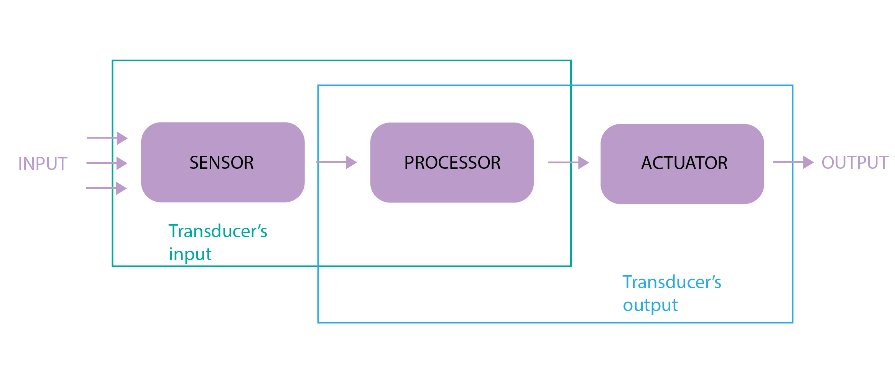

Sensors are a fundamental part of IoT. In this course, we will learn how to wire and program them. We will use several sensors as examples, such as DHT11, GPS, Soil moisture or Motion sensor.

Introduction
========
Generally, sensors are used in the architecture of IOT devices. Sensors are used for sensing things and devices etc.

A device that provides a usable output in response to a specified measurement.The sensor attains a physical parameter and converts it into a signal suitable for processing (e.g. electrical, mechanical, optical) the characteristics of any device or material to detect the presence of a particular physical quantity. The output of the sensor is a signal which is converted to a human-readable form like changes in characteristics, changes in resistance, capacitance, impedance, etc. In various systems the transducer might be used as an actuator. The transducer helps to convert a signal from one physical structure to another or one type of energy into another type.




Sensors
=================
There are different types of sensor available. They can be classified as -
- Temperature Sensors
- Humidity Sensors
- Advanced T/H Sensors
- Distance Sensors
- Motion Sensors
- Sound Level Sensors
- Light Sensors
- RFID Tags
- GPS & Localization
- OLED Screen
  


Humidity Sensors
=======================
Several fields including meteorology, medicine, food production, industry (paper, textile, electronics, and automotive) and agriculture (cereal stocking and greenhouses) all depend on the measurement and management of humidity. Humidity can be measured using a variety of methods, some of which can be combined with electronics to provide continuous readings. These include solid-state conductors or electrolytes, semiconductors that alter their impedance as a result of water's donor characteristics, porous and water-adsorbing insulators or dielectrics, and piezoelectrics that alter their mechanical wave characteristics as a result of water adsorption.

Simple humidity sensors are mostly analog sensors related to soil humidity or water level.The most well-known humidity sensor is the capacitive type sensor as water has an unusual high dielectric constant and because the adsorption of water causes changes in relative permittivity, which in turn gives an easily understood detection method.

Here, we are going to use a simple conductivity or capacitive sensors for soil humidity and learn the process of wiring and programming.

### Here's what we will be learning:

- What parts are needed
- How to wire up and read sensor values
- How to trigger an actuator
- How to use the actuator to control a water pump
- How to communicate to the cloud over LoRa


### What parts do we need?

To follow this user manual, one will need the following hardware and software:

Hardware
  - WaziAct
  - FT232 FTDI module with Mini USB Cable
  - Wazigate
  - Soil Moisture Sensor
  - Submersible Water Pump
  - Some Jumper Wires
  - Power Supply


Software
  - Please install the [Arduino IDE](https://www.arduino.cc/en/Main/Software) for the programming aspects.
  - Install the [WaziDev](https://github.com/Waziup/WaziDev/archive/master.zip) libraries for LoRa communication. Follow the guide [here](https://waziup.io/documentation/wazidev/user-manual/#install-the-wazidev-sketchbook)

## Step #1: Setting up the Soil Moisture Sensor

Soil moisture sensors measures the amount of water in the soil to maintain consistent and ideal soil conditions for plants.
They can be used to detect the moisture of soil or judge if there is water around the sensor. They can be very easy to use, 
just insert it into the soil and then read it.

### Schematics

There are only three pins that you need to worry about on most of these analog soil humidity sensors. The common principle is to power the sensor and get the output voltage on an analog pin. In our case, we are going to use pin A6.


NOTE: we are powering the soil moisture sensor from **pin D6**. Each digital pin can with stand **40mA** max current draw. The soil moisture sensor is rated for **35mA**.

Module interface:
1. VCC: Connect to the D6 pin of the WaziACT
2. GND: Connect to the GND pin of the WaziACT
3. IN: Connect to the WaziACT analog pin A6

Code Sample
------------
```c
/********************
 * Soil Moisture Tester
 * Read soil humidity by measuring its resistance.
 ********************/

int sensorPin = A6;
int sensorPow = 6;

void setup() {
  Serial.begin(38400);
  pinMode(sensorPow, OUTPUT);
  delay(100);
  digitalWrite(sensorPow, HIGH);
}

void loop() {
  int soilHumidity = analogRead(sensorPin);
  Serial.println(soilHumidity);
  delay(100);
}
```

## Step #2: Setting up the Actuator(Relay)


You may occasionally wish to manage appliances with AC power, such as lamps, fans, and other home appliances. The WaziACT, however, cannot directly control these higher voltage devices because it runs on 3.3 volts.

This is where the relay comes into play.The waziACT has a relay module to control the AC mains. In our case, we are controlling the 12 Volts supply of a water pump.

Code Sample
-----------
```c
/********************
 *  Program:  Relay Tester
 ********************/

//Declaring pin 10 as the control pin    
int RelayPin = 7;

void setup() {
  //Set RelayPin as an output pin
  pinMode(RelayPin, OUTPUT);
}

void loop() {
  // Let's turn on the relay...
  digitalWrite(RelayPin, LOW);

  //Lets wait for 5 seconds
  delay(5000);
	
  //Let's turn off the relay...
  digitalWrite(RelayPin, HIGH);

  //Lets wait for another 5 seconds
  delay(5000);
}
```


## Step #3: Combining Sensing and Actuation with Lora Communication


At this point, we want to trigger the relay to turn ON the water pump, when the soil moisture sensor detects a dry soil. The relay will then turn OFF when the soil moisture sensor reports the soil is wet. Also the WaziACT will constantly update Wazicloud with the current state of the soil through Wazigate.

**NOTE:** Make sure to have a configured gateway up and running before uploading this next code. Kindly see the lectures under **Module 5 Lecture 2** for how to setup a Waziup Gateway.

### Schematics


Code Sample
-----------
```c
#include <WaziDev.h>
#include <xlpp.h>
#include <Base64.h>

// NwkSKey (Network Session Key) and Appkey (AppKey) are used for securing LoRaWAN transmissions.
// You need to copy them from/to your LoRaWAN server or gateway.
// You need to configure also the devAddr. DevAddr need to be different for each devices!!
// Copy'n'paste the DevAddr (Device Address): 26011D00
unsigned char devAddr[4] = {0x26, 0x01, 0x1D, 0x00};

// Copy'n'paste the key to your Wazigate: 23158D3BBC31E6AF670D195B5AED5525
unsigned char appSkey[16] = {0x23, 0x15, 0x8D, 0x3B, 0xBC, 0x31, 0xE6, 0xAF, 0x67, 0x0D, 0x19, 0x5B, 0x5A, 0xED, 0x55, 0x25};

// Copy'n'paste the key to your Wazigate: 23158D3BBC31E6AF670D195B5AED5525
unsigned char nwkSkey[16] = {0x23, 0x15, 0x8D, 0x3B, 0xBC, 0x31, 0xE6, 0xAF, 0x67, 0x0D, 0x19, 0x5B, 0x5A, 0xED, 0x55, 0x25};

WaziDev wazidev;

//Declaring pin 7 as the control pin
int RelayPin = 7;

//Sensor Power Pin
int sensorPow = 6;

//Declaring pin A0 moisture sensing pin
int sensorPin = A6;

//Declaring dry and wet soil threshold values
int const dryThreshold = 800;
int const wetThreshold = 350;

void setup()
{
  Serial.begin(38400);
  wazidev.setupLoRaWAN(devAddr, appSkey, nwkSkey);

  pinMode(RelayPin, OUTPUT);
  pinMode(sensorPow, OUTPUT);
  delay(100);
  digitalWrite(sensorPow, HIGH);
}

XLPP xlpp(120);

void loop(void)
{
  int soilHumidity = analogRead(sensorPin);

  //Check if the soil moisture value is a number
  if (!(isnan(soilHumidity))) {
    if (soilHumidity > dryThreshold) { //Turn Pump ON
      digitalWrite(RelayPin, HIGH);
    } else if (soilHumidity <= wetThreshold) { //Turn Pump OFF
      digitalWrite(RelayPin, LOW);
    }
  }
  
  // 1
  // Create xlpp payload.
  
  xlpp.reset();
  
  xlpp.addRelativeHumidity(1, soilHumidity);
  
  // 2.
  // Send paload with LoRaWAN.
  serialPrintf("LoRaWAN send ... ");
  uint8_t e = wazidev.sendLoRaWAN(xlpp.buf, xlpp.len);
  if (e != 0)
  {
    serialPrintf("Err %d\n", e);
    delay(60000);
    return;
  }
  serialPrintf("OK\n");
  
  // 3.
  // Receive LoRaWAN message (waiting for 6 seconds only).
  serialPrintf("LoRa receive ... ");
  uint8_t offs = 0;
  long startSend = millis();
  e = wazidev.receiveLoRaWAN(xlpp.buf, &xlpp.offset, &xlpp.len, 6000);
  long endSend = millis();
  if (e != 0)
  {
    if (e == ERR_LORA_TIMEOUT){
      serialPrintf("nothing received\n");
    }
    else
    {
      serialPrintf("Err %d\n", e);
    }
    delay(60000);
    return;
  }
  serialPrintf("OK\n");
  
  serialPrintf("Time On Air: %d ms\n", endSend-startSend);
  serialPrintf("LoRa SNR: %d\n", wazidev.loRaSNR);
  serialPrintf("LoRa RSSI: %d\n", wazidev.loRaRSSI);
  serialPrintf("LoRaWAN frame size: %d\n", xlpp.offset+xlpp.len);
  serialPrintf("LoRaWAN payload len: %d\n", xlpp.len);
  serialPrintf("Payload: ");
  char payload[100];
  base64_decode(payload, xlpp.getBuffer(), xlpp.len); 
  serialPrintf(payload);
  serialPrintf("\n");
  
  delay(5000);
}
```

At this point, all we need to do is drop the water pump in a water resevoir and attach a pipe to the outlet of the pump, to the plant.

we can also setup notifications on WaziCloud, for when the relay turns ON or OFF. We can use the soil figures we used in the previous example. That is `800` for dry soil(Relay ON) and `350` for a wet soil(Relay OFF).


Distance Sensors
=================

### Here's what we will be learning:
- What parts are needed
- How to wire up and read sensor values
- How to trigger an actuator
- How to communicate to the cloud over LoRa

### What parts do we need?


To follow this user manual, one will need the following:

Hardware
  - WaziACT
  - FTDI FT232
  - Mini USB Cable
  - Wazigate
  - SR04 Ultrasonic Sensor
  - Some Jumper Wires
  - Lora 868Mhz Antenna


Software
  - Install the [Arduino IDE](https://www.arduino.cc/en/Main/Software) for the programming aspects.
  - Install the [WaziDev](https://github.com/Waziup/WaziDev/archive/master.zip) libraries for LoRa communication. Follow the guide [here](https://waziup.io/documentation/wazidev/user-manual/#install-the-wazidev-sketchbook)


## Step #1: Wiring and Reading Sensor Values


To be able to detect the current water level in the tank, we need to use the waterproof ultrasonic distance sensor.

The sensor head emits an ultrasonic wave and receives the wave reflected back from the target. The ultrasonic Sensor measures the distance to the target by measuring the time between the emission and reception of the ultrasonic signal.


### Schematic


**NOTE:** we used the digital pin d4 as the VCC/power source for the ultrasonic sensor. This is to enable us to switch off the sensor completely if need be in the future. Because each digital pin can handle 40mA max current draw, the 30mA operating current of the sensor wont be an issue. we can see this from the manufactureres data sheet.

Lets also note that the waterproof ultrasonic sensor we are using has a minimum range of 25cm. This means that below 25cm the sensor reading might not be accurate. However we can read up to 5 meters max. This may good enough for most use cases.


Code Sample
-----------

```c
//sensor pins
#define trigPin  9
#define echoPin  5

//sensor power pin
#define powerPin  4

void setup() {
  Serial.begin(9600);

  //turning sensor on
  pinMode(powerPin, OUTPUT);
  delay(500);
  digitalWrite(powerPin, HIGH);

  //declaring sensor pin modes
  pinMode(trigPin, OUTPUT);
  //inputpull up to prevent noise on echo pin
  pinMode(echoPin, INPUT_PULLUP);

}

void loop() {

  //reading sensor values
  unsigned long duration = 0;
  int distance = 0;
  int average = 0;

  //taking 100 distance samples
  while (average <= 100) {
    digitalWrite(trigPin, LOW);
    delayMicroseconds(5);
    digitalWrite(trigPin, HIGH);
    delayMicroseconds(10);
    digitalWrite(trigPin, LOW);

    duration = pulseIn(echoPin, HIGH, 1000);
    distance += duration * 0.034 / 2;
    average += 1;
    delay(30);
  }

  //finding the average of 100 samples
  distance = distance / average;

  //checking to be sure the current distance value is a number and greater than 0
  if (!(isnan(distance) || distance < 0)) {
    return;
  }

  Serial.print("Distance: ");
  Serial.print(distance);
  Serial.println(" cm");

  delay(10);
}
```


## Step #2: Triggering an Actuator with Sensor Data

In our previous code snample, we were able to read sensor values. Lets now use those values to trigger the relay when the water level falls to say 100cm. We will also stop or turn off the pump when the water level rises to 30cm.

NOTE: Since AC power is involved, please make sure you're wearing protective clothing. Make sure you're qualified/certified to handle the task at hand. You are 100% responsible for your safety and well being.

### Schematics


Code Sample
-----------

```c
//sensor pins
#define trigPin  9
#define echoPin  5

//sensor power pin
#define powerPin  4

//relay pin
const int relayPin = 7;

void setup() {
  Serial.begin(9600);

  //turning sensor on
  pinMode(powerPin, OUTPUT);
  delay(500);
  digitalWrite(powerPin, HIGH);

  //declaring relay pin mode
  pinMode(relayPin, OUTPUT);
  delay(500);
  //make sure the relay isnt on during a restart
  digitalWrite(relayPin, LOW);
  
  //declaring sensor pin modes
  pinMode(trigPin, OUTPUT);
  //inputpull up to prevent noise on echo pin
  pinMode(echoPin, INPUT_PULLUP);

}

void loop() {

  //reading sensor values
  unsigned long duration = 0;
  int distance = 0;
  int average = 0;

  //taking 100 distance samples
  while (average <= 100) {
    digitalWrite(trigPin, LOW);
    delayMicroseconds(5);
    digitalWrite(trigPin, HIGH);
    delayMicroseconds(10);
    digitalWrite(trigPin, LOW);

    duration = pulseIn(echoPin, HIGH, 1000);
    distance += duration * 0.034 / 2;
    average += 1;
    delay(30);
  }

  //finding the average of 100 samples
  distance = distance / average;

  //checking to be sure the current distance value is a number and greater than 0
  if (!(isnan(distance) || distance < 0)) {
    return;
  }

  Serial.print("Distance: ");
  Serial.print(distance);
  Serial.println(" cm");

  //full tank value of 30cm and low value of 100cm
  if(distance < 30){//tank full
    digitalWrite(relayPin, LOW);
  }else if(distance > 100){//tank running low
    digitalWrite(relayPin, HIGH);
  }

  delay(10);
}
```


## Step #3: Combining Sensing, Actuation and Lora Communication


At this point, we want the WaziDev to constantly update Wazicloud with the current state of the tank through Wazigate.

**NOTE:** Make sure to have a configured gateway up and running before uploading this next code. Kindly see the lectures under **Module 5 Lecture 2** for how to setup a Waziup Gateway.

In order to make our project mobile, we can add a battery to power the sensor and the Wazidev as shown below.

### Schematics


Code Sample
-----------

```c
#include <WaziDev.h>
#include <xlpp.h>
#include <Base64.h>

//sensor pins
#define trigPin  9
#define echoPin  5

//sensor power pin
#define powerPin  4

//relay pin
const int relayPin = 7;

// NwkSKey (Network Session Key) and Appkey (AppKey) are used for securing LoRaWAN transmissions.
// You need to copy them from/to your LoRaWAN server or gateway.
// You need to configure also the devAddr. DevAddr need to be different for each devices!!
// Copy'n'paste the DevAddr (Device Address): 26011D00
unsigned char devAddr[4] = {0x26, 0x01, 0x1D, 0x00};

// Copy'n'paste the key to your Wazigate: 23158D3BBC31E6AF670D195B5AED5525
unsigned char appSkey[16] = {0x23, 0x15, 0x8D, 0x3B, 0xBC, 0x31, 0xE6, 0xAF, 0x67, 0x0D, 0x19, 0x5B, 0x5A, 0xED, 0x55, 0x25};

// Copy'n'paste the key to your Wazigate: 23158D3BBC31E6AF670D195B5AED5525
unsigned char nwkSkey[16] = {0x23, 0x15, 0x8D, 0x3B, 0xBC, 0x31, 0xE6, 0xAF, 0x67, 0x0D, 0x19, 0x5B, 0x5A, 0xED, 0x55, 0x25};

WaziDev wazidev;

void setup()
{
  Serial.begin(38400);
  wazidev.setupLoRaWAN(devAddr, appSkey, nwkSkey);

  //turning sensor on
  pinMode(powerPin, OUTPUT);
  delay(500);
  digitalWrite(powerPin, HIGH);

  //declaring relay pin mode
  pinMode(relayPin, OUTPUT);
  delay(500);
  //make sure the relay isnt on during a restart
  digitalWrite(relayPin, LOW);

  //declaring sensor pin modes
  pinMode(trigPin, OUTPUT);

  //inputpull up to prevent noise on echo pin
  pinMode(echoPin, INPUT_PULLUP);

}

XLPP xlpp(120);

void loop(void)
{
  //reading sensor values
  unsigned long duration = 0;
  int distance = 0;
  int average = 0;

  //taking 100 distance samples
  while (average <= 100) {
    digitalWrite(trigPin, LOW);
    delayMicroseconds(5);
    digitalWrite(trigPin, HIGH);
    delayMicroseconds(10);
    digitalWrite(trigPin, LOW);

    duration = pulseIn(echoPin, HIGH, 1000);
    distance += duration * 0.034 / 2;
    average += 1;
    delay(30);
  }

  //finding the average of 100 samples
  distance = distance / average;

  //checking to be sure the current distance value is a number and greater than 0
  if (!(isnan(distance) || distance < 0)) {
    return;
  }

  Serial.print("Distance: ");
  Serial.print(distance);
  Serial.println(" cm");

  //full tank value of 30cm and low value of 100cm
  if (distance < 30) { //tank full
    digitalWrite(relayPin, LOW);
  } else if (distance > 100) { //tank running low
    digitalWrite(relayPin, HIGH);
  }

  delay(10);
  // 1
  // Create xlpp payload.

  xlpp.reset();

  xlpp.addTemperature(1, distance);

  // 2.
  // Send paload with LoRaWAN.
  serialPrintf("LoRaWAN send ... ");
  uint8_t e = wazidev.sendLoRaWAN(xlpp.buf, xlpp.len);
  if (e != 0)
  {
    serialPrintf("Err %d\n", e);
    delay(60000);
    return;
  }
  serialPrintf("OK\n");

  // 3.
  // Receive LoRaWAN message (waiting for 6 seconds only).
  serialPrintf("LoRa receive ... ");
  uint8_t offs = 0;
  long startSend = millis();
  e = wazidev.receiveLoRaWAN(xlpp.buf, &xlpp.offset, &xlpp.len, 6000);
  long endSend = millis();
  if (e != 0)
  {
    if (e == ERR_LORA_TIMEOUT) {
      serialPrintf("nothing received\n");
    }
    else
    {
      serialPrintf("Err %d\n", e);
    }
    delay(60000);
    return;
  }
  serialPrintf("OK\n");

  serialPrintf("Time On Air: %d ms\n", endSend - startSend);
  serialPrintf("LoRa SNR: %d\n", wazidev.loRaSNR);
  serialPrintf("LoRa RSSI: %d\n", wazidev.loRaRSSI);
  serialPrintf("LoRaWAN frame size: %d\n", xlpp.offset + xlpp.len);
  serialPrintf("LoRaWAN payload len: %d\n", xlpp.len);
  serialPrintf("Payload: ");
  char payload[100];
  base64_decode(payload, xlpp.getBuffer(), xlpp.len);
  serialPrintf(payload);
  serialPrintf("\n");

  delay(5000);
}
```

At this point, all we need to do is flash the above code to the WaziACT and attach the ultrasonic head to the upper part of the desired tank for sensing.

If we take a look at the data in our serial monitor we should see something similar to the image below.


Since we used `xlpp.addTemperature(1, distance);` for the distance or water level values, we have to rename the sensor on the wazigate for clarity as shown below.


If we take a look at the Wazicloud platform, we will also see the sensor value once again.


we can also setup notifications on WaziCloud, for when the water level threshold conditions are met. Kindly see the lectures under **Module 5 Lecture 3** for how to setup a Notifications on Wazicloud.


