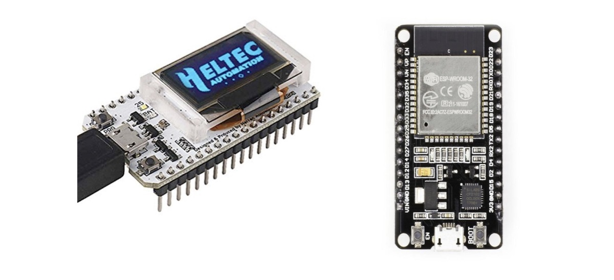
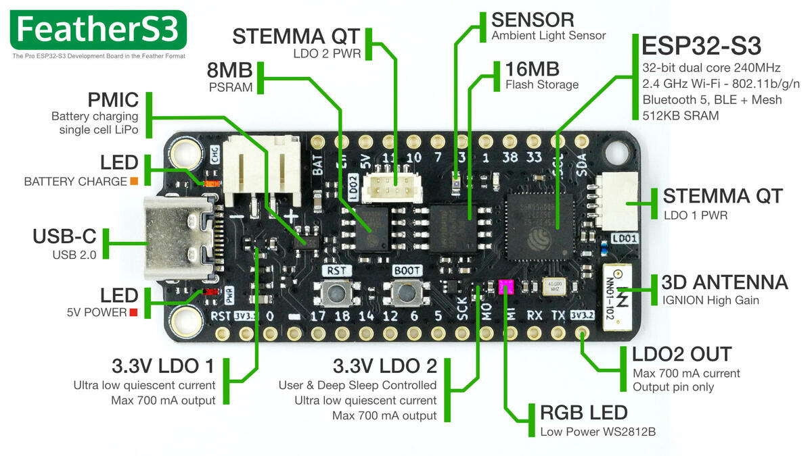
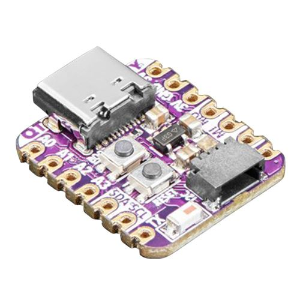

Introduction
============

This course will present general public wireless technologies such as WiFi. These versatile wireless technologies can be used in specific IoT domains when short range or Internet connectivity should be available on the device itself. These technologies can also be used in training sessions to introduce higher level IoT protocol stacks such as MQTT.
We will use the popular chips ESP8266 or ESP32 as an example, as this chip as Wifi embbeded.

The ESP8266/ESP32 boards
========================

The ESP8266 is a low-cost Wi-Fi microchip with full TCP/IP stack and microcontroller capability produced by Shanghai-based Chinese manufacturer Espressif Systems [source: https://en.wikipedia.org/wiki/ESP8266]. The chip is usually embedded on a board such as the NodeMCU (see picture below) to make it easier to use. Most of ESP8266-based boards are compatible with Arduino IDE provided that you install the required addons. 


The successor to these microcontroller chips is the ESP32. Again, many boards based on the ESP32 are available. Below are the Heltec WiFi LoRa 32 with a small embedded OLED screen and the more common ESP32-WROOM.



First ESP32 was released in Sep. 2016. New ESP32 versions have been released since. You can look at [all the ESP32 versions](https://www.espressif.com/en/products/modules) released by Expressif. Most recent ESP32 chips are ESP32-S2, ESP32-S3, ESP32-C3 and ESP32-C6, used by a large number of boards to propose high-end versatile microcontroller boards for a wide variety to applications. Latest ESP32-C3 & ESP32-C6 also adopt the RISC-V architecture. Below are illustrated the FeatherS3 (ESP32-S3) from Unexpected Maker and the QT Py (ESP32-C3) from Adafruit.





You can find lots of information such as latest datasheets on the [Espressif official web site](https://www.espressif.com/en).

Installation
============

Starting with 1.6.4, Arduino allows installation of third-party platform packages using Boards Manager. We have packages available for Windows, Mac OS, and Linux (32 and 64 bit).

- Install the current upstream Arduino IDE at the 1.8 level or later. The current version is at the [officiel Arduino web site](https://www.arduino.cc/en/main/software)
Start Arduino and open Preferences window
- For ESP8286 enter `http://arduino.esp8266.com/stable/package_esp8266com_index.json`; for generic ESP32 enter `https://dl.espressif.com/dl/package_esp32_index.json`; for the Heltec LoRa enter `https://github.com/Heltec-Aaron-Lee/WiFi_Kit_series/releases/download/0.0.5/package_heltec_esp32_index.json` into Additional Board Manager URLs field. You can add multiple URLs, one per line
- Open Boards Manager from Tools → Board menu, then search & install "ESP8266" or "ESP32" or "Heltec ESP32" platforms
- Then, select your board, ESP8266 or ESP32 or Heltec ESP32, from Tools → Board menu to compile for the correct platform
- After connecting the ESP32, select the serial port and if you don’t see the serial port in your Arduino IDE, you will need to install the [CP210x USB to UART Bridge VCP Drivers](https://www.silabs.com/developers/usb-to-uart-bridge-vcp-drivers)

You can read the [following page](https://randomnerdtutorials.com/installing-the-esp32-board-in-arduino-ide-windows-instructions/) which has a YouTube video to see all these steps.
 
You can refer to GitHub page for [ESP8266](https://github.com/esp8266/Arduino#installing-with-boards-manager) for futher information on Arduino core for ESP8286 WiFi chip.
   
As there are many boards based on both ESP8266 or ESP32, you can refer to the following [wikipedia page](https://en.wikipedia.org/wiki/ESP8266) to identify your board.

Setting up the WiFi
========================

In the example below, we briefly explain setting up the wifi and establishing the connection. 
 
We will briefly explain the steps used in the example below to use the WiFi module.

If using ESP8266, use `ESP98266WiFi.h` header file. In case you are using ESP32, use the `WiFi.h`.

```c++
#if defined ESP8266 || defined ARDUINO_ESP8266_ESP01
#include <ESP8266WiFi.h>
#else
#include <WiFi.h>
#endif
```

Define the network SSID and password, here for demonstration purpose, we usually use a smartphone sharing 3G/4G as WiFi access point. Note that it is not possible to use a WiFi that requires pop-up windows or a complex authentication mechanism.

```c++
char* ssid = "iPhoneD";
char* password = "hello123";
```

Then we define a dedicated function to setup the WiFi. `setup_wifi()` mainly 
defines the connection to the WiFi network using the SSID and the password, and then check if the WiFi is successfully connected.

```c++
void setup_wifi() {
  WiFi.begin(ssid, password);
}
```

In `setup()` we mainly call `setup_wifi()`function to connect to WiFi.

```c++
void setup() {
  delay(3000); 
  Serial.begin(38400);
  
  // Print a start message 
  Serial.println(F("Simple WiFi example"));  

  setup_wifi();
}
```

In `loop()`, we first check if the WiFi is connected. If is not connected, we attempt to connect to the WiFi again.

``` c++
if (WiFi.status() != WL_CONNECTED) {

    unsigned long start=millis();    
    while (WiFi.status() != WL_CONNECTED && millis()-start<15000) {
        WiFi.begin(ssid, password);
     }
 }
```

Complete example
=================

Here is the complete working and tested example of the an Arduino board with WiFi.

```c++
// if you have an ESP8266 based board
#define ESP8266

#if defined ESP8266 || defined ARDUINO_ESP8266_ESP01
#include <ESP8266WiFi.h>
// else if you have an ESP32
#else
#include <WiFi.h>
#endif

#include <HTTPClient.h>

// Update these with values suitable for your network.
char* ssid = "iPhoneD";
char* password = "hello123";

// setting up the wifi
void setup_wifi() {

  delay(10);
  // We start by connecting to a WiFi network
  Serial.println();
  Serial.print("Connecting to ");
  Serial.println(ssid);

  WiFi.begin(ssid, password);

  unsigned long start=millis();
  
  while (WiFi.status() != WL_CONNECTED && millis()-start<15000) {
    delay(500);
    Serial.print(".");
  }

  if (WiFi.status() == WL_CONNECTED) {
      Serial.println("");
      Serial.println("WiFi connected");
      Serial.println("IP address: ");
      Serial.println(WiFi.localIP());
  }
  else {
      Serial.println("WiFi not connected");          
  }
} 

void setup() {
  delay(3000); 
  Serial.begin(38400);
  
  // Print a start message 
  Serial.println(F("Simple WiFi example"));  

  setup_wifi();
}

void loop() {

    if (WiFi.status() != WL_CONNECTED) {

        unsigned long start=millis();    
        while (WiFi.status() != WL_CONNECTED && millis()-start<15000) {
          Serial.print("Attempting to connect to WPA SSID: ");
          Serial.println(ssid);
          // Connect to WPA/WPA2 network
          WiFi.begin(ssid, password);
          delay(500);
        }
    }

    if (WiFi.status() == WL_CONNECTED) {
        Serial.println("Connected to AP");   
    }
    else  {
        Serial.println("WiFi not connected");        
    }
 }
```
