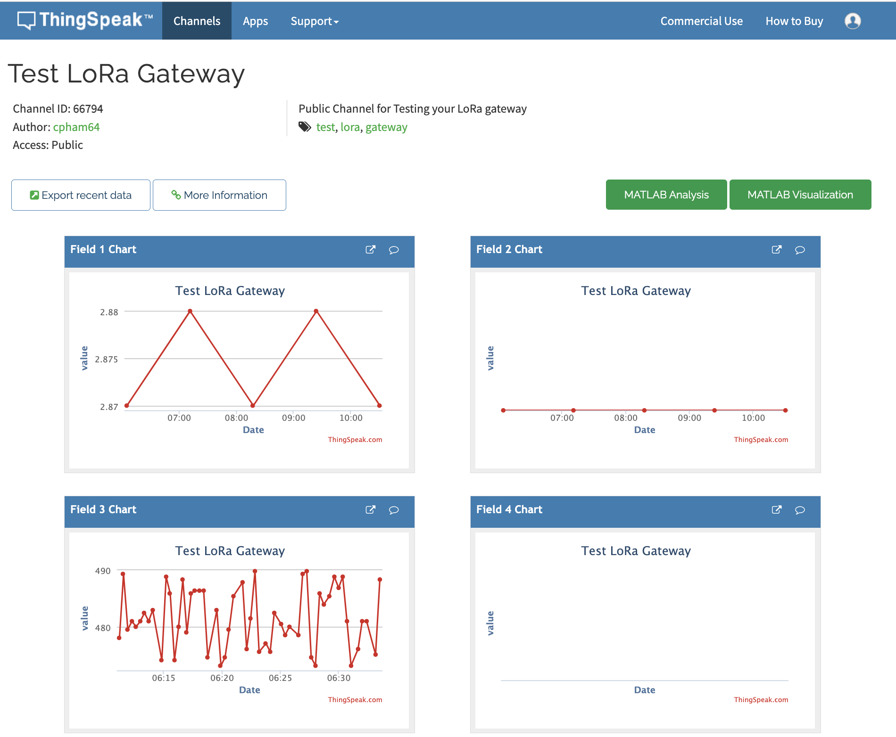

From previous course
====================

We saw previously that the `loop()` function first check if the WiFi is connected. If is not connected, we attempt to connect to the WiFi again.

``` c++
if (WiFi.status() != WL_CONNECTED) {

		unsigned long start=millis();    
		while (WiFi.status() != WL_CONNECTED && millis()-start<15000) {
			Serial.print("Attempting to connect to WPA SSID: ");
			Serial.println(ssid);
			// Connect to WPA/WPA2 network
			WiFi.begin(ssid, password);
			delay(500);
		}
}

if (WiFi.status() == WL_CONNECTED) {
		Serial.println("Connected to AP");   
}
else  {
		Serial.println("WiFi not connected");        
}
```

Now, let's move on and see how we can upload data to an IoT cloud.

Send sensor data on WiFi
========================

It is known that both ESP8266 and ESP32 have "bad" analog-to digital converter. So here the analog sensor is just for demonstration purpose. It is better for accuracy to get a digital sensor, such as the DHT22. You can also just assign a value to the temperature in the code without connecting any physical sensor.

In `setup()`, we additionally define the input pins for an analog temperature sensor and change accordingly the display as we will use the ThingSpeak IoT cloud.

```c++
void setup() {
  delay(3000); 
  Serial.begin(38400);

  // for the temperature sensor 
  pinMode(TEMP_PIN_READ, INPUT);
  
  // Print a start message 
  Serial.println(F("Simple Temp WiFi+ThingSpeak demo"));  

  setup_wifi();
}
```

In `loop()`, after checking that the WiFi is connected and connection to the wifi client is established, then we start uploading data the ThingSpeak channel using its HTTP REST API.

```c++
if (WiFi.status() != WL_CONNECTED) {

		unsigned long start=millis();    
		while (WiFi.status() != WL_CONNECTED && millis()-start<15000) {
			Serial.print("Attempting to connect to WPA SSID: ");
			Serial.println(ssid);
			// Connect to WPA/WPA2 network
			WiFi.begin(ssid, password);
			delay(500);
		}
}

if (WiFi.status() == WL_CONNECTED) {
		Serial.println("Connected to AP");   
}
else  {
		Serial.println("WiFi not connected");        
}

if (WiFi.status() == WL_CONNECTED) { 
 
    WiFiClient client;
    HTTPClient http;
	
    // Your Domain name with URL path or IP address with path
    http.begin(client, server);
		
    // Specify content-type header
    http.addHeader("Content-Type", "application/x-www-form-urlencoded");
    // Data to send with HTTP POST
    String httpRequestData = "api_key=" + apiKey + "&field3=" + String(temp);           
    // Send HTTP POST request
    int httpResponseCode = http.POST(httpRequestData);
	 
    Serial.print("HTTP Response code: ");
    Serial.println(httpResponseCode);
			
    // Free resources
    http.end();     
} 
```



Complete example
=================

Here is the complete working and tested example of the an Arduino board with WiFi. Data is uploaded to our LoRa demo ThingSpeak channel 66794: https://thingspeak.com/channels/66794 on field 3. Check on the [channel page](https://thingspeak.com/channels/66794) for the data you are uploading.

```c++
// if you have an ESP8266 based board
#define ESP8266

#if defined ESP8266 || defined ARDUINO_ESP8266_ESP01
#include <ESP8266WiFi.h>
// else if you have an ESP32
#else
#include <WiFi.h>
#endif

#include <HTTPClient.h>

// Update these with values suitable for your network.
char* ssid = "iPhoneD";
char* password = "hello123";

// Test LoRa gateway channel, channel ID 66794
String apiKey = "SGSH52UGPVAUYG3S";

// To upload on thingspeak
const char* server = "http://api.thingspeak.com/update";

#define TEMP_PIN_READ  A0 //will be pin 36 on the Heltec 
#define TEMP_SCALE  5000.0

// setting up the wifi
void setup_wifi() {

  delay(10);
  // We start by connecting to a WiFi network
  Serial.println();
  Serial.print("Connecting to ");
  Serial.println(ssid);

  WiFi.begin(ssid, password);

  unsigned long start=millis();
  
  while (WiFi.status() != WL_CONNECTED && millis()-start<15000) {
    delay(500);
    Serial.print(".");
  }

  if (WiFi.status() == WL_CONNECTED) {
      Serial.println("");
      Serial.println("WiFi connected");
      Serial.println("IP address: ");
      Serial.println(WiFi.localIP());
  }
  else {
      Serial.println("WiFi not connected");          
  }
} 

void setup() {
  delay(3000); 
  Serial.begin(38400);

  // for the temperature sensor 
  pinMode(TEMP_PIN_READ, INPUT);
  
  // Print a start message 
  Serial.println(F("Simple Temp WiFi+ThingSpeak demo"));  

  setup_wifi();
}

void loop() {

    if (WiFi.status() != WL_CONNECTED) {

        unsigned long start=millis();    
        while (WiFi.status() != WL_CONNECTED && millis()-start<15000) {
          Serial.print("Attempting to connect to WPA SSID: ");
          Serial.println(ssid);
          // Connect to WPA/WPA2 network
          WiFi.begin(ssid, password);
          delay(500);
        }
    }

    if (WiFi.status() == WL_CONNECTED) {
        Serial.println("Connected to AP");   
    }
    else  {
        Serial.println("WiFi not connected");        
    }

    int value = analogRead(TEMP_PIN_READ);
    Serial.print(F("Reading "));
    Serial.println(value);

    float temp;
  
    // change here how the temperature should be computed depending on your sensor type 
    temp = (value*TEMP_SCALE/1024.0)/10;
  
    if (isnan(temp)) {
      Serial.println("Failed to read from Temp sensor!");
    }
    else {
        Serial.print("Temperature: ");
        Serial.print(temp);
        Serial.println("Temperature: ");
             
      if (WiFi.status() == WL_CONNECTED) { 
 
          WiFiClient client;
          HTTPClient http;
	
          // Your Domain name with URL path or IP address with path
          http.begin(client, server);
		
          // Specify content-type header
          http.addHeader("Content-Type", "application/x-www-form-urlencoded");
          // Data to send with HTTP POST
          String httpRequestData = "api_key=" + apiKey + "&field3=" + String(temp);           
          // Send HTTP POST request
          int httpResponseCode = http.POST(httpRequestData);
	 
          Serial.print("HTTP Response code: ");
          Serial.println(httpResponseCode);
			
          // Free resources
          http.end();    
          
          Serial.println("Upload to Thingspeak");
      } 
    }
      
    delay(10000);  
 }
```

The raw source of the sketch example is visible [here](src/sketch/Arduino_ESP_Temp_ThingSpeak/Arduino_ESP_Temp_ThingSpeak.ino).

The code is ready for an Heltec WiFi LoRa 32 board so OLED is activated.

