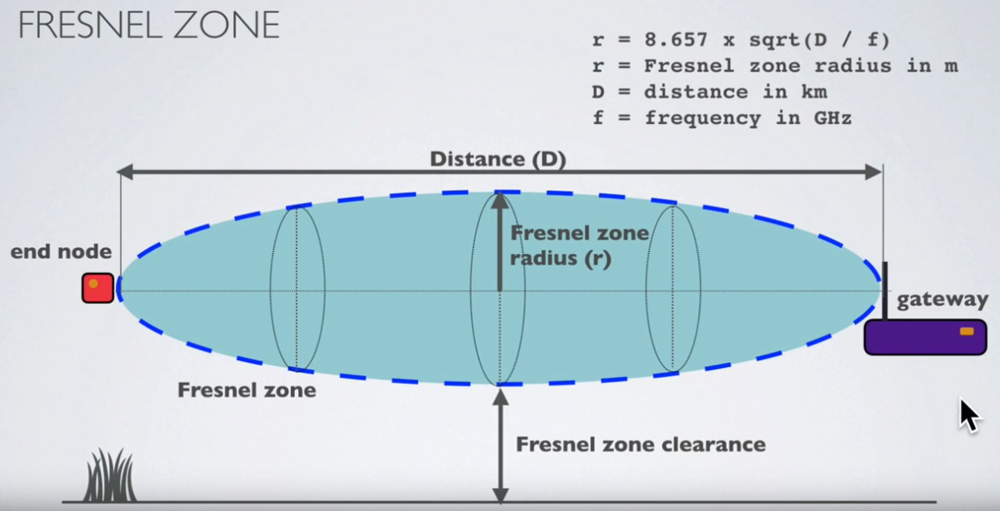
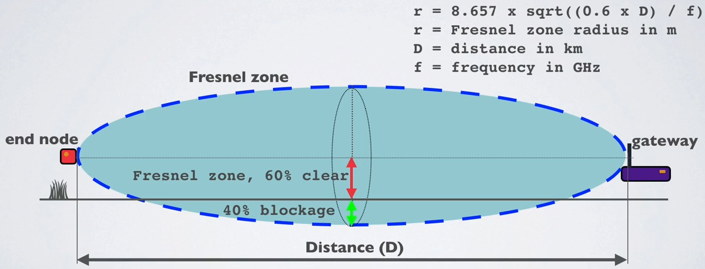
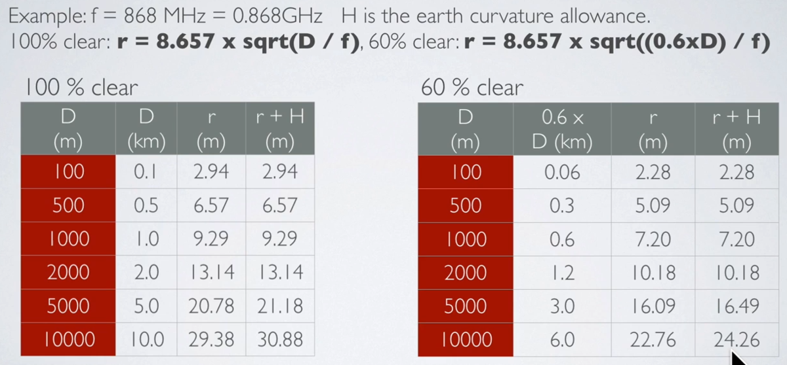

Introduction
============
This course will introduce the basics of wireless communications: wireless transmission fundamentals including radio propagation models, antenna technologies, wireless link budget and the relationship between modulation, throughput, energy and transmission range.

<youtube>Bky-2y76P2U</youtube>

Duty cycle / time on air (ToA)
==============================

When a signal is send from a sender it takes a certain amount of time before a receiver receives this signal.
This time is called Time on Air (ToA).
Duty cycle is the proportion of time during which a component, device, or system is operated.
The duty cycle can be expressed as a ratio or as a percentage.
As mentioned previously in Europe there is a 0.1% and 1.0% duty cycle per day depending on the channel.
To respect the 1% duty cycle :
For example : ToA = 530ms => affer sending a message, we have to wait 99x530ms = 52.47s before sending a new message.

Fresnel zone
============

The Fresnel zone is an elliptical shaped body around the direct line of sight path between the end node and the gateway.
Any obstacle within this volume, for example buildings, trees, hilltops or ground can weaken the transmitted signal even if there is a direct line of sight between the end node and the gateway.



For long distance transmissions, the earth curvature has an influence.
The following table shows the recommended height for deployement of the devices/gateways.


As a rule of thumb Fresnel zone should always be clear of obstruction but this can be impractical so it is said that beyond 40% blockage, signal loss will become significant.



Example :

- f = 868 MHz
- H : earth curvature allowance
- r+H : minimum end node and gateway height above ground



- For the best radio signal performance: The gateway antenna must be placed outdoors at a high location (avoiding obstacles in the Fresnel zone)
- The antenna design for both gateway and end nodes must be optimised for its regional frequency.
- Keep the antenna polarisation vertical for both gateway and end nodes and use omnidirectional antenna to cover a large area.


Link Budget
===========

A link budget is the sum of all of the gains and losses from the transmitter, through the medium (aka free space), to the receiver in a telecommunication system. It is a way of quantifying the link performance.

The receiver sensitivity is the lowest power level at which receiver can receive or demodulate the signal.


EIRP and ERP
============

RF transmitting systems must adhere to certain rules set by the regulatory bodies such as FCC or ETSI.
One of these rules: radio devices must not exceed certain ERP or EIRP values set by these regulatory bodies.
The Effective Isotropic Radiated Power (EIRP) is the total power radiated by a hypothetical isotropic antenna in a single direction.


The Effective Radiated Power (ERP) is the total power radiated by an actual antenna relative to a half-wave dipole rather than a theoretical isotropic antenna.


The definition of EIRP is:
```
EIRP = Tx power (dBm) + antenna gain (dBi) - cable loss (dBm)
```
For example: EIRP = 20 + 10 - 5 = 25 dBm

The definition of ERP is:
```
ERP = Tx power (dBm) + antenna gain (dBd) - cable loss (dBm)
```
For example: ERP = 20 + 7.85 - 5 = 22.85 dBm

Relationship EIRP and ERP: `EIRP (dBm) = ERP (dBm) + 2.15`


RSSI and SNR
============

The Received Signal Strength Indication (RSSI) is the received signal power in milliwatts and is measured in dBm.
This value can be used as a measurement of how well a receiver can “hear” a signal from a sender.


The RSSI is measured in dBm and is a negative value.
The closer to 0 the better the signal is.
Typical LoRa RSSI values are: 
- If RSSI=-30dBm: signal is strong.
- If RSSI=-120dBm: signal is weak.

Signal-to-Noise Ratio (SNR) is the ratio between the received power signal and the noise floor power level.
The noise floor is an area of all unwanted interfering signal sources which can corrupt the transmitted signal and therefore re-transmissions will occur.
- If SNR is greater than 0, the received signal operates above the noise floor.
- If SNR is smaller than 0, the received signal operates below the noise floor.

Normally the noise floor is the physical limit of sensitivity, however LoRa works below the noise level.
Typical LoRa SNR values are between: -20dB and +10dB
A value closer to +10dB means the received signal is less corrupted.
LoRa can demodulate signals which are -7.5 dB to -20 dB below the noise floor.

