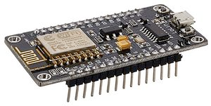
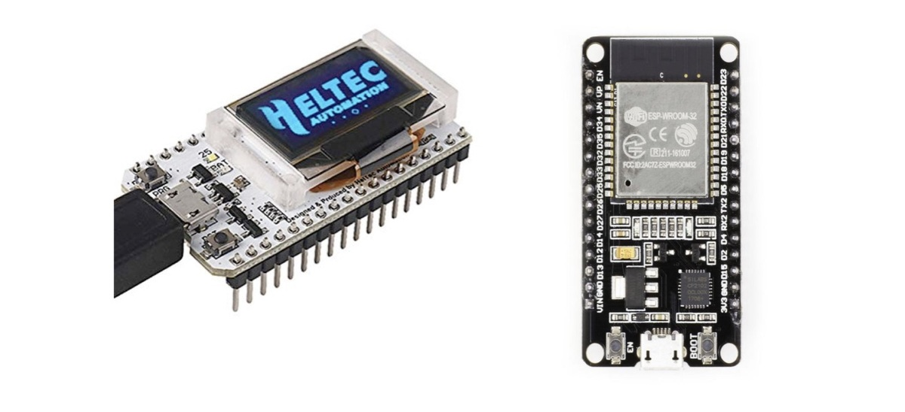
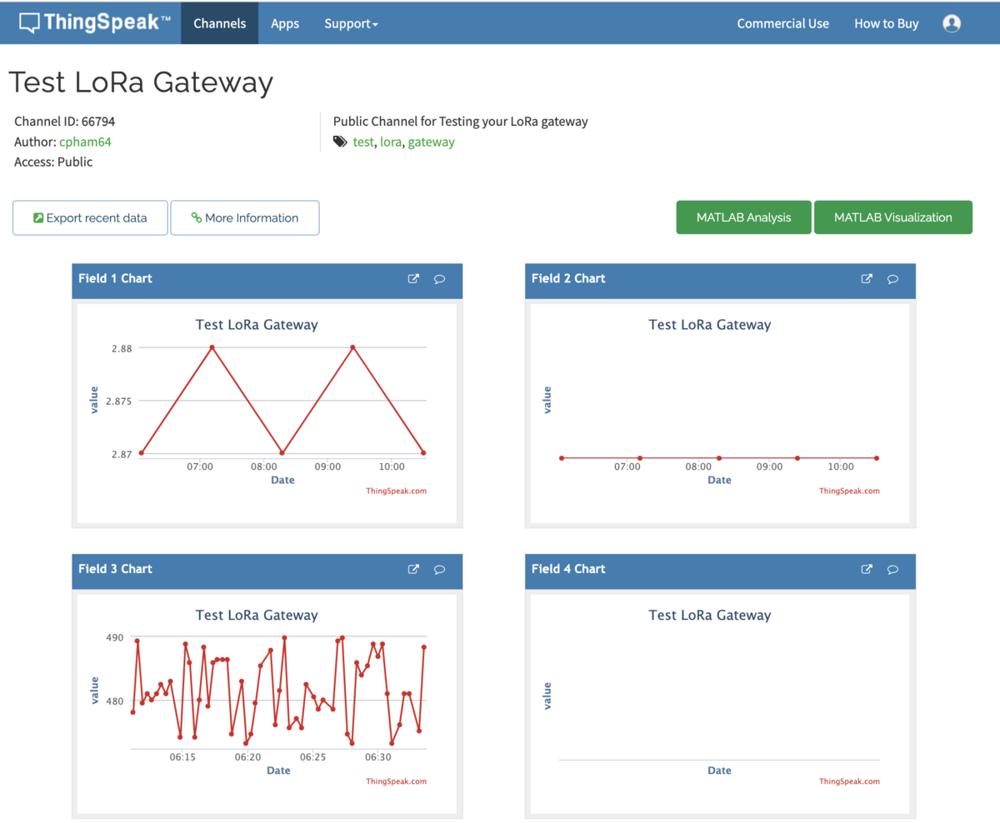

Introduction
============

This course will present general public wireless technologies such as WiFi. These versatile wireless technologies can be used in specific IoT domains when short range or Internet connectivity should be available on the device itself. These technologies can also be used in training sessions to introduce higher level IoT protocol stacks such as MQTT.
We will use the popular chips ESP8266 or ESP32 as an example, as this chip as Wifi embbeded.

The ESP8266 WiFi board
======================

For this course, we will use the ESP8266.
The [ESP8266](https://en.wikipedia.org/wiki/ESP8266) is a low-cost Wi-Fi microchip with full TCP/IP stack and microcontroller capability produced by Shanghai-based Chinese manufacturer Espressif Systems . The chip is usually embedded on a board such as the NodeMCU (see picture below) to make it easier to use. Most of ESP8266-based boards are compatible with Arduino IDE provided that you install the required addons. 



The successor to these microcontroller chips is the ESP32. Again, many boards based on the ESP32 are available. Below are the Heltec WiFi LoRa 32 with a small embedded OLED screen and the more common ESP32-WROOM.



Installation
============

First install the current upstream Arduino IDE at the 1.8 level or later. The current version is at the [officiel Arduino web site](https://www.arduino.cc/en/main/software).

Start Arduino IDE and open the Preferences window. Then for ESP8286 enter `http://arduino.esp8266.com/stable/package_esp8266com_index.json`.
For generic ESP32 enter `https://dl.espressif.com/dl/package_esp32_index.json`.

Then open Boards Manager from Tools → Board menu, then search & install "ESP8266" or "ESP32" or "Heltec ESP32" platforms. Select your board, ESP8266 or ESP32 or Heltec ESP32, from Tools → Board menu to compile for the correct platform.

After connecting the ESP32, select the serial port and if you don’t see the serial port in your Arduino IDE, you will need to install the [CP210x USB to UART Bridge VCP Drivers](https://www.silabs.com/developers/usb-to-uart-bridge-vcp-drivers)

You can read the [following page](https://randomnerdtutorials.com/installing-the-esp32-board-in-arduino-ide-windows-instructions/) which has a YouTube video to see all these steps.
 
You can refer to GitHub page for [ESP8266](https://github.com/esp8266/Arduino#installing-with-boards-manager) for futher information on Arduino core for ESP8286 WiFi chip.
   
As there are many boards based on both ESP8266 or ESP32, you can refer to the following [wikipedia page](https://en.wikipedia.org/wiki/ESP8266) to identify your board.

Send sensor data on Wifi
========================

In the example, we will send temparature measurements over Wifi.
We will first set up the wifi and establish the connection. If the connection is successful, we measure the temperature. The temperature value is then uploaded to a ThingSpeak channel. 
 
If using ESP8266, use `ESP98266WiFi.h` header file. In case you are using ESP32, use the `WiFi.h`.

```c++
#if defined ESP8266 || defined ARDUINO_ESP8266_ESP01
#include <ESP8266WiFi.h>
#else
#include <WiFi.h>
#endif
```

Define the network SSID and password, here for demonstration purpose, we usually use a smartphone sharing 3G/4G as WiFi access point. Note that it is not possible to use a WiFi that requires pop-up windows or a complex authentication mechanism.

```c++
char* ssid = "iPhoneD";
char* password = "hello123";
```

Then we define a dedicated function to setup the WiFi. `setup_wifi()` mainly 
defines the connection to the WiFi network using the SSID and the password, and then check if the WiFi is successfully connected.

```c++
void setup_wifi() {
  WiFi.begin(ssid, password);
}
```

In `setup()`, in addition to define the input pins we mainly call `setup_wifi()`function to connect to WiFi.

```c++
void setup() {
  delay(3000); 
  Serial.begin(38400);

  // for the temperature sensor 
  pinMode(TEMP_PIN_READ, INPUT);
  
  // Print a start message 
  Serial.println(F("Simple Temp WiFi+ThingSpeak demo"));  

  setup_wifi();
}
```

In `loop()`, we first check if the WiFi is connected. If is not connected, we attempt to connect to the WiFi again.

``` c++
if (WiFi.status() != WL_CONNECTED) {

    unsigned long start=millis();    
    while (WiFi.status() != WL_CONNECTED && millis()-start<15000) {
        WiFi.begin(ssid, password);
     }
 }
```

Then, if WiFi is connected and connection to the wifi client is established, then we upload to the ThingSpeak channel using a REST API.

```c++
if (WiFi.status() == WL_CONNECTED) { 
 
    WiFiClient client;
    HTTPClient http;
	
    // Your Domain name with URL path or IP address with path
    http.begin(client, server);
		
    // Specify content-type header
    http.addHeader("Content-Type", "application/x-www-form-urlencoded");
    // Data to send with HTTP POST
    String httpRequestData = "api_key=" + apiKey + "&field3=" + String(temp);           
    // Send HTTP POST request
    int httpResponseCode = http.POST(httpRequestData);
	 
    Serial.print("HTTP Response code: ");
    Serial.println(httpResponseCode);
			
    // Free resources
    http.end();     
 } 
```

## Complete example

Here is the complete working and tested example of the an Arduino board with WiFi. Data is uploaded to our LoRa demo ThingSpeak channel 66794: https://thingspeak.com/channels/66794 on field 3. Check on the [channel page](https://thingspeak.com/channels/66794) for the data you are uploading.

```c++
// if you have an ESP8266 based board
#define ESP8266

#if defined ESP8266 || defined ARDUINO_ESP8266_ESP01
#include <ESP8266WiFi.h>
// else if you have an ESP32
#else
#include <WiFi.h>
#endif

#include <HTTPClient.h>

// Update these with values suitable for your network.
char* ssid = "iPhoneD";
char* password = "hello123";

// Test LoRa gateway channel, channel ID 66794
String apiKey = "SGSH52UGPVAUYG3S";

// To upload on thingspeak
const char* server = "http://api.thingspeak.com/update";

#define TEMP_PIN_READ  A0 //will be pin 36 on the Heltec 
#define TEMP_SCALE  5000.0

// setting up the wifi
void setup_wifi() {

  delay(10);
  // We start by connecting to a WiFi network
  Serial.println();
  Serial.print("Connecting to ");
  Serial.println(ssid);

  WiFi.begin(ssid, password);

  unsigned long start=millis();
  
  while (WiFi.status() != WL_CONNECTED && millis()-start<15000) {
    delay(500);
    Serial.print(".");
  }

  randomSeed(micros());

  if (WiFi.status() == WL_CONNECTED) {
      Serial.println("");
      Serial.println("WiFi connected");
      Serial.println("IP address: ");
      Serial.println(WiFi.localIP());
  }
  else {
      Serial.println("WiFi not connected");          
  }
} 

void setup() {
  delay(3000); 
  Serial.begin(38400);

  // for the temperature sensor 
  pinMode(TEMP_PIN_READ, INPUT);
  
  // Print a start message 
  Serial.println(F("Simple Temp WiFi+ThingSpeak demo"));  

  setup_wifi();
}

void loop() {

    if (WiFi.status() != WL_CONNECTED) {

        unsigned long start=millis();    
        while (WiFi.status() != WL_CONNECTED && millis()-start<15000) {
          Serial.print("Attempting to connect to WPA SSID: ");
          Serial.println(ssid);
          // Connect to WPA/WPA2 network
          WiFi.begin(ssid, password);
          delay(500);
        }
    }

    if (WiFi.status() == WL_CONNECTED) {
        Serial.println("Connected to AP");   
    }
    else  {
        Serial.println("WiFi not connected");        
    }

    int value = analogRead(TEMP_PIN_READ);
    Serial.print(F("Reading "));
    Serial.println(value);

    float temp;
  
    // change here how the temperature should be computed depending on your sensor type 
    temp = (value*TEMP_SCALE/1024.0)/10;
  
    if (isnan(temp)) {
      Serial.println("Failed to read from Temp sensor!");
    }
    else {
        Serial.print("Temperature: ");
        Serial.print(temp);
        Serial.println("Temperature: ");
             
      if (WiFi.status() == WL_CONNECTED) { 
 
          WiFiClient client;
          HTTPClient http;
	
          // Your Domain name with URL path or IP address with path
          http.begin(client, server);
		
          // Specify content-type header
          http.addHeader("Content-Type", "application/x-www-form-urlencoded");
          // Data to send with HTTP POST
          String httpRequestData = "api_key=" + apiKey + "&field3=" + String(temp);           
          // Send HTTP POST request
          int httpResponseCode = http.POST(httpRequestData);
	 
          Serial.print("HTTP Response code: ");
          Serial.println(httpResponseCode);
			
          // Free resources
          http.end();    
          
          Serial.println("Upload to Thingspeak");
      } 
    }
      
    delay(10000);  
 }
```

The raw source of the sketch example is visible [here](src/sketch/Arduino_ESP_Temp_ThingSpeak/Arduino_ESP_Temp_ThingSpeak.ino).

The code is ready for an Heltec WiFi LoRa 32 board so OLED is activated.


Exercice
========

We saw previously that the `loop()` function first check if the WiFi is connected. If is not connected, we attempt to connect to the WiFi again.

``` c++
if (WiFi.status() != WL_CONNECTED) {

		unsigned long start=millis();    
		while (WiFi.status() != WL_CONNECTED && millis()-start<15000) {
			Serial.print("Attempting to connect to WPA SSID: ");
			Serial.println(ssid);
			// Connect to WPA/WPA2 network
			WiFi.begin(ssid, password);
			delay(500);
		}
}

if (WiFi.status() == WL_CONNECTED) {
		Serial.println("Connected to AP");   
}
else  {
		Serial.println("WiFi not connected");        
}
```

Now, let's move on and see how we can upload data to an IoT cloud.

## Send sensor data on WiFi

It is known that both ESP8266 and ESP32 have "bad" analog-to digital converter. So here the analog sensor is just for demonstration purpose. It is better for accuracy to get a digital sensor, such as the DHT22. You can also just assign a value to the temperature in the code without connecting any physical sensor.

In `setup()`, we additionally define the input pins for an analog temperature sensor and change accordingly the display as we will use the ThingSpeak IoT cloud.

```c++
void setup() {
  delay(3000); 
  Serial.begin(38400);

  // for the temperature sensor 
  pinMode(TEMP_PIN_READ, INPUT);
  
  // Print a start message 
  Serial.println(F("Simple Temp WiFi+ThingSpeak demo"));  

  setup_wifi();
}
```

In `loop()`, after checking that the WiFi is connected and connection to the wifi client is established, then we start uploading data the ThingSpeak channel using its HTTP REST API.

```c++
if (WiFi.status() != WL_CONNECTED) {

		unsigned long start=millis();    
		while (WiFi.status() != WL_CONNECTED && millis()-start<15000) {
			Serial.print("Attempting to connect to WPA SSID: ");
			Serial.println(ssid);
			// Connect to WPA/WPA2 network
			WiFi.begin(ssid, password);
			delay(500);
		}
}

if (WiFi.status() == WL_CONNECTED) {
		Serial.println("Connected to AP");   
}
else  {
		Serial.println("WiFi not connected");        
}

if (WiFi.status() == WL_CONNECTED) { 
 
    WiFiClient client;
    HTTPClient http;
	
    // Your Domain name with URL path or IP address with path
    http.begin(client, server);
		
    // Specify content-type header
    http.addHeader("Content-Type", "application/x-www-form-urlencoded");
    // Data to send with HTTP POST
    String httpRequestData = "api_key=" + apiKey + "&field3=" + String(temp);           
    // Send HTTP POST request
    int httpResponseCode = http.POST(httpRequestData);
	 
    Serial.print("HTTP Response code: ");
    Serial.println(httpResponseCode);
			
    // Free resources
    http.end();     
} 
```




## Solution


Here is the complete working and tested solution for the an Arduino board with WiFi. Data is uploaded to our LoRa demo ThingSpeak channel 66794: https://thingspeak.com/channels/66794 on field 3. Check on the [channel page](https://thingspeak.com/channels/66794) for the data you are uploading.

```c++
// if you have an ESP8266 based board
#define ESP8266

#if defined ESP8266 || defined ARDUINO_ESP8266_ESP01
#include <ESP8266WiFi.h>
// else if you have an ESP32
#else
#include <WiFi.h>
#endif

#include <HTTPClient.h>

// Update these with values suitable for your network.
char* ssid = "iPhoneD";
char* password = "hello123";

// Test LoRa gateway channel, channel ID 66794
String apiKey = "SGSH52UGPVAUYG3S";

// To upload on thingspeak
const char* server = "http://api.thingspeak.com/update";

#define TEMP_PIN_READ  A0 //will be pin 36 on the Heltec 
#define TEMP_SCALE  5000.0

// setting up the wifi
void setup_wifi() {

  delay(10);
  // We start by connecting to a WiFi network
  Serial.println();
  Serial.print("Connecting to ");
  Serial.println(ssid);

  WiFi.begin(ssid, password);

  unsigned long start=millis();
  
  while (WiFi.status() != WL_CONNECTED && millis()-start<15000) {
    delay(500);
    Serial.print(".");
  }

  if (WiFi.status() == WL_CONNECTED) {
      Serial.println("");
      Serial.println("WiFi connected");
      Serial.println("IP address: ");
      Serial.println(WiFi.localIP());
  }
  else {
      Serial.println("WiFi not connected");          
  }
} 

void setup() {
  delay(3000); 
  Serial.begin(38400);

  // for the temperature sensor 
  pinMode(TEMP_PIN_READ, INPUT);
  
  // Print a start message 
  Serial.println(F("Simple Temp WiFi+ThingSpeak demo"));  

  setup_wifi();
}

void loop() {

    if (WiFi.status() != WL_CONNECTED) {

        unsigned long start=millis();    
        while (WiFi.status() != WL_CONNECTED && millis()-start<15000) {
          Serial.print("Attempting to connect to WPA SSID: ");
          Serial.println(ssid);
          // Connect to WPA/WPA2 network
          WiFi.begin(ssid, password);
          delay(500);
        }
    }

    if (WiFi.status() == WL_CONNECTED) {
        Serial.println("Connected to AP");   
    }
    else  {
        Serial.println("WiFi not connected");        
    }

    int value = analogRead(TEMP_PIN_READ);
    Serial.print(F("Reading "));
    Serial.println(value);

    float temp;
  
    // change here how the temperature should be computed depending on your sensor type 
    temp = (value*TEMP_SCALE/1024.0)/10;
  
    if (isnan(temp)) {
      Serial.println("Failed to read from Temp sensor!");
    }
    else {
        Serial.print("Temperature: ");
        Serial.print(temp);
        Serial.println("Temperature: ");
             
      if (WiFi.status() == WL_CONNECTED) { 
 
          WiFiClient client;
          HTTPClient http;
	
          // Your Domain name with URL path or IP address with path
          http.begin(client, server);
		
          // Specify content-type header
          http.addHeader("Content-Type", "application/x-www-form-urlencoded");
          // Data to send with HTTP POST
          String httpRequestData = "api_key=" + apiKey + "&field3=" + String(temp);           
          // Send HTTP POST request
          int httpResponseCode = http.POST(httpRequestData);
	 
          Serial.print("HTTP Response code: ");
          Serial.println(httpResponseCode);
			
          // Free resources
          http.end();    
          
          Serial.println("Upload to Thingspeak");
      } 
    }
      
    delay(10000);  
 }
```

The raw source of the sketch example is visible [here](src/sketch/Arduino_ESP_Temp_ThingSpeak/Arduino_ESP_Temp_ThingSpeak.ino).

The code is ready for an Heltec WiFi LoRa 32 board so OLED is activated.


