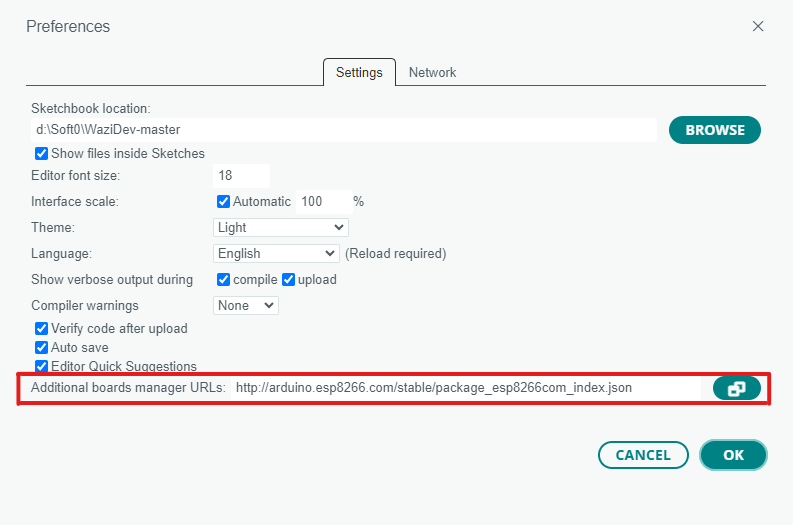

# Introduction

This course will present general public wireless technologies such as WiFi. These versatile wireless technologies can be used in specific IoT domains when short range or Internet connectivity should be available on the device itself. These technologies can also be used in training sessions to introduce higher level IoT protocol stacks such as MQTT.
We will use the popular chips ESP8266 or ESP32 as an example, as this chip as Wifi embbeded. In addition, we will perform an exercise of sending data to `wazicloud` using the ESP8266 and [Waziup API](https://api.waziup.io)

# The ESP8266 WiFi board

For this course, we will use the ESP8266.
The [ESP8266](https://en.wikipedia.org/wiki/ESP8266) is a low-cost Wi-Fi microchip with full TCP/IP stack and microcontroller capability produced by Shanghai-based Chinese manufacturer Espressif Systems . The chip is usually embedded on a board such as the NodeMCU (see picture below) to make it easier to use. Most of ESP8266-based boards are compatible with Arduino IDE provided that you install the required addons.


The successor to these microcontroller chips is the ESP32. Again, many boards based on the ESP32 are available. Below are the Heltec WiFi LoRa 32 with a small embedded OLED screen and the more common ESP32-WROOM.


# Installation

1. First install the current upstream Arduino IDE at the 1.8 level or later. The current version is at the [officiel Arduino web site](https://www.arduino.cc/en/main/software).

2. Start Arduino IDE and open the Preferences window. Then for ESP8286 enter `http://arduino.esp8266.com/stable/package_esp8266com_index.json`.
   For generic ESP32 enter `https://dl.espressif.com/dl/package_esp32_index.json`. In case you have to put multiple URLs togrther make sure to separate them with a comma.

   

3. Then open Boards Manager from Tools → Board menu, then search & install "ESP8266" or "ESP32" or "Heltec ESP32" platforms. Select your board, ESP8266 or ESP32 or Heltec ESP32, from Tools → Board menu to compile for the correct platform.

4. After connecting the ESP32, select the serial port and if you don’t see the serial port in your Arduino IDE, you will need to install the [CP210x USB to UART Bridge VCP Drivers](https://www.silabs.com/developers/usb-to-uart-bridge-vcp-drivers)

The following resources are useful for the installation process,

- [Installing arduino IDE in windows](https://randomnerdtutorials.com/installing-the-esp32-board-in-arduino-ide-windows-instructions/)

- [Github repository on ESP8286](https://github.com/esp8266/Arduino#installing-with-boards-manager)

As there are many boards based on both ESP8266 or ESP32, you can refer to the following [wikipedia page](https://en.wikipedia.org/wiki/ESP8266) to identify your board.

# Send sensor data to Wazicloud from ESP board

**Required**
1. ESP8266 board
2. Active internet connection

In the example, we will send raw value measurements from the board to the wazicloud.
We will first set up the wifi and establish the connection. If the connection is successful, we measure get random value to send. The value is then uploaded to a Wazicloud dashboard.

If using ESP8266, use `ESP98266WiFi.h` header file. In case you are using ESP32, use the `WiFi.h`.


**Setting up**
Include the following libraries to help your board establish an internet connection.

```cpp
#include <ESP8266WiFi.h>
#include <ESP8266HTTPClient.h>
```

Define the network SSID and password, here for demonstration purpose, we usually use a smartphone sharing 3G/4G as WiFi access point. Note that it is not possible to use a WiFi that requires pop-up windows or a complex authentication mechanism.

```c++
char* ssid = "WIFI NAME";
char* password = "PASSWORDD";
```
We also need to obtain the `device id` and the `sensor id` that we are sending data to, in the wazicloud.

To obtain the IDs, navigate to [Wazicloud dashboard](https://dashboard.waziup.io). You should first have a wazicloud account.

On the settings, allow manual creation of devices,


```cpp
const char* device_id = "YOUR_DEVICE_ID";
const char* sensor_id = "YOUR_SENSOR_ID";
```

Head over, to the dashboard and click a new option.


You can obtain the device ID from here, then proceed to create the device.

Now that the device has been created, we need to add a sensor to which we will be sending the data to.

Click the add sensor button to add a new sensor.


In the setup function, we define the connection to the WiFi network using the SSID and the password we created. We finally confirm whether the connection was successful.

```c++
void connectWifi(){
  WiFi.begin(ssid, password); //Initiate the wifi connection here with the credentials earlier preset

  while (WiFi.status() != WL_CONNECTED) {
    delay(1000);
    Serial.println("Connecting to WiFi...");
  }

  Serial.println("Connected to WiFi");
  return
}

void setup() {
  Serial.begin(115200); //Set the baudrate to the board youre using (115200 is fine)
  delay(100);
  connectWifi();
}
```


In `loop()`, we ge nerate a random value in the range of 10 to 30. The generated random value is passed to the the custom function `sendDataToWaziCloud` to send it to the wazicloud.

```cpp
void loop(){
  float randomValue = random(10, 30);
  sendDataToWaziCloud(randomValue);
  delay(300000) // Wait for 5 minutes (in ms) to send the next generated random value
}

void sendDataToWaziCloud(float value) {

  // We cancel the send process if our board is not yet connectedd to the internet, and try reconnecting to wifi again.
  if (WiFi.status() != WL_CONNECTED) {
    Serial.println("WiFi not connected.");
    connectWifi()
    return;
  }

  HTTPClient http;

  // Initialize the API endpoint to send data. This endpoint is responsible for receiving the data we send
  String endpoint = "https://api.waziup.io/api/v2/devices/" + String(device_id) + "/sensors/" + String(sensor_id) + "/value";
  http.begin(endpoint);

  // Header content for the data to send
  http.addHeader("Content-Type", "application/json;charset=utf-8");
  http.addHeader("accept", "application/json;charset=utf-8");

  // Data to send
  String data = "{ \"value\": " + String(value) + " }";

  int httpResponseCode = http.POST(data);

  if (httpResponseCode > 0) {
    String response = http.getString();
    Serial.println("HTTP Response code: " + String(httpResponseCode));
    Serial.println("Response: " + response);
  } else {
    Serial.print("Error code: ");
    Serial.println(httpResponseCode);
  }

  http.end();
}
```

On successfully sending data to the cloud, you should see its status update. If the values dont update, refresh the browser to see the updates.

## Complete example

Here is the complete working and tested example of the an Arduino board with WiFi. Data is uploaded to our LoRa demo Wazicloud dashboard. You should have noticed that the background color of the sensor changed from red to green, meaning that the sensor is constantly receiving data.


You can click on the device to view the logged data in graphical format. Furthermore, you can also download the data in json format.

```c++
#include <ESP8266WiFi.h>
#include <ESP8266HTTPClient.h>

// Your wifi credentials
char* ssid = "WIFI NAME";
char* password = "PASSWORDD";

// Device settings from the wazicloud
const char* device_id = "YOUR_DEVICE_ID";
const char* sensor_id = "YOUR_SENSOR_ID";


void connectWifi(){
  WiFi.begin(ssid, password); //Initiate the wifi connection here with the credentials earlier preset

  while (WiFi.status() != WL_CONNECTED) {
    delay(1000);
    Serial.println("Connecting to WiFi...");
  }

  Serial.println("Connected to WiFi");
  return
}

void setup() {
  Serial.begin(115200); //Set the baudrate to the board youre using (115200 is fine)
  delay(100);
  connectWifi();
}


void loop(){
  float randomValue = random(10, 30);
  sendDataToWaziCloud(randomValue);
  delay(300000) // Wait for 5 minutes (in ms) to send the next generated random value
}

void sendDataToWaziCloud(float value) {

  // We cancel the send process if our board is not yet connectedd to the internet, and try reconnecting to wifi again.
  if (WiFi.status() != WL_CONNECTED) {
    Serial.println("WiFi not connected.");
    connectWifi()
    return;
  }

  HTTPClient http;

  // Initialize the API endpoint to send data. This endpoint is responsible for receiving the data we send
  String endpoint = "https://api.waziup.io/api/v2/devices/" + String(device_id) + "/sensors/" + String(sensor_id) + "/value";
  http.begin(endpoint);

  // Header content for the data to send
  http.addHeader("Content-Type", "application/json;charset=utf-8");
  http.addHeader("accept", "application/json;charset=utf-8");

  // Data to send
  String data = "{ \"value\": " + String(value) + " }";

  int httpResponseCode = http.POST(data);

  if (httpResponseCode > 0) {
    String response = http.getString();
    Serial.println("HTTP Response code: " + String(httpResponseCode));
    Serial.println("Response: " + response);
  } else {
    Serial.print("Error code: ");
    Serial.println(httpResponseCode);
  }

  http.end();
}

```

# Exercice
1. We have previously send random generated values to the wazicloud. In this task, you are required to send temperature and humidity data from the microcontroller to the wazicloud. _Hint:_ You can use DHT11/DHT22 to collect temperature and humidity values.
