Cellular technologies such as 3G/4G will be presented and compared against more adapted wireless technologies for IoT such as LoRa and NB-IoT. These 2 latter technologies will be explained in detail as they represent the best energy vs range tradeoff. A focus will be made on LoRa wireless communication technologies to present the LoRa & LoRaWAN ecosystem.

LoRa
====

LoRa (Long Range) is a low-power wide-area network (LPWAN) protocol developed by Semtech.
It is based on spread spectrum modulation techniques derived from chirp spread spectrum (CSS) technology.
It was developed by Cycleo of Grenoble, France and acquired by Semtech, the founding member of the LoRa Alliance.

Introduction
------------

LoRa is specifically designed for sending small data packages over long distances, with devices operating on a battery.
The folowing table picture shows the ranges and powers for various well-know protocols.

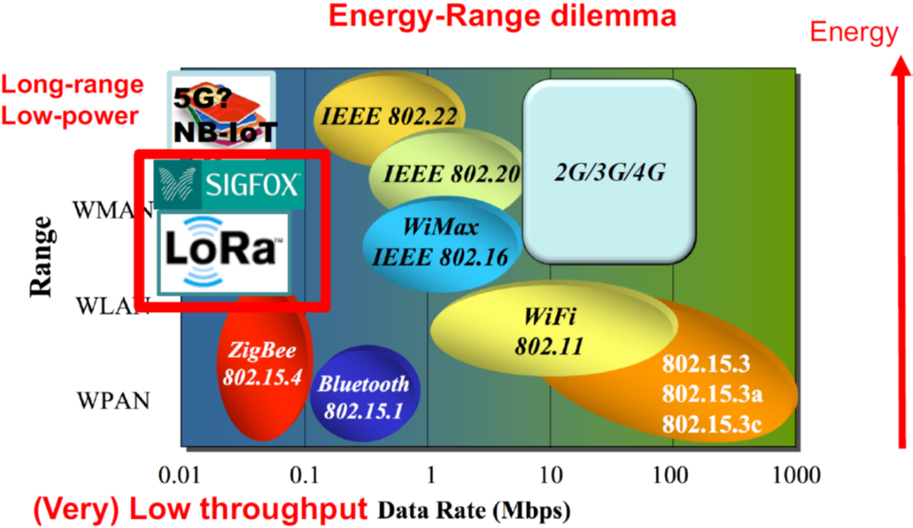

The data rates supported are between 0.3 kbps to 5.5 kbps.
The gateways can listen to multiple frequencies simultaneously, in every spreading factor at each frequency.
This allows the gateways to handle 100s of devices at the same time, with bidirectional communications.

LoRa protocol stack
------------------

LoRa is a physical layer protocol. It is defining radio signal, frequencies and modulation...
This is to diferenciate it from the LoRaWAN protocol, which is at MAC layer and application layer.

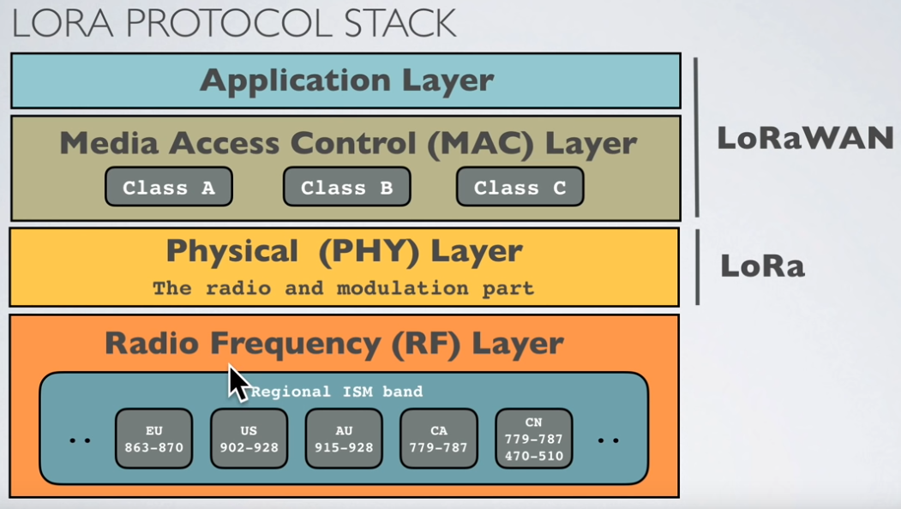

Radio bands
-----------

LoRa operates in the unlicensed ISM (Industrial, Scientific and Medical) radio band that are available worldwide.

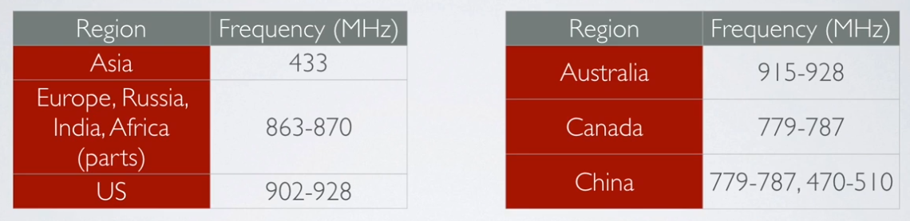

In Europe the [European Telecommunications Standards Institute (ETSI)](https://www.etsi.org/) creates standards which are used by local regulatory authorities.

ISM band advantages:
- Anyone is allowed to use these frequencies.
- No license fee is required.

ISM band disadvantages:
- Low data rate.
- Lots of interference because anyone can use these frequencies.

Modulation Types and Chirp Spread Spectrum
------------------------------------------

LoRa is based on Chirp Spread Spectrum modulation (CSS).
**Chirp** Spread Spectrum is a spread spectrum technique that uses wideband linear frequency modulated chirp pulses to encode information.
A chirp pulse is a sweep in frequency on the corresponding bandwidth (125kHz, 250kHz…) defined earlier. 

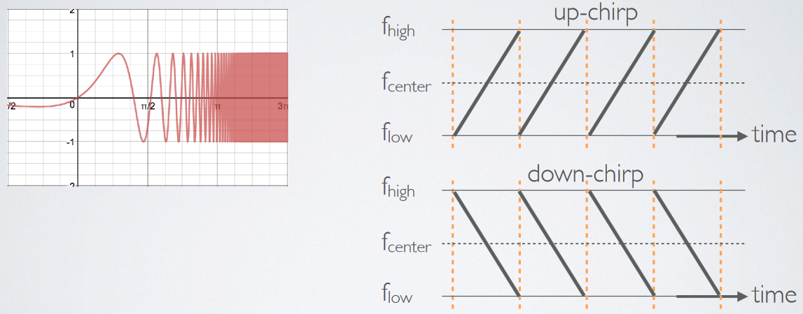

- **Spread spectrum** techniques are methods by which a signal is deliberately spread in the frequency domain. For example a signal is transmitted in short bursts, “hopping” between frequencies in a pseudo random sequence.

Symbol, Spreading Factor and Chirp
---------------------------------

To generate symbols/chirps, the modem modulates the phase of an oscillator.
The number of times per second that the modem adjusts the phase is called the chirp rate and defines the modulation bandwidth.
Chirp rate is a direct subdivision of the quartz frequency (32 MHz).
Basic chirps are simply a ramp from fmin to fmax (up-chirp) or fmax to fmin (down-chirp). Data-carrying chirps are chirps that are cyclically-shifted, and this cyclical shift carries the information.

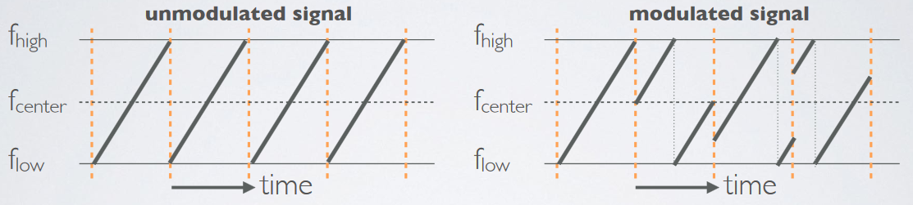

LoRaWAN
=======

Introduction
------------

The LoRaWAN® specification is a Low Power, Wide Area (LPWA) networking protocol designed to wirelessly connect battery operated ‘things’ to the internet in regional, national or global networks, and targets key Internet of Things (IoT) requirements such as bi-directional communication, end-to-end security, mobility and localization services.
LoRaWAN® network architecture is deployed in a star-of-stars topology in which gateways relay messages between end-devices and a central network server.
The gateways are connected to the network server via standard IP connections and act as a transparent bridge, simply converting RF packets to IP packets and vice versa. The wireless communication takes advantage of the Long Range characteristics of the LoRaÒ physical layer, allowing a single-hop link between the end-device and one or many gateways.
All modes are capable of bi-directional communication, and there is support for multicast addressing groups to make efficient use of spectrum during tasks such as Firmware Over-The-Air (FOTA) upgrades or other mass distribution messages.
The specification defines the device-to-infrastructure (LoRa®) physical layer parameters & (LoRaWAN®) protocol and so provides seamless interoperability between manufacturers, as demonstrated via the device certification program.
While the specification defines the technical implementation, it does not define any commercial model or type of deployment (public, shared, private, enterprise) and so offers the industry the freedom to innovate and differentiate how it is used.
The LoRaWAN® specification is developed and maintained by the LoRa Alliance®: an open association of collaborating members.

LoRaWAN Network
-------

The following picture shows the LoRaWAn network.

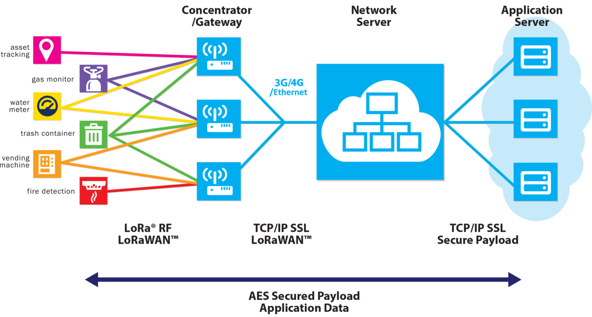

Frequencies
-----------

The allowed frequencies are given by the [Regional Alliance parameters](https://lora-alliance.org/lorawan-for-developers):

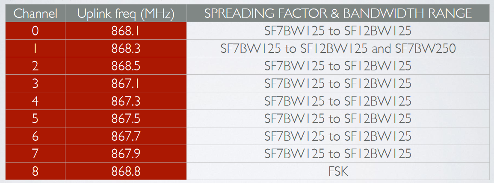

Downlink is the same as uplink with an additional one:

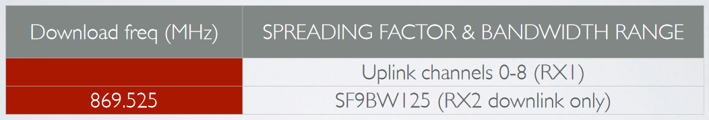

If your country uses the EU863-870 ISM band, than according to the LoRaWAN Regional Parameters document every EU868MHz end device must implement the following default channels:

- 868.10 MHz, bandwidth = 125 kHz
- 868.30 MHz, bandwidth = 125 kHz
- 868.50 MHz, bandwidth = 125 kHz

and additional 5 frequencies.

The other 5 frequencies can be freely attributed by the network operator. For example, The Things Network implemented the following frequencies: 867.1, 867.3, 867.5, 867.7 and 867.9.
LoRaWAN only uses the following bandwidth ranges: 125 kHz, 250 kHz and 500 kHz.
Which of these 3 ranges are actual used depends on the region or frequency plan.
For example in Europe only the bandwidths 125kHz and 250 kHz are used.

Data Rates
----------

In addition to frequency hopping, all communication packets between end-devices and gateways also include a variable ‘Data rate’ (DR) setting.
The selection of the DR allows a dynamic trade-off between communication range and message duration.
Also, due to the spread spectrum technology, communications with different DRs do not interfere with each other and create a set of virtual ‘code’ channels increasing the capacity of the gateway.
To maximize both battery life of the end-devices and overall network capacity, the LoRaWAN® network server manages the DR setting and RF output power for each end-device individually by means of an Adaptive Data Rate (ADR) scheme.

LoRaWAN® baud rates range from 0.3 kbps to 50 kbps.

Security
--------

Security is a primary concern for any mass IoT deployment and the LoRaWAN® specification defines two layers of cryptography:

A unique 128-bit Network Session Key shared between the end-device and network server
A unique 128-bit Application Session Key (AppSKey) shared end-to-end at the application level
AES algorithms are used to provide authentication and integrity of packets to the network server and end-to-end encryption to the application server. By providing these two levels, it becomes possible to implement ‘multi-tenant’ shared networks without the network operator having visibility of the users payload data.

The keys can be Activated By Personalisation (ABP) on the production line or during commissioning, or can be Over-The-Air Activated (OTAA) in the field. OTAA allows devices to be re-keyed if necessary.

LoRaWAN Device Classes
----------------------

The LoRaWAN specification defines three device classes:

- A(ll) Battery powered devices. Each device uplink to the gateway and is followed by two short downlink receive windows.
- B(eacon) Same as class A but these devices also opens extra receive windows at scheduled times.
- C(ontinuous) Same as A but these devices are continuously listening. Hence these devices uses more power and are often mains powered.

**Class A**

The default class which must be supported by all LoRaWAN end-devices, class A communication is always initiated by the end-device and is fully asynchronous.
Each uplink transmission can be sent at any time and is followed by two short downlink windows, giving the opportunity for bi-directional communication, or network control commands if needed.
This is an ALOHA type of protocol.
The end-device is able to enter low-power sleep mode for as long as defined by its own application: there is no network requirement for periodic wake-ups.
This makes class A the lowest power operating mode, while still allowing uplink communication at any time.
Because downlink communication must always follow an uplink transmission with a schedule defined by the end-device application, downlink communication must be buffered at the network server until the next uplink event.

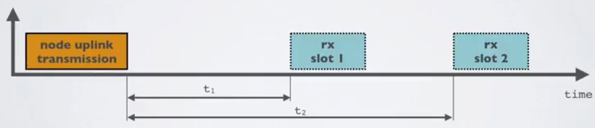

*Note : “All” means the class A mode is supported by all classes.*

**Class B**

In addition to the class A initiated receive windows, class B devices are synchronised to the network using periodic beacons, and open downlink ‘ping slots’ at scheduled times.
This provides the network the ability to send downlink communications with a deterministic latency, but at the expense of some additional power consumption in the end-device.
The latency is programmable up to 128 seconds to suit different applications, and the additional power consumption is low enough to still be valid for battery powered applications.

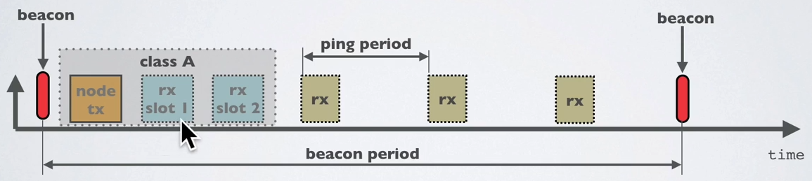

**Class C**

In addition to the class A structure of uplink followed by two downlink windows, class C further reduces latency on the downlink by keeping the receiver of the end-device open at all times that the device is not transmitting (half duplex). Based on this, the network server can initiate a downlink transmission at any time on the assumption that the end-device receiver is open, so no latency. The compromise is the power drain of the receiver (up to ~50mW) and so class C is suitable for applications where continuous power is available.

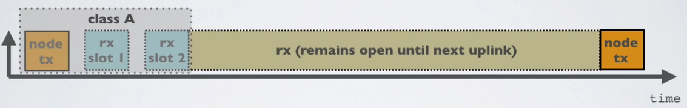

Changing frequencies for every transmission
------------------------------------------

An end device changes channel in a pseudo-random fashion for every transmission.
Changing frequencies makes the system more robust to interferences.
For example in Europe for uplink transmissions 8 different frequencies are used.

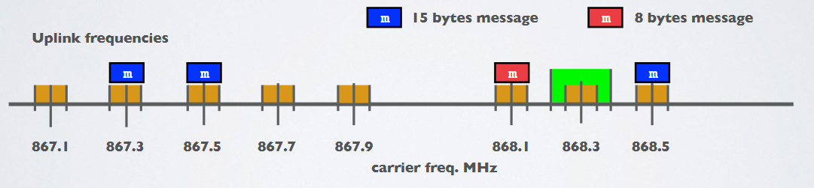

- **Dwell time** (or transmit time) is the amount of time needed to transmit on a frequency.
- **Hop time** is the amount of time needed to change from one frequency to another in which the radio is not transmitting

LoRa use cases
==============

LoRa enables long-range communication at low power consumptions. This has made it popular in LPWAN (Low Power Wide Area Network) applications. Some use cases of LoRa/LoRaWAN are:

- Agriculture: LoRa allows farmers to remotely monitor several agriculture parameters, such as temperature, humidity, and soil moisture content. It is also possible to control irrigation systems remotely such as turning on sprinklers at the farm. This increases agricultural production and enables farmers to use more efficient farming techniques.
- Smart cities: to connect devices like air sensors, street lights, smart parking meters, etc., cities typically use wireless wide area networks such as LoRa. LoRa is also integrated into infrastructures in order to facilitate automation, enable remote control, and equipment management.
- Smart buildings: with little infrastructure and maintenance required, LoRa is being used in buildings to monitor conditions such as temperature, humidity, occupancy/motion sensing, water meters, fire; and even execute remote control operations such as turning on lights or control the air conditioning units.
- Industries: LoRa supports various industrial IoT applications such as remote monitoring of equipment  and also remote control of machines.
- Healthcare: LoRa enables doctors to remotely monitor patient's conditions.
- Wildlife conservation: by deploying LoRa sensors in the forests such as smart cameras, motion sensors, smart acoustic devices, etc.; we are able to monitor wildlife movement and also identify poaching activities.

Exercise on LoRa to LoRa communication
======================================

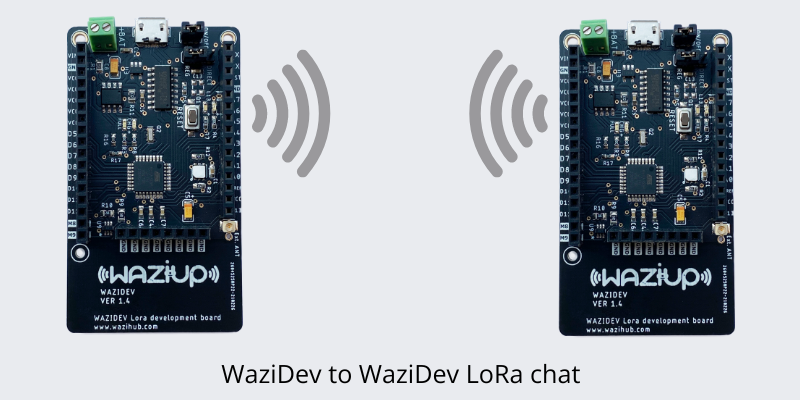

Hardware:
- 2 Waziup LoRa boards like the WaziDev. It's not a must for the boards to be the same
- If using the WaziDev board, then a Micro USB cable for programming
- If using the WaziSense or WaziAct board, then an FTDI module (like FT232) and a Mini USB cable for programming
- If using the WaziSense or WaziAct board, then an 868MHz LoRa antenna

Software
- Please install the [Arduino IDE](https://www.arduino.cc/en/Main/Software) for the programming aspects.
- Install the [WaziDev](https://github.com/Waziup/WaziDev/archive/master.zip) libraries for LoRa communication. Follow the guide [here](https://waziup.io/documentation/wazidev/user-manual/#install-the-wazidev-sketchbook)

In this exercise, we will do a simple LoRa to LoRa communication. For this, we will use two [WaziDev boards](http://lab.waziup.io/resources/waziup/wazidev) and we will send and receive LoRa messages on each board. The WaziDev board has an Atmega328P-AU microcontroller that is connected to an RFM95W LoRa module. A LoRa module is a device that has a LoRa transceiver chip.

If you are not familiar with the WaziDev board, there is a "Waziup" course that gives a comprehensive tutorial on the WaziDev board, and also other similar LoRa boards from Waziup. The WaziDev [documentation](https://waziup.io/documentation/wazidev/user-manual/#install-the-wazidev-sketchbook) also describes how to download and configure the Arduino IDE accordingly.

To do this simple exercise, we will upload an example code to two WaziDev boards and then use a Serial connection software, like the Arduino's Serial Monitor, to send and view the LoRa communications between the boards.

---
### Step 1: Upload the first LoRa code
---

First, open Arduino IDE and then the WaziDev LoRa chat example. This can be opened by navigating to Files -> Sketchbook -> LoRa -> WaziDev_to_WaziDev_Chat; as shown below.

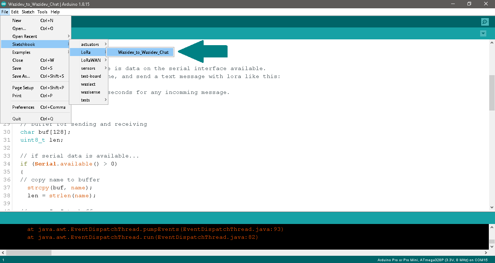

Next, using a USB cable, connect one of the WaziDev boards to the computer, select the correct COM port of the board and upload the sketch to it.

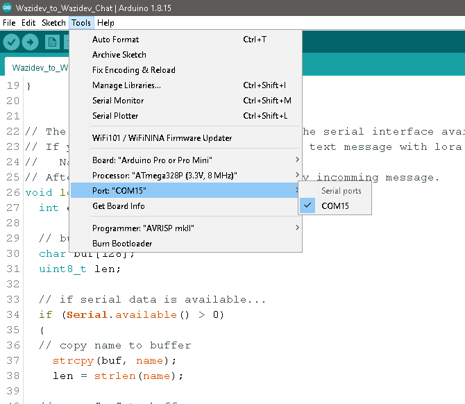

---
### Step 2: Upload the second LoRa code
---

A really cool feature with the Arduino IDE version 2 is that the Serial Monitor is linked to the sketch windows you have open. For example, we can open a new Arduino sketch, copy-paste the example code to it, and finally upload the code to the board. Afterwards, we can select the port and board for each window, and have two Serial Monitors running at the same time. 

However, if you do not have the Arduino IDE version 2, then you can open another instance of the Arduino IDE by running the Arduino software that is on the computer's Desktop or the applications list. Note that we need to start another Arduino IDE instance and not open a new window. Finally, connect the other WaziDev board to the computer and upload the example code to it.

---
### Step 3: Open two Serial Monitors
---

If you are using Arduino IDE version 2, open two Serial Monitors for the board and port configuration of each window. Set the Serial Monitors' Baud Rate to 9600 (as configured in the code) and set the ending character to "Both NL & CR". 

If you are not using Arduino IDE version 2, on one instance of the Arduino IDE, ensure the COM port for one of the WaziDev is selected. Open the Serial Monitor on this Arduino window. Set the Baud Rate to 9600 (as configured in the code) and set the ending character to "Both NL & CR". On the other Arduino IDE instance, ensure the COM port for the other WaziDev is selected and open the Serial Monitor on that window. Remember to also set the Baud Rate and ending characters accordingly.

We can now interact with the two WaziDev's serial communications at the same time. On one Serial Monitor, enter some text like "Hello world" and click "Send" while the other Serial Monitor is showing "Receiving ...". The "Hello world" message will then be sent from that WaziDev to the other via LoRa and we will see it on the other Serial Monitor. 

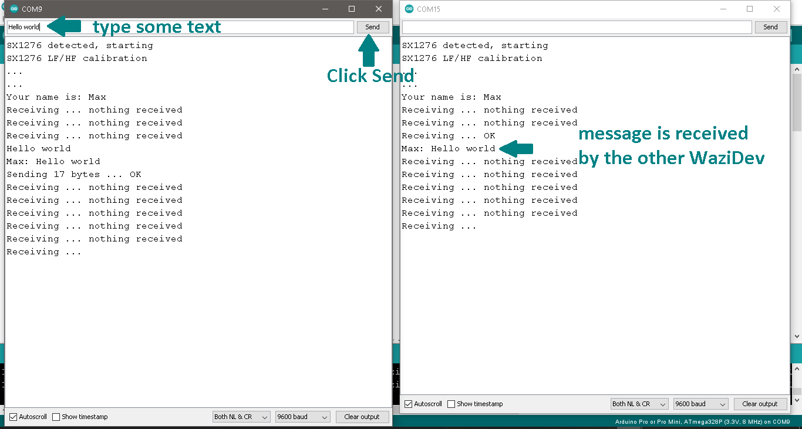

Annexes
=======

dBm, dBi, dBd
-------------

- dBm : reference is 1mW
- dBi : refers to the antenna gain with respect to an isotropic antenna
- dBd : dBd refers to the antenna gain with respect to a reference dipole antenna

dBi = dBd + 2.15

Free space losses
----------------

L(fs) = 32.45 + 20log(D) + 20log(f)

- Lfs = Free space loss in dB
- D = Distance between end node and gateway in km
- f = frequency in MHz

For example: f=868MHz

- D=0.01 km, Lfs = 32.45 + 20log(0.01) + 20log(868) = 51 dB
- D=0.05 km, Lfs = 32.45 + 20log(0.05) + 20log(868) = 65 dB
- D=0.10 km, Lfs = 32.45 + 20log(0.10) + 20log(868) = 71 dB
- D=0.50 km, Lfs = 32.45 + 20log(0.50) + 20log(868) = 85 dB
- D=1.00 km, Lfs = 32.45 + 20log(1.00) + 20log(868) = 91 dB
