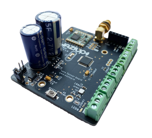
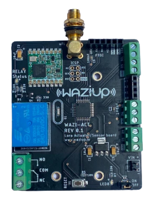

Development boards
==================

<!-- This first course will cover the development boards that are usable with Waziup.
In the following video, we will overview the Waziup development boards, namely WaziDev, WaziSense and WaziAct. -->

Welcome to  the **WaziDev Board Series** course, where we dive into the innovative world of Internet of Things (IoT) with Waziup's cutting-edge development boards. This course is designed to explore, learn, and create transformative IoT solutions. Let's delve into the details of the featured development boards: WaziDev, WaziSense, WaziHat Pro Single, and WaziAct in the following video.

<youtube>ir_EQOdyZQA</youtube>

WaziDev
========
**Overview**

WaziDev is a Sensing and Actuation development board for IoT applications. It transmits data up to 7Km using the RFM95W LoRa module with an embedded LoRa antenna. It is easily programmable and customizable, using Arduino technology. Embedded is a Lipo battery charger for solar panels and low power options. An ideal solution for start-ups and entrepreneurs who want to rapidly prototype IoT applications.

**Features**
- Arduino Pro Mini compatible CPU
- RFM95W LoRa module
- Fully compatible with the Arduino development environment
- Embedded Lipo battery charger for solar panels and low power options
- Two pins with high current support (500mA)

**Specifications**
- Microcontroller: ATmega328P
- Board Power Supply: 3.35 -12 V
- Circuit Operating Voltage: 3.3V
- Digital I/O Pins: 14
- PWM Pins: 6
- UART: 1
- SPI: 1
- I2C: 1
- Analog Input Pins: 6
- External Interrupts: 2
- DC Current per I/O Pin: 40 mA
- Flash Memory: 32KB of which 2 KB used by bootloader
- SRAM: 2 KB
- EEPROM: 1 KB
- Clock Speed: 8 MHz

WaziSense
==========
**Overview**

The wazisense is an all in one style development board for projects involving outdoor sensing and agricultural purposes. Fitted with a LoRa sx1276 chip, it is able to communicate with a LoRa enabled gateway over long distances. It has supercaps that enable it to keep running for a few more hours in the event of power loss. It also has terminal connectors which make it easy to hookup peripherals and deploy outdoor solutions with ease.

**Features**
- Lora support (SX1276 Chip)
- SMA connector with dedicated antenna
- On-Board si7021 digital humidity and temperature sensor
- 11 Farad Super Caps for field deployment
- Support for 4.2v battery

**Specifications**
- Microcontroller: ATmega328P
- Board Power Supply: 3.35 -12 V
- Flash Memory: 32KB ( bootloader uses 2KB)
- Circuit Operating Voltage: 3.3V
- DC Current per I/O Pin: 40 mA
- External Interrupts: 2
- Analog Input Pins: 6
- Digital I/O Pins: 14
- Clock Speed: 8 MHz
- PWM Pins: 6
- EEPROM: 1KB
- SRAM: 2KB
- UART: 1
- SPI: 1
- I2C: 1

WaziHat Pro Single
==================
**Overview**

Wazihat sits on top of the raspberry pi to enable it to communicate with sensor nodes and actuators via LoRa. The wazihat pro single is fitted with a 0.96" OLED and an SX1276 chip. Beyond the waziup edge operating system of the raspberry pi, the wazihat is essentially the reason the raspberry pi can serve as a LoRa gateway.

**Features**
- SMA Connector for Antenna
- Supports 433, 868 and 915 MHz
- SX1276 LoRa Chip
- 0.96" OLED Display
- Power toggle Button
- Wifi/Access Point Button
- Network Connection Status LED

**Specifications**
- Operating voltage: 3.3v
- Max Current Draw in Operation: 120 mA
- Standby Current Draw: 1.8 mA
- Sleep Current Draw: 1 uA

WaziAct
========
**Overview**

The WaziAct is an all-in-one development board for projects involving the great outdoor and sensing, however unlike the WaziSense, it also has a relay for actuation. Fitted with a LoRa sx1276 chip, its able to communicate with a LoRa enabled gateway over long distances. It also has terminal connectors which make it easy to hookup peripherals and deploy solutions with ease.

**Features**
- Lora support (SX1276 Chip)
- SMA connector with dedicated antenna
- 3.3v 1A AMS1117 Voltage Regulator
- 3v Single Channel Relay
- Support for 4.2v battery

**Specifications**
- Microcontroller: ATmega328P
- Board Power Supply: 3.35 -12 V
- Circuit Operating Voltage: 3.3V
- Flash Memory: 32KB ( bootloader uses 2KB)
- DC Current per I/O Pin: 40 mA
- External Interrupts: 2
- Digital I/O Pins: 14
- Analog Input Pins: 6
- PWM Pins: 6
- UART: 1
- SPI: 1
- I2C: 1
- SRAM: 2 KB
- EEPROM: 1 KB
- Clock Speed: 8 MHz

References
==========

You can find the user manual of WaziDev [here](https://www.waziup.io/documentation/wazidev/).
