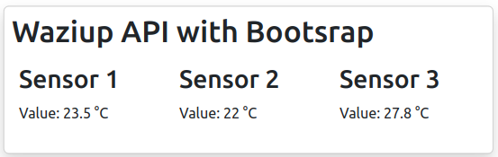

Introduction
============


This course will show you how to develop a Web interface for your IoT application.
At first, we will develop a very simple Web application, based solely on HTML and Javascript.
We will build on this knowledge to go to the next step: the Web frameworks. We will show the basics of three of the most popular frameworks: ReactJS, Angular and Vue.

<youtube>e3lnWpQQRpc</youtube>


Simple Web App
==============

The simplest Web application is composed of just HTML + Javascript.
Here is an example:

```html
<html>
  <body>
    <script>
      fetch("https://api.waziup.io/api/v2/devices/MyDevice/sensors/TC1")
        .then(res => res.json())
        .then(json => {
           document.getElementById("device_value").innerHTML = "The temperature is: " + json.value.value + " C";
      })
    </script>
    <h1>My Application</h1>
    <div id="device_value">
      Loading...
    </div>
  </body>
</html>
```

You recognize some HTML tags: `<html>`, `<body>`, `<div>`...
There is also some Javascript in the middle, in the `<script> </scripts>` tags.
What does this small application do?
Well, if we ignore the script part for the moment, it just have a title (`<h1>`) and a div with displayed "Loading...".
This is what you will see on your screen.
Go ahead and copy this code in a file called "index.html", and open it in your web browser.
After some seconds, this is what you should see:


Once you open the file, the script part will also be executed.
The first part is:

```js
fetch("https://api.waziup.io/api/v2/devices/MyDevice/sensors/TC1/values")
```

We perform a call on a URL. This URL is the address of a specific sensor called "TC1" mounted on a device called "MyDevice".
Once this fetch is done, the second part kicks off, using the response from the fetch: 

```js
  .then(res => res.json())
  .then(json => {
         ...
  })

```

The above code receives the response from the fetch, then proceeds to decode it as JSON.
With the JSON, we call this function:

```js
document.getElementById("device_value")
```

This piece of code will give you the element from the HTML page which have the ID "device_value".
Where did you see that ID before? Ah! It's here:

```html
    <div id="device_value">
      Loading...
    </div>
```

So, the function `getElementById` will return a pointer to this exact section of the HTML code.
The idea is to change it "on the fly" and insert our sensor value there.
This is done by the next section of the code:

```js
.innerHTML = "The temperature is: " + json.value.value + " C";
```

We set the "innerHTML" of the div to `"The temperature is: " + json.value.value + " C"`.
We use the json returned by the fetch and extract the sensor value.
What we are doing is modifying "live" the "virtual DOM".
DOM is "Document Object Model", this is the internal representation of the HTML page in your browser.
So basically, we are modifying the HTML page live, inserting our sensor value.

This is, really, the simplest IoT Web app that you could do!

Web Sockets
===========

Web sockets is like HTTP on steroid. 
While HTTP is "fire and forget", Web sockets will open a persistent 2-way connection between client and server.
The session will not be closed after the first request.
As can be seen in the next figure, Web Socket extends the HTTP protocol: We will first send a request to "upgrade" the HTTP connection to Web Socket.
After that, the full-duplex channel will be open.


Let's check [an example using Web Sockets](https://waziup.github.io/WaziApps-examples/www/mqtt/).
Now open the developper's networking tools in you browser, and click on refresh.
You should see:


You might not have seen the HTTP code "101" before: it mean "Switching protocol".
We are "upgrading" from HTTP to Web Sockets.
In the "response" tab, you should see:


The channel is open! Client and server are discussing. This is not anymore "fire and forget".
The underlying protocol here is MQTT, but you can use anything else.


Create a plot and a map
=======================

It is very common to display IoT data as a time series graph, or as a map for geographical data.
Let's look at some examples.

Please find the [example for a graph](https://github.com/Waziup/WaziApps-examples/blob/master/www/graph/index.html).


```html
<html>
  <body>
    <script src="https://cdnjs.cloudflare.com/ajax/libs/Chart.js/2.7.2/Chart.min.js"></script>
    <script>
      fetch("https://api.waziup.io/api/v2/devices/UGB-PILOTS_Sensor200/sensors/TP/values")
        .then(res => res.json())
        .then(values => {
          console.log("data" + JSON.stringify(values));
          var data = [];
          var labels = [];
          for (value of values) {
            data.push(value.value);
            labels.push(value.timestamp);
          }
          new Chart(document.getElementById("myChart").getContext("2d"),
                   {type: "line", data: { labels: labels, datasets: [{label: "Device values", data: data }]}});
        });
    </script>
    <canvas id="myChart" width="800" height="600">Loading...</canvas>
  </body>
</html>
```

We use the same technique as before: We have a HTML tag that will be replace by live content using a script.
Here, we have a `<canvas>` with ID "myChart":

```html
<canvas id="myChart" width="800" height="600">Loading...</canvas>
```

It will be replaced by a graph:

```js
new Chart(document.getElementById("myChart").getContext("2d"),
          {type: "line", data: { labels: labels, datasets: [{label: "Device values", data: data }]}});
```

The rest of the code is used to fetch the datapoints and put them in the correct shape.

You can find yet another example, creating a map of IoT devices [here](https://github.com/Waziup/WaziApps-examples/blob/master/www/map/index.html).
In that example, we are creating a map, that setting markers on it, corresponding to the location of the Waziup devices.

All the examples are rendered [at this link]().

Bootstrap
=========

Another Web technology you might have heard of is [Bootstrap](https://getbootstrap.com/).
Bootstrap is a framework built on the top of HTML and CSS3, with some optional Javascript.
It contains design templates for forms, buttons, tables, navigation, modals, image carousels...
Here is a basic example for a [three collumns design](https://getbootstrap.com/docs/5.2/layout/grid/):

**Responsive design**
Before getting to understand how bootstrap and other styling works, we need to understand the concept of `responsive designs`. Responsive design  is an approach to web design that aims to make web pages render well on a variety of devices and window or screen sizes from minimum to maximum display size to ensure usability and satisfaction. The major categories of screen sizes are,

- Extra-extra large screens (XXL)
- Extra large screens (XL)
- Large screens
- Medium screens
- Small screens
- Extra small screens
- Extra-extra small screens

When designing web pages, you have to account for each screen size. However, in most cases you will use at least 3 screen sizes. Below is an image describing the break points for common designs


Bootstrap will take care of this by allocating respective columns in each screen size.

**Installing bootstrap**
You can use a CDN to access bootstrap features. We will be using approach due to its flexibility. You can find other approaches in [this](https://getbootstrap.com/docs/5.3/getting-started/download/) installation tutorial.

```html
<link href="https://cdn.jsdelivr.net/npm/bootstrap@5.3.3/dist/css/bootstrap.min.css" rel="stylesheet" integrity="sha384-QWTKZyjpPEjISv5WaRU9OFeRpok6YctnYmDr5pNlyT2bRjXh0JMhjY6hW+ALEwIH" crossorigin="anonymous">
```
```html
<script src="https://cdn.jsdelivr.net/npm/bootstrap@5.3.3/dist/js/bootstrap.bundle.min.js" integrity="sha384-YvpcrYf0tY3lHB60NNkmXc5s9fDVZLESaAA55NDzOxhy9GkcIdslK1eN7N6jIeHz" crossorigin="anonymous"></script>
```

**Creating a responsive container using bootstrap**
Create a html skeleton file below. You can get this HTML boiler plate by typing `!` in the code editor. Let's first save the file as `index.html`.

```html
<!DOCTYPE html>
<html lang="en">
<head>
    <meta charset="UTF-8">
    <meta name="viewport" content="width=device-width, initial-scale=1.0">
    <link href="https://cdn.jsdelivr.net/npm/bootstrap@5.3.3/dist/css/bootstrap.min.css" rel="stylesheet" integrity="sha384-QWTKZyjpPEjISv5WaRU9OFeRpok6YctnYmDr5pNlyT2bRjXh0JMhjY6hW+ALEwIH" crossorigin="anonymous">
    <title>Bootstrap container</title>
</head>
<body>
    
    <script src="https://cdn.jsdelivr.net/npm/bootstrap@5.3.3/dist/js/bootstrap.bundle.min.js" integrity="sha384-YvpcrYf0tY3lHB60NNkmXc5s9fDVZLESaAA55NDzOxhy9GkcIdslK1eN7N6jIeHz" crossorigin="anonymous"></script>
</body>
</html>
```
We added the `link` and `script` tag in the file to use bootstrap classes.
If you are using vs code, install a live server extension to view the changes we make to our index file.


Add this content to the body context

```html
<div class="container card mt-5 p-2 shadow">
  <h1>Waziup API with Bootsrap</h1>
  <div class="row p-2">
      <div class="col-sm-4">
      <h2>Sensor 1</h2>
      <p id="t1">Loading...</p>
      </div>
      <div class="col-sm-4">
      <h2>Sensor 2</h2>
      <p id="t2">Loading...</p>
      </div>
      <div class="col-sm-4">
      <h2>Sensor 3</h2>
      <p id="t3">Loading...</p>
      </div>
  </div>
</div>
```


Finally, we add the response from the request to the t1,t2,t3 IDs.

```html
<script>
    const headers = {
        'Content-Type':'application/json' 
    }
    
    const getTemperature = async() =>{

      try {
          //You can create your own devices on the wazicloud dashboard and add sensors
          const fetchTemperatureValue1 = await fetch('https://api.waziup.io/api/v2/devices/bootstrap/sensors/TC/values');
          const fetchTemperatureValue2 = await fetch('https://api.waziup.io/api/v2/devices/bootstrap/sensors/TC2/values');
          const fetchTemperatureValue3 = await fetch('https://api.waziup.io/api/v2/devices/bootstrap/sensors/TC3/values');

          const res1 = await fetchTemperatureValue1.json();
          const res2 = await fetchTemperatureValue2.json();
          const res3 = await fetchTemperatureValue3.json();

          const val1 = res1[0].value;
          const val2 = res2[0].value;
          const val3 = res3[0].value;

          document.getElementById('t1').innerHTML = `Value: ${val1} &degC`
          document.getElementById('t2').innerHTML = `Value: ${val2} &degC`
          document.getElementById('t3').innerHTML = `Value: ${val3} &degC`
          
      } catch(error){
          console.log(error)
      }
    }
    
    getTemperature();
    
</script>
```

The images below demonstrates the responsiveness at different screen widths:

**Desktop View**


**Tablet View**



**Mobile View**


Lets discuss the bootstrap classes used here

1. container -  contain, pad, and align your content within a given device or viewport
2. card - flexible container with borders and border radius
3. row - Rows are wrappers for columns
4. mt-5 - Add margin top of 5px
5. p-2 - Add padding 2px
6. shadow - Adding a box shadow
7. col - width specifiers for rows

In this example, Bootstrap provides the definitions of CSS classes "row" and "col-sm-4".
Bootstrap is reactive by default, so your web page will look good on any screen size.

ReactJS
=======

In this section, we'll overview some Web development frameworks useful for developping IoT applications.

ReactJS is a Javascript library for writing UIs. 

We will use `vite` to create the react app. Issue the command below to create and run react app.

```
npm create vite@latest my-app --template react
```
```
cd my-app
```
```
npm install
```
```
npm run dev
```

This starts a simple react app as shown below,


We will re-use the content from the `bootstrap module` to build our react application.

First things first, lets install our bootstrap library in react. Add this link tag to the index.html,

```html
<link
  rel="stylesheet"
  href="https://cdn.jsdelivr.net/npm/bootstrap@5.3.2/dist/css/bootstrap.min.css"
  integrity="sha384-T3c6CoIi6uLrA9TneNEoa7RxnatzjcDSCmG1MXxSR1GAsXEV/Dwwykc2MPK8M2HN"
  crossorigin="anonymous"
/>
```
After adding the bootstrap link, copy this content to the app.jsx file,

```js
import { useState } from 'react'
import './App.css'
import { useEffect } from 'react'

function App() {

  const [sensorVals, setSensorVals] = useState({
    sensor1: null,
    sensor2: null,
    sensor3: null
  })

  const getSensorValues = async() => {
    try {

      const fetchTemperatureValue1 = await fetch('https://api.waziup.io/api/v2/devices/bootstrap/sensors/TC/values');
      const fetchTemperatureValue2 = await fetch('https://api.waziup.io/api/v2/devices/bootstrap/sensors/TC2/values');
      const fetchTemperatureValue3 = await fetch('https://api.waziup.io/api/v2/devices/bootstrap/sensors/TC3/values');

      const res1 = await fetchTemperatureValue1.json();
      const res2 = await fetchTemperatureValue2.json();
      const res3 = await fetchTemperatureValue3.json();

      setSensorVals({
        sensor1: res1[0].value,
        sensor2: res2[0].value,
        sensor3: res3[0].value
      })

    } catch(error){
      console.log(error)
    }
  }

  useEffect(()=>{
    getSensorValues()
  })

  return (
    <>
      <h1>React Waziup Application</h1>
      <div className="card">
        <div className="row p-2">
          <div class="col-sm-4">
          <h2>Sensor 1</h2>
          <p id="t1">
            {
              sensorVals.sensor1 ? `${sensorVals.sensor1}` : '---'
            } &deg;C
          </p>
          </div>
          <div className="col-sm-4">
          <h2>Sensor 2</h2>
          <p id="t2">
            {
              sensorVals.sensor2 ? `${sensorVals.sensor2}` : '---'
            } &deg;C
          </p>
          </div>
          <div className="col-sm-4">
          <h2>Sensor 3</h2>
          <p id="t3">
            {
              sensorVals.sensor3 ? `${sensorVals.sensor3}` : '---'
            } &deg;C
          </p>
          </div>
        </div>
      </div>
    </>
  )
}

export default App

```

The browser should automatically pull these changes and load them into the app as shown below.


In the above code, we use same context like in bootstrap to fetch the data from waziup API. However there are two main features that are added,

- useEffect hook -  We use this hook to tell our app to run the function to fetch data only once
- useState hook - We use this hook to handle the state of our app variables, i.e storing the retrieved values from the API

In the next frameworks let's touch on how to use them. The setup process is similar to that of React framework. However, in the template section, you can use vue, angular.

```
npm create vite@latest my-app --template vue
```
```
npm create vite@latest my-app --template angular
```

Angular
=======

[Angular](https://getbootstrap.com/) is built on `Typescript`.
TypeScript is a strongly typed programming language that builds on JavaScript.
That means that Typescript is safer than Javascript, and result in better programs.

Angular uses a templating system directly in the HTML (while ReactJS uses JSX).
Here is an example:

Typescript:
```tsx
import { Component } from '@angular/core';

@Component ({
  selector: 'hello-world-interpolation',
  templateUrl: './template.html'
})
export class HelloWorldInterpolationComponent {
    message = 'Hello, World!';
}
```
HTML:
```tsx
<p>{{ message }}</p>
```

In the HTML above, you can see some templating marks "{{message}}".
The Angular program will read the template and replace the template marker by its value: 'Hello, World!'.
Angular is also has a system of Modules, Components, and Services.


Vue
===

The third and final Web framework that we'll overview is [Vue](https://vuejs.org/guide/introduction.html).
The Vue.js core library focuses on the ViewModel layer only from the [MVVM pattern](https://en.wikipedia.org/wiki/Model%E2%80%93view%E2%80%93viewmodel).
That means that it focuses on the rendering of information, leaving the business logic ot other components.
It is a "progressive" framework because you can extend its functionality with official and third-party packages, such as Vue Router or Vuex, to turn it into an actual framework.
Here is an example.
Javascript:

```jsx
import { createApp } from 'vue'

createApp({
  data() {
    return {
      count: 0
    }
  }
}).mount('#app')
```

HTML:

```html
<div id="app">
  <button @click="count++">
    Count is: {{ count }}
  </button>
</div>
```

You can note that the templating system is similar with Angular with the `{{ count }}`.

This concludes our trip through web development. Good programming!
