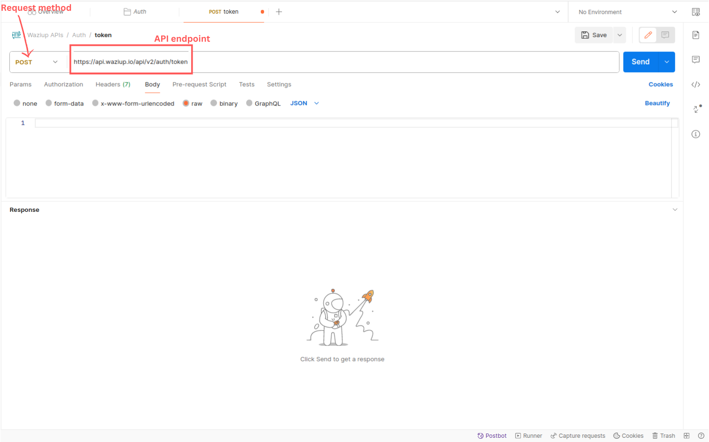
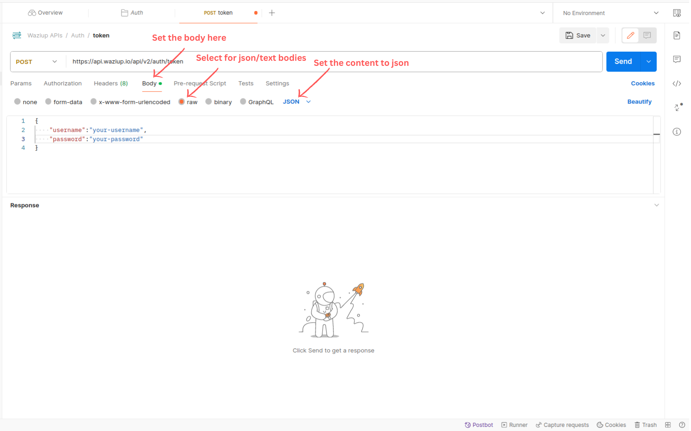
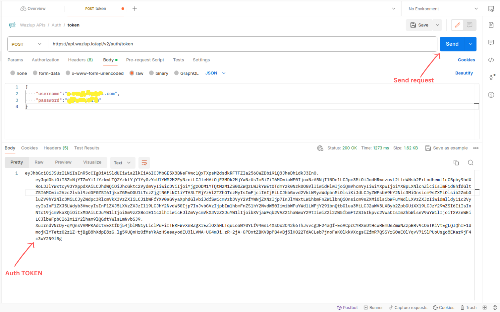
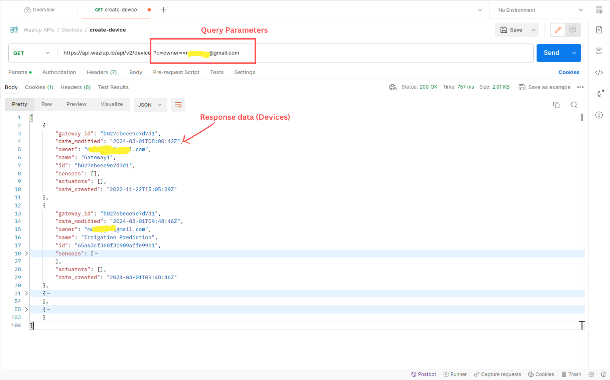
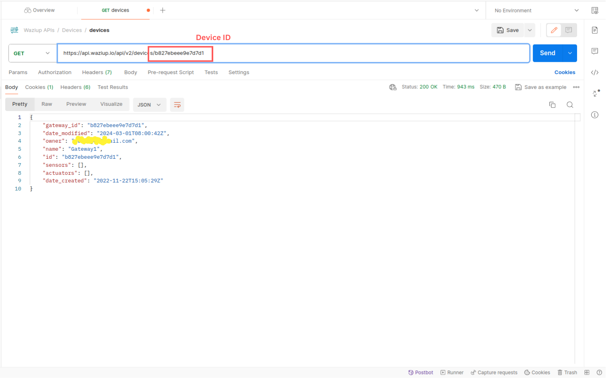
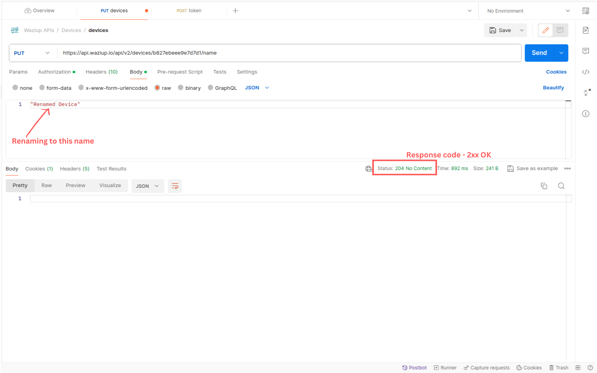
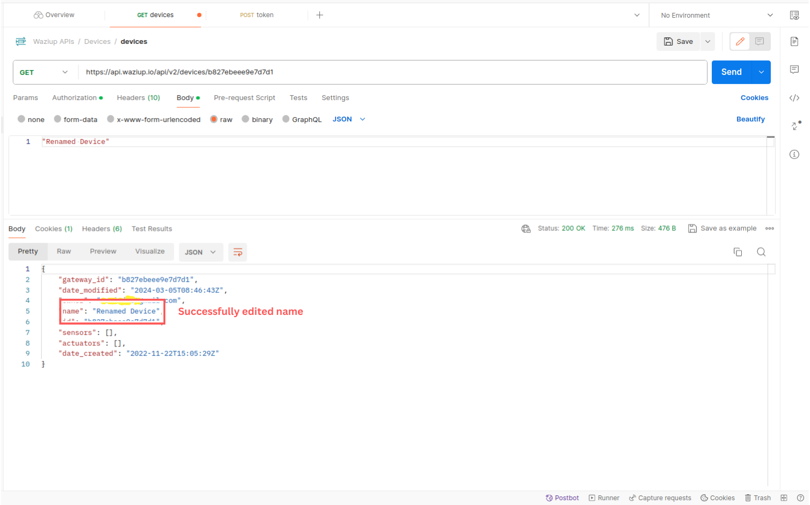

This course will show you how to use HTTP APIs. We will go through the architecture of each protocol, and how to send and retrieve data. Additionally, the course will show you how to design APIs, with all the do’s and don’ts. At the end of the course, we will demonstrate how to consume waziup API from the cloud using postman.

<youtube>CHTOr1ZWcog</youtube>

# Introduction

REST is a standard to create Application Programming Interfaces (APIs).
REST means "REpresentational State Transfer".
What does this name means exactly? Well, with a REST API, we are transfering the _representation_ of a _state_.
This state is usually stored in a database on the server side.
To tranfer this state to the client, we can use various representations; JSON and XML are the most common.
As can be seen in the picture, REST APIs are based on the "client-server" paradigm: a client makes a request to a server and gets a response.


The API is "stateless": that mean that the communication is "fire and forget".
The Client makes a request to the server, the server responds and completely forgets about you.
There is no openned sessions or openned channels between the client and the server after the response is sent.
On the next request, you will need to provide again all necessary information in your request.

Additionally, REST APIs are usually based on HTTP.
That means that everything will be represented as a URL, in particular every "resources" manipulated by the API will have its own URL.


# HTTP methods

There are 4 main HTTP methods used in REST APIs: POST, PUT, GET and DELETE.
They match more or less with the CRUD operations: Create, Read, Update and Delete.


A POST will add a new resource. PUT will modify an existing resource, without adding a new one.
GET will retrieve a resource. Finally, DELETE suppresses a resource.
There are additional methods that you may incounter: PATCH, HEAD, OPTIONS...

# Query parameters

Query parameters can be added on a request (usually a GET), to make it more precise.
They can be used for querying, filtering or sorting.
For example, if you have an endpoint to retrieve cars, you can refine your query by retrieving only red cars: `GET /cars?color=red`
Similarly, to get the list of users whose name matches tom: `GET /users?name=tom`

# Headers

Header are an often misunderstood part of HTTP protocol.
Headers allows you to add additional informations on the request or response.
Some examples of headers are:

- Content-Type: defines the request data format.
- Accept: defines a list of acceptable response data formats.
- Authorization: adds authorization informations.

`Content-Type` and `Accept` goes in pair. `Content-Type` tells the server that you are sending data in a specific format.
With `Accept` on the other hand, you are telling the server that you want the response to be in a certain format.
For instance, if you make a POST with the data in the JSON format, you need to include and header with "Content-Type: application/json".

The `Authorization` header allows to add some credentials. For instance, with the "Basic" authorization header, you can send a username and password.
The "Bearer" authorization requires a token, which is a more secured way to communicate with the server.

# HTTP Response Status Code

Any HTTP request will give you a [response code](https://developer.mozilla.org/en-US/docs/Web/HTTP/Status). They are:

- 1xx Informational Codes
- 2xx Successful Codes
- 3xx Redirection Codes
- 4xx Client Error Code
- 5xx Server Error Codes

For instance, a `200` response means "OK". There are some variants, such as `201` Created. i
The request succeeded, and a new resource was created as a result. This is typically the response sent after POST requests, or some PUT requests.
With 3xx codes, the server is telling you "I understood your request, but this resource has moved."
4xx codes means "you made a mistake". 5xx codes means "I made a mistake".

# A full request

With all this in mind, let's build a full request.
We want to read all the cities visited by a user.
Our request is:

```
GET https://www.myhost.com/api/v1/users/1/cities
```

Our client will send the following HTTP request:

```
GET /user/1/cities http/1.1
host: https://www.myhost.com/api/v1
Accept: application/json
Accept-Language: us-en
```

We will receive the following HTTP response:

```
HTTP/1.1 200 OK (285ms)
Date: Fri, 21 Apr 2017 10:27:20 GMT
Server: Apache/2.4.6 (CentOS) OpenSSL/1.0.1e-fips PHP/7.0.16
X-Powered-By: PHP/7.0.16
Content-Length: 109
Keep-Alive: timeout=5, max=100
Connection: Keep-Alive
Content-Type: application/json; charset=UTF-8

{"status":"success","message":"City
List","data":[{"city_name":"Visakhapatnam"},{"city_name":"Vijayawada"}]}
```

The response code is `200`: OK!
At the end of the message, we get the data in JSON format, as requested.

# Designing a REST API

In this section, we'll review some do's and don'ts when designing a REST API.

**Use Nouns but not verbs in URIs**

The URLs of your endpoints shall contains on nouns, not verbs.
The nouns are usually your resources: `/cars`, `/users`...
The actions you perform on theses resources will be conveyed by the method (GET, POST...).
Here are some good and bad examples.

Retrieves a list of users:

- `Bad: GET /getAllUsers`
- `Good: GET /users`

Create a new user:

- `Bad: POST /createUser`
- `Good: POST /users`

Delete a user:

- `Bad: DELETE /deleteUser`
- `Good: DELETE /users/10`

Get balance of user:

- `Bad: GET /getUserBalance`
- `Good: GET /users/11/balance`

**Use plural nouns**

It is good practice to use only plural for resource names:
/cars instead of /car
/users instead of /user
/products instead of /product
/settings instead of /setting

Even if you address a single resource, use plural. Your API will look more consistant.

**GET method should not alter the state**

Use PUT, POST and DELETE methods instead of the GET method to alter
the state.
Do not use GET method or Query parameters for state changes:

- Bad: `GET /users/711?activate`
- Bad: `GET /users/711/activate`
- Good: `PUT /users/711/activated` (with body data = `true` or `false`)

**Use sub-resources for relations**

If you want to express a relation between two resources, you can use a subresource:

- Returns a list of drivers for car 711: `GET /cars/711/drivers/`
- Returns driver #4 for car 711: `GET /cars/711/drivers/4`

**Use HTTP headers for serialization formats**

Both client and server need to know which format is used for the communication.
The format has to be specified in the HTTP-Header:

- `Content-Type` defines the request format.
- `Accept` defines a list of acceptable response formats.

You don't need to put the format on the URL:

- Bad: `GET /data?format=json`

**Versioning**

As your API becomes successful, more and more users will use it.
However, you will want to be able to make changes to it, without impacting existing users.
This is why it's useful to include a version number in the URL:

```
/blog/api/v1/posts
```

Use a simple ordinal number and avoid dot notation such as 2.5.
You can plan to make big releases with all breaking changes and update your version number at this time.
For smaller, non breaking changes, you can just update your API without updating the version number.

**Error handling**

To handle errors in your API, you can make an extensive use of HTTP error codes.
Here are some interresting codes:

- 200 OK (Everything is working)
- 201 OK (New resource has been created)
- 204 OK (Resource successfully deleted)
- 400 Bad Request (The request was invalid or cannot be served. The exact error should be explained in the error payload. E.g. “The JSON is not valid”)
- 401 Unauthorized (The request requires an user authentication)
- 403 Forbidden (The server understood the request, but is refusing it or the access is not allowed)
- 404 Not found (There is no resource behind the URI)
- 405 Method not allowed
- 408 Request timeout
- 500 Internal server error

**Filtering**

When a big number of items can be returned, it's important to give the user the capacity to filter it.
It can be done on a field by field basis:

- Returns a list of red cars: GET /cars?color=red
- Returns a list of users whose name matches tom: GET /users?name=tom

Some APIs have a more complex query language for filtering:

```
GET /cars?q="color==!red&&mileage<100000"
```

The request above search for cars than are not red and with a mileage of less than 100000Kms.

**Sorting**

It is also usefule to allow ascending and descending sorting over some fields.
For example, this request returns a list of cars sorted by ascending models:
GET /cars?sort=model

**Paging**

Some requests could return a huge amount of data.
You can use "paging" to return data little by little.
This is usually done with `limit` and `offset`:

```
GET /cars?limit=100&offset=0
```

This command retrieve the first 100 cars. The next 100 can be retrieve by setting `offset=100`.

# Waziup APIs with Postman

In this exercise we will be consuming wazicloud API. We will understand how to send `GET`, `PUT` and `POST` request using postman. We will also understand how to get access token for authentication using postman.

**Prerequisites**

- Postman - You can download postman from [this](https://www.postman.com/) page or use an online version of postman
- Wazicloud account - You need to have wazicloud account. You can set one from [this](https://dashboard.waziup.io/) page
- Active internet connnection

For more reference on using the API, you can find the complete documentation [here](https://api.waziup.io/docs)

**Obtaining auth token**
The authentication endpoint receives a post request. The request contains body with username and password. The body is in json format. The token received will be in text format. We need to start postman, and head over to creating the request.

The endpoint to obtain the request is,

```
https://api.waziup.io/api/v2/auth/token
```

Paste the above url in the request input section. Remember to toggle the method to `POST`. Otherwise, you will receive an error, METHOD NOT ALLOWED.



We need now to provide our login credentials before sending the request.

```json
{
  "username": "your-username",
  "password": "your-password"
}
```



After issuing the correct credentials, we should receive our response along with the token. The token contains our credential information like username etc.



**Listing devices connected to our cloud**

To list connected devices on our cloud, send a `GET` command to the endpoint below.

```
https://api.waziup.io/api/v2/devices
```

Since we need to retrieve our devices only, add a query string with your username as the owner. Below is an example,

```
https://api.waziup.io/api/v2/devices?q=owner==username
```

_NB_ Replace the username with the wazicloud username.



**Editing device**
Editing is normally a `PUT` request. Lets first retrieve the device we want to edit. Issue this `PUT` command in postman.

```
https://api.waziup.io/api/v2/devices/DEVICE_ID
```



_NB_ Supply the correct device id you want to retrieve

To edit the device, you need to supply the auth token you obtained from `auth/token`.

Under the body section, add the name of the device.



The request should return a 204 status. If you try retrieving the device once more, you get the device's name has been edited successfully.



# Exercise

We have already performed, GET, PUT/UPDATE,

1. Perform the following HTTP request on the waziup API.

- `POST` - Create a waziup device on the cloud platform
- `DELETE` - Delete the device you created on the Wazicloud
