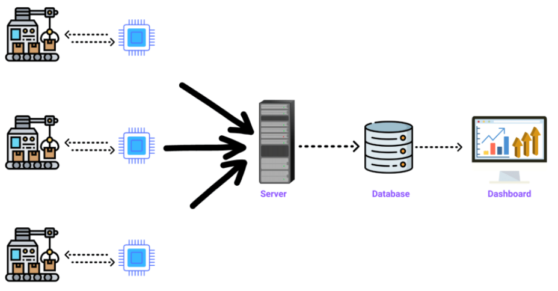

This course will show you how to manage your IoT data in databases.
In particular, you will learn how to use SQL databases, and No-SQL databases.
Based on the type of IoT application, the course will give advice for a better choice.
Finally, we give hints to improve database performance when a big amount of data is involved.


Introduction
============

The diagram below shows the basic architecture of an IoT application.
You will notice the database in the middle, between your IoT devices and you Web application.



In practice, your user application will never reach "directly" the IoT objects: there is always an intermediate database!
IoT objets are moving, they are not always on, and furthermore reaching them might cost too much in term of energy.
Furthermore, they might not store all the history of data measurements, because of the limited memory space.
So, there is always a database...


No-SQL databases
================

The first kind of databases are called "No-SQL databases".
The main type of databases in this family are "document-oriented" databases.
The idea is to store complete "documents", which are most of the time JSON documents.
This is simpler than storing data in complex tables, however it is less structured and os offers less guaranty on the validity of the data.

Some examples includes MongoDB, MariaDB or CouchBase.
Let's take an example with [MongoDB](https://www.mongodb.com).
Here is how to store, and retrieve IoT data with Mongo.
First, you need to install MongoDB on your system.
Then, start of the Mongo client with the command `mongo`:

```js
$ mongo
> use myapp
> db.createCollection("iot_data")
> db.iot_data.insert({ "sensor_id" : "TC1", "device_id" : "MyDevice", "value" : "25.6", "timestamp" : "2016-06-08T18:20:27.873Z" })
> db.iot_data.find()
{ "_id" : ObjectId("6260780dac610863d6139a05"), "sensor_id" : "TC1", "device_id" : "MyDevice", "value" : "25.6", "timestamp" : "2016-06-08T18:20:27.873Z" }
```

In this example, we use the database "myapp". It will be created if non-existant.
We then create a collection of document, called "iot_data".
This collection will contain the datapoints form our IoT object!

We then insert a first datapoint:
```json
{ "sensor_id" : "TC1", 
  "device_id" : "MyDevice", 
  "value" : "25.6", 
  "timestamp" : "2016-06-08T18:20:27.873Z" }
```

This is the recommanded format for an IoT datapoint. It contains an ID for the device (e.g. an Arduino board), an ID of the sensor (e.g. a temperature sensor mounted on the Arduino board), a value and a timestamp.
The last line retrieves that datapoint from the collection.
Here is an example in NodeJS:

```js
const { MongoClient } = require("mongodb");
const client = new MongoClient('mongodb://127.0.0.1');
async function run() {
  try {
    await client.connect();
    const database = client.db('myapp');
    const iot_data = database.collection('iot_data');
    const query = { 'device_id': 'MyDevice' };
      const data = await iot_data.findOne(query);
      console.log(data);
    } finally {
      await client.close();
    }
  }
run().catch(console.dir);
```
The example above connects to a local database, and queries all the datapoints produced by the device named "MyDevice".
Libraries exist for any languages, so it should be easy to integrate Mongo in your app.

Optimizations
-------------

If your app grows big, you will have millions of datapoints in the database.
That's when you might notice some slow-down when retrieving data.
It will be useful to create an [index](https://www.mongodb.com/docs/manual/indexes/), based on the most often made query in your database.
```js
> db.iot_data.createIndex( { timestamp : 1 } )
{
    "createdCollectionAutomatically" : false,
    "numIndexesBefore" : 1,
    "numIndexesAfter" : 2,
    "ok" : 1
}
```
In the example above, we create an index based on the "timestamp" attribute of our datapoints.
That will optimize any further query based on dates. This is useful if you often search your data by dates, e.g. retrieving data for a window of time.


SQL databases
=============

SQL databases stores data in tables. This allows for more structure and more control over your data.
Two popular examples are MySQL and PostgreSQL.
Here is an example with [MySQL](https://www.mysql.com):
```js
$ mysql
> CREATE TABLE iot_data (sensor_id VARCHAR(20), device_id VARCHAR(20), value VARCHAR(20), timestamp DATE);
> INSERT INTO iot_data VALUES ("TC1","MyDevice","25.6","2016-06-08T18:20:27.873Z");
> SELECT value, timestamp FROM iot_data WHERE device_id = "MyDevice";
+-------+------------+
| value | timestamp  |
+-------+------------+
| 25.6  | 2016-06-08 |
+-------+------------+
1 row in set (0,00 sec)
```

In this example, we create a table with four collumns: sensor_id, device_id, value and timestamp.
We also need to select the data type for each collums.
We then insert our first datapoint.
The last line shows how to extract the values and timestamps from all datapoints generated by the device "MyDevice".

Finally, here is the example with NodeJS:

```js
var mysql = require('mysql');

var con = mysql.createConnection({
  host: "localhost",
  user: "myuser",
  password: "mypassword",
  database: "myapp"
});

 con.connect(function(err) {
  if (err) throw err;
  console.log("Connected!");
  con.query("SELECT value FROM iot_data", function (err, result) {
    if (err) throw err;
    console.log("Result: " + JSON.stringify(result));
  });
});
```

Have fun!
