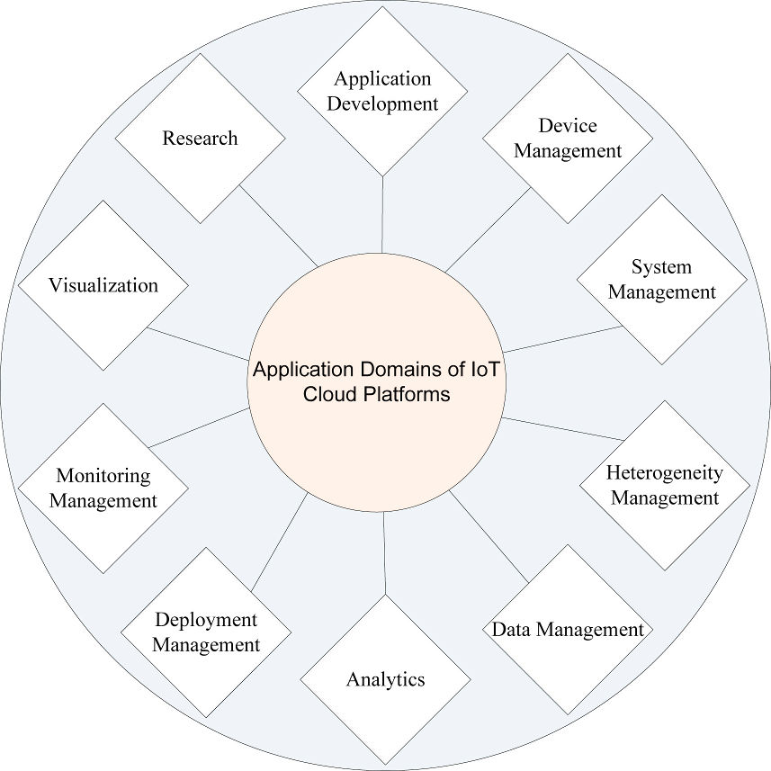
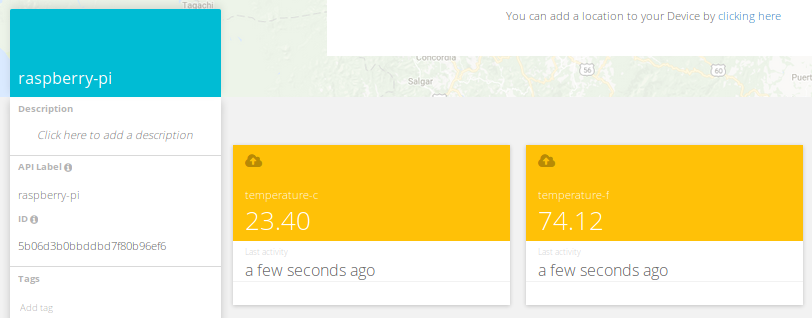

In this course, we will explain first what is an IoT Cloud platform. We will then survey various existing platforms: ThingSpeak, Ubidots and Blynk. We will upload our own IoT data to these platforms using a Wifi capable IoT board.

Introduction
============

IoT cloud platforms bring together capabilities of IoT devices and cloud computing delivered as a end-to-end service. They are also referred by other terms such as Cloud Service IoT Platform. In this age, where billions of devices are connected to the Internet, we see increasing potential of tapping big data acquired from these devices and processing them efficiently through various applications.

IoT devices are devices with multiple sensors connected to the cloud, typically via gateways. There are several IoT Cloud Platforms in the market today provided by different service providers that host wide ranging applications. These can also be extended to services that use advanced machine learning algorithms for predictive analysis, especially in disaster prevention and recovering planning using data from the edge devices.

Key features
============

As can be seen in the following figure, typical features of IoT Cloud platforms include connectivity and network management, device management, data acquisition, processing analysis and visualization, application enablement, integration and storage.



In general, there are two kinds of IoT software architectures:

- Cloud-centric: Data from IoT devices such as sensors are streamed to a data centre where all the applications that do the analytics and decision making are executed, using real-time and past data from one or more sources. Servers in the cloud control the edge devices too.
- Device-centric: All the data is processed in the device (sensor nodes, mobile devices, edge gateways), with only some minimal interactions with the cloud for firmware updates or provisioning. Terms such Edge Computing and Fog Computing are used in this case.

Today, for IoT Cloud Platforms, the goal is to stretch the analytics and data processing across Cloud and Device, leveraging the resources at each end seamlessly. In general, we are beginning to see a shift towards leveraging the compute and service capabilities of the cloud to manage IoT devices better. This is also quite evident from a snapshot of the Google Trends showing increasing interest in Cloud compute compared to just IoT.

Challenges
==========

Security and privacy are the main concerns delaying the adoption of IoT Cloud Platforms. Cloud providers typically will not own the data and are only authorized to do the analytics and control of systems as permitted by the owner of the data. Any breach of data access either during transit or from storage is a concern from privacy and security perspective. Also, since the value of IoT data is immense, proper legal agreements and mechanisms must be in place to ensure the data or outcome of data analysis is only used for the intended purpose by the authorised personnel.

Existing IoT cloud platforms may not always conform to standards, thereby causing interoperability issues. They may also not support heterogeneous modules or communication technologies. When there's too much data, context awareness can help, including decisions of what needs to be done at the edge. Vertical silos continue to exist and this prevents horizontal flow of information. Middleware can solve this problem. Many system continue to use IPv4 and this could be a problem as devices run out of unique IP addresses.


Thingspeak
==========

Thingspeak is easy to use and can display quickly the data from your sensors.

Step 1: Create an account on https://thingspeak.com


Step 2: Create a channel 
You just need to fill the channel name for now.


Step 3: Go in the "API" section and try the various API endpoints.
For instance, try:
```sh
curl -X POST "https://api.thingspeak.com/update?api_key=B5BM1GNV8BXLMQWB" -d "field1=5"
```

Boom! You have a graphic curve with your datapoint:


Blynk
=====

Blynk is another IoT Cloud platform to connect your devices to.

After you created an account (https://www.blynk.io), you can start the Wizard:


It is quite straightforward. They will propose a code template preconfigured with your credentials:


Ubidots
======

Similarly, Ubidots allows you to create a [quick dashboard](https://help.ubidots.com/en/articles/2400308-create-dashboards-and-widgets) for your devices.




One interesting feature of Ubidots is [UbiFunctions](https://help.ubidots.com/en/articles/2132086-analytics-ubifunctions-user-guide).


This allows you to upload some code to perform some preprocessing on the data.
It can be used as an "adapter" between two different platforms, for instance to [get data from The Things Network](https://help.ubidots.com/en/articles/1866089-integrate-your-ttn-data-with-ubidots-manual-ubifunction-setup).

