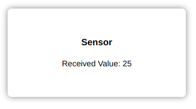

# Introduction

MQTT (Message Queue Telemetry Transport) is a publish-subscribe messaging protocol designed for lightweight M2M communications.
It is very useful in IoT applications, as we will see.

<youtube>ozqQEhM5IPo</youtube>

HTTP vs MQTT
============

There is a major difference between HTTP and MQTT: HTTP is a "request-response" protocol.
You perform a request, the server responds, and completely forgets about you.
This works fine most of the time, but for IoT applications in particular there is a small problem.
Say, that you request the value of a sensor.
However, after some seconds, that value may change! So you have to request it again. And again.

A better solution in this case is to use MQTT, which uses the "publish-subscribe".
Instead of performing regular requests, you say to the server "Look, I'm interrested in this sensor values. Could you call me back if there is any changes?"

As can be seen in the following picture, in MQTT the connection with the server is persistent (as opposed to HTTP).


The following picture show the HTTP methods vs the MQTT operations.


Architecture
============

The architecture of MQTT is based on a central server, called the "broker".
All clients can publish informations to the broker, and also subscribe on informations.


In the picture above, Client A and Client B are smartphones subscribing on an topic called "human-presence" from the broker.
Client C is a presence detector, than will publish any detection on the "human-presence" topic. 
As soon as the publish is done, the server will send an update on any subscribed clients.

Topics
======

A topic is a string that the broker uses to filter messages for each connected client.
The topic consists of one or more topic levels. Each topic level is separated by a forward slash (topic level separator).


Topics supports wildcards. 
For example, subscribing on the following topic would get you update for the temperature changes in any rooms:


You can also subscribe on all sub-topics using the wildcard "#":


Other features
==============

Quality of service
------------------

MQTT supports the following Quality of Service levels:
- Fire and forget (0): Client sends message to broker. Doesn’t care what happens to it.
- Deliver at least once (1): Client only destroys copy of message when acknowledgement is received from broker.
- Deliver exactly once (2): Multiple levels of checks and balances until it is established that message has been sent exactly once.

Last Will Testament
-------------------

You can configure the broker to send message to a specified client in case the connecting client’s connection closes in an ungraceful manner.


Persistent sessions
-------------------

In the event that the client goes offline, the broker stores all messages that the client has subscribed to and notifies the client of all such messages once it comes back online.

# Hands on task - MQTT Application

In this task, we will be building a simple MQTT application that listens to paticular sensor updates from the `wazicloud`.

**Prerequisites**

To build the application, we will need the following setup

- Wazicloud account
- Waziup API docs
- Active internet connection
- Node & npm

The url that we will be listening to follows the following format,

mqtt://api.waziup.io/devices/<device-id>/sensors/<sensor-id>/value

Note that instead of using `http`, we will be using `mqtt` protocal.

To send the data to the cloud, you can simply use a simple `curl` command or have an active device on the gateway that streams the values to the cloud. In this task, we will be sending data using curl.

Create an index.html component for our app. Paste the code below:

<!DOCTYPE html>
<html lang="en">
<head>
    <meta charset="UTF-8">
    <meta name="viewport" content="width=device-width, initial-scale=1.0">
    <script src="main.js"></script>
    <title>MQTT-Waziup</title>
    <style>
        * {
            box-sizing: border-box;
            margin: 0;
        }

        body {
            font-family: sans-serif;
            display: flex;
            align-items: center;
            justify-content: center;
            box-sizing: border-box;
            height: 100dvh  ;
        }
        .sensor-card {
            padding: 0.5rem;
            box-shadow: 0 0 12px 0 gray;
            width: 22rem;
            border-radius: 8px;
            aspect-ratio: 2;
            display: flex;
            flex-direction: column;
            align-items: center;
            justify-content: center;
            gap: 1.5rem;
        }
        
        h1 {
            margin: 0;
            font-size: large;
        }
        
    </style>
</head>
<body>
    <div class="sensor-card">
        <h1 id="sensor-id">Sensor</h1>
        <article>
            Received Value: <span id="val">---</span>
        </article>
    </div>
</body>
</html>

_NB_ Use the compile js code in the script tag, you can use browserify to compile the js to work on browser

```
npm install browserify
```

```
browserify main.js -o main.js
```

In the html elements we simply declare where the sensor values will be displayed.

**Subscribing to mqtt**

Install this mqtt library to facilitate the connection and subscription to the cloud.

```
npm install mqtt
```

Use this js code to listen to incoming data. Use script tag to import the code below to the html component.

```js
// Import the MQTT library
const mqtt = require("mqtt");

// Connect to mqtt client
const mqttClient = mqtt.connect("mqtt://api.waziup.io");

// Obtain the device and sensor ID from the wazicloud. Ensure you have devices set up already
const deviceId = 'ESPDEVICE';
const sensorId = 'TC';

// Declare a topic (endpoint) where we want to listen update from
const topic = `devices/${deviceId}/sensors/${sensorId}/value`;
// When we are connected to the client, subscribe to the defined topic
mqttClient.on("connect", ()=>{
    mqttClient.subscribe(topic, (error)=>{
        if (error) {
            console.log("Failed to connect MQTT");
        } else {
            console.log(`Connected to MQTT \nTopic: ${topic}`);
        }
    })
})

// Update the UI when we receive data
mqttClient.on("message", (receivedTopic, message)=>{
    console.log("Received...")
    console.log("Topic: ", receivedTopic);
    console.log(message);
    document.getElementById("val").innerHTML = message.value
})
```

Before receiving any value, the UI could look like this without any populated value,


Issue the curl command below to push a sensor to the wazicloud.

```
curl -X POST "https://api.waziup.io/api/v2/devices/ESPDEVICE/sensors/TC/value" -H "accept: application/json;charset=utf-8" -H "Content-Type: application/json;charset=utf-8" -d "{ \"value\": 25}"

```

_NB_: Use the correct device id and sensor id.

The UI should be automatically populated with the value you sent


# Exercise

1. Develop a simple application that listens to real time values from all the sensors and actuators connected to a particular device
    
    Hint: Use the topic `#` to subscribe to all instances happening in a particular device
    e.g `devices/#`