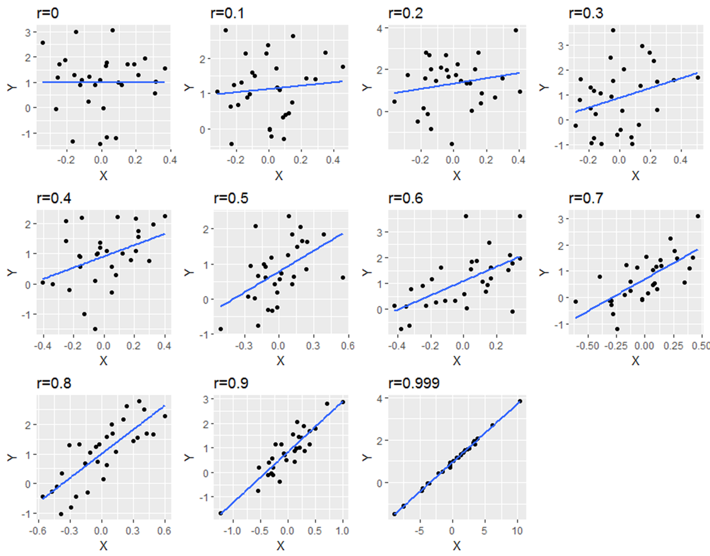
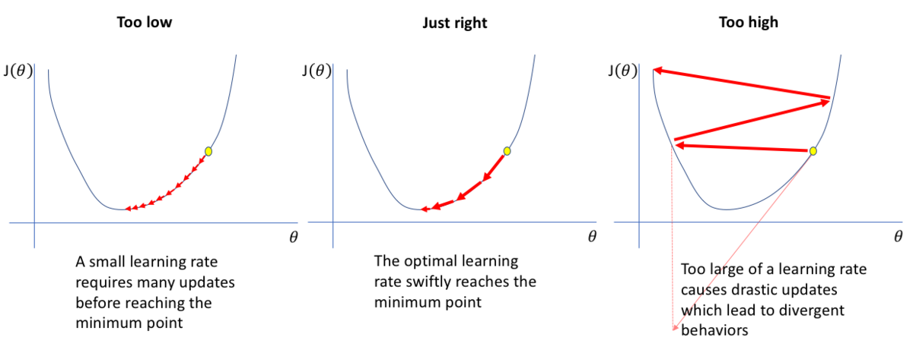

Introduction
============

Machine Learning is a subfield of AI.
Machine learning is a process that uses an algorithm to analyze data, learn from the data and make a statement or prediction about it.
Unlike software, which was programmed by hand and performed tasks by specific instructions, the machine can be trained using large amounts of data and algorithms.
This allows it to learn how to perform a task.

# Overview of different Machine learning algorithms grouped by similarity

In the following there is an overview about the different algorithms that are being used in machine learning, they are grouped by similarity.

## Algorithms used for Regression Analysis

Regression algorithms are trying to map an association between variables. Models are refined by the measurement of errors in predictions that are made by a model.

Regression methods are originated from the scientific field of statistics and had been adopted to statistical machine learning.

Here are some examples of Regression Analysis:

- Ordinary Least Squares Regression (OLSR)
- Linear Regression
- Logistic Regression
- Stepwise Regression
- Multivariate Adaptive Regression Splines (MARS)
- Locally Estimated Scatterplot Smoothing (LOESS)

## Algorithms that are instance-based

Instance-based learning, also called memory-based learning, is a learning algorithm, which instead of performing a generalization, compares an input with instances seen during training. This means the complexity to solve the problem will grow with the learned data, which was used during training. 

Here are some examples of algorithms that are instance-based:

- k-Nearest Neighbor (kNN)
- kernel machines
- Self-Organizing Map (SOM)
- Radial basis function network (RBF)
- Locally Weighted Learning (LWL)
- Support Vector Machines (SVM)

## Algorithms used for regularization

Regularization is a technique used in Regression Analysis to reduce complexity of a model and shrink coefficients of independent features.
So the task of regularization is to convert complex models into simpler ones, that need less computational cost and also avoid the risk of overfitting. 

Here are some examples of algorithms that are used for regularization:

- Least Absolute Shrinkage and Selection Operator Regression (LASSO) (L1)
- Ridge Regression (L2)
- Elastic-Net Regression
- Least-Angle Regression (LARS)

## Algorithms used for Decision Trees

Decision Trees belong to the family of supervised machine learning algorithms. They can be used in classification and regression. Consequently, there are two types of decision trees:

1. **Categorical** Variable Decision Trees: Solves a classification problem, the leaves of the tree represent the categories. 
2. **Continuous** Variable Decision Trees: Solves a regression problem, the leaves are "bins" that represent ranges in a numerical space.

Here are some examples of algorithms that are used for decision trees:

- Iterative Dichotomiser 3 (ID3)
- C4.5 and C5.0 (successor of ID3)
- Classification and Regression Tree (CART)
- Chi-square automatic interaction detection Performs multi-level splits when computing classification trees (CHAID)
- Multivariate adaptive regression splines (MARS)
- Decision Stumps
- Conditional Decision Trees

## Algorithms that implement Bayes' Theorem

The Bayes' Theorem provides a way of thinking about the relationship between data and a specific model. The theorem is a method to determine conditional probabilities, this means the probability of a specific event occurring, if another event already occurred. Bayesian can be applied to solve regression and classification problems.

Here are some examples of algorithms that implement Bayes' Theorem:

- Naive Bayes
- Gaussian Naive Bayes
- Bayesian Belief Network (BBN)
- Bayesian Network (BN)
- Multinomial Naive Bayes
- Averaged One-Dependence Estimators (AODE)

## CLustering Algorithms

Clustering is a Machine Learning technique that aims to group similar data points. In theory data that is in the same group, should share the same properties. Clustering can be a supervised- or unsupervised learning method. They are typically organized by the modeling approaches such as hierarchal and centroid-based.

Here are some examples of Clustering Algorithms:

- K-Means Clustering
- Mean-Shift Clustering
- Density-Based Spatial Clustering of Applications with Noise (DBSCAN)
- Expectation–Maximization (EM) Clustering using Gaussian Mixture Models (GMM)
- Agglomerative Hierarchical Clustering

Further information can be obtained from the article [The 5 Clustering Algorithms Data Scientists Need to Know, by George Seif](https://towardsdatascience.com/the-5-clustering-algorithms-data-scientists-need-to-know-a36d136ef68).

## Association Rule Learning Algorithms

Association Rule learning is an unsupervised technique. It checks the dependency of one data item on another item and maps them accordingly. Association rule learning tries to find, according to different rules, associations or relations among variables of a given dataset.

Here are some examples of Association Rule Learning Algorithms:
- Eclat algorithm
- Apriori algorithm

## Algorithms that use Neural Networks

Neural Networks are inspired by operations of neurons in the human brain. 

The models are created with help of a supervised learning process. 
Neural networks are a big subfield of machine learning, containing hundreds of algorithms and variations for many problem types.

Here are some examples of neural networks:
- Perceptron
- Multilayer Perceptrons (MLP)

In recent years the neural networks are getting bigger and bigger, more layers, more parameters, ... . Also, the size of the training data was increased. Therefore, a new subfield of machine learning was found to host these kinds of algorithms. It is called **Deep Learning**. 

Here are some examples of deep leaning algorithms:
- Convolutional Neural Networks (CNNs)
- Recurrent Neural Networks (RNNs)
- Deep Belief Networks (DBN)

## Ensemble learning algorithms

Ensemble learning combination of different methods using numerous learning algorithms, to get better prediction results. The results are usually better than one approach alone. The models being trained independently and are combined afterwards. This is a lengthy process, because they have to be combined in a useful way.

Here are some examples of ensemble learning algorithms:

- Random Forest
- Boosting
- AdaBoost
- Weighted Average (Blending)
- Gradient Boosting Machines (GBM)

## Algorithms to reduce dimensionality  

The reduction of dimensionality specify various techniques for reducing the number of input variables in training data. The higher the number of variables or features, the harder the model is to learn. 
Clustering follows the same approach, but dimensionality reduction follows a strict unsupervised learning method.

Here are some examples of dimensionality reduction algorithms:

- Kernel PCA (KPCA)
- Singular Value Decomposition (SVD)
- Non-negative Matrix Factorization (NMF)
- Manifold learning
- Linear Discriminant Analysis (LDA)

## Remarks

This list does not claim to be complete, there are many algorithms excluded, for example those that are important in some subfields of machine learning. Like Natural Language Processing (NLP), Computer Vision (CV), Reinforced Learning and many more.

Regression Analysis
===================

Regression analysis is a basic concept of machine learning. With help of regression continuous values can be predicted.
It is used to plot a best-fit line or a curve between data and can give a hint about the future development of data.
It is a supervised learning method, that means the model is trained with help of training data and labels.

Regression algorithms are trying to map an association between variables. Models are refined by the measurement of errors in predictions that are made by a model.
Regression methods are originated from the scientific field of statistics and had been adopted to statistical machine learning.
Here are the main regression methods:

- Ordinary Least Squares Regression (OLSR)
- Linear Regression
- Logistic Regression
- Stepwise Regression
- Multivariate Adaptive Regression Splines (MARS)
- Locally Estimated Scatterplot Smoothing (LOESS)

In regression analysis, we try to estimate relationships between a `dependent variable` and one or more `independent variables`:

- **dependent variables:** variable which holds the phenomena which we are studying, is dependent on other variables or factors, changes when independent variables change
- **independent variables:** the variables that are not affected by other variables

Important Metrics
=================

In the following the important metrics like variance, bias, r2-score and mean square error (MSE) are explained. Machine learning algorithms use statistical or mathematical models. They have inherent errors in two categories:

- irreducible errors: inherent uncertainty, due to noise in training data due to unknown variables
- reducible errors: more controllable, should be minimized to ensure higher accuracy: variance and Bias

So the error in a machine learning model is made up of:

The reducible Error is the sum of squared Bias and Variance.

Combining the above two equations, we get:

Variance
--------

<!-- TODO: make difference between BIAS clear -->

Variance is also known as **Variance Error** or **Error due to Variance**.
Variance measures how close observed values are to predicted values or, in other words, how far observed values are spread out from their mean (predicted) values.
The goal is here to have a low value, this means the prediction is accurate compared to the observed values. 
It shows the amount of the target's functions change, if different training data is introduced.

Bias
----

Bias is a constant or vector that shows the difference of the model's prediction from the target value. In other words, it is the simplifying assumption made by the model to make the target function easier to approximate. The difference of Bias and Variance is illustrated in the diagram below.

Difference between variance and bias illustrated [Fort12]. 

Correlation
-----------

Explains relationship between two variables, it shows how they are related to each other. Possible values can be from *-1* to *+1*. 

- A correlation of *-1* represents a perfect negative correlation.
- A correlation of *0* tells that the values are not linked at all.
- A correlation of *1* means that there is a perfect positive correlation.

In the following diagrams the correlation is visualized for different datasets. 

The blue line shows the predicted linear regression function, the black points represents the actual datapoints. The correlation is stated above the diagram [Curl20].

Only positive correlation is shown, for negative correlation the slope of the prediction would be negative.

Mean Square Error
-----------------

The metric Mean Square Error (MSE) describes the average of the square errors, the larger the number of MSE is, the larger the error. The metric is defined as the following:

The diagram below shows a graph that was created using linear regression. 

The blue line shows the predicted linear regression function, the purple points are the actual datapoints, the red lines represents the error (residuals) which is squared [Bini18].

Now the distance from our calculated line is squared and added up and multiplied by the reciprocal amount of points, this gives an average deviation to our prediction.

A more in-depth mathematical explanation of MSE is given by Moshe Binieli in his article ["Machine learning: an introduction to mean squared error and regression lines"](https://www.freecodecamp.org/news/machine-learning-mean-squared-error-regression-line-c7dde9a26b93/)

R2-Score
--------

The r2 score closely relates to Mean Square Error (explained in the last bulletin). It is a percentage, that varies from *0* % - *100* %. The r2 score shows a ratio of variances:

A high value means that the variables are perfectly correlated, there is no variance. A low value would indicate a low level of correlation, that means in most cases, that the model is not suitable for the given task.

A more in-depth mathematical explanation of the r2 score is given by Paul Johnson in his lecture ["Extending R-squared beyond ordinary least-squares linear regression"](https://www.slideshare.net/pcdjohnson/extending-rsquared-beyond-ordinary-leastsquares-linear-regression-95949488)

Linear Regression
=================

Linear Regression is a supervised learning algorithm. It aims to create a relation between the dependent variable (*y*) and one or more independent variable (*x*).
In other words “Linear Regression” is a method to predict dependent variable (Y) based on values of an independent variable or variables (X).
For a simple linear regression there can be only one independent variable.
This is accomplished by a linear function, which is created with help of metrics like "ordinary least square" (*OLS*) or "mean squared error" (*MSE*).
When there is a single continuous dependent variable and a single independent variable, the analysis is called a simple linear regression analysis. 

<!-- TODO: Check multiple ones?-->
<!-- Change-->

Ordinary Least Squares
======================

Ordinary Least Squares (OLS) is a type of linear least squares for guessing the not known parameters in linear regression models. It is an extended form of the basic linear function *y = f(x) = mx + n*, the extension is the error component ε.
It is done with help of the equation below:

- Y  : Represents the target, dependent variable
- X  : Represents the features, independent variables
- β0 : Intercept value: value of y at intersection with y-axis (x=0)
- β1 : Slope of the line that minimizes the sum of squared errors
- ε  : Random error component: for effects outside the model, which alter it

<!-- TODO: missing explanation -->

Gradient Descent 
================

Gradient descent is a continuous first-order optimization algorithm, used to find the local maximum/minimum of a function.
The gradient describes the slope of a function at a given point. In case of a univariate function, it is the first derivative at a point.
For a multivariate function, it is a vector of derivatives.

The gradient decent algorithm does not work for every function, it has specific requirements:

- The function needs to be **differentiable**
- The function needs to has a **convex shape**

Differentiable functions have a derivative for each point in the course of the function. Non differentiable functions have a discontinuity, a step or a cusp.
For Convex functions one could have a line segment on connecting two arbitrary points of a function without crossing it. Some examples are shown below:

A convex shaped function, the green line cannot intersect with function [Ful13]. 

If the line segment crosses the course of the function in one or more points, it is a non-convex function.

A non-convex shaped function, the green line can intersect with function [Jes15]. 

Algorithm
---------

<!-- Corentin: might be too much. -->

The gradient descent algorithm calculates the next point using gradient at the current position, the size of the steps is scaled by the learning rate (η) and subtracts the given value from the current point.
Since the we want to minimize the function, we have to subtract the value, to find the maximum one would need to add.
This can be expressed with the following equation:

The parameter η (eta) scales the gradient and likewise regulate the step size. It is called learning rate.
This parameter has a big influence on the amount of steps, that have to be observed to find the minimum of the function.

Gradient decent search determines a weight vector (w) that minimizes error (E).
The first step is to take a random starting point to evaluate the minimum of a function, that means an arbitrary initial weight vector is being chosen.
On every observed point, the sum of squared errors are calculated. The learning rate is used to scale the coefficients.
This process is repeated until there is no improvement visible, so the minimum of sum of squared error is reached.
This process is visualized in the diagram below:

Shows the process of the approximation with help of gradient descent algorithm [Gud21]. 

Convergence is normally reached slowly, since the optimization steps, controlled by learning rate, are small.
In the following different learning rates and their influence are being compared.

Shows different learning rates, in the left the learning rate is too small, the middle shows an optimal learning rate, the right a big learning rate leads to divergent behavior [Jor18]. 

Regularization
==============

There are also extensions of the training methods, applied to linear models, called regularization methods.
Regularization is aiming to minimize the sum of squared error of the model on the training data (using Ordinary Least Squares) and also reduce the complexity of the model.
This is done by reducing the absolute size of the sum of all coefficients in the model.

So, in course of the training process of machine learning model, one important aspect is to avoid overfitting.
This is happening because your model learns all the noisy features of your dataset.
Noisy data points do not represent the properties of your data. By leaning those points, your model gets more flexible but is also prone to overfitting.

Regularization is a form of regression, it constraints, regularizes or shrinks the used coefficients near to zero. 
There are two commonly used regularization methods for linear models:

- **Lasso** Regression: OLS is modified to minimize the **absolute sum of coefficients** (also called **L1** regularization)
- **Ridge** Regression: OLS is modified to minimize the **squared absolute sum of coefficients** (also called **L2** regularization)

The methods explained before are adequate to use if there is a collinearity  occurring in your input values and OLS algorithm would overfit the training data.

Preparation of Dataset for Linear Regression
============================================

The requirements and expectations to your data when you create a linear regression model, some of them are named and explained here.

- **Noise reduction**: It may be necessary to remove noise from your data, to let you clarify and expose the signal in your dataset. 
- **Linear course of function**: With linear regression the relationship between input and output data is assumed to be linear. If the course of the function is quadratic or at least different, another regression method has to be chosen. 
- **Gaussian Distributions**: If you have a Gaussian distribution in your input and output variables, linear regression will make more reliable predictions.
- **Rescale Inputs:** Rescaling the input variables with standardization or normalization will also make your model more robust and reliable.
- **Remove Collinearity:** If you have a high correlation in your input variables, linear regression is prone to over-fit your data. It should be considered to calculate pairwise correlations in your input data.

Making predictions
==================

Making a prediction after calculated the linear equation is quite simple, you just have to solve the function for a specific input.

<!-- TODO: add a finish note-->

## Sources

[Ful13] Fulvio314, Convex function, https://commons.wikimedia.org/wiki/File:Convex_function_2.svg 8 July 2013

[Jes15] Christensen Jesper, Topology Optimisation of Structures Exposed to Large (non-linear) Deformations, 10.13140/RG.2.1.1212.8724, 2015

[Gud21] Varshitha Gudimalla, Concept of Gradient Descent in Machine Learning, https://varshithagudimalla.medium.com/concept-of-gradient-descent-algorithm-in-machine-learning-44f587ac16ac, 2021

[Jor18] Jeremy Jordan, Setting the learning rate of your neural network,
https://www.jeremyjordan.me/nn-learning-rate/, 2018

[Fort12] Scott Fortmann-Roe: Understanding the Bias-Variance Tradeoff http://scott.fortmann-roe.com/docs/BiasVariance.html June 2012

[Curl20] James P. Curley & Tyler M. Milewski: "PSY317L Guidebook: 11 Correlation" https://bookdown.org/curleyjp0/psy317l_guides5/correlation.html Version: 2020 

[Bini18] Moshe Binieli, "Machine learning: an introduction to mean squared error and regression lines" https://www.freecodecamp.org/news/machine-learning-mean-squared-error-regression-line-c7dde9a26b93/ Version: 2022

