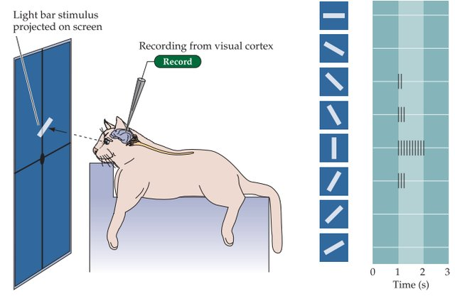
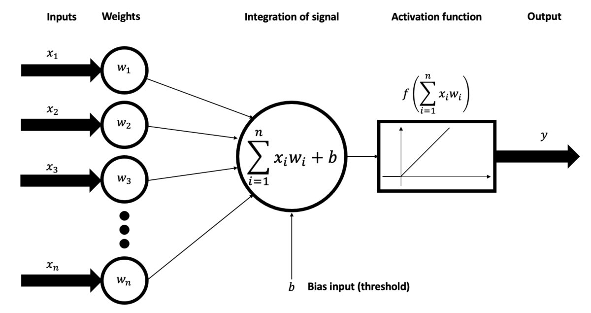
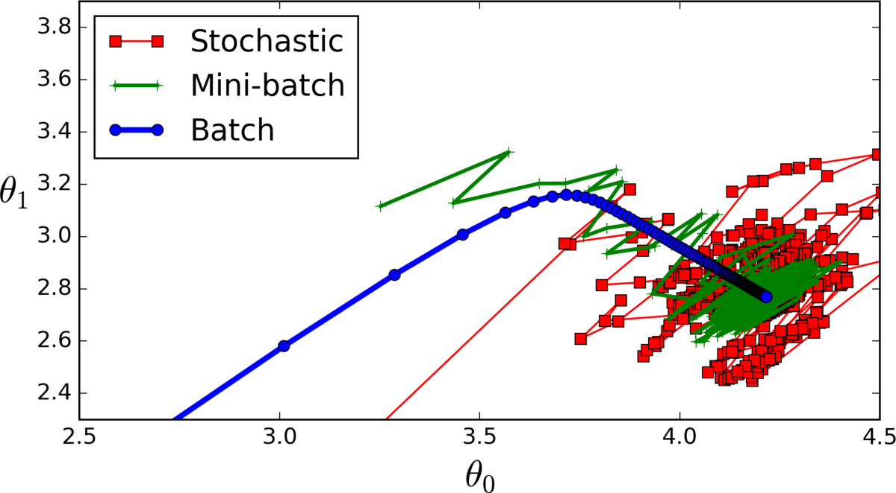

Introduction
============

This section introduces the basic techniques of image-based recognition.
Under the computer-aided recognition of images, or Computer Vision, one understands various techniques to locate elements in images or identify and catalog videos.
The goal is to use an automated process to gain a visual understanding while distinguishing between relevant and less distinguish relevant information.
This is a complex process that otherwise reserved only for the human visual system, part of the nervous system.

Today it is common to train image recognition models, which take an image as a received input and output one or more objects and possibly more recognize attributes.
The various objects possible to recognize are in classes assigned. Examples of these images must first be stored in so-called image databases collected. In addition to the class prediction these image recognition models also provide an assessment of the accuracy of the prediction meet. This value can be understood as a kind of probability of prediction and describes how confident the model is that an image becomes a learned class can be assigned.

In general, the recognition systems distinguish between single and multiple recognition. With a single detection, the model says only one class as Prediction for the entire image. Models designed for multiple detection were able to recognize several objects of different classes in one image.
Consequently, information on the localization of the object in the image and confidence needed.

History
=======

<!-- Corentin: Maybe lighter section? -->

For more than 60 years scientists have been dealing with the subject of using machines to extract the visual meaning of data.
Rosenblatt introduced the perceptron in 1958, it is a simplified artificial one neural network (ANN) and in this context the first representative [Ros58].
The developed "Mark I Perceptron" Machine could already recognize simple digits with an array of 400 photocells. 

Now an example should be mentioned, which has nothing to do with software development. However, this can be seen as an inspiration for the research field and later published work. 
The neurophysiologists David Hubel and Torsten Wiesel [HW59] examined the sensitivity of simpler and more complex ones Neurons in the striped cortex of cats. This was from the point of view of Stimulus orientation or orientation selectivity quantitatively studied. 

Sensitivity of simpler and more complex ones Neurons [HW59].

The researchers found that there are simple and complex neurons in the primary visual cortex and that visual processing always begins with simple structures such as oriented edges. This means that in the process of image processing initially not holistic objects are recognized, but simple geometries are processed first. The neural networks used today learn the features in the same order.

In 1960, Henry J. Kelley published an important paper that attempted to calculate optimal flight paths of airplanes based on gradients. The findings are used as the basis for backpropagation.

In 1960, the ADALINE model [Som] was presented by Bernard Widrow and ME Hoff, it represents an artificial neural network. This is the first to be commercialized applied, here a real-time echo filtering was carried out with analogue telephones.

In 1963 Lawrence Roberts published "Machine perception of three-dimensional solids" [Rob63]. The aim of this doctoral thesis was to convert 2D photographs to line drawings process, which are then processed into three-dimensional representations will. The real world was reduced to simple geometric figures.

The first working deep learning networks were created by Alexey Ivakhnenko and V.G. Lapa presented. In 1971 they published the first computer-aided identification system called "Alpha".

Another influential contribution was made in 1982 by David Marr, a British Neuroscientist, provided [Mar82]. He proved that seeing in the broadest sense is a hierarchical process. He developed a prototype with which it is possible to  create three-dimensional representations of the environment in order to use them later
to interact. He also developed a CV framework, where algorithms were used are offered, which recognize simple features, i.e. corners and edges. This rudimentary understanding of the scene provided the basis for later work and paved the way for gaining a higher understanding of the scene.

At the same time, the Japanese computer scientist Kunihiko Fukushima developed his own organizing artificial neural network. The network includes simple and complex cells. With the help of the network called "Neocognition".
Patterns are recognized, it consisted of several layers of folding.
A few years later, French scientist Yann LeCun published his changes or additions to Fukushima's convolution layer architecture. He refined the principle of error feedback (backprop-learn). 
After a few years of work in the field, he published "LeNet-5". This may be the first modern convolutional neural network (CNN) be considered. LeNet-5 has been used on a large scale to automate handwritten digits on personal and commercial bank checks in the United States recognize [LBB+98]. A lower threshold of the recognition quality of the bank fixed. *50%* of bank checks must be scanned with an error rate of *1%*, the rest can be rejected by the system and becomes a human recognition assigned editor. This work also advanced the development of the MNIST image database, which is one of the essential image databases.

Just before the year 2000, the focus shifted to image-based recognition. Many researchers stopped reconstructing 3D models and thus no longer followed path suggested by Marr. It now became more feature-oriented Object recognition focused.

An image based recognition is used in many areas today, such as autonomous driving on the road, face recognition in public places, facilities for determining plant species, tagging photos and videos or also in the healthcare system for evaluating visual data. Despite the impressive recent advances, we are not close to a rather all-encompassing
solution not yet close.

Convolutional Neural Networks
=============================

A convolutional neural network (CNN) is able to process a wide variety of inputs.
They process the data in the form of matrices. It can be fundamentally called juxtaposition of layers which are of different types.
These change the input with help of various mathematical operations, so certain spatial characteristics will be prioritized or learned, others neglected.
The various components are briefly described in the following.

The Input Layer
---------------

The input or the input layer **receives the image** given to the network. If the image is stored in three color channels (red, green, blue), one has a height and width of 28 pixels, then the dimensions of the input are like follows: [28 x 28 x 3].

The Convolutional Layer
-----------------------

The convolutional layer (CL) calculates the output neurons that belong to the local regions are connected. This is accomplished using various **filters**, which are repeatedly applied to the input at an offset. The size of the filter specifies the **kernel size**. This area is also called the **receptive field** and thus describes the field of view of the filter. Now the **dot product** is calculated between the local regions and the filter. A central component here are the interim results, which are stored in a so-called feature map. These maps are stored and passed to the next layers as input will. This is illustrated in the below. 

Calculation example of a convolutional layer [cs231].

At a CL, the feature map is defined by the dot product between input and kernel calculated.
The spatial size of the output is determined by three **hyperparameters:**

1. **Stride** describes the offset of the filter, which uses the input to produce the output calculated. If the stride is specified as 1, then the filter will always shifted by one pixel, creating an overlap. Now if that Stride is greater than 1, then the filter is shifted by several pixels, consequently the output decreases.
2. **Depth** is a hyperparameter describing the number of filters used be used to extract features from the input. In the first layers after the input are increasingly simple features such as directed edges or the color detected from a blob.
3. **Zero-padding** corrects the spatial expression of the CL output. This is accomplished with a frame of zeros. If the padding with a value of 1 is specified, the width of the border is 1 and increases the spatial expression of the feature map by two units.

The spatial size of the output (N) is calculated using the following formula:

The spatial size of the input (W) is subtracted by the size of the receptive field (F) and double the length of the zero padding (P) is added, as this is applied to both sides of the image. Divided by the stride (S), enlarged by one. This gives the spatial size of the output (N) after a CL.

The Pooling Layer
----------------

Pooling describes bringing together. This is important to reduce complexity and make the network more robust against small changes between learned features and the input. The Convolutional Layer (CL) decreases spatial size only minimally when no stride is applied, the positions and prominences of features are stored precisely. This leads to small changes in the picture, for example due to movements or rotations, to another feature map. The pooling layer solves this by only addressing the significant features forwards the next layer. 

There are several forms of pooling, the most popular being max and average pooling. Max pooling is illustrated below:

Illustration of max pooling [Max22].

For these, the maximum or average value is used, determined from the previously specified size of the filter. The result is written into the feature map of the output. A [2 x 2] filter size paired with a Stride of 2. Significant features are obtained in this way. The size of feature maps can also be shrunk in CL using stride, however information is skipped and can thus be lost.

Fully connected layer
--------------------
The Fully Connected (FC) layer in a Convolutional Neural Network (CNN) is a crucial component responsible for connecting neurons across different layers. Typically positioned before the output layer, FC layers form the concluding segment of a CNN architecture.

In the FC layer, input images, previously processed through convolutional and pooling layers, are flattened into a vector. This flattened vector is then transmitted through multiple FC layers where fundamental mathematical operations occur. This stage marks the initiation of the classification process, enabling the network to assign labels or make predictions.

The connectivity between two FC layers enhances the network's performance, as the synergy of two fully connected layers often outperforms a single connected layer. In CNNs, these FC layers contribute to automating feature extraction and reducing the need for extensive human supervision in the learning process.

The output in the last layer of a CNN is usually used for classification performed by the Softmax activation function. The number of feature maps in the last layer usually corresponds to the number of classes learned.

Activation Functions
====================

Activation functions determine the output, hence the accuracy and duration of the learning process and recognition, ultimately the efficiency of the CNN. The activation function can be viewed as a kind of threshold that decides about the forwarding of respective activations. Activation functions also have a high influence on convergence (convergence towards a local optimum) in a CNN, in some cases, activation functions can also impede convergence.

In a CNN, numeric data is fed as an input to the first layer neurons. Each neuron has a weight which, when multiplied (see subsection Convolutional Layer) with the input, gives the output which is passed to the next layer and serves there as an input. Activation functions represent a kind of threshold, which decides about the forwarding of the respective activation. This can be simplified by specify a rule or threshold. However, it can also be viewed as a transformation that maps input signals into output signals.

### Binary step function

A binary step function is defined as an activation function with a **threshold**. When an input value is above a certain value, the neuron is activated (or deactivated) and sends the information unchanged to the next Layer. A disadvantage here is that only a binary classification (a classification of only two classes) can be done.

### Nonlinear Activation Functions

Nonlinear activation functions are a common choice for use in CNNs. In the following, some of these will be presented, an initial visual overview should give Figure the figure below.

An overview of nonlinear activation functions. [Jai19]

**Rectified linear unit (ReLU)** is an activation function that allows fast convergence of the network. Although the curves assume a linear function, this is a non-linear function. It thus has a derivation, which can be used for backpropagation. However, if the inputs are negative, the gradient of the function becomes zero and thus again there is no backpropagation possible.

With **sigmoid**, the output values ​​are scaled in a range of *0 − 1*, i.e the output of the neurons is normalized. It finds a strong prioritization on the most probable result instead, this is due to the course of the curve in the range of *x > 2* and *x < 2*, where the results are very close to the values ​​*0* or *1*.
Sigmoid is one of the **logistic activation functions**. With very high or low *x*-values ​​it is problematic because the prediction does not differ from the others, similarly high or low predictions. In addition, this scalar
Function actually only used with **binary classification**. Here they add up probabilities of all classes not equal to *1*.

With **softmax**, the output values ​​are also scaled in a range from *0* to *1*. That means, the output is derived from a translation- but not scale-invariant normalization of the neurons, converted into a probability distribution. The individual probabilities of the classes add up to one. Usually the softmax activation function for classification will be only used in the output layer and combined with a with the cross entropy loss function. (More information on loss functions will be available in the next chapter.)

## Weights and biases

Before the training process the neural network is initialized with a set weights and biases. Weights are being optimized throughout the period of training and optimum weights are produced. Below there is an illustration of a convolutional layer.

A convolutional layer with inputs, weights, bias, signal integration, activation function and the output [Brun21].

A neuron computes the weighted sum of the inputs, as shown in the equation below:

The input is the output of the last layer and is represented as <em>x</em>, the weights <em>w</em> are then computed as a weighted sum, subsequently a bias(constant) in being added to the weighted sum. This is shown in the equation as follows:

Afterwards the computed values are taken as an input for an activation function, which refines an output:

With this mechanism it is weighted how important a specific input is. Bias is, as stated just a constant or vector, used to shift the result of an activation function to the positive or negative side.

The learning process
====================

With a CNN, the **weights** and **biases** are trained in a monitored process. This means that previously annotated data are learned in a training process, which have a finite number of classes. During training, the neurons are weighted in different feature maps saved. This is often done over the entire training data iterated, once the training set has been completed, an epoch is complete. The weights of the neurons and threshold values ​​(biases) are combined in one value, stored in feature maps, in an iterative process. Neural networks are created using different methods of gradient descent, a loss function is needed for this, some of them will be discussed below.
Labels are used when training images, a label represents a class, e.g. the number five (with *11* classes in total) is the **one-hot encoded** label: 

 <strong>[0 0 0 0 0 1 0 0 0 0 0 0]</strong> 

However, after the first epoch of training becomes likely another value predicted by the CNN. Consequently, the loss of this prediction are calculated. Loss is used to evaluate how good a particular Algorithm models the input data. Now, if the forecast label deviates, the loss function will return a high value. 
The parameters are now adjusted in the optimization function, so the errors are reduced in prediction.

### Loss functions for classification and for regression problems
The loss functions can be divided into two main categories depending on the type of learning task: Some of these are briefly explained below.

In **classification**, one of the finite number of categories or classes, which are previously learned form, for example, training images are predicted. The most commonly used loss function for this problem is **cross entropy loss**. It is being increased when the predicted class is different from the actual one.

The spatial size of the output (*N*) is calculated using the following formula:

The function shown is used for **binary classification**. For the classification of **multiple classes**, the loss function is applied to each class individually and summed up the result.

*M* here corresponds to the number of classes. *y* is a binary indicator, this indicates whether for the specific class *c* there is a correct classification for the observation *o*. The predicted probability *p* indicates how likely *o* is to a class. 

In contrast, **regression** predicts a continuous value. Here comes however, a different type of loss function to use. For example, the **mean squared error**. This is a measure of discrepancy between prediction and CNN's training data.

Here, the mean square error is calculated as the **average of the squared difference** calculated between the actual observation (target) and the predicted output. The aim here is to reduce the loss as much as possible, this process includes adjusting the weights and bias. 

In the following, some details about optimizers should also be given. As mentioned before, the optimizer tries to reduce the loss. Therefore different forms of the gradient descent method are used, the procedure however, is similar. To begin with, a point in the function is selected where should be approximated to the local minimum using the gradient descent method.

<!--we need a picture of gradient decent-->

At this point the slope of the function is calculated. After now the direction of the greatest descent is determined, the direction vector is normalized. Hereinafter, the step size is now applied repeatedly in the direction of descent. When however, as the loss function for the next step increases, the step size becomes
scaled down. The procedure is aborted when the derivative results in 0 at the point or a certain limit differs.

In the **stochastic gradient descent** method, the weights are adjusted after every training example. This has the disadvantage that the gradient jumps large makes and is generally inaccurate.
Different variants or extensions of the stochastic gradient descent method are momentum or acceleration. 

At **momentum**, the atypical Training examples that have a high impact on the gradient are neglected.
This has the problem that some potentially important features are not learned and increase the loss. 

With **acceleration**, a damping is introduced, which is applied to atypical training examples and thus updating the
weights slowed down.

In the following, these procedures are examined in terms of **size of the batching**. 
However, since it is usually not possible to load the entire training data into the main memory, batching was developed. It indicates how many images at once can be learned from the network before the weights or parameters are updated. For this reason, a CNN with a smaller batch size also learns faster,
since the weights are updated more often. However, this also results in a crucial disadvantage, because the smaller the size of the batch, the less accurate it is
Estimation of the gradient. This is to be illustrated as an example below.

Approaching the optimal gradient with batches of different sizes. the red curve shows a batch size of 1 (one image per batch), the green curve shows small batches (mini-batch) and the blue curve shows the adjustment a whole epoch [itd15].

The blue curve shows the adjustment of the gradient when learning with the entire training set, this is called **batch gradient descent**. Approaching the optimum is most accurate. A small batch size indicates a rough approximation the optimal gradient. The red curve shows the worst result, here it is stochastic gradient descent method shown, the gradients are too imprecise and adjusted too many times, due to the batch size of *1*.

**Validation** is performed after each epoch, during training there is a smaller validation set split from the training set before training. Differences in accuracy and loss between training and validation set can give useful information about possible problems of the classifier already during the training. After the training is finished, another evaluation is carried out, this is usually carried out on a test set, which was separated before the training.

At the end of the training, the **weights** are **stored in a model**. This can be reloaded at any time and contains any information required for further classifications.

## Further information

A more in depth overview about CNNs can be obtained the [CS231n Convolutional Neural Networks for Visual Recognition](https://cs231n.github.io/convolutional-networks/), which is a great written article with all the fundamentals. 

Sources
=======

[itd15] itdxer: What is batch size in neural network? https://stats.stackexchange.com/questions/153531/what-is-batch-size-in-neural-network. Version: 2015

[cs231] Convolutional Neural Networks (CNNs / ConvNets) https://cs231n.github.io/convolutional-networks/ Version: 2022

[Max22] File:Max pooling https://commons.wikimedia.org/wiki/File:Max_pooling.png Version: 2022

[Brun21] BrunelloN Example of a neural network's neural unit https://commons.wikimedia.org/wiki/file:Example_of_a_neural_network's_neural_unit.png Version: 2021

[Ros58] Rosenblatt, F.: The Perceptron: A Probabilistic Model for Information Storage and Organization in The Brain. In: Psychological Review (1958), page 65–386

[HW59] Hubel, David H. ; Wiesel, Torsten N.: Receptive Fields of Single Neurons in the Cat’s Striate Cortex. In: Journal of Physiology 148 (1959), page 574–591

[Som] Sommer, Gerald: Neuroinformatik. https://www.informatik.uni-kiel.de/inf/Sommer/doc/Downloads/Skripte/neuroskript.pdf

[Rob63] Roberts, Lawrence: Machine Perception of Three-Dimensional Solids. 1963. – ISBN 0–8240–4427–4

[Mar82] Marr, David: Vision: A Computational Investigation into the Human Representation and Processing of Visual Information. USA : Henry Holt and Co., Inc., 1982. – ISBN 0716715678

[LBB+98] LeCun, Yann ; Bottou, Leon ; Bengio, Yoshua ; Haffner, Patrick u. a.: Gradient-based learning applied to document recognition. In: Proceedings of the IEEE 86 (1998), Nr. 11, page 2278–2324

