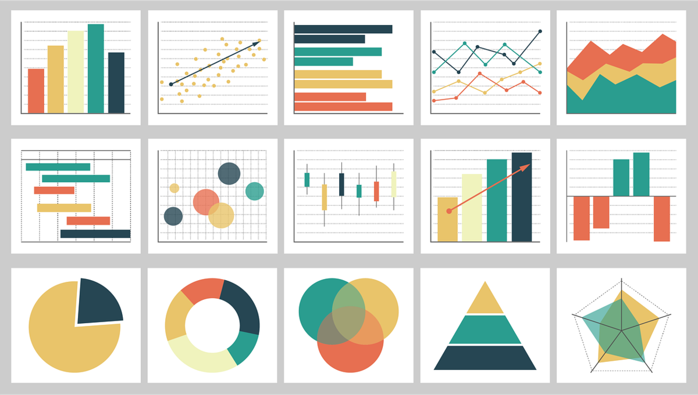
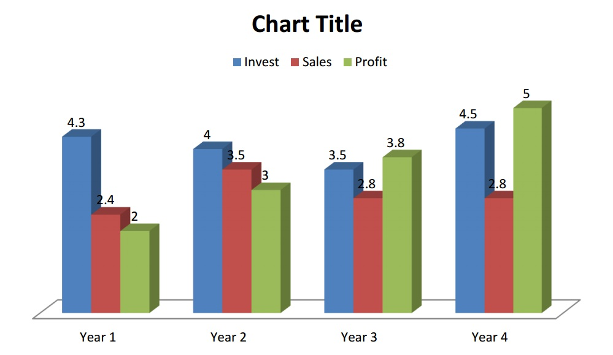
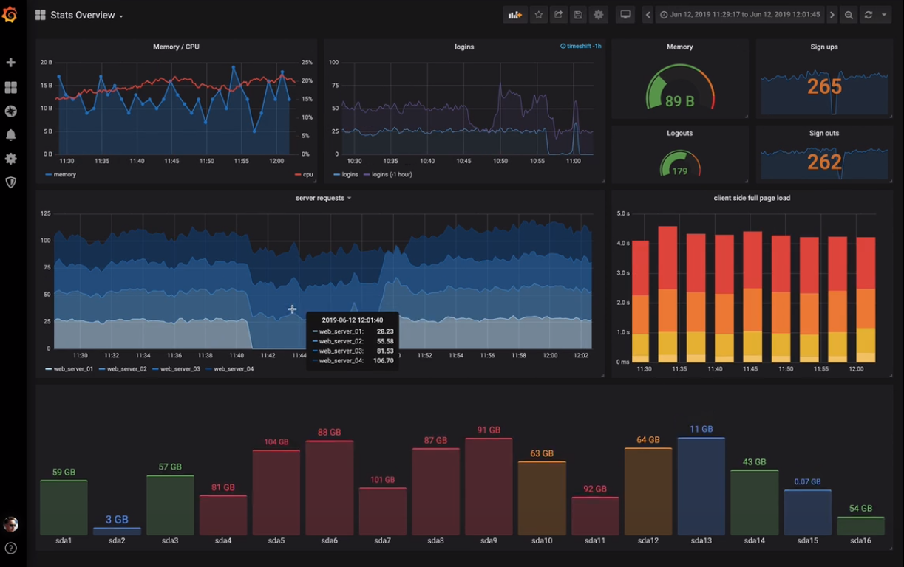
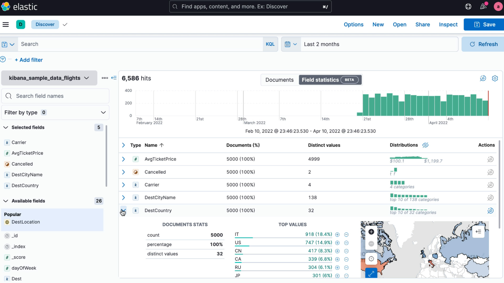

This course will cover the various IoT data visualization techniques (DataViz). The objective of data visualization is to extract relevant information from massive amounts of data. We will use various existing platforms, such as Grafana, Kibana and Tableau.

# Data Visualization Introduction

The visualization of data is a graphical representation of information. With utilizing visual elements like charts, maps and graphs, one can understand the data an judge on patterns, tendencies or exceptions.

Example picture of some visualization types [Wall21]. 

It is part art science and part art. The objective is to get the science part and the art part right. There are many visualizations that only get part of it right. Information needs to presented in a way, that it allows the observer to retrieve it effortless. On the other hand, aesthetics are also important. A good visualization should be also pleasing to look at.  

## Importance of DataViz

DataViz is an effective way to share complex information that is difficult to convey in words. Charts, graphs and photos transport information more quickly than large tables that are hard to retrieve relevant information from or written text that needs more time to read. Visualized metaphors can be understood by people of any language. Visual data increases knowledge and is easy to process, analyzed and remembered. It is also easier to consume information that way. 

## Principles

In the following the characteristics of effective graphical displays is conveyed. These are being:

- display the data
- induce the viewer to consider the substance rather than methodology, graphic design, graphic production technology, or something else
- try not to distort what the data has to say.
- display a large number in a small space
- make large data sets logical
- encourage the eye to compare various types of data
- reveal the data at various levels of detail, from a high-level overview to the fine structure
- serve a clear purpose, such as description, exploration, tabulation, or decoration
- be closely integrated with a data set's statistical and verbal descriptions

## Different types of Data Visualizations

**Pie Chart:** A pie chart is used to show the proportion of a whole. It is represented in a circular format and the proportion of each section is indicated by the size of the slices. 

**Bar Chart:** A bar chart is a graphical representation of data in which data points are displayed in the form of bars. It is used to compare values across different categories. An example can be found below.

**Histogram:** A histogram is a chart that shows the distribution of a numerical variable. It is a graphical representation of the frequency of occurrence of different ranges of values. 

**Gantt Chart:** A Gantt chart is a graphical representation of a project timeline. It is used to visualize the progress of a project and plan tasks in order to meet deadlines.

**Heat Map:** A heat map is a graphical representation of data where values are represented by colors. It is used to visualize the distribution of data and identify patterns.

**Box and Whisker Plot:** A box and whisker plot is a graphical representation of data where the data points are displayed in the form of a box. It is used to identify the spread of data and identify outliers.

**Waterfall Chart:** A waterfall chart is a graphical representation of data in which data points are displayed in the form of columns. It is used to show changes in a data set over time.

**Area Chart:** An area chart is a graphical representation of data in which data points are displayed in the form of a graph. It is used to show the relationship between two or more variables.

**Scatter Plot:** A scatter plot is a graphical representation of data in which data points are displayed in the form of a graph. It is used to show the relationship between two or more variables.

**Pictogram Chart:** A pictogram chart is a graphical representation of data in which data points are displayed in the form of pictures. It is used to make data easier to understand and visualize relationships.

**Timeline:** A timeline is a graphical representation of data in which data points are displayed in the form of a chronological list. It is used to show changes over time.

**Highlight Table:** A highlight table is a graphical representation of data in which data points are displayed in the form of a table. It is used to compare and contrast different sets of data.

**Bullet Graph:** A bullet graph is a graphical representation of data in which data points are displayed in the form of a bar graph with a single point of reference. It is used to compare data points and identify performance levels. 

**Choropleth Map:** A choropleth map is a graphical representation of data in which data points are displayed in the form of colored regions. It is used to show how data is distributed across geographic regions.

**Word Cloud:** A word cloud is a graphical representation of data in which data points are displayed in the form of words. It is used to identify the most common words in a text and show the frequency of occurrence.

**Network Diagram:** A network diagram is a graphical representation of data in which data points are displayed in the form of a network. It is used to visualize relationships between different entities.

**Correlation Matrices:** Correlation matrices are graphical representations of data in which data points are displayed in the form of matrices. It is used to identify relationships between different variables.

# Grafana

Imagine that you have a large volume of data is arriving from many sources, such as servers, databases, or even Internet of Things(IoT) devices. This information may relate to user activity, system performance, or any other metrics you'd like to monitor.

By combining data from several sources and presenting it to you in the form of interactive, customizable graphs, charts, and dashboards, [Grafana](https://grafana.com/) assists you to make sense of all this information. This allows you to quickly see trends, patterns, and anomalies rather than having to look at a spreadsheet full of numbers.

Consider Grafana as a tool for creating easily interpreted and actionable visual stories out of your data. It's widely used in industries like IT, software development, and industrial automation to monitor systems, troubleshoot issues, and optimize performance.

The company has released several [documentations](https://grafana.com/docs/) about Grafana that can help you to easily get started with the software.

# Kibana

Assume you have a vast amount of data saved in a database designed for searching and analyzing big datasets, such as Elasticsearch. Anything from sales transactions to social media activity to website logs could be included in this data.

[Kibana](https://www.elastic.co/kibana) serves as a user-friendly interface via which you may interact with this data. Charts, maps, and histograms are examples of visualizations that you may make to better understand your data and spot trends or patterns.

It functions similarly to a dashboard that guides you through your data and lets you analyze it in various ways to get new insights. Kibana makes it simple and quick to understand your data, whether you're tracking system performance, evaluating consumer behavior, or keeping an eye on website traffic.

# Tableau

Assume that you have a database or spreadsheet containing a lot of data. It could be any kind of information, such as customer demographics or sales numbers. You can connect to this data using [Tableau](https://www.tableau.com/) and generate dynamic dashboards and visuals. You can rapidly generate charts, graphs, and maps that will assist you in identifying patterns, trends, and outliers rather than merely staring at numbers or rows of data.

Your data can be transformed into vibrant, dynamic images like a magic wand, making it simpler to identify opportunities, reach choices, and tell tales.

Tableau is a popular tool for data analysis, prediction, and knowledge sharing in industry, academia, and government. Whether you're a data analyst, a marketer, or a manager, Tableau can help you unlock the power of your data and turn it into actionable insights. The company has published several [resources](https://www.tableau.com/resources) that can help you to easily get started with the software.

# Sources

[Wall21] Wallusy: charts, tables, graph, statistics https://pixabay.com/illustrations/charts-tables-graph-statistics-6246450/

[Bar16] Frank dbt: Bar graph - stock price statistics https://commons.wikimedia.org/wiki/File:Bar_graph_-_stock_price_statistics.jpg
