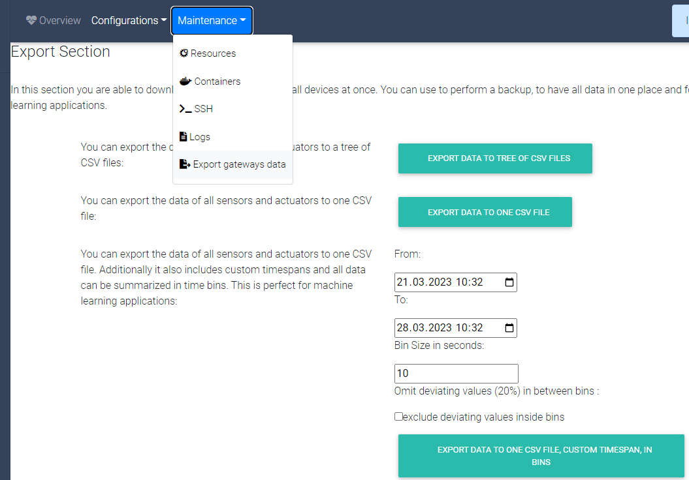

This course will show how to analyse IoT data, using Python. The first thing to do is to import, clean and prepare the data for analysis. We will then show various techniques to extract information from data. 


Definition
=========

Data Science is a branch of computer science where we study how to store, use and analyze data for deriving information from it.

Finding important insights within mountains of complicated or seemingly unimportant data is the ultimate goal of data science. Data science frequently focuses on creating the models and algorithms that will be used during the data analysis process rather than actually performing the analysis itself.

Data science aims to use that data to predict the results of decisions made in the future, whereas data analysis uses past data to provide insights that can guide future decisions. On the basis of enormous amounts of historical data, predictions are made using the emerging fields of machine learning and pattern recognition.


Introduction
==========

Data science involves transforming, visualizing, and manipulating data in order to derive insightful conclusions from the findings. These insights are frequently used to guide people, companies, and even governments.

Why Machine Learning Is Useful in Data Science?
Automated model construction for data analysis is where machine learning is useful. Machine learning is used when we give computers the fundamental data science tasks of classification, clustering, and anomaly detection. We can create self-improving learning algorithms that take data as input and provide statistical inferences. The algorithms take action whenever they notice a change in pattern, without relying on hard-coded software programming.

Despite the fact that these machine-learning models are very popular, humans are still required to determine the ultimate implications of data analysis. It's up to us humans to interpret the findings or make choices about, say, how to clean the data.

Machine-Learning Algorithms in Data Science:
-------------------------------------------

Let's now examine six popular machine-learning techniques that are applied to analyze data. We will discuss some of their real-world applications in addition to reviewing their structure.

The most important machine learning techniques in data science are:
- **Regression** is a supervised learning technique used to predict a numerical value given a set of input features. It is commonly used to predict continuous values like stock prices, house prices, or sales figures.
- **Classification** is a supervised learning technique used to predict a categorical value given a set of input features. It is commonly used to classify images or documents into different classes.
- **Clustering** is an unsupervised learning technique used to group similar data points together. It is used to identify underlying structures in the data and is commonly used in customer segmentation. 
- **Decision Trees** are a supervised learning technique used to make decisions based on a set of input features. It is used to create a model that can classify data points into different classes.
- **Neural Networks** are a type of deep learning algorithm that is used to classify data points into different classes. 
- **Anomaly Detection** is an unsupervised learning technique used to detect outliers or anomalies in data. It is used to identify unusual patterns or events in data that could signify a potential problem.

These algorithms allow us to better understand data, identify trends, and make predictions. Additionally, they are used for tasks such as supervised learning, unsupervised learning, and reinforcement learning. The basics are already discussed in length in the [Machine Learning lecture](../2.MachineLearning/_index.md). 

We examine how machine learning can scale and automate data analysis in this course. A few significant machine learning algorithms are outlined, and their practical applications are shown. While machine learning can increase the accuracy and scalability of data analysis, it's important to keep in mind that humans are still the ones who must actually evaluate the results.

Data preparation and problem definition
================

There are five major steps involved on how to approach a machine learning problem [Brow14]. They are being discussed below:

## 1. Define the Problem

In this phase one tires to understand the problem in holistic way. 
This can be split into three questions.

- What is the problem? - here the problem is described, to further understand it. List assumptions and similar problems.

- Why this problem needs to be solved? - this question includes advantages one gain from solving the problem. It is a motivation to think about benefits a solution provides.

- How would one solve the problem? - try to understand how the problem would be solved manually, to get insights in this domain.

## 2. Prepare Data 

In that phase one tries to understand the data, for that some scatter plots or histograms are useful.

- Data Selection - in data selection it is being examined what data is available, what data is missing and what is redundant or simply not needed. The relevant training examples are then chosen. 

- Data Preprocessing - data preprocessing tries to organize the selected data by formatting, cleaning and sampling.

- Data Transformation - data transformation involves engineering features by scaling, attribute aggregation and attribute decomposition. 

## 3. Spot Check Algorithms

Spot check algorithms means to compare different approaches solving the problem. There are some low code frameworks that let you compare different algorithms. They train different models on a given dataset. Afterwards they can compared according to different metrics.

After a first spot check the most promising algorithms can be chosen. Afterwards parameters can be refined to make them even more effective in solving the problem, but this is part of the next step.

## 4. Improve Results

- Algorithm Tuning - in this process the hyperparameter of the model architecture are changed (in a specific range) and the model is trained in various combinations. The best model can be chosen afterwards.

- Ensemble Methods - like stated before, there can be a combination of different machine learning models to give the best results. So, it should be considered to combine different approaches, if this is feasible.

- Extreme Feature Engineering - in extreme feature engineering the attribute decomposition and aggregation seen in data preparation is being used to make the training data more explicit. It involves transforming data to forms that better relate to the learning targets. It can augment the value of your data and improves the overall performance of your model. It involves techniques like:

1) **Imputation**: handling the missing values in data
2) **Discretization**: grouping sets of values together in some logical fashion into buckets or bins
3) **Categorical encoding**: encode categorical values into numerical features -> simpler to learn
4) **Feature splitting**: splitting features into parts can improve the value of features
5) **Handling outliers**: outliers are unusually high or low values in a dataset, there are some options: removal, replacing, capping, discretization. 
6) **Variable transformations**: could help normalizing skewed data, e.g. logarithmic transformation
7) **Scaling**: scaling inputs of data can improve your model. Here values are normalized. This can be achieved differently with methods such as: Variance scaling where data points are subtracted by their mean, the result is divided by the distribution variance; and Min-Max scaling whereby we rescale the values in a range from 0 to 1
8) **Create features**: deriving new features from existing ones, done by simple mathematical operations like: mean, median, difference, sum, mode or a product of two values

## 5. Present Results

It is always good to summarize findings, to remember them and use them in future. In order to do so, they can be grouped into: **context, problem, solution, findings, limitations and conclusions**.


Important Metrics
==============

In the following the important metrics like variance, bias, r2-score and mean square error (MSE) are explained. Machine learning algorithms use statistical or mathematical models. They have inherent errors in two categories:

- irreducible errors: inherent uncertainty, due to noise in training data due to unknown variables
- reducible errors: more controllable, should be minimized to ensure higher accuracy: variance and Bias

So the error in a machine learning model is made up of:

<p style="text-align: center;">

</p>

The reducible Error is the sum of squared Bias and Variance.

<p style="text-align: center;">

</p>

Combining the above two equations, we get:

<p style="text-align: center;">

</p>

Variance
--------

Variance is also known as **Variance Error** or **Error due to Variance**.
Variance measures how close observed values are to predicted values or, in other words, how far observed values are spread out from their mean (predicted) values.
The goal is here to have a low value, this means the prediction is accurate compared to the observed values. 
It shows the amount of the target's functions change, if different training data is introduced.

Bias
----

Bias is a constant or vector that shows the difference of the model's prediction from the target value. In other words, it is the simplifying assumption made by the model to make the target function easier to approximate. The difference of Bias and Variance is illustrated in the diagram below.


<p style="text-align: center;">
Difference between variance and bias illustrated [Fort12]. 
</p>

In summary, bias measures how closely the model's predictions match the true values, while variance measures how much the predictions vary with changes in the training data. Balancing bias and variance is crucial for building models that generalize well to unseen data

Correlation
-----------

Explains relationship between two variables, it shows how they are related to each other. Possible values can be from *-1* to *+1*. 

- A correlation of *-1* represents a perfect negative correlation.
- A correlation of *0* tells that the values are not linked at all.
- A correlation of *1* means that there is a perfect positive correlation.

In the following diagrams the correlation is visualized for different datasets. 


<p style="text-align: center;">
The blue line shows the predicted linear regression function, the black points represents the actual datapoints. The correlation is stated above the diagram [Curl20].
</p>

Only positive correlation is shown, for negative correlation the slope of the prediction would be negative.

Mean Square Error
-----------------

The metric Mean Square Error (MSE) describes the average of the square errors, the larger the number of MSE is, the larger the error. The metric is defined as the following:

<p style="text-align: center;">

</p>

The diagram below shows a graph that was created using linear regression. 


<p style="text-align: center;">
The blue line shows the predicted linear regression function, the purple points are the actual datapoints, the red lines represents the error (residuals) which is squared [Bini18].
</p>

Now the distance from our calculated line is squared and added up and multiplied by the reciprocal amount of points, this gives an average deviation to our prediction.

A more in-depth mathematical explanation of MSE is given by Moshe Binieli in his article ["Machine learning: an introduction to mean squared error and regression lines"](https://www.freecodecamp.org/news/machine-learning-mean-squared-error-regression-line-c7dde9a26b93/)

R2-Score
--------

The r2 score closely relates to Mean Square Error (explained in the last bulletin). It is a percentage, that varies from *0* % - *100* %. The r2 score shows a ratio of variances:

<p style="text-align: center;">

</p>

A high value means that the variables are perfectly correlated, there is no variance. A low value would indicate a low level of correlation, that means in most cases, that the model is not suitable for the given task.

A more in-depth mathematical explanation of the r2 score is given by Paul Johnson in his lecture ["Extending R-squared beyond ordinary least-squares linear regression"](https://www.slideshare.net/pcdjohnson/extending-rsquared-beyond-ordinary-leastsquares-linear-regression-95949488)


Exercise - data collection from WaziCloud
========================================

Retrieve values in JSON via curl
--------------------------------

Get desired values via the **curl** command. In the following data is being retrieved from the WaziGate 

You can get an overview about the possible queries from WaziCloud by visiting [Swagger](https://api.waziup.io/docs/#/Sensors/get_devices__device_id__sensors__sensor_id__values "Swagger").
All you need is your **device_id** and the **sensor_id**, you can find them by visiting the [WaziCloud](https://dashboard.waziup.io/ "WaziCloud").

```python
response = !curl -s -X GET "https://api.waziup.io/api/v2/devices/0242ac1200023852/sensors/temperatureSensor_0/values" -H "accept: application/json;charset=utf-8"
print ("This is the response: \n\n",response)
```
We can create a **list** from the **JSON** to organize our values:

```python
import json
# Opening JSON file

print(type(response))
rep_str = str(response).replace("'",'')
print(type(rep_str))

# create JSON list
response_list = json.loads(rep_str)

# Print first value
print(response_list[0][0])
```

```python
# Get temparature of first "value"
print("First value: ", response_list[0][0]["value"])
print("Values in total: ", len(response_list[0]))
```

Or an **NumPy** ndarray:

```python
import numpy as np

temp_vals = np.array([])

for n in range(len(response_list[0])):
    temp_vals = np.append(temp_vals, response_list[0][n]["value"], axis=None)

print("Temperature values: ",temp_vals)
```

Plot the values, with **Matplotlib**:

```python
import matplotlib.pyplot as plt

plt.plot(temp_vals)
plt.show()
```
Now you can start using the retrieved data. A next step would be to clean, interpolate and prepare the data for analysis.

Download values in *.csv
------------------------

You can also download the gateway's data in *.csv file format. You can use to perform a backup, to have all data in one place and for machine learning applications. There are three possibilities to do so:


<p style="text-align: center;">Export section of the WaziGate.
</p>

- Export the data of all sensors and actuators to a tree of CSV files
- Export the data of all sensors and actuators to one CSV file
- Export the data of all sensors and actuators to one CSV file. Additionally it also includes custom timespans and all data can be summarized in time bins. This is perfect for machine learning applications.

Linear Regression
=================

In the [Machine Learning lecture](../2.MachineLearning/_index.md) you can find a comprehensive guide, that explains the fundamentals of Linear Regression. 


Python Libraries used in Data Analysis
=====================================

In the following there are some important python packages named and described, that are useful in the context of data analysis.

Scipy
-----------

Scipy has a number of sub-packages and a selection of scientific features, such as gradient optimization, integration, differentiation, and image processing. Its speed is the primary factor in why it is chosen over other tools. In Python, SciPy is used for all numerical computations.
It is being used to find scientific mathematical formulae like:
- Linear Algebra & Sparse Linear Algebra
- Integration
- Matrix Rank
- Inverse
- polynomial equations
- LU Decomposition

Matplotlib
----------

Matplotlib is the plotting library to produce quality figures such as histogram, scatter plot etc… It is widely used for Data visualization.

### Matplotlib exercise

The simple example code below will load some test data and use Matplotlib to visualize the data:

```python
import matplotlib.pyplot as plt 
 
# initializing the data
x = [10, 20, 30, 40]
y = [20, 25, 35, 55]
 
# plotting the data
plt.plot(x, y)
 
# Adding label on the y-axis
plt.ylabel('Y-Axis')
 
# Adding label on the x-axis
plt.xlabel('X-Axis')
 
plt.show()
```

This code results in the following plotted diagram. We cans see that there is a relationship between the X and Y values, that is, as they are nearly proportional to each other.


Pandas
------

Pandas is a high-performance, open-source library that's simple to use. It offers tools for analysis and data structures in Python.
It is helpful for tasks such as statistical analysis, data cleansing, data preparation and mining. But it is used less in data modeling and analysis.

One basic use case is to read data from a *.csv and store it in pandas dataframe. It is the spreadsheet Python equivalent. Given that each column can hold a variety of different data types and has sophisticated selection and pivotal mechanisms, it differs from a 2D numpy array. It also has named columns.

```python
import pandas
# load from csv file -> the separator is “;”
data = pandas.read_csv('examples/brain_size.csv', sep=';', na_values=".")
# show the first entries
data.head()
# show last entries
data.tail()
# show dimensions of data (shape)
data.shape
# summary of the data set
data.info()
```

General applications of pandas in Data Science:

- Data cleansing
- Data fill
- Data normalization
- Merges and joins
- Data visualization
- Statistical analysis
- Data inspection
- Loading and saving data


In data science, Pandas is frequently used. Although it is frequently used by data scientists to modify data before creating machine learning models, it can be useful for even more straightforward tasks that you would perform in Excel.

Many of the tasks I used to complete in Excel at work are now done with Python and Pandas. Even though the learning curve might be a little steeper, Python is a great tool to have in your toolbox and could lead to an increase in productivity!

NumPy
-----

NumPy offers enhanced functionality for Python and a user-friendly environment. It permits quick operations on homogeneous data kept in NumPy arrays, which are arrays with specialized design. Additionally, it makes manipulating numerical data easier.

It offers support for large, multi-dimensional arrays and matrices, along with a large collection of high-level mathematical functions to operate on these arrays.
NumPy aims to provide an array object that is up to 50x faster than traditional Python lists.

Includes functions for working in domain of: 
- linear algebra
- fourier transform
- matrices

Practical example with the python package **pycaret**
--------------

Workflows for machine learning can be automated via the low-code and open-source, Python-based PyCaret module. It is a complete machine learning and model management application that increases productivity and exponentially shortens the trial cycle.

PyCaret is an alternative low-code library to the other open-source machine learning libraries that can be used to replace hundreds of lines of code with just a few. Experiments become incredibly quick and effective as a result. In essence, PyCaret is a Python wrapper for a variety of machine learning frameworks and modules, including scikit-learn, XGBoost, LightGBM, CatBoost, spaCy, Optuna, Hyperopt, Ray, and others.

Pycaret has a comprehensive [tutorial section](https://pycaret.gitbook.io/docs/get-started/installation) everything is explained in detail there.

It can be used to tackle problems for different applications, most important ones are:
- Classification
- Regression
- Clustering
- Anomaly Detection
- Natural Language Processing
- Association Rules
- Time Series Forecasting

There are [notebooks](https://pycaret.gitbook.io/docs/get-started/tutorials) provided for different applications, mentioned beforehand.

**Disadvantages**

Documentation of pycaret is not that comprehensive. Due to the fact, that is a low code framework, you give those simple functions many arguments, which makes it also hard to read sometimes.

In the following we will have some practical examples in two areas: **Regression and Time Series Forecasting**

### **Regression** 

Pycaret let's you compare 25 different regression algorithms, some of them are just named in the following:
- Gradient Boosting Regressor
- Random Forest Regressor	
- Light Gradient Boosting Machine	
- Extra Trees Regressor	
- AdaBoost Regressor	
- Lasso Least Angle Regression	
- Ridge Regression
- Least Angle Regression
- Bayesian Ridge	
- Lasso Regression
- Linear Regression
- Decision Tree Regressor	
- Huber Regressor	
- Orthogonal Matching Pursuit	
- Passive Aggressive Regressor	
- Elastic Net
- K Neighbors Regressor
- Dummy Regressor

All those algorithms are compared for you after a short setup automatically.

The following practical examples are taken from the [provided examples from github.](https://github.com/pycaret/pycaret/tree/master/examples) They also got an example [using regression here.](https://github.com/pycaret/pycaret/blob/master/examples/PyCaret%202%20Regression.ipynb)

First we load some example data, in this case it is insurance data.

```python
# load the example dataset
data = get_data('insurance')
```

The next step is it to setup the objective, here we hand over the loaded data and set the target, we want to estimate. Here the charges are the target variable.

```python
# setup
reg1 = setup(data, target = 'charges', session_id=123, log_experiment=True, experiment_name='insurance1')
```
Now we want to compare different regression algorithms or techniques, to find the most promising ones. 
So we use the compare_models function and store the result in the best_models variable. 

```python
# compare baseline models
best_model = compare_models(fold=5)
```
Here we took a "Light Gradient Boosting Machine"

```python
# create a promising model from the list
lightgbm = create_model('lightgbm')
```

Here we train the model with different learning rates to avoid effects like overfitting.

```python
import numpy as np
# find a good learning rate
lgbms = [create_model('lightgbm', learning_rate=i) for i in np.arange(0.1,1,0.1)]
```

Next step is to tune the Hyperparameter of the model, to increase it's performance. We just use the tune_model function and optimize towards a small mean absolute error (MAE).

```python
# tune hyperparameters of the model
tuned_lightgbm = tune_model(lightgbm, n_iter=50, optimize = 'MAE')
# print the best hyperparameters
tuned_lightgbm
```

The tuner suggests the best fitting hyperparameters for the specific task.

```python
LGBMRegressor(boosting_type='gbdt', class_weight=None, colsample_bytree=1.0,
              importance_type='split', learning_rate=0.3, max_depth=70,
              min_child_samples=20, min_child_weight=0.001, min_split_gain=0.2,
              n_estimators=10, n_jobs=-1, num_leaves=10, objective=None,
              random_state=123, reg_alpha=0.4, reg_lambda=0.1, silent=True,
              subsample=1.0, subsample_for_bin=200000, subsample_freq=0)
```

The next steps would include to create an ensemble model, blend models and stack models.

**Ensemble models** are a machine learning technique for combining various other models in the prediction process. Base estimators are the term used to describe these models. The technical difficulties of developing a single estimator can be overcome with ensemble models.

For the sake of simplicity we skip those steps. 

Another important step is to visualize the performance of the model according to different metrics.

```python
# Show residuals for Decsision Tree Regressor Model
plot_model(dt)
# Show prediction error for Decsision Tree Regressor
plot_model(dt, plot = 'error')
# Plot the feature that have the highest importance 
plot_model(dt, plot = 'feature')
evaluate_model(dt)
```
**Residuals:** The discrepancies between observed and predicted data values are known as residuals in statistics or machine learning models. They serve as a diagnostic tool for determining a model's level of quality. They are also called errors.

The interpretation of the model is done in the following: 

```python
# show variables with high impact on model output
interpret_model(lightgbm)
interpret_model(lightgbm, plot = 'correlation')
interpret_model(lightgbm, plot = 'reason', observation = 12)
```
The next step is to use the model on new data and predict the target variable: 

```python
pred_holdouts = predict_model(lightgbm)
pred_holdouts.head()

new_data = data.copy()
new_data.drop(['charges'], axis=1, inplace=True)
predict_new = predict_model(best, data=new_data)
predict_new.head()
```
The last step is to save and load the model for future usage:

```python
# Save the model
save_model(best, model_name='best-model')

# Load the model
loaded_bestmodel = load_model('best-model')
print(loaded_bestmodel)
```
Those are the basic steps involved on how to create models, chose the most suitable ones, improve them, analyze them and save/load them. Normally it would involve much more work and analysis, but the low code framework makes those easy to implement and efficient, which leaves more time interpret results and fast prototyping.


### **Time Series Forecasting**

On the basis of confirmed historical data, time series models are used to forecast events. Moving average, smooth-based types and Autoregressive integrated moving average (ARIMA) are typical examples. It's important to choose the model that works best based on the individual time series because not all models will produce the same results for the same dataset.

It's crucial to know your goal when forecasting. Ask questions about: to help you focus in on the particulars of your predictive modeling issue.

The amount of data that is available; more data is frequently more beneficial, providing more opportunity for exploratory data analysis, model testing and tuning, and model fidelity.
Shorter time horizons are frequently easier to predict with greater confidence than longer ones.
Frequency of forecast updates: Forecasts may need to be revised frequently over time or they may only need to be created once and then remain static (updating forecasts as new information becomes available frequently yields more accurate predictions).
Forecast temporal frequency — Often, forecasts can be made at lower or higher frequencies, enabling the use of data up-sampling and down-sampling (which can be useful for modeling).

In the following there is an example, taken from the [GitHub repository of PyCaret](https://github.com/pycaret/pycaret/blob/3.0.0.rc7/examples/TimeSeries_Forecasting.ipynb).

Since January 1, 2012, every wholesale liquor purchase made by retailers in the state of Iowa for sale to consumers is included in this dataset.

The wholesale distribution of alcoholic beverages intended for retail sale is under the control of the State of Iowa, so this dataset provides a comprehensive picture of retail alcoholic beverage sales in the entire state.

First step is to **download the dataset**:

```python
import pandas as pd

url = 'https://drive.google.com/file/d/1g3UG_SWLEqn4rMuYCpTHqPlF0vnIDRDB/view?usp=sharing'
path = 'https://drive.google.com/uc?export=download&id='+url.split('/')[-2]
df2 = pd.read_csv(path)
```

Print some lines and get an **overview about the data** and select useful part of data for the task:

```python
# print first entries
df2.head(5)
# selecting the needed columns
df2_ds = df2[['date','sale_dollars']] 
# sort them by date
df2_ds=df2_ds.sort_index(axis=0)
# show last entries
df2_ds.tail(5)
```

**Sort them by date** and set date as index:

```python

aggregated=df2_ds.groupby('date',as_index=True).sum()
# show first and last date
print(min(aggregated.index))
print(max(aggregated.index))
aggregated.index=pd.to_datetime(aggregated.index)
```

Next step is to **create the features**, we will create function for that purpose:

```python
def create_features(df):
    """
    Creates time series features from datetime index
    """
    df['date'] = df.index
    df['dayofweek'] = df['date'].dt.dayofweek
    df['quarter'] = df['date'].dt.quarter
    df['month'] = df['date'].dt.month
    df['year'] = df['date'].dt.year
    df['dayofyear'] = df['date'].dt.dayofyear
    df['dayofmonth'] = df['date'].dt.day
    df['weekofyear'] = df['date'].dt.weekofyear
    df['flag'] = pd.Series(np.where(df['date'] >= np.datetime64('2020-03-03'), 1, 0), index=df.index) #flag for COVID-19
    #df['rolling_mean_7'] = df['sale_dollars'].shift(7).rolling(window=7).mean()
    #df['lag_7'] = df['sale_dollars'].shift(7)
    #df['lag_15']=df['sale_dollars'].shift(15)
    #df['lag_last_year']=df['sale_dollars'].shift(52).rolling(window=15).mean()
  
    
    X = df[['dayofweek','quarter','month','year',
           'dayofyear','dayofmonth','weekofyear','flag','sale_dollars']]
    X.index=df.index
    return X
```

To create a training and test set, we have to **split the data**: (at the time of split_date):

```python
def split_data(data, split_date):
    return data[data.index <= split_date].copy(), \
           data[data.index >  split_date].copy()
```

To get a **visual overview** about the data, training set and test set to be specific, we print the data with the help of matplotlib:

```python
aggregated=create_features(aggregated)
train, test = split_data(aggregated, '2020-06-15') # splitting the data for training before 15th June

plt.figure(figsize=(20,10))
plt.xlabel('date')
plt.ylabel('sales')
plt.plot(train.index,train['sale_dollars'],label='train')
plt.plot(test.index,test['sale_dollars'],label='test')
plt.legend()
plt.show()
```

There is a lot of variation in the date and the dates are not continuous, so there are gaps. In this case, we have the option of imputeing the missing date or leaving it alone. Because we are using this data for predictive modeling rather than time series forecasting, one of the main reasons we won't create missing dates is because the data isn't dependent on the recent past but rather on the features' relationships with sales over time.

The next step is to **feed the data into PyCaret**, to realize this we havge to call PyCaret setup function:

```python
reg = setup(data = train, 
             target = 'sale_dollars',
             numeric_imputation = 'mean',
             categorical_features = ['dayofweek','quarter','month','year','dayofyear','dayofmonth','weekofyear',
                                     'flag']  , 
            transformation = True, transform_target = True, 
                  combine_rare_levels = True, rare_level_threshold = 0.1,
                  remove_multicollinearity = True, multicollinearity_threshold = 0.95, 
             silent = True)
```

Now comes the part where PyCaret shines, with the following line we can compare over 20 different models. So we do not have to **train 20 different models** individually. Here we select the top three models.

```python
# returns best models - takes a little time to run
top3 = compare_models(n_select = 3)
```

Now we chose the **most promising model**, for this data it is a light gradient boosting machine:

```python
#we create a model using light gbm
lightgbm = create_model('lightgbm')
```

Next step is to **tune the hyperparameters** of the model, with just one line of code:

```python
tuned_lightgbm = tune_model(lightgbm) 
```

To **visualize the performance** of the model, we plot residuals, prediction and feature importance:

```python
# Residuals
plot_model(lightgbm)
# Prediction Error
plot_model(lightgbm, plot = 'error')
# Feature importance 
plot_model(tuned_lightgbm, plot='feature')
```

To show some metrics that describe the performance of the model we call the **predict_model function**:

```python 
# Show some metrics
predict_model(tuned_lightgbm);
# Finalize the model
final_lightgbm = finalize_model(tuned_lightgbm)
# Final Light Gradient Boosting Machine parameters for deployment
print(final_lightgbm)
# Show some metrics about the finalized model
predict_model(final_lightgbm);  
```

Next step is to **validate our model**, to do this we use the test data and compare it with our prediction:

```python
unseen_predictions = predict_model(final_lightgbm, data=test)
unseen_predictions.head()
unseen_predictions.loc[unseen_predictions['Label'] < 0, 'Label'] = 0 #removing any negative values
```

To **visualize the data** we introduce a plot_series function:

```python
def plot_series(time, series,i, format="-", start=0, end=None):
    #plt.figure(figsize=(20,10))
    plt.plot(time[start:end], series[start:end], format,label=i)
    plt.xlabel("Date")
    plt.ylabel("Sales (Dollar)")
    plt.legend()

plt.figure(figsize=(20,10))
plot_series(test.index, test['sale_dollars'],"True")
#plot_series(train['ds'],train['y'])
plot_series(test.index, unseen_predictions['Label'],"Baseline")
```

To **compare the prediction with our baseline** test set we introduce a different metric:

```python
def calc_smape(y_hat, y):
        return 100/len(y) * np.sum(2 * np.abs(y_hat - y) / (np.abs(y) + np.abs(y_hat)))

calc_smape(test['sale_dollars'].values,unseen_predictions['Label'].values)
```
We will consider 78.3 as our baseline SMAPE score and will compare it from now on with other models:

An accuracy metric built on percentage (or relative) errors is known as the symmetric mean absolute percentage error (SMAPE). The absolute error divided by the magnitude of the precise value yields the relative error. SMAPE has a lower bound and an upper bound, unlike the mean absolute percentage error.

Next step is to **blend the models**:

Now, using four algorithms—Huber, Random Forest, XGBoost, and LightGBM—we will build a blend model.

```python
# create models for blending
huber = create_model('huber', verbose = False)
rf = create_model('rf', verbose = False)
lightgbm = create_model('lightgbm', verbose = False)
xgb = create_model('xgboost',verbose=False)
     
# tune the created models for blending
tuned_rf = tune_model(rf)
tuned_huber = tune_model(huber)
tuned_lightgbm = tune_model(lightgbm)
tuned_xgb = tune_model(xgb)
```

Again we **print the residuals** for each model and compare them:

```python
plot_model(tuned_huber)
plot_model(huber)
plot_model(lightgbm)
plot_model(xgb)
```

Now we will **blend the different models**, we use tuned_rf, tuned_lightgbm, tuned_xgb, tuned_huber:

```python
blend_specific = blend_models(estimator_list = [tuned_rf,tuned_lightgbm,tuned_xgb,tuned_huber])
```

Finalize the model and print metrics:

```python
predict_model(blend_specific);
# Finalize model:
final_model = finalize_model(blend_specific)
```

Next step is to **validate our model**, to do this we use the test data and compare it with our prediction:

```python
unseen_predictions_2 = predict_model(final_model, data=test, round=0)
unseen_predictions_2.loc[unseen_predictions_2['Label'] < 0, 'Label'] = 0
unseen_predictions_2.head()
```

We also print the **validation of test and prediction (blending):**

```python
plt.figure(figsize=(20,5))
plot_series(test.index, test['sale_dollars'],"True")
plot_series(test.index, unseen_predictions_2['Label'],'Blend')
```

Next step is to calculate **SMAPE** with the updated model and compare it to our baseline: 

```python
calc_smape(test['sale_dollars'].values,unseen_predictions_2['Label'].values)
```

We improved our model with blending, now the SMAPE went from 78.3 (without blending) to 59.5 (with blending). The blend model is a major improvment over the baseline model.

Last step is **Stacking** for sake of simplicity we will skip the step at the moment.

**Further steps:**

The model isn't finished yet, but we can always go back and combine the features of other models.

## Sources

[Brow14] Jason Brownlee, "Applied Machine Learning Process" https://machinelearningmastery.com/process-for-working-through-machine-learning-problems/ Version 2019

