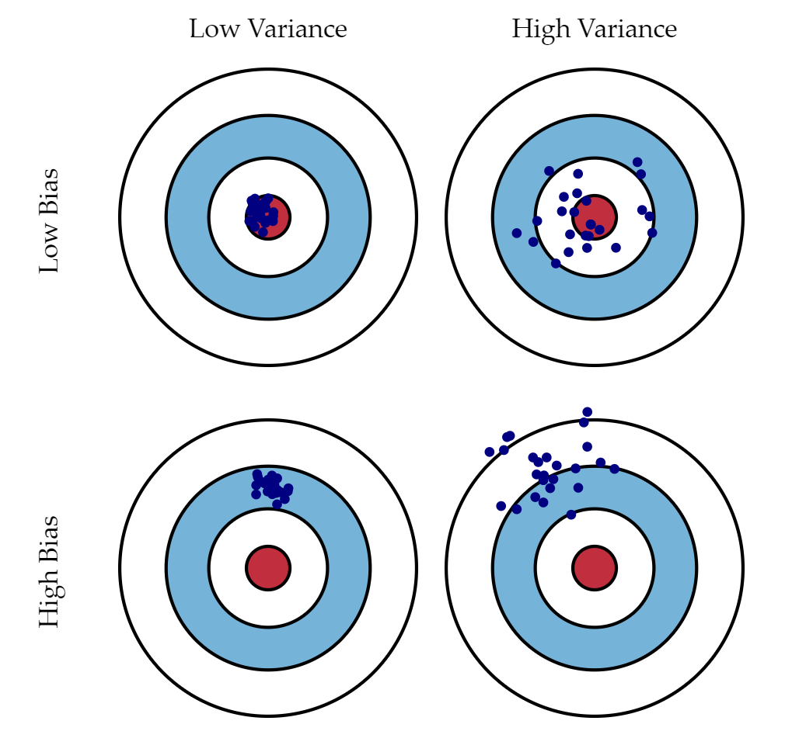
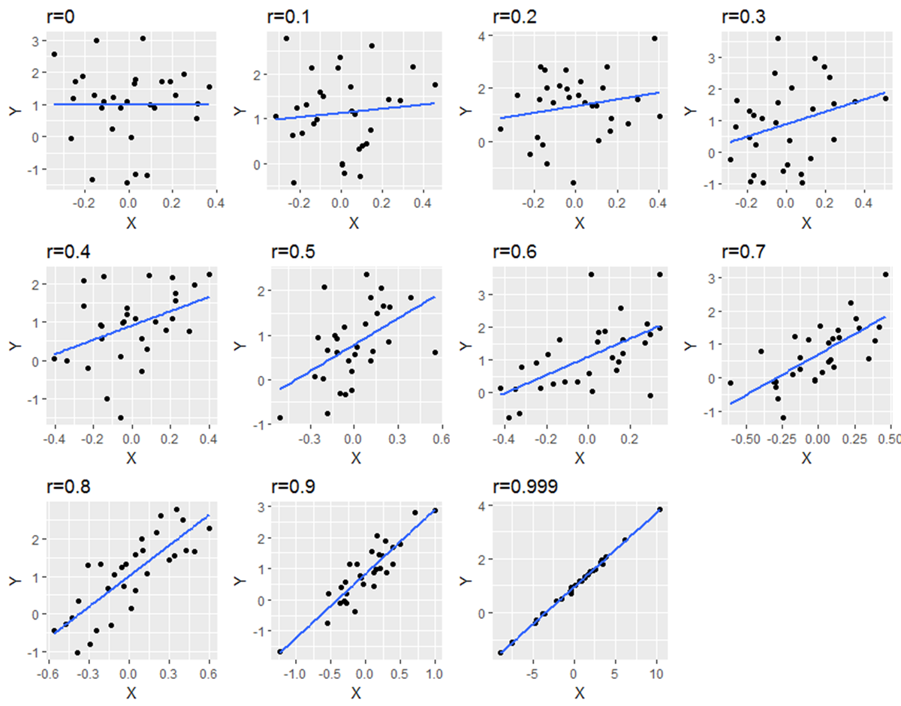

This course will show how to analyse IoT data, using Python. The first thing to do is to import, clean and prepare the data for analysis. We will then show various techniques to extract information from the data. 


**Data Science**
=============

Definition
=========

Data Science a branch of computer science where we study how to store, use and analyze data for deriving information from it.

Finding important insights within mountains of complicated or seemingly unimportant data is the ultimate goal of data science. Data science frequently focuses on creating the models and algorithms that will be used during the data analysis process rather than actually performing the analysis itself.

Data science aims to use that data to predict the results of decisions made in the future, whereas data analysis uses past data to provide insights that can guide future decisions. On the basis of enormous amounts of historical data, predictions are made using the emerging fields of machine learning and pattern recognition.


Introduction
==========

A car next to you stops automatically when a pedestrian steps in front of it, an unsolicited email skips your inbox and goes straight to spam, and an advertisement for the item you were considering yesterday appears on your social media feed over the course of an hour. Artificial intelligence has been the driving force behind all of these events, which is what unites them. And the driving force behind them all are machine-learning algorithms that forecast outcomes using data.

Let's now examine each discipline's foundations before examining how machine learning supports data science.

How does machine learning work?
The science of machine learning entails creating algorithms that can change without human intervention by learning from data on their own. These algorithms develop their own logic as we provide data to them, resulting in solutions that are applicable to a variety of aspects of our world, including:
- fraud detection
- web searches
- tumor classification
- price prediction

In deep learning, a branch of machine learning, computer programs learn complex ideas by deriving them from simpler ones. The "deep" neural networks used by these algorithms are multilayered (hence the name). Deep learning has a significant positive impact on performance in machine learning applications like natural language processing.

Data science: What is it?
Data science involves transforming, visualizing, and manipulating data in order to derive insightful conclusions from the findings. These insights are frequently used to guide people, companies, and even governments.

Simple linear regression can be used by data scientist to forecast customer behavior, stock prices, or insurance claims. They could use classification and regression trees (CART) to produce homogeneous clusters, or they could use graphs to represent the portfolio of a financial technology company to gain some insight into how their decisions might be affected.

Human analysts were indispensable when it came to identifying patterns in data up until the last decades of the 20th century. They remain crucial today for feeding the right data to learning algorithms and deducing meaning from algorithmic output, but machines can and do carry out a large portion of the analytical work themselves.

Why Machine Learning Is Useful in Data Science?
Automated model construction for data analysis is where machine learning is useful. Machine learning is used when we give computers the fundamental data science tasks of classification, clustering, and anomaly detection.

We can create self-improving learning algorithms that take data as input and provide statistical inferences. The algorithms take action whenever they notice a change in pattern, without relying on hard-coded programming.

Let's talk about some terminology used to classify various machine-learning algorithms before we look at specific data analysis issues. First, we can consider that the majority of algorithms are either regression-based (where machines predict values) or classification-based (where machines classify data into categories).

After that, let's make a distinction between supervised and unsupervised algorithms. After adequate data training, a supervised algorithm outputs target values. In contrast, an unsupervised machine-learning algorithm does not require an output variable as guidance during the learning process.

For instance, a supervised algorithm might calculate a home's value after examining the prices (the output variable) of comparable homes, whereas an unsupervised algorithm might search for hidden patterns in housing that is currently on the market.

Despite the fact that these machine-learning models are very popular, humans are still required to determine the ultimate implications of data analysis. It's up to us humans to interpret the findings or make choices about, say, how to clean the data.

Machine-Learning Algorithms in Data Science.
Let's now examine six popular machine-learning techniques that are applied to analyze data. We will discuss some of their real-world applications in addition to reviewing their structure.

The most important machine learning techniques in data science are:
- **Regression** is a supervised learning technique used to predict a numerical value given a set of input features. It is commonly used to predict continuous values like stock prices, house prices, or sales figures.
- **Classification** is a supervised learning technique used to predict a categorical value given a set of input features. It is commonly used to classify images or documents into different classes.
- **Clustering** is an unsupervised learning technique used to group similar data points together. It is used to identify underlying structures in the data and is commonly used in customer segmentation. 
- **Decision Tree** are a supervised learning technique used to make decisions based on a set of input features. It is used to create a model that can classify data points into different classes.
- **Neural Networks** are a type of deep learning algorithm that is used to classify data points into different classes. 
- **Anomaly Detection** is an unsupervised learning technique used to detect outliers or anomalies in data. It is used to identify unusual patterns or events in data that could signify a potential problem.

These algorithms allow us to better understand data, identify trends, and make predictions. Additionally, they are used for tasks such as supervised learning, unsupervised learning, and reinforcement learning. The basics are already discussed in length in the [Machine Leaning lecture](../2.MachineLearning/_index.md). 

We examine how machine learning can scale and automate data analysis in this course. A few significant machine learning algorithms are outlined, and their practical applications are shown. While machine learning can increase the accuracy and scalability of data analysis, it's important to keep in mind that humans are still the ones who must actually evaluate the results.

Data preparation and problem definition
================

In this step it is being discussed on how to prepare the data you want analyze.

## How to approach a machine learning problem

There are five major steps involved on how to approach a machine learning problem [Brow14]. They are being discussed below.

## 1. Define the Problem

In this phase one tires to understand the problem in holistic way. 
This can be split into three questions.

### 1. What is the problem?

Here the problem is described, to further understand it. List assumptions and similar problems.

### 2. Why this problem needs to be solved?

This question includes advantages one gain from solving the problem. It is a motivation to think about benefits a solution provides.

### 3. How would one solve the problem? 

Try to understand how the problem would be solved manually, to get insights in this domain.

## 2. Prepare Data 

In that phase one tries to understand the data, for that some scatter plots or histograms are useful.

### 1. Data Selection

In data selection it is being examined what data is available, what data is missing and what is redundant or simply not needed. The relevant training examples are then chosen. 

### 2. Data Preprocessing

Data preprocessing tries to organize the selected data by formatting, cleaning and sampling.

### 3. Data Transformation

Data transformation involves engineering features by scaling, attribute aggregation and attribute decomposition. 

## 3. Spot Check Algorithms

Spot check algorithms means to compare different approaches solving the problem. There are some low code frameworks that let you compare different algorithms. They train different models on a given dataset. Afterwards they can compared according to different metrics.

After a first spot check the most promising algorithms can be chosen. Afterwards parameters can be refined to make them even more effective in solving the problem, but this is part of the next step.

## 4. Improve Results

### 1. Algorithm Tuning: 

In this process the hyperparameter of the model architecture are changed (in a specific range) and the model is trained in various combinations. The best model can be chosen afterwards.

### 2. Ensemble Methods:

Like stated before, there can be a combination of different machine learning models to give the best results. So, it should be considered to combine different approaches, if this is feasible.

### 3. Extreme Feature Engineering

In extreme feature engineering the attribute decomposition and aggregation seen in data preparation is being used to make the training data more explicit. It involves transforming data to forms that better relate to the learning targets. It can augment the value of your data and improves the overall performance of your model. It involves techniques like:

- **Imputation**: handling the missing values in data
- **Discretization**: grouping sets of values together in some logical fashion into buckets or bins
- **Categorical encoding**: encode categorical values into numerical features -> simpler to learn
- **Feature splitting**: splitting features into parts can improve the value of features
- **Handling outliers**: outliers are unusually high or low values in a dataset, there are some options: 
  - removal
  - replacing
  - capping 
  - discretization 
- **Variable transformations**: could help normalizing skewed data, e.g. logarithmic transformation
- **Scaling**: scaling inputs of data can improve your model, here values are normalized, this can be achieved differently
  - Variance scaling. data points are subtracted by their mean, the result is divided by the distribution variance, this gives a distribution with 0 mean and a variance of 1
  - Min-Max scaling: rescaling the values in a range from 0 to 1
- **Create features**: deriving new features from existing ones, done by simple mathematical operations like: mean, median, difference, sum, mode or a product of two values

## 5. Present Results

It is always good to summarize findings, to remember them and use them in future. In order to do so, they can be grouped into: **context, problem, solution, findings, limitations and conclusions**.


Important Metrics
==============

In the following the important metrics like variance, bias, r2-score and mean square error (MSE) are explained. Machine learning algorithms use statistical or mathematical models. They have inherent errors in two categories:

- irreducible errors: inherent uncertainty, due to noise in training data due to unknown variables
- reducible errors: more controllable, should be minimized to ensure higher accuracy: variance and Bias

So the error in a machine learning model is made up of:

<p style="text-align: center;">

</p>

The reducible Error is the sum of squared Bias and Variance.

<p style="text-align: center;">

</p>

Combining the above two equations, we get:

<p style="text-align: center;">

</p>

Variance
--------

<!-- TODO: make difference between BIAS clear -->


Variance is also known as **Variance Error** or **Error due to Variance**.
Variance measures how close observed values are to predicted values or, in other words, how far observed values are spread out from their mean (predicted) values.
The goal is here to have a low value, this means the prediction is accurate compared to the observed values. 
It shows the amount of the target's functions change, if different training data is introduced.

Bias
----

Bias is a constant or vector that shows the difference of the model's prediction from the target value. In other words, it is the simplifying assumption made by the model to make the target function easier to approximate. The difference of Bias and Variance is illustrated in the diagram below.


<p style="text-align: center;">
Difference between variance and bias illustrated [Fort12]. 
</p>

Correlation
-----------

Explains relationship between two variables, it shows how they are related to each other. Possible values can be from *-1* to *+1*. 

- A correlation of *-1* represents a perfect negative correlation.
- A correlation of *0* tells that the values are not linked at all.
- A correlation of *1* means that there is a perfect positive correlation.

In the following diagrams the correlation is visualized for different datasets. 


<p style="text-align: center;">
The blue line shows the predicted linear regression function, the black points represents the actual datapoints. The correlation is stated above the diagram [Curl20].
</p>

Only positive correlation is shown, for negative correlation the slope of the prediction would be negative.

Mean Square Error
-----------------

The metric Mean Square Error (MSE) describes the average of the square errors, the larger the number of MSE is, the larger the error. The metric is defined as the following:

<p style="text-align: center;">

</p>

The diagram below shows a graph that was created using linear regression. 


<p style="text-align: center;">
The blue line shows the predicted linear regression function, the purple points are the actual datapoints, the red lines represents the error (residuals) which is squared [Bini18].
</p>

Now the distance from our calculated line is squared and added up and multiplied by the reciprocal amount of points, this gives an average deviation to our prediction.

A more in-depth mathematical explanation of MSE is given by Moshe Binieli in his article ["Machine learning: an introduction to mean squared error and regression lines"](https://www.freecodecamp.org/news/machine-learning-mean-squared-error-regression-line-c7dde9a26b93/)

R2-Score
--------

The r2 score closely relates to Mean Square Error (explained in the last bulletin). It is a percentage, that varies from *0* % - *100* %. The r2 score shows a ratio of variances:

<p style="text-align: center;">

</p>

A high value means that the variables are perfectly correlated, there is no variance. A low value would indicate a low level of correlation, that means in most cases, that the model is not suitable for the given task.

A more in-depth mathematical explanation of the r2 score is given by Paul Johnson in his lecture ["Extending R-squared beyond ordinary least-squares linear regression"](https://www.slideshare.net/pcdjohnson/extending-rsquared-beyond-ordinary-leastsquares-linear-regression-95949488)


How to retrieve values from the WaziCloud platform
================
Get desired values via the **curl** command. In the following data is being retrieved from the WaziGate 

You can get an overview about the possible queries from WaziCloud by visiting [Swagger](https://api.waziup.io/docs/#/Sensors/get_devices__device_id__sensors__sensor_id__values "Swagger").
All you need is your **device_id** and the **sensor_id**, you can find them by visiting the [WaziCloud](https://dashboard.waziup.io/ "WaziCloud").

```python
response = !curl -s -X GET "https://api.waziup.io/api/v2/devices/0242ac1200023852/sensors/temperatureSensor_0/values" -H "accept: application/json;charset=utf-8"
print ("This is the response: \n\n",response)
```
We can create a **list** from the **JSON** to organize our values:

```python
import json
# Opening JSON file

print(type(response))
rep_str = str(response).replace("'",'')
print(type(rep_str))

# create JSON list
response_list = json.loads(rep_str)

# Print first value
print(response_list[0][0])
```

```python
# Get temparature of first "value"
print("First value: ", response_list[0][0]["value"])
print("Values in total: ", len(response_list[0]))
```

Or an **NumPy** ndarray:

```python
import numpy as np

temp_vals = np.array([])

for n in range(len(response_list[0])):
    temp_vals = np.append(temp_vals, response_list[0][n]["value"], axis=None)

print("Temperature values: ",temp_vals)
```

Plot the values, with **Matplotlib**:

```python
import matplotlib.pyplot as plt

plt.plot(temp_vals)
plt.show()
```
Now you can start using the retrieved data. A next step would be to clean, interpolate and prepare the data for analysis.


Python Libraries used in Data Analysis
=====================================

In the following there are some important python packages named and described, that are useful in the context of data analysis.

Scipy
-----------

Scipy has a number of sub-packages and a selection of scientific features, such as gradient optimization, integration, differentiation, and image processing. Its speed is the primary factor in why it is chosen over other tools. In Python, SciPy is used for all numerical computations.
It is being used to find scientific mathematical formulae like:
- Linear Algebra & Sparse Linear Algebra
- Integration
- Matrix Rank
- Inverse
- polynomial equations
- LU Decomposition

Matplotlib
----------

Matplotlib is the plotting library to produce quality figures such as histogram, scatter plot etc… It is widely used for Data visualization.

```python
import matplotlib.pyplot as plt 
 
# initializing the data
x = [10, 20, 30, 40]
y = [20, 25, 35, 55]
 
# plotting the data
plt.plot(x, y)
 
# Adding label on the y-axis
plt.ylabel('Y-Axis')
 
# Adding label on the x-axis
plt.xlabel('X-Axis')
 
plt.show()
```

This code results in the following plotted diagram:


Pandas
------

Pandas is a high-performance, open-source library that's simple to use. It offers tools for analysis and data structures in Python.
It is helpful for tasks such as statistical analysis, data cleansing, data preparation and mining. But it is used less in data modeling and analysis.

One basic use case is to read data from a *.csv and store it in pandas dataframe. It is the spreadsheet Python equivalent. Given that each column can hold a variety of different data types and has sophisticated selection and pivotal mechanisms, it differs from a 2D numpy array. It also has named columns.

```python
import pandas
# load from csv file -> the separator is “;”
data = pandas.read_csv('examples/brain_size.csv', sep=';', na_values=".")
# show the first entries
data.head()
# show last entries
data.tail()
# show dimensions of data (shape)
data.shape
# summary of the data set
data.info()
```

General applications of pandas in Data Science:

- Data cleansing
- Data fill
- Data normalization
- Merges and joins
- Data visualization
- Statistical analysis
- Data inspection
- Loading and saving data


In data science, Pandas is frequently used. Although it is frequently used by data scientists to modify data before creating machine learning models, it can be useful for even more straightforward tasks that you would perform in Excel.

Many of the tasks I used to complete in Excel at work are now done with Python and Pandas. Even though the learning curve might be a little steeper, Python is a great tool to have in your toolbox and could lead to an increase in productivity!

NumPy
-----

NumPy offers enhanced functionality for Python and a user-friendly environment. It permits quick operations on homogeneous data kept in NumPy arrays, which are arrays with specialized design. Additionally, it makes manipulating numerical data easier.

It offers support for large, multi-dimensional arrays and matrices, along with a large collection of high-level mathematical functions to operate on these arrays.
NumPy aims to provide an array object that is up to 50x faster than traditional Python lists.

Includes functions for working in domain of: 
- linear algebra
- fourier transform
- matrices

Practical example with the python package **pycaret**
--------------

Workflows for machine learning can be automated via the low-code and open-source, Python-based PyCaret module. It is a complete machine learning and model management application that increases productivity and exponentially shortens the trial cycle.

PyCaret is an alternative low-code library to the other open-source machine learning libraries that can be used to replace hundreds of lines of code with just a few. Experiments become incredibly quick and effective as a result. In essence, PyCaret is a Python wrapper for a variety of machine learning frameworks and modules, including scikit-learn, XGBoost, LightGBM, CatBoost, spaCy, Optuna, Hyperopt, Ray, and others.

Pycaret has a comprehensive [tutorial section](https://pycaret.gitbook.io/docs/get-started/installation) everything is explained in detail there.

It can be used to tackle problems for different applications, most important ones are:
- Classifiction
- Regression
- Clustering
- Anomaly Detection
- Natural Language Processing
- Association Rules
- Time Series Forecasting

There are [notebooks](https://pycaret.gitbook.io/docs/get-started/tutorials) provided for different applications, mentioned beforehand.

In the following we will have some practical examples in two areas: **Regression and Time Series Forecasting**

### Regression 

Pycaret let's you compare 25 different regression algorithms, some of them are just named in the following:
- Gradient Boosting Regressor
- Random Forest Regressor	
- Light Gradient Boosting Machine	
- Extra Trees Regressor	
- AdaBoost Regressor	
- Lasso Least Angle Regression	
- Ridge Regression
- Least Angle Regression
- Bayesian Ridge	
- Lasso Regression
- Linear Regression
- Decision Tree Regressor	
- Huber Regressor	
- Orthogonal Matching Pursuit	
- Passive Aggressive Regressor	
- Elastic Net
- K Neighbors Regressor
- Dummy Regressor

All those algorithms are compared for you after a short setup automatically.

The following practical examples are taken from the [provided examples from github.](https://github.com/pycaret/pycaret/tree/master/examples) They also got an example [using regression here.](https://github.com/pycaret/pycaret/blob/master/examples/PyCaret%202%20Regression.ipynb)

First we load some example data, in this case it is insurance data.

```python
# load the example dataset
data = get_data('insurance')
```
The next step is it to setup the objective, here we hand over the loaded data and set the target, we want to estimate. Here the charges are the target variable.

```python
# setup
reg1 = setup(data, target = 'charges', session_id=123, log_experiment=True, experiment_name='insurance1')
```
Now we want to compare different regression algorithms or techniques, to find the most promising ones. 
So we use the compare_models function and store the result in the best_models variable. 

```python
# compare baseline models
best_model = compare_models(fold=5)
```
Here we took a "Light Gradient Boosting Machine"

```python
# create a promising model from the list
lightgbm = create_model('lightgbm')
```
Here we train the model with different learning rates to avoid effects like overfitting.

```python
import numpy as np
# find a good learning rate
lgbms = [create_model('lightgbm', learning_rate=i) for i in np.arange(0.1,1,0.1)]
```

Next step is to tune the Hyperparameter of the model, to increase it's performance. We just use the tune_model function and optimize towards a small mean absolute error (MAE).

```python
# tune hyperparameters of the model
tuned_lightgbm = tune_model(lightgbm, n_iter=50, optimize = 'MAE')
# print the best hyperparameters
tuned_lightgbm
```

The tuner suggests the best fitting hyperparameters for the specific task.

```python
LGBMRegressor(boosting_type='gbdt', class_weight=None, colsample_bytree=1.0,
              importance_type='split', learning_rate=0.3, max_depth=70,
              min_child_samples=20, min_child_weight=0.001, min_split_gain=0.2,
              n_estimators=10, n_jobs=-1, num_leaves=10, objective=None,
              random_state=123, reg_alpha=0.4, reg_lambda=0.1, silent=True,
              subsample=1.0, subsample_for_bin=200000, subsample_freq=0)
```

The next steps would include to create an ensemble model, blend models and stack models.

**Ensemble models** are a machine learning technique for combining various other models in the prediction process. Base estimators are the term used to describe these models. The technical difficulties of developing a single estimator can be overcome with ensemble models.

For the sake of simplicity we skip those steps. 

Another important step is to visualize the performance of the model according to different metrics.

```python
# Show residuals for Decsision Tree Regressor Model
plot_model(dt)
# Show prediction error for Decsision Tree Regressor
plot_model(dt, plot = 'error')
# Plot the feature that have the highest importance 
plot_model(dt, plot = 'feature')
evaluate_model(dt)
```
**Residuals:** The discrepancies between observed and predicted data values are known as residuals in statistics or machine learning models. They serve as a diagnostic tool for determining a model's level of quality. They are also called errors.

The interpretation of the model is done in the following: 

```python
# show variables with high impact on model output
interpret_model(lightgbm)
interpret_model(lightgbm, plot = 'correlation')
interpret_model(lightgbm, plot = 'reason', observation = 12)
```
The next step is to use the model on new data and predict the target variable: 

```python
pred_holdouts = predict_model(lightgbm)
pred_holdouts.head()

new_data = data.copy()
new_data.drop(['charges'], axis=1, inplace=True)
predict_new = predict_model(best, data=new_data)
predict_new.head()
```
The last step is to save and load the model for future usage:

```python
# Save the model
save_model(best, model_name='best-model')

# Load the model
loaded_bestmodel = load_model('best-model')
print(loaded_bestmodel)
```
Those are the basic steps involved on how to create models, chose the most suitable ones, improve them, analyze them and save/load them. Normally it would involve much more work and analysis, but the low code framework makes those easy to implement and efficient, which leaves more time interpret results and fast prototyping.


### Time Series Forecasting

On the basis of confirmed historical data, time series models are used to forecast events. Moving average, smooth-based types, and ARIMA are typical examples. It's important to choose the model that works best based on the individual time series because not all models will produce the same results for the same dataset.

It's crucial to know your goal when forecasting. Ask questions about: to help you focus in on the particulars of your predictive modeling issue.

The amount of data that is available; more data is frequently more beneficial, providing more opportunity for exploratory data analysis, model testing and tuning, and model fidelity.
Shorter time horizons are frequently easier to predict with greater confidence than longer ones.
Frequency of forecast updates: Forecasts may need to be revised frequently over time or they may only need to be created once and then remain static (updating forecasts as new information becomes available frequently yields more accurate predictions).
Forecast temporal frequency — Often, forecasts can be made at lower or higher frequencies, enabling the ue of data up-sampling and down-sampling (which can be useful for modeling).

## Sources

[Brow14] Jason Brownlee, "Applied Machine Learning Process" https://machinelearningmastery.com/process-for-working-through-machine-learning-problems/ Version 2019

