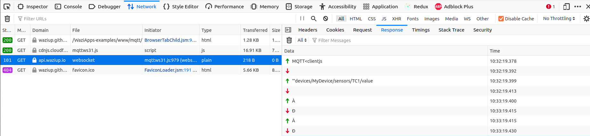

This course will show you how to develop a Web interface for your IoT application. At first, we will develop a very simple Web application, based solely on HTML and Javascript. We will build on this knowledge to go to the next step: the Web frameworks. We will show the basics of three of the most popular frameworks: ReactJS, Angular and Vue.

Simple Web App
==============

HTML + Javascript
-----------------

The simplest Web application is composed of just HTML + Javascript.
Here is an example:

```
<html>
  <body>
    <script>
      fetch("https://api.waziup.io/api/v2/devices/MyDevice/sensors/TC1")
        .then(res => res.json())
        .then(json => {
           document.getElementById("device_value").innerHTML = "The temperature is: " + json.value.value + " C";
      })
    </script>
    <h1>My Application</h1>
    <div id="device_value">
      Loading...
    </div>
  </body>
</html>
```

You recognize some HTML tags: `<html>`, `<body>`, `<div>`...
There is also some Javascript in the middle, in the `<script> </scripts>` tags.
What does this small application do?
Well, if we ignore the script part for the moment, it just have a title (`<h1>`) and a div with displayed "Loading...".
This is what you will see on your screen.
Go ahead and copy this code in a file called "index.html", and open it in your web browser.
After some seconds, this is what you should see:


Once you open the file, the script part will also be executed.
The first part is:

```
fetch("https://api.waziup.io/api/v2/devices/MyDevice/sensors/TC1/values")
```

We perform a call on a URL. This URL is the address of a specific sensor called "TC1" mounted on a device called "MyDevice".
Once this fetch is done, the second part kicks off, using the response from the fetch: 

```
  .then(res => res.json())
  .then(json => {
         ...
  })

```

The above code receives the response from the fetch, then proceeds to decode it as JSON.
With the JSON, we call this function:

```
document.getElementById("device_value")
```

This piece of code will give you the element from the HTML page which have the ID "device_value".
Where did you see that ID before? Ah! It's here:

```
    <div id="device_value">
      Loading...
    </div>
```

So, the function `getElementById` will return a pointer to this exact section of the HTML code.
The idea is to change it "on the fly" and insert our sensor value there.
This is done by the next section of the code:

```
.innerHTML = "The temperature is: " + json.value.value + " C";
```

We set the "innerHTML" of the div to `"The temperature is: " + json.value.value + " C"`.
We use the json returned by the fetch and extract the sensor value.
What we are doing is modifying "live" the "virtual DOM".
DOM is "Document Object Model", this is the internal representation of the HTML page in your browser.
So basically, we are modifying the HTML page live, inserting our sensor value.

This is, really, the simplest IoT Web app that you could do!

Web Sockets
-----------

Web sockets is like HTTP on steroid. 
While HTTP is "fire and forget", Web sockets will open a persistent 2-way connection between client and server.
The session will not be closed after the first request.
As can be seen in the next figure, Web Socket extends the HTTP protocol: We will first send a request to "upgrade" the HTTP connection to Web Socket.
After that, the full-duplex channel will be open.


Let's check [an example using Web Sockets](https://waziup.github.io/WaziApps-examples/www/mqtt/).
Now open the developper's networking tools in you browser, and click on refresh.
You should see:


You might not have seen the HTTP code "101" before: it mean "Switching protocol".
We are "upgrading" from HTTP to Web Sockets.
In the "response" tab, you should see:



The channel is open! Client and server are discussing. This is not anymore "fire and forget".
The underlying protocol here is MQTT, but you can use anything else.


Create a graph plot and a map
-----------------------------

It is very common to display IoT data as a time series graph, or as a map for geographical data.
Let's look at some examples.

Please find the [example for a graph](https://github.com/Waziup/WaziApps-examples/blob/master/www/graph/index.html).


```
<html>
  <body>
    <script src="https://cdnjs.cloudflare.com/ajax/libs/Chart.js/2.7.2/Chart.min.js"></script>
    <script>
      fetch("https://api.waziup.io/api/v2/devices/UGB-PILOTS_Sensor200/sensors/TP/values")
        .then(res => res.json())
        .then(values => {
          console.log("data" + JSON.stringify(values));
          var data = [];
          var labels = [];
          for (value of values) {
            data.push(value.value);
            labels.push(value.timestamp);
          }
          new Chart(document.getElementById("myChart").getContext("2d"),
                   {type: "line", data: { labels: labels, datasets: [{label: "Device values", data: data }]}});
        });
    </script>
    <canvas id="myChart" width="800" height="600">Loading...</canvas>
  </body>
</html>
```

We use the same technique as before: We have a HTML tag that will be replace by live content using a script.
Here, we have a "<canvas>" with ID "myChart":

```
<canvas id="myChart" width="800" height="600">Loading...</canvas>
```

It will be replaced by a graph:

```
new Chart(document.getElementById("myChart").getContext("2d"),
          {type: "line", data: { labels: labels, datasets: [{label: "Device values", data: data }]}});
```

The rest of the code is used to fetch the datapoints and put them in the correct shape.

You can find yet another example, creating a map of IoT devices [here](https://github.com/Waziup/WaziApps-examples/blob/master/www/map/index.html).
In that example, we are creating a map, that setting markers on it, corresponding to the location of the Waziup devices.

All the examples are rendered [at this link]().

Bootstrap
---------

Another Web technology you might have heard of is [Bootstrap](https://getbootstrap.com/).
Bootstrap is a framework built on the top of HTML and CSS3, with some optional Javascript.
It contains design templates for forms, buttons, tables, navigation, modals, image carousels...
Here is a basic example for a [three collumns design](https://getbootstrap.com/docs/5.2/layout/grid/):

```
<div class="container">
  <div class="row">
    <div class="col-sm-4">
      <h3>Column 1</h3>
      <p>Lorem ipsum dolor..</p>
    </div>
    <div class="col-sm-4">
      <h3>Column 2</h3>
      <p>Lorem ipsum dolor..</p>
    </div>
    <div class="col-sm-4">
      <h3>Column 3</h3>
      <p>Lorem ipsum dolor..</p>
    </div>
  </div>
</div>
```

In this example, Bootstrap provides the definitions of CSS classes "row" and "col-sm-4".
Bootstrap is reactive by default, so your web page will look good on any screen size.

Web development frameworks
==========================

In this section, we'll overview some Web development frameworks useful for developping IoT applications.

ReactJS
-------

ReactJS is a Javascript library for writing UIs. 
The basic example looks like that:
Javascript:
```
ReactDOM.render(
  <h1>Hello, world!</h1>,
  document.getElementById('root')
);
```
HTML:
```
<div id="root">
    <!-- This element's contents will be replaced with your component. -->
</div>
```

The example works exactly the same than before: first we call a function `ReactDOM.render` from the ReactJS library.
This function will proceed to replace the content of the HTML `div` with the ID "root".


ReactJS uses [JSX](https://fr.reactjs.org/docs/introducing-jsx.html), a syntax extension for JavaScript that mimics HTML.
In fact, `<h1>Hello, world!</h1>` in the script above is *not* HTML!
It is Javascript. JSX is syntactix sugar that looks like HTML, but the compiler will transform it to javascript.

ReactJS is also based on [Components](https://reactjs.org/docs/components-and-props.html). 
Components are renderable parts of a web page. 
They are very usefull for splitting the UI into independent, reusable pieces.

Angular
=======


[Angular](https://getbootstrap.com/) is built on `Typescript`.
TypeScript is a strongly typed programming language that builds on JavaScript.
That means that Typescript is safer than Javascript, and result in better programs.

Angular uses a templating system directly in the HTML (while ReactJS uses JSX).
Here is an example:

Typescript:
```
import { Component } from '@angular/core';

@Component ({
  selector: 'hello-world-interpolation',
  templateUrl: './template.html'
})
export class HelloWorldInterpolationComponent {
    message = 'Hello, World!';
}
```
HTML:
```
<p>{{ message }}</p>
```

In the HTML above, you can see some templating marks "{{message}}".
The Angular program will read the template and replace the template marker by its value: 'Hello, World!'.
Angular is also has a system of Modules, Components, and Services.


Vue
===

The third and final Web framework that we'll overview is [Vue](https://vuejs.org/guide/introduction.html).
The Vue.js core library focuses on the ViewModel layer only from the [MVVM pattern](https://en.wikipedia.org/wiki/Model%E2%80%93view%E2%80%93viewmodel).
That means that it focuses on the rendering of information, leaving the business logic ot other components.
It is a "progressive" framework because you can extend its functionality with official and third-party packages, such as Vue Router or Vuex, to turn it into an actual framework.
Here is an example.
Javascript:
```
import { createApp } from 'vue'

createApp({
  data() {
    return {
      count: 0
    }
  }
}).mount('#app')
```
HTML:
```
<div id="app">
  <button @click="count++">
    Count is: {{ count }}
  </button>
</div>
```

You can note that the templating system is similar with Angular with the `{{ count }}`.

This concludes our trip through web development. Good programming!
