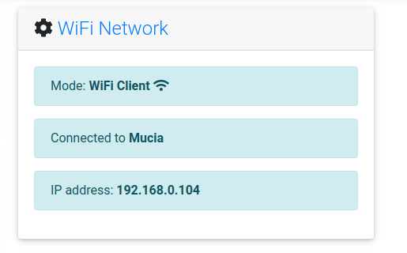
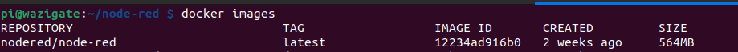
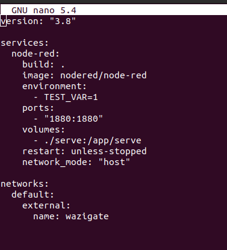
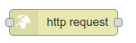
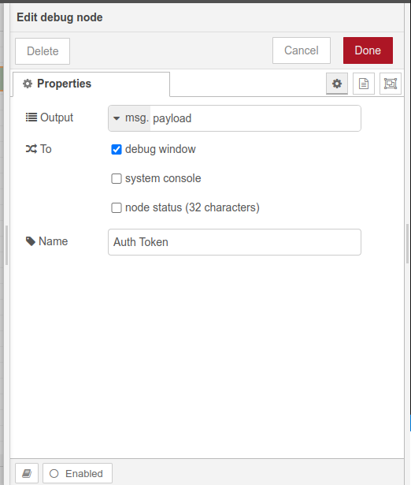
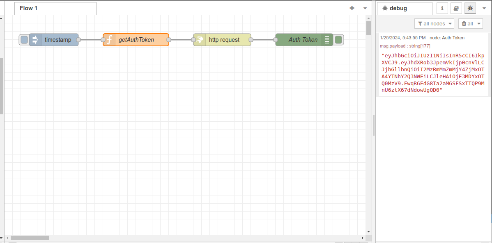
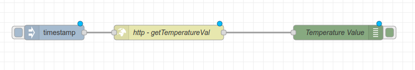
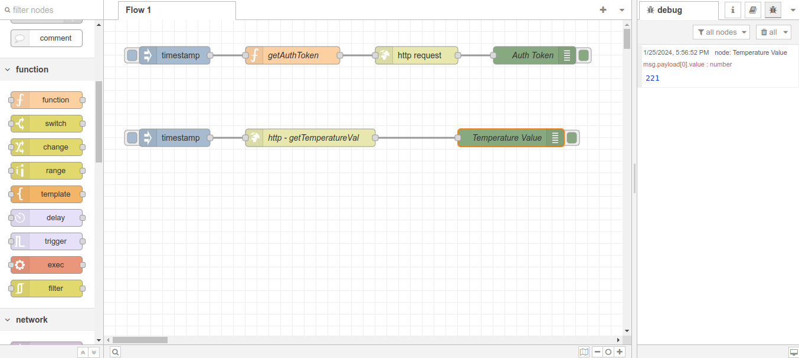
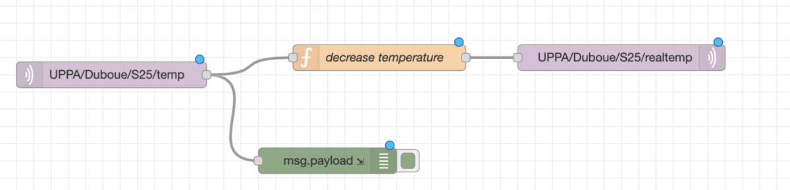

# Introduction

`Node-RED` "is a programming tool for wiring together hardware devices, APIs and online services in new and interesting ways. It provides a browser-based editor that makes it easy to wire together flows using the wide range of nodes in the palette that can be deployed to its runtime in a single-click. Node-RED is a flow-based programming tool, originally developed by IBM’s Emerging Technology Services team and now a part of the JS Foundation".

It is built on Node.js and is available on a large [variety of platforms](https://nodered.org/docs/getting-started/). You can use `Node-RED` on a Raspberry PI, a desktop computer or your laptop. If it is not already installed on your computer, you can follow [instructions](https://nodered.org/docs/getting-started/) from the Node-RED web site. See this video illustrating Node-RED's main features.

<!-- <iframe src="https://www.youtube.com/watch?v=ksGeUD26Mw0" width="600" height="400"></iframe> -->

<!-- `video: https://www.youtube.com/watch?v=ksGeUD26Mw0` -->

[](https://www.youtube.com/watch?v=ksGeUD26Mw0)

You need first to start Node-RED locally with:

    node-red

or

    node-red-start

Then, you can use a web browser to connect to the local Node-RED web interface on `http://127.0.0.1:1880`.

# Installing Node-RED on Wazigate

Wazigate is a raspberry pi powered IoT gateway. Therefore, we can get the docker image for node red and run it on the wazigate. In this module, you will learn how to - Install and run Nodered and run it on the wazigate

- Downloading images from dockerhub
- Setting up waziapps

1. Power you wazigate and ensure that ssh is enabled in your wazigate.
2. Login to the wazigate using the command

```
ssh pi@wazigate.local
```

The default password is `loragateway`
If the wazigate.local does not work for you, replace the command with (wazigate.local) with the IP address of the gateway. You can find the IP address of the gateway under wazigate dashboard



The command should look like `ssh pi@192.168.0.104`

3. Download docker image for node using the command below. The command will install the latest version of node-red in your wazigate.

```
 docker pull nodered/node-red
```

Issue the command below to check if the image is downloaded,

```
docker images
```



The image should be visible as shown above

4. Create a docker compose file to setup the docker image you just downloaded

```
touch docker-compose.yml
```

Open the docker compose file using the command below,

```
nano docker-compose.yml
```

Copy and paste the content below in the docker compose file

```bash
version: "3.8"

services:
  node-red:
    build: .
    image: nodered/node-red
    environment:
      - TEST_VAR=1
    ports:
      - "1880:1880"
    volumes:
      - ./serve:/app/serve
    restart: unless-stopped
    network_mode: "host"

networks:
  default:
    external:
      name: wazigate

```



5. Start the docker container by issueing the command.

```
docker-compose up -d
```


This command creates the docker container for node red and starts it on detached mode

6. Access the nodered from gateway,

Navigate to you gateway ip address and add the port 1880 as shown below,

```
http://192.168.0.104:1880/
```

The format is `http:///<ip-address>:<port-number>`

You can also use `wazigate.local` as shown below:

```
http://wazigate.local:1880/
```

By issueing either of the commands you should receive a node red window as shown below


# A simple Node-RED flow with Wazigate

In this exercise you will create a `node-red` flow that will:

1. Authenticate to wazigate
2. Fetch sensor/actuator values from the wazigate
3. Post actuator values to wazigate

To understand more on the wazigate-edge API, you can refer to the learning content course under `Waziup > WaziupAPI`
Let's first understand basic blocks in node-red. After navigating to the [node red dashboard](http://127.0.0.1:1880), you should see this type of dashboard.


On the left side we see blocks like: inject, debug, switch etc.

**1. Inject Node**


- The Inject node is used to trigger or inject a message into the flow at a specific interval or when manually triggered.
- It is often used to simulate events or trigger flows on a schedule.
- You can configure it to inject messages at a specific time, interval, or in response to external events.
  </br>

**2. Debug Node**


- The Debug node is used for debugging and inspecting messages within a flow.
- It allows you to view the contents of the messages passing through a particular point in your flow.
- You can use it to log information to the Node-RED debug sidebar, helping you understand the data and debug any issues in your flow.
  </br>

**3. Switch Node**


- The Switch node is a conditional node that routes messages based on specified conditions.
- It allows you to define rules or conditions based on message properties and direct the flow to different branches accordingly.
- Useful for creating decision-making logic within your flow.
  </br>

**4. HTTP Request Node**



- The HTTP Request node is used to make HTTP requests to external web services or APIs.
- It can be configured for various HTTP methods (GET, POST, etc.) and includes options for setting request headers, query parameters, and handling response data.
- This node is commonly used to interact with external APIs, fetch data, or send data to remote servers.
  </br>

**5. Function Node**


- The Function node in Node-RED is a versatile block that allows you to write JavaScript code to manipulate or process messages within your flow.
- It allows you to perform complex operations, modify message properties, or create custom logic that is not easily achievable with the standard nodes.
- Implement custom logic based on the content of the message, headers, or other properties.

The names of these can be renamed by double clicking on them and editing their names to your preference. This ensures that your block is easy to understand. Consider this process as assiging variables to your code.


## Authentication with WaziGate

Create the block below by dragging and dropping the node-red block.

The block contains, inject -> function -> http request -> debug


Double click the function block (getAuthToken) and enter the content below

```js
var username = "admin";
var password = "loragateway";

var body = {
    username:username,
    password:password
}
msg.payload = body;

return msg;
```


Edit the username and password, if you changed the credentials.

Double click the http block and enter the following information


```
http://192.168.0.104/auth/token
```

Replace 192.168.0.104, with the IP address of your gateway which you can find under the `wazigate dashboard > settings


The last block is used to log data into the node red console. The content for the block is,



After setting up as per the steps above, click the `deploy` button to save everything.

Click the `timestamp` (inject block). This step initiates the authenticatication process.

Ensure the debug mode is activated so that you can see the output


On successful authentication, you will see the encoded token on the debug window as shown:



_NB: The token is valid for 5mins, therefore, upon expire, just re-inject the block to get another token_

## Getting sensor values from wazigate API

Create the block shown below

inject -> http request -> debug



The content for the http request is shown below,


```
http://192.168.0.104/devices/655af3b968f31909eb88515a/sensors
```

_NB: Ensure you have atleast one sensor created. Also pass the correct device id_

In the authentication box, select bearer authentication and paste the token that you obtained from `Authentication block`

The `temperature value block` (debug) should contain the following,


Finally, click the inject in this block. You will receive data on the console window as shown,



Now that we have the temperature value, lets add logic and a POST command to perform an actuation on the gateway.


The switch block contains the logic for determining whether to send a 1 or 0, for turning ON or OFF respectively


In the above diagram, we set a threshold at 23

The setValue -> 1/0 sets the data to be send to the gateway. Let's look into this `function`.


This is the code for sending an actuator val of 1

```js
var value = JSON.parse(1);
msg.payload = value;
return msg;
```

To send a val of 0, paste the code below into the setValue -> 0 block

```js
var value = JSON.parse(0);
msg.payload = value;
return msg;
```

The next block is the http block which is responsible for sending this data to the gateway, it's similar to the the block in getting temperature value, `getTemperatureVal`, except the url changes to

```
http://192.168.0.104/devices/655af3b968f31909eb88515a/actuators/655af3cf68f31909eb88515b/value
```

_NB: Replace the device id and the actuator id_

The endpoint should follow this structure `http://{IP_ADDRESS}/devices/{DEVICE_ID}/actuators/{ACTUATOR_ID}/value`

The `val Sent` block and `val Response` are debug blocks. The `valSent` shows the value sent, while the `valResponse` returns the response from the http request.

Inject the block by pressing the `inject` (timestamp) block.

_NB: If you get an error, remember to get another token and paste it in the http request blocks_
_NB: After making changes to your blocks, alway click deploy (on the top right) before injecting_

To confirm whether the request was successful. navigate to your gateway -> dashboard -> devices -> actuators. The status should have changed to either on or off depenfing with the logic and the temperature value in the wazigate sensor.


The full block representation is shown below


<!--
## Writing a simple Node-RED flow with MQTT nodes

Create a Node-RED flow with:

- an MQTT input node listening for data on `UPPA/Duboue/S25/temp` topic from `test.mosquitto.org` MQTT broker
- a Function node that would decrease the received temperature by 1.8 degree Celcius
- an MQTT output node that will publish the new temperature on `UPPA/Duboue/S25/realtemp` topic on `test.mosquitto.org` MQTT broker



In the Function node, you can add simple Javascript code to process `msg.payload` which will normally contain the received temperature (string format) on `UPPA/Duboue/S25/temp`. You can also add a debug node after the MQTT input node to verify that you can correctly receive on `UPPA/Duboue/S25/temp`. You can then test your Node-RED flow by deploying it (Deploy button) and use `mosquitto_pub` and `mosquitto_sub` commands to respectively publish on `UPPA/Duboue/S25/temp` and receive on `UPPA/Duboue/S25/#`.

The commands would then look like:

- `mosquitto_pub -h test.mosquitto.org -t UPPA/Duboue/S25/temp -m "21.6"`, to publish a temperature of 21.6 degree Celsius
- `mosquitto_sub -v -h test.mosquitto.org -t UPPA/Duboue/S25/#`, to subscribe to all topics under `UPPA/Duboue/S25`

Use a terminal to subscribe. Then use another terminal to publish. Normally, each time you publish "21.6" on `UPPA/Duboue/S25/temp`, you should receive a modified temperature on `UPPA/Duboue/S25/realtemp`, if your Node-RED flow is correctly developed.

```
> mosquitto_sub -v -h test.mosquitto.org -t UPPA/Duboue/S25/#
UPPA/Duboue/S25/realtemp 19.8
UPPA/Duboue/S25/realtemp 19.8
UPPA/Duboue/S25/realtemp 19.8
...
``` -->
