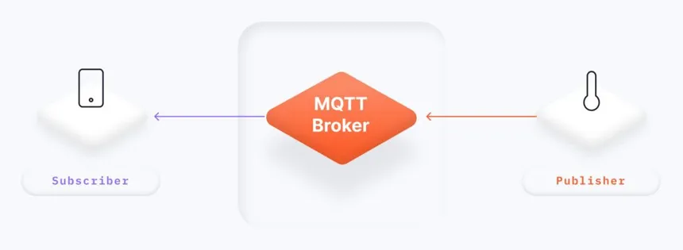

# Introduction

MQTT is a messaging protocal for Internet of Things (IoT). The protocal is designed for transporting messages under low bandwidth. MQTT has find its applications in industries like automotive industry, manufacturing, and telecommunication.

# MQTT Publish & Subscribe model

MQTT follows a publish-subscribe architecture, which involves two major components: **publishers** and **subscribers**.

**Publisher**

- A publisher is a device that generates and sends messages.
- The device publishes messages to a specific topic which the subscriber needs to be subscribed to receive the messages.
- Topics are like channels that help categorize and organize messages. e.g A topic for receiving message etc
- Publishers do not need to know who the subscribers are; they simply publish messages to a topic

**Subscriber**

- A subscriber is a devicethat receives messages from the publisher.
- It subscribes to one or more topics to express interest in specific types of messages.
- Subscribers receive messages from topics they are subscribed to.
- Subscribers do not need to know who the publishers are; they just listen for messages on the topics they've subscribed to.

**Broker**

A broker is a central intermediary/server responsible for managing the communication between publishers and subscribers



Here are example of common broker services,

1. Mosquitto
2. EMQ X
3. HiveMQ
4. RabbitMQ
5. ActiveMQ

**Publish-subscribe architecture**


In MQTT messages are published on topics. Clients receive messages by subscribing to topics. From the figure above, the publisher publishes a sensor temperature value of 21.9 to the temperature topics. Topics are simple strings treated as a hierarchy, using a slash (/) as a separator.

The subscribers, having subscribed to the topic, they will receive the message from the broker.

To learn more on MQTT, you can refer to [https://mqtt.org/](https://mqtt.org/).

# Why use MQTT

- Lightweight and efficient and can therefore be used in resource contrained devices that need real time communication
- MQTT can handle bi-directional communication, hence providing real time communication
- MQTT is easily scalable and can connect to many IoT devices at a go
- The protocal is sucre, transfering messages in encrypted formats
- Reliable in sending messages in IoT use cases. This is because it has Quality of Services (QoS)

# Using MQTT with microcontrollers

ESP8266 will be used to impement the MQTT architecture.

**Code explanationn**

First things first, include a subscribe/publish library.

```
#include <PubSubClient.h>
```

Test MQTT parameters: topic, temperature and MQTT server address

```
char *topicin = "UPPA/test";
char *topicout = "UPPA/Duboue/S25/temp";
char *msgTemp  = "22.5";
char* mqtt_server = "test.mosquitto.org";
```

Define the publish/subscribe client. This will be the client to connect to a particular topic.

```
WiFiClient espClient;
PubSubClient client(espClient);
```

Define a **function callback()** that will listen and process incoming message from a given subscribed topic. This is not needed if you only publish, which is more typical of an end-device. Normally, the messages are received in realtime.

```
void callback(char* topic, byte* payload, unsigned int length) {
  Serial.print("Message arrived [");
  Serial.print(topic);
  Serial.print("] ");
  for (int i = 0; i < length; i++) {
    Serial.print((char)payload[i]);
  }
```

Define a function reconnect() to keep trying to connect to the MQTT broket until it is successful. Here the client id can be random because the MQTT broker we use does not require authentication.

```
void reconnect() {
  // Loop until we're reconnected
  while (!client.connected()) {
    Serial.print("Attempting MQTT connection...");
    // Create a random client ID
    String clientId = "ESP8266Client-";
    clientId += String(random(0xffff), HEX);
    // Attempt to connect
    if (client.connect(clientId.c_str())) {
      Serial.println("connected");

    } else {
      Serial.print("failed, rc=");
      Serial.print(client.state());
      Serial.println(" try again in 5 seconds");
    // Wait 5 seconds before retrying
      delay(5000);
    }
  }
}
```

In function setup(), setup the MQTT server. This acts as the broker. It facilitates communication between publishers and subscribers.

```
client.setServer(mqtt_server, 1883);
```

In function loop(), check if client is connected, if not then reconnect

```
void loop() {

  if (!client.connected()) {
    reconnect();
  }
```

At the end, publish the message on specified topic

```
int e=client.publish(topicout, msgTemp);
```

**Testing MQTT messages**
To test the MQTT publishing from the IoT device, we will use a computer with an MQTT client to listen for a specific topic.

In all the following examples and assignments, if you do not have access to a computer with a terminal window to use `mosquitto_sub` and `mosquitto_pub` command line, you can use the [HiveMQ MQTT web client](http://www.hivemq.com/demos/websocket-client/) to subscribe and publish in place of `mosquitto_sub` and `mosquitto_pub`. In this case, also replace the [MQTT broker](broker.hivemq.com) `test.mosquitto.org` by `broker.hivemq.com` in the Arduino example

```
char* mqtt_server = "broker.hivemq.com";
```

`mosquitto_sub` takes at least 2 parameters: `-h` and `-t`to indicate respectively the MQTT broker and the topic to subscribe to. In the Arduino example, the MQTT broker used was `test.mosquitto.org` and the published topic was `"UPPA/Duboue/S25/temp"`. The `-v` option will display information in verbose mode to get the complete topic in presence of a wildcard.

The command would then look like:

```
mosquitto_sub -v -h test.mosquitto.org -t UPPA/#
```

which means subscribe to all topics under UPPA/. Each time that the IoT device is publishing, you should see on your computer terminal an output similar to:

```
> mosquitto_sub -v -h test.mosquitto.org -t UPPA/#
UPPA/Duboue/S25/temp 22.5
UPPA/Duboue/S25/temp 22.5
UPPA/Duboue/S25/temp 22.5
...
```

In the next chapter, we will implement complex data workflow uusing Node-Red
