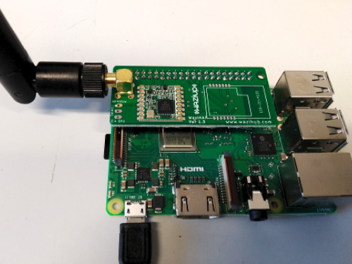

WaziGate Overview
================

<!-- Let's start this lesson on the WaziGate with a tour of its parts and features. -->

WaziGate is an IoT LoRa Gateway, ideal for all your remote IoT applications. The Gateway can cover up to 100 IoT sensors and actuator nodes using the LoRa radio network: weather stations, soil monitoring, GPS applications, etc. The possibilities are endless! The Gateway can also control your actuators, such as electro-valves. You can host your own applications directly on the gateway and connect to it through WiFi. The gateway can easily work without Internet connectivity and still provide data to end-users through its embedded database and web-based visualization module.

<youtube>QCZssYIdKss</youtube>

<alert type='info'> Please get informed. The downloadable files are listed below in the resources section.</alert>

### Resources
- browse [WaziGate User Manual](http://lab.waziup.io/resources/waziup/wazigate)
- download [Gateway ISO Image](https://downloads.waziup.io/)
- download [Raspberry Pi Imager](https://www.raspberrypi.com/software/)
- browse [Raspberry Pi 5](http://lab.waziup.io/resources/waziup/raspberry-pi)
- browse [WaziHat Pro Signle](http://lab.waziup.io/resources/waziup/wazihat-pro-single)

OS Installation
===============
From here and on, you will be guided through the steps to assemble your Wazigate and configure it in order to connect to the Waziup Cloud. 

<youtube>NUv9xwDRtUc</youtube>

## What do you need to start?
- Raspberry Pi
- SD card (minimum 8 GB)
- Gateway ISO Image (link provided in the resource section)
- Raspberry Pi Imager (link provided in the resource section)

## Assemble the WaziGate
There are only two simple steps to assemble your WaziGate:

**Step #1:** Attach the heat sinks.

**Step #2:** Mount a WaziHat on the Raspberry Pi.

## Installation

Nice! Now that you have all the required resources, you are ready to go. First, start by flashing the WaziGate, as shown in the video tutorial earlier.

<alert type='warning'>Your MicroSD card must be at least <b>8 GB</b>, but <b>16 GB</b> is better.</alert>

### Resources
- Download [Gateway ISO Image](https://downloads.waziup.io/)
- Download [Raspberry Pi Imager](https://www.raspberrypi.com/software/)
          

Connect to the WaziGate
=======================

Once the WaziGate OS is installed, we need to connect to it. The following tutorial demonstrates the whole process.

<youtube>ZsFFwagjE5E</youtube>

### Resources
- Download the [Advance IP Scanner](https://www.advanced-ip-scanner.com/)
- Browse [WaziGate](http://lab.waziup.io/resources/waziup/wazigate)

UI Overview
===========

Congratulations! You have it running! 

In this part, you will get to know about the WaziGate UI and its features.

<youtube>SAwH-iR18hc</youtube>

### Resources
- browse [WaziGate](http://lab.waziup.io/resources/waziup/wazigate)

Configuring Internet
====================
Let's now configure the internet on your WaziGate by following two steps:

<youtube>aucdo0knjh4</youtube>

**Step #1:** Select the menu Settings/Wifi.

Once Wazigate finds all the available WiFi networks in range, click on the network that you want to connect to.

**Step #2:** Enter the password for that network and click on "connect."

<alert type='warning'> Once you set up your WaziGate to connect to a WiFi network, you will lose the hotspot connection.</alert>

Configuring the Gateway
======================

Let's now configure the rest of your WaziGate according to the video tutorial.

<youtube>YeDg1wnJhQY</youtube>

A Waziup account enables you to receive all your sensor data in your dashboard and manage your Wazigate remotely. If you do not have an account on the [Waziup dashboard](https://login.waziup.io/auth/realms/waziup/protocol/openid-connect/auth?client_id=dashboard&redirect_uri=https%3A%2F%2Fdashboard.waziup.io%2F&state=7c9547dd-c0bf-4b2a-8642-bdc13a3949a3&response_mode=fragment&response_type=code&scope=openid&nonce=1a520f4b-4814-4607-8472-aaeba34f5b6b), you need to create one first. Then follow the steps:

**Step #1:** Click on the Sync menu. 

**Step #2:** Enter your cloud username and password, and click Save.

**Step #3:** Flip the Active Sync ON.

<alert type='warning'> You need to enter your CLOUD login or password, collected on https://dashboard.waziup.io/. Do not enter your gateway password here.</alert>

### Resources
- browse [Waziup Dashboard](https://dashboard.waziup.io)
- browse [WaziGate](http://lab.waziup.io/resources/waziup/wazigate)

LoRaWAN Sensing and Actuating
=============================

Congratulations on reaching this point! Now, it's time to dive into the exciting world of LoRaWAN sensing and actuating — the real deal awaits you!

<youtube>G_cQ_UaOvq4</youtube>

### Resources
- browse [WaziDev](http://lab.waziup.io/resources/waziup/wazidev)
- browse [WaziAct](http://lab.waziup.io/resources/waziup/waziact)
- browse [WaziSense](http://lab.waziup.io/resources/waziup/wazisense)