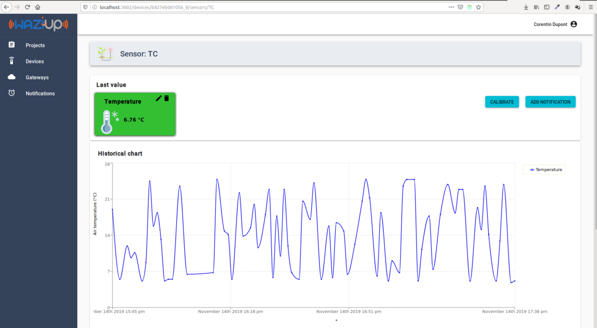

Introduction
============

Welcome to the WaziCloud Basics Course!

This course is designed to help you understand the fundamentals of using the WaziCloud platform. WaziCloud enables you to visualize sensor measurements, control actuators, and monitor your gateways seamlessly.

The first step is to create an account on the Web interface.
The course will then show how to create and connect devices.
This will allow us to monitor the device's status and data.
Gateways can also be managed on WaziCloud with the remote maintenance feature. 
We will also show how WaziCloud can be used to create **Notifications**.
This powerful feature allows you to receive messages on **Social Networks** if some conditions are met regarding the sensor measurements.
It also allows us to create an **Actuation loop**: we can trigger an actuator based on some condition.
Finally, the **projects** feature is demonstrated, allowing the user to conveniently group the various devices and gateways in a single deployment.

<youtube>e3lnWpQQRpc</youtube>

### Resources
- Full Documentation: [WaziCloud](https://www.waziup.io/documentation/wazicloud/dashboard/)

Registration
============

Welcome to WaziCloud Registration! Follow these steps to get started:

**Step #1:** Create Your Account

- Navigate to the [WaziCloud dashboard](https://dashboard.waziup.io/).
  
  

- Choose either of the following options:
  - Click on "Register" to create a new account.
  - Opt for the social network OpenID procedure.
  
- All communications during the registration process are secured by SSL.

**Step #2:** Fill in Your Details

- Complete the required fields in the registration form.
  
  

- Ensure the accuracy of your information.

- After submission, you will receive an email to confirm your registration.

**Step #3:** Log In After Registration

- Once registered, log in using your newly created login and password.

<alert severity='warning'> Please avoid pressing the big red button.</alert>
<alert severity='info'> After creating your login and password, [insert them into your gateway](https://lab.waziup.io/resources/waziup/wazigate).</alert>

Now you're all set to explore the features of WaziCloud. Happy exploring!

Devices
=======

Start by clicking on the "Devices" menu entry. This action will direct you to the dedicated device page. If this is your first visit to the dashboard, you won't find any devices listed on this page yet. Don't worry, the following will guide you through the exciting journey of discovering and managing devices on the Waziup platform.

At this point, you have two choices:
1. Let your gateway create the devices for you,
2. Create your devices manually.

The Waziup gateway will automatically create devices on the WaziCloud dashboard for you.
**So, if you have a WaziGate, you should already be able to find your devices on this page!**
For example, your [WaziDev](/resources/waziup/wazidev/) should be listed here.

Manual creation
---------------

If you want to create your devices yourself on the dashboard, follow this procedure:

**Step \#1:** Click on the "Settings" menu. 

You will get this screen:

**Step \#2:** Activate the "Allow manual creation of gateways and devices" option. 

This option will allow you to create your own devices.

**Step \#3:** Come back to the device screen and click on the "Add a device" button.

**Step \#4:** You can now fill in the details of your device.

On this screen, you can fill in the fields:
- Device ID
- Device name
- Domain
- Visibility
- Gateway

The *Device ID* is the most important. It is a unique ID (across all Waziup platforms) referencing your device.
For instance, it will be used by sensors to push data to your device or by  applications to retrieve data from this device.
Choose it wisely!

The *Device name* is optional; it is a human-readable name for your device. For example, you can set it as "My garden device".
The Domain is optional; it can be setup to group your devices by use case, such as "Agriculture".
*Visibility* can be set to either Public or Private. A Public device can be seen by anyone, while a Private device can be seen only by you.
For your first devices, it is advised to set them to "Public". They will be easier to share with friends.
*Gateway* contains the gateway ID that transmitted this device. It is optional.

Device details
==============

Click on one of your devices.
The following page will show you more details.

On this screen, you can see the details of your device, including its sensors and actuators.
You can edit your device by entering the following:

- Name
- Domain
- Visibility 
- Gateway

The name of your device is important. You should change it as soon as you can to something significant, such as "My weather station".
The domain allows you to group your devices by topics, such as "Agriculture".
You can also set the gateway that is associated with your device. You normally don't need to do that, since your gateway will do it automatically.

Sensors
=======

Click on one of the sensors to open the sensor details page.

Remember that the sensors are automatically created by the gateway.
However, we need to "enrich" our sensor by providing some metadata.
Click on the little pen icon next to the sensor.
This will allow us to set up:

- a sensor name
- a sensing device. This is the kind of physical sensor used: a temperature sensor, a soil moisture sensor...
- a quantity kind. This is what you are really measuring with the sensor. For example, air temperature or water temperature?
- a unit of measurement.

Setting up this metadata is not mandatory; however, it is much better to get it if you want to exploit your data in the long term. It will also allow you to create nicer graphics.

Gateways
========

In this section, we'll learn how to connect and configure your gateway on the Waziup Dashboard.
If you install [WaziGate](/resources/waziup/wazigate), it should already appear on this page.

The small symbol next to the gateway icon shows if your gateway is currently connected. It should appear green if connected.
Now click on your gateway to open the details page.

The details page shows the name, privacy, and ID of your gateway.
It also shows all the devices that are connected to that gateway.
You can click on a device to navigate to that device.

You can open your own Gateway UI by clicking on the "Remote Access" button.
This will open the [login screen for your gateway UI](/resources/waziup/wazigate).

Finally, you can edit the parameters of your gateway and delete them using the corresponding buttons. 

Notifications
=============

The notifications allow you to program SMS or Twitter messages triggered by events on your sensors.
For instance, if a sensor value becomes too high, an SMS will be sent to the user.
The notification list is shown below.
 

For each notification, you can see its name, ID, sensor name, and condition.
Let's create a notification for your sensor!
Click on the “Add notification” button.

You need to select your sensor ID in the list and then the measurement ID.
For instance, select *MySensor* and *TC* to make a notification on the temperature measured by MySensor.

The next field contains the condition for sending the message.
Examples of expressions include “TC==10”, “TC==10..30”, “TC>30”, “Color==orange,red”.
The list of operators is: “==”, “!=”, “>”, “<”, “>=”, “<=”.
Several conditions can be concatenated with “;”, for example: “TC>30; HUM<20”.
The *Message* field contains the message to be sent to the user.
It can contain variables, which will be replaced by their values when the message is sent.
For example, you can include the current value of a sensor in the message with “Field sensor value is ${TC}”.

The next step is to select the users you want to send it to.
Select your own username here.
Finally, select the social media to send one.
Remember, your account needs to be configured with your phone number and Twitter account to receive messages.

Once this is done, you can validate.
You should be able to see your notification on the list.
You can click on that notification to view the details.

Did you receive anything?
You should see the number of times this notification was sent and the time for the last sending in the box "Status".

