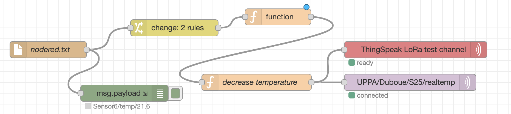

## Node-RED to create complex data workflows

`Node-RED` "is a programming tool for wiring together hardware devices, APIs and online services in new and interesting ways. It provides a browser-based editor that makes it easy to wire together flows using the wide range of nodes in the palette that can be deployed to its runtime in a single-click. Node-RED is a flow-based programming tool, originally developed by IBM’s Emerging Technology Services team and now a part of the JS Foundation".

It is built on Node.js and is available on a large [variety of platforms](https://nodered.org/docs/getting-started/). You can use `Node-RED` on a Raspberry PI, a desktop computer or your laptop. If it is not already installed on your computer, you can follow [instructions](https://nodered.org/docs/getting-started/) from the Node-RED web site. See this video illustrating Node-RED's main features.

<!-- <iframe src="https://www.youtube.com/watch?v=ksGeUD26Mw0" width="600" height="400"></iframe> -->

<!-- `video: https://www.youtube.com/watch?v=ksGeUD26Mw0` -->

[](https://www.youtube.com/watch?v=ksGeUD26Mw0)

You need first to start Node-RED locally with:

    node-red

or

    node-red-start

Then, you can use a web browser to connect to the local Node-RED web interface on `http://127.0.0.1:1880`.

## Writing a simple Node-RED flow with MQTT nodes

Create a Node-RED flow with:

- an MQTT input node listening for data on `UPPA/Duboue/S25/temp` topic from `test.mosquitto.org` MQTT broker
- a Function node that would decrease the received temperature by 1.8 degree Celcius
- an MQTT output node that will publish the new temperature on `UPPA/Duboue/S25/realtemp` topic on `test.mosquitto.org` MQTT broker


In the Function node, you can add simple Javascript code to process `msg.payload` which will normally contain the received temperature (string format) on `UPPA/Duboue/S25/temp`. You can also add a debug node after the MQTT input node to verify that you can correctly receive on `UPPA/Duboue/S25/temp`. You can then test your Node-RED flow by deploying it (Deploy button) and use `mosquitto_pub` and `mosquitto_sub` commands to respectively publish on `UPPA/Duboue/S25/temp` and receive on `UPPA/Duboue/S25/#`.

The commands would then look like:

- `mosquitto_pub -h test.mosquitto.org -t UPPA/Duboue/S25/temp -m "21.6"`, to publish a temperature of 21.6 degree Celsius
- `mosquitto_sub -v -h test.mosquitto.org -t UPPA/Duboue/S25/#`, to subscribe to all topics under `UPPA/Duboue/S25`

Use a terminal to subscribe. Then use another terminal to publish. Normally, each time you publish "21.6" on `UPPA/Duboue/S25/temp`, you should receive a modified temperature on `UPPA/Duboue/S25/realtemp`, if your Node-RED flow is correctly developed.

```
> mosquitto_sub -v -h test.mosquitto.org -t UPPA/Duboue/S25/#
UPPA/Duboue/S25/realtemp 19.8
UPPA/Duboue/S25/realtemp 19.8
UPPA/Duboue/S25/realtemp 19.8
...
```

## Adding ThingSpeak node to upload on ThingSpeak cloud

In a second step, you will add a ThingSpeak node to publish the modified temperature on a ThingSpeak channel. To do so, you may need to install the ThingSpeak node with:

```
> cd
> cd .node-red/node_modules
> npm install node-red-contrib-thingspeak42
```


You can then use our ThingSpeak LoRa test channel (https://thingspeak.com/channels/66794, the write key is `SGSH52UGPVAUYG3S`) and assign the modified temperature to the field of your choice (field 1 to field 8). The Node-RED ThingSpeak node works as follows: for each field, you need to indicate a matching topic that will trigger the upload on that field. So, somewhere in the Function node, you need to assign `msg.topic` to the topic you chose for that field. In this example, you can just take `msg.topic= UPPA/Duboue/S25/realtemp`. If your Node-RED flow is correct, you should also see the temperature value you published on `UPPA/Duboue/S25/realtemp` uploaded on the ThingSpeak channel as well. Check on the [channel page](https://thingspeak.com/channels/66794) for the data you are uploading.

## Real-world IoT deployment scenario using Node-Red

Here, we are going to emulate a more realistic scenario where an IoT gateway will run the Node-RED flow and will receive data from sensor nodes through an adhoc wireless communication using long-range radios such as LoRa for instance. In that case, the Node-RED flow will not listen on an MQTT topic but rather will receive and process data from sensor nodes.

To add an additional data sub-flow in the current flow, simply add new processing nodes to the current Node-RED flow and chain them accordingly. All Node-RED data sub-flows are executed in parallel.

Here, you will use an Inject node to inject the string "Sensor6/temp/21.6" to the Node-RED flow. That would emulate reception of data from a physical sensor node. From a Node-RED perspective, `msg.payload` will be set to `Sensor6/temp/21.6`. This string will then be injected into a Change node. At this point, to better understand how Node-RED messages work and their format you may have a look at [Steves Node-Red Guide on "Understanding and Using The Node-Red Message Object"](https://stevesnoderedguide.com/node-red-message-object) and [Node-RED documentation on "Working with messages"](https://nodered.org/docs/user-guide/messages).


Configure the Change node to translate "Sensor6" into "UPPA/Duboue/S25" and "temp" into "realtemp". Then add a new Function node to process (split) `UPPA/Duboue/S25/realtemp/21.6` in order to have `msg.topic` set to `UPPA/Duboue/S25/realtemp` and `msg.payload` changed to `21.6`. You can use Javascript `msg.payload.lastIndexOf()`, `msg.payload.substring()` and `msg.payload.length` to write your processing code. Remember that you can add debug nodes to verify at each step of your Node-RED flow that it performs as expected.

The message that will come out from the new Function node will then be injected to a copy of your previous Function node that would decrease the received temperature by 1.8 degree Celcius. The final MQTT output node that publishes on `UPPA/Duboue/S25/realtemp` will now simply need to use `msg.topic` as the MQTT topic and `msg.payload` as the new temperature value to publish. Therefore leave the MQTT Topic field empty in the MQTT node configuration tab.

Use a terminal to subscribe to `UPPA/Duboue/S25/#`. Normally, each time you inject the string "Sensor6/temp/21.6" in your Node-RED flow, you should receive a modified temperature on `UPPA/Duboue/S25/realtemp`, if your Node-RED flow is correctly developed.

```
> mosquitto_sub -v -h test.mosquitto.org -t UPPA/Duboue/S25/#
UPPA/Duboue/S25/realtemp 19.8
UPPA/Duboue/S25/realtemp 19.8
UPPA/Duboue/S25/realtemp 19.8
...
```

## More realistic approach

Replace the Inject node by a Tail node that would continuously look for new lines in a local `nodered.txt` file which content will look as follows.

```
Sensor6/temp/21.6
Sensor6/temp/21.3
Sensor6/temp/21.2
Sensor6/temp/21.5
...
```



To do so, you may need to install the Tail node with:

```
> cd
> cd .node-red/node_modules
> npm install node-red-tail
```

Then, from a Terminal window, simply add new lines in `nodered.txt` with:

    > echo "Sensor6/temp/21.6" >> nodered.txt

use a terminal to subscribe to `UPPA/Duboue/S25/#`. Normally, each time you add a line "Sensor6/temp/21.6" in `nodered.txt`, you should receive a modified temperature on `UPPA/Duboue/S25/realtemp`, if your Node-RED flow is correctly developed.

In a real scenario, the IoT gateway could generate new lines in `nodered.txt` when it receives new data from remote sensor nodes. So with this last example, you reproduced the typical behavior of a Node-RED flow that could be run on an IoT gateway.

## Assignment: Additional Node-RED processing nodes

Play with Node-RED, search the web and add additional processing nodes such as email or social media nodes. For email, install the Node-RED node as follows:

```
> cd
> cd .node-red/node_modules
> npm install node-red-node-email
```
