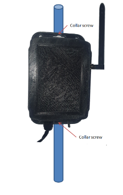
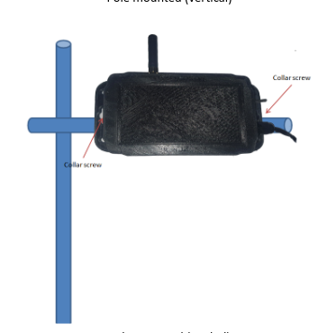

# Designing cases for devices

## Introduction

In this course we will learn how to build an outdoorcasing for your IoT solution. This includes the cabling, boxing and power aspects. Important issues such as the mechanical solidity, resistance to UVs, humidity and dust will be touched upon. Device casing will also be discussed.

Before starting the design process for the case. You need to know where you are deploying your case. For instance, outdoor cases and indoor cases require different parameters to take into consideration.

## Use cases & requirements

**Use cases**

The casing users cases should be taken to consideration. Some user case scenarios for IoT include:

- Agriculture application
- Greenhouse monitoring
- Water level monitoring
- Moisture monitoring
- Weather station

For these use cases each has its own specifications. Therefore, when structuring your requirements, take into account every case.

**Functional requirements**

These requirements describe specific features for the casing. In the development & design process, some common features to consider are

1. The IoT board dimensions you are using. For instance, the `wazisense v2` board has dimension of 70mmx52mm. This means that the minimum casing size should be able to accomodate this board

  

2. The internal accessories to be used and their dimensions. These inlude, sensor modules, battery etc.
3. Casing ports. These provide opening to access the sensor cables. This is incase your casing has wires that go out of the casing. For this step, you can use cable glands or any available cable management techniques. The objective is to have a neat casing.

  <!--   -->
  
  

4.  Finally, take into account the mounting mechanism. The casing designed should be mounted on platforms like, walls, poles etc. Some casing however, don't need to be mounted like wearbles.

**Mounting example of wazisense v2 casing**

**Non functional requirements**

These are the features that describe how the product works. Other parameters to take into consideration include quality, and user expectations. We could classify these features as production requirements or specifications

- **Tolerance**

  This refers to the acceptance error from the final print. An example of tolerance could be +/-0.2mm, meaning that a marginal error of `0.2mm` is allowed.

- **Weight specifications**

  This is the final weight for the casing without considering the components to go into the casing

- **Dust IP rating**
  The rating is used to define the protection of debris, dust, and moisture. A rating of `IP65` can be used.

  **IP 65**

  An IP65 rated enclosure provides ptotection from low-pressure water jets from any direction. This is suitable for most outdoor enclosures that will not encounter any extreme weather such as water submersion.

    

- **Surface finish**

  Finishing a 3D printed part often involves a combination of the following processes: smoother application, sanding, polishing, cleaning and painting. The process is unique to the material type

- **Printing material type**

  Choosing the right material for 3D printing is crucial, as it directly impacts the quality, durability, and functionality of your printed casing. The common used materials are `PLA` and `ABS`. This topic is discussed in the next chapter on 3D printing process.

## Designing for power supply

Power supply is one of the critical areas that designers should consider when coming with the casing requirements. In some applications, secondary power supply like solar panels while others dont need secondary power supply. In cases where the solar panel is to be included, consider having it mounted either directly on the casing, or on an external mounting desing. Below are some examples.

**Direct mounting**

  
  

**Indirect mounting**

  
  
  
