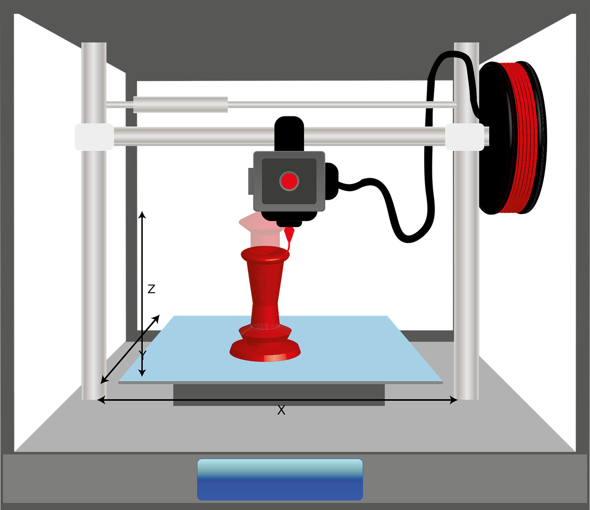
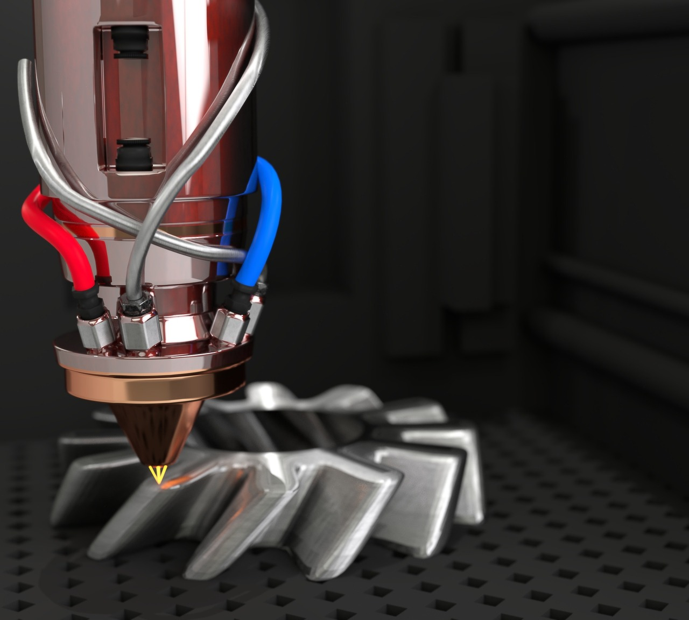
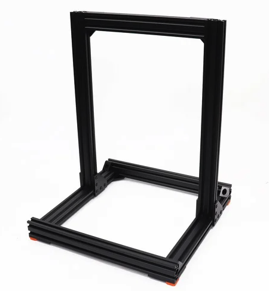
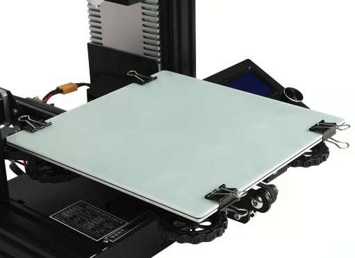
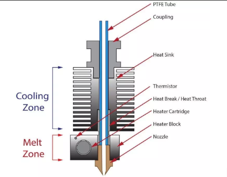
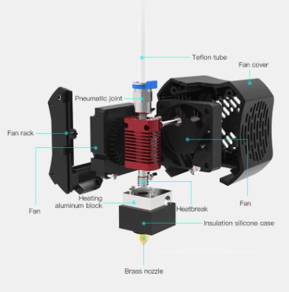
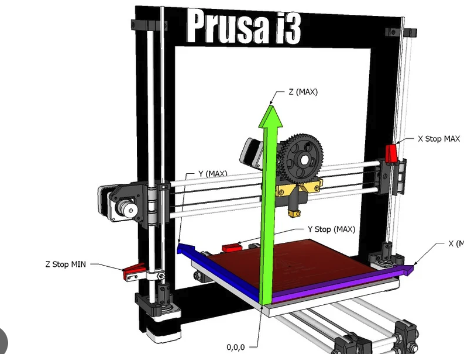
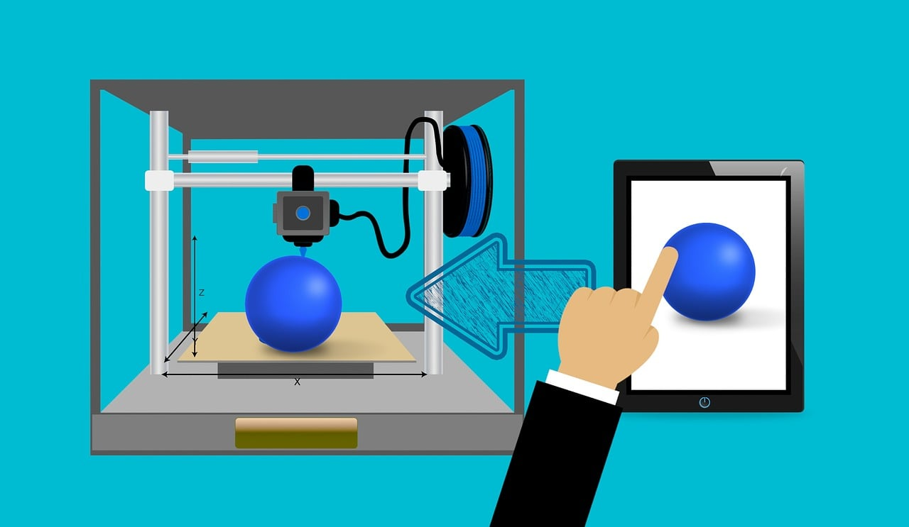

# 3D printing and assembly

3D printing can be used to create the casing for your prototype. In this course, you will learn how to use 3D softwares in order to create a perfect box for your solution.

## Introduction

At its core, 3D printing involves layer-by-layer additive manufacturing. A digital model is sliced into layers, and the printer builds the object layer by layer, fusing materials together to create the final product. This stands in contrast to traditional subtractive manufacturing methods, such as milling or carving, where material is removed to create the desired shape.

  

**Applications of 3D printing**

- **Manufacturing and Prototyping**:

  Rapid prototyping has become a hallmark of 3D printing, allowing for quick and cost-effective iteration of designs.

- **Healthcare**:

  Medical professionals use 3D printing for custom implants, prosthetics, and patient-specific models for surgery planning.

- **Aerospace**:

  Lightweight components and complex geometries achievable through 3D printing enhance efficiency and performance.

- **Automotive**:

  Customized parts, streamlined production, and prototyping contribute to innovation in the automotive sector.

- **Architecture**:

  Architects leverage 3D printing for intricate scale models and prototypes.

## Basics of 3D printing

### Understanding the 3D Printing Process

**Layer-by-Layer Additive Manufacturing:**

At its core, 3D printing is an additive manufacturing process where objects are built layer by layer. This contrasts with subtractive manufacturing methods, which involve cutting or milling material to achieve the desired shape. In 3D printing, a digital model is sliced into thin layers, and the printer deposits or solidifies material one layer at a time, gradually forming the final three-dimensional object.

**The Importance of Digital Modeling:**

Before 3D printing, a digital model of the object is created using computer-aided design (CAD) software. This digital file serves as the blueprint for the physical object and dictates the printer's movements during the printing process.

### Common 3D Printing Processes:

- **Fused Deposition Modeling (FDM):**

  Thermoplastic filaments are heated and extruded layer by layer to create the object.

- **Stereolithography (SLA):**

  Liquid resin is cured layer by layer using ultraviolet light to produce high-resolution, detailed prints.

- **Selective Laser Sintering (SLS):**

  Fine powder is selectively fused together by a laser, creating strong and intricate structures.

- **Digital Light Processing (DLP):**

  Similar to SLA but uses a digital light projector to cure entire layers simultaneously.

  

### Key Components of a 3D Printer\*\*

1. _Frame_ - The structural foundation of the printer.

  

2. _Print Bed_ - The surface on which the object is built.

  

3. _Extruder_ - The component that feeds and melts the filament in FDM printers.

4. _Hotend_ - Heats the filament to its melting point before extrusion.

  

5. _Print Head_ - The assembly containing the hotend and extruder.

  

6. _Axis System_ - The arrangement of axes (X, Y, Z) for precise movement.

  

### Types of 3D printers

**Fused Deposition Modeling (FDM):**

Most common and affordable, suitable for a wide range of applications.
**Stereolithography (SLA):**

Offers high precision and smooth surface finishes, commonly used for detailed prototypes.
**Selective Laser Sintering (SLS):**

Utilizes lasers to fuse powdered materials, enabling the printing of complex and functional parts.
**Digital Light Processing (DLP):**

Similar to SLA but employs a digital light projector for curing layers.

## Design file formats

**STL (Standard Tessellation Language)**

The STL file format is a widely used file format in 3D printing. It represents 3D geometry as a collection of triangular facets, defining the surface of the object. STL files use a mesh structure to approximate the surface of a 3D model, breaking it down into a series of connected triangles.
STL files come in two formats - binary (compressed, smaller file size) and ASCII (human-readable but larger file size).

**OBJ (Wavefront OBJ)**

_Description:_ Developed by Wavefront Technologies, OBJ files support both geometry and material properties.

_Applications:_ Commonly used for 3D graphics and is compatible with 3D modeling software.

**AMF (Additive Manufacturing File Format)**

_Description:_ A more advanced file format than STL, AMF supports color, materials, and more detailed geometry.

_Applications:_ Suitable for complex designs with intricate features and color information.

**3MF (3D Manufacturing Format)**

_Description:_ Developed by the 3MF Consortium, 3MF is an XML-based file format supporting color, materials, and more.

_Applications:_ A modern format aimed at addressing some limitations of STL, offering enhanced capabilities for multi-material and multi-color printing.

**STEP (Standard for the Exchange of Product Data)**

_Description:_ A CAD file format that represents 3D objects using parametric information.

_Applications:_ Widely used in the manufacturing industry for exchanging information between different CAD systems.

### Slicers

A slicer is a crucial piece of software in the 3D printing process that takes a 3D model, typically in STL format, and converts it into a series of instructions (G-code) that the 3D printer understands.

**Key Functions**

- The slicer breaks down the 3D model into horizontal layers, determining how each layer will be printed.
- It calculates the toolpath for the 3D printer's nozzle or laser, outlining the route it should follow for each layer.
- Some slicers can automatically generate support structures for overhanging parts of the model.

**Role of Slicers in 3D Printing**

The slicer translates the 3D model into a language the 3D printer understands – G-code. G-code consists of specific instructions for movements, temperatures, and other parameters.

- Users can specify the thickness of each printed layer, affecting the level of detail and printing speed.
- Slicers allow users to control the amount of infill (internal structure) within the printed object, balancing strength and material usage.
- Users can adjust the speed at which the printer moves, influencing the overall print time and quality.

Slicers analyze the 3D model and can automatically generate support structures to ensure that overhanging or bridging sections of the object print successfully.
These supports are designed to be easily removable after the print is complete.

- Slicers provide a visual representation of how each layer will be printed, allowing users to identify potential issues before printing.
- Users can also estimate the time it will take to print a model and the amount of material required.

**Popular slicers**

1. Cura

   Open-source and free to use.
   User-friendly interface with extensive customization options.
   Compatible with a wide range of 3D printers.

   https://ultimaker.com/software/ultimaker-cura/

2. PrusaSlicer

   Designed specifically for Prusa 3D printers but compatible with other models.
   Offers detailed control over printing parameters.
   Incorporates features like variable layer height for optimized prints.
   https://www.prusa3d.com/en/page/prusaslicer_424/

3. MatterControl

   All-in-one solution with 3D model design, slicing, and printer control.
   User-friendly interface suitable for beginners.

   https://www.matterhackers.com/store/l/mattercontrol/sk/MKZGTDW6

4. Simplify3D

   Comprehensive and highly customizable slicing options.
   Supports a wide range of 3D printers.
   Advanced features for precise control over the printing process.

   https://www.simplify3d.com/

5. OctoPrint

   Primarily a web interface for remotely controlling and monitoring 3D printers.
   Allows slicing and G-code generation, integrating with various slicers.

   https://octoprint.org/

## Plastic materials for 3D printing

**PLA (Polylactic Acid)**

_Overview:_ One of the most popular and widely used 3D printing materials.

Biodegradable and derived from renewable resources (cornstarch or sugarcane).
Low melting point, making it easy to print with.
Suitable for a wide range of applications, especially prototyping and hobbyist projects.

**ABS (Acrylonitrile Butadiene Styrene)**

_Overview:_ A durable and impact-resistant thermoplastic widely used in various industries.

Higher melting point than PLA, making it suitable for functional prototypes.
Excellent layer adhesion but may produce unpleasant fumes during printing.
Commonly used in automotive and electronic components.

**PETG (Polyethylene Terephthalate Glycol)**

_Overview:_ A variant of PET with improved transparency and flexibility.

Combines the strength of ABS with the ease of printing associated with PLA.
Good chemical resistance and toughness.
Suitable for applications requiring durability and clarity, such as bottle prototypes.

[TODO]

## The 3D printing process

### Loading files to a 3D printer

**Wired & Wireless**

Most 3D printers support a direct connection to a computer using a USB cable.
This connection allows for real-time control and monitoring of the printer.

Some modern 3D printers come equipped with Wi-Fi or Bluetooth connectivity options.
Wireless connections enable remote control and monitoring through dedicated software or web interfaces.

  

**Key Considerations for wired and wireless connections**

Ensure that the 3D printer drivers are installed on the computer.
Verify the connection stability to prevent interruptions during the printing process.
Follow manufacturer instructions for establishing a connection.

**Loading Files via SD Card or USB**

- SD Card:

  Save the G-code file onto an SD card.
  Insert the SD card into the printer's card slot.
  Use the printer's interface to navigate to the file and initiate the printing process.

- USB Flash Drive:

  Save the G-code file onto a USB flash drive.
  Connect the USB flash drive to the printer's USB port.
  Access the file through the printer's menu and start the print job.

  To understand more on loading files to a 3D printer, check [this video](https://www.youtube.com/watch?v=A5WfYA1EgOE) tutorial.

### Preparing the 3D Printer

1. Calibration and Leveling of the Print Bed
   It ensures an even and consistent first layer, crucial for successful prints. It prevents issues like adhesion problems, warping, and uneven surfaces.

**Steps for Bed Calibration:**

- **Home the Printer:** Use the printer's interface to move the print head to the home position.
- **Disable Steppers:** Disable the stepper motors to manually move the print head and adjust the bed.
- **Leveling Screws:** Adjust the leveling screws at each corner of the bed until a sheet of paper can be moved with slight resistance between the nozzle and bed.
- **Repeat:** Recheck and adjust as needed, ensuring the entire bed is uniformly leveled.

2. Checking and Calibrating the Extruder

Ensures accurate filament extrusion, preventing under or over-extrusion issues.
Maintains consistent layer adhesion and print quality.

**Steps for Extruder Calibration:**

- **Mark Filament:** Mark a point on the filament, a known distance (e.g., 100mm) from the extruder.
- **Extrude Filament:** Use the printer interface to command the extruder to feed a specified length of filament.
- **Measure:** Measure the distance between the mark and the extruder after extrusion.
- **Calculate and Adjust:** If the actual extruded length differs from the commanded length, calculate the correction factor and adjust the extruder steps per millimeter in the firmware.

3. Temperature Settings and Considerations

**Hotend Temperature:**

PLA: Typically printed between 190°C to 220°C.
ABS: Requires higher temperatures, usually between 230°C to 260°C.
PETG: Printed at temperatures ranging from 220°C to 250°C.

**Bed Temperature:**

PLA: Often does not require a heated bed but benefits from temperatures around 50°C.
ABS: Heated bed temperatures between 80°C to 100°C.
PETG: A heated bed around 75°C to 85°C is recommended.

### Post-Printing Procedures

Always ensures the integrity of the printed object.
Minimizes the risk of damaging the build plate or the print.

**Steps for Safe Removal:**

- **Cooling:** Allow the print and build plate to cool down to room temperature.
- **Use a Spatula or Scraper:** Gently slide a spatula or scraper underneath the print, starting from the edges.
- **Apply Pressure:** If necessary, apply slight pressure to encourage separation between the print and the build plate.
- **Avoid Force:** Avoid excessive force to prevent damage to the build plate or the printed object.

**Understanding Support Structures**
Support structures are temporary elements generated during the 3D printing process to provide stability for overhanging or bridging sections of a print.
They prevent sagging, deformation, and other issues that can arise when printing complex geometries.

**Tools and Techniques for Removing Supports**

1. Pliers or Tweezers:
   Application: Removing large support structures.
   Technique: Grasp the support structure close to the model and gently wiggle or twist to break it away.

2. Flush Cutters or Side Cutters:
   Application: Trimming excess support material close to the model.
   Technique: Carefully cut away the supports, ensuring not to damage the model.

3. Needle Nose Pliers:
   Application: Useful for reaching into small and intricate areas.
   Technique: Carefully grab and pull away supports in tight spaces.

4. Heat Gun or Hot Air Gun:
   Application: Softening supports for easier removal.
   Technique: Apply heat to the support structures, making them more flexible and easier to peel away.

**Cleaning and Finishing Techniques**

1. Removing Support Structures:
   Use pliers, wire cutters, or specialized support removal tools.
   Sanding or filing can be employed for a smoother finish.

2. Smoothing Layer Lines:
   Sand the surface using progressively finer grits of sandpaper.
   Apply filler or putty to smooth out imperfections.

3. Filling Gaps and Imperfections:
   Use modeling putty or filler to fill gaps or imperfections in the print.
   Sand the filled areas for a seamless finish.

4. Painting and Coating:
   Apply primer to create a smooth base.
   Use paints suitable for the chosen material.
   Apply clear coats or sealants for protection and aesthetics.

5. Sanding and Polishing:
   Sand the entire print with progressively finer grits of sandpaper.
   Polish with a soft cloth or polishing compound for a glossy finish.
