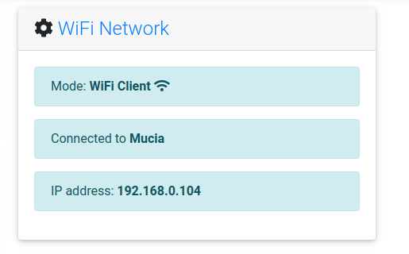
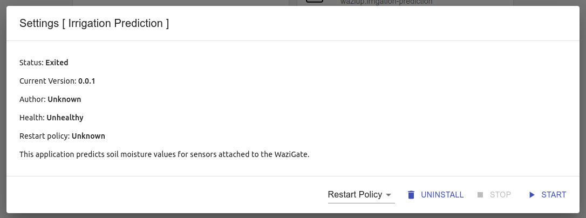

# Deployment and Maintenance

## Introduction

Deployment and piloting is a huge step in any IoT project. In this course, we will detail the deployment procedure, using several examples. Calibration of sensors is also a necessary step during the deployment. Finally, you will learn how to perform local and remote maintenance on your prototype.

Before an IoT solution is deployed, there are critical steps taken to ensure that the systems functions properly. These steps include
preparation, installation, configuration, intergration, testing, then finally doing the deployment.

## Preparation

The preparation phase includes gathering all the necessary hardware components like sensors, actuators and the casing itself. Taking for instance
a solution for monitoring temperatures using `Waziup dev` boards, you will need to gather,

- Temperature sensors
- Microcontroller board e.g Wazidev, wazisense etc
- The casing

Ensure all the devices are functioning well before the assembly and installation procedure.

In the next step you will need to build your network infratracture. This involves setting up your IoT data entrypoint, which is already setup of for you in the `gateway`.
Ensure the gateway is powered and has access to the internet incase you need to send data to the `wazicloud`.

## Installation

Physically install the IoT casing with to the desired location. Note that the `communication range` from the device to the gateway is estimated to be roughly `7km` in crowded and areas with uneven terrain.

However, in a line to line communication, the distance is approximated to be `12km`.
Ensure that your device has access to enough power supply. For solar application, the solar panel should be oriented in a way that it receives maximum solar rays. Furthermore, to prevent entry of dust and water, the casing should have good IP rating as earlier discussed. An IP rating of `IP65` is recommended.

## Configuration

In this phase, you need to have access to the gateway user interface, you can access it from http://wazigate.local

The configuration steps includes setting the user specific data like sensor configuration.

You can set the kind of sensors connected, set actuators connected to your device as well as setting the Wi-Fi connections.

## Testing

The testing phase is used to validate the performance of the device. Some of the key things to check in testing phase are:

1. Data is sent from device to the gateway (downlink)
2. Data is sent from gateway to the device (uplink)
3. Test the communication range for the device to the gateway
4. Battery life of the edge device
5. Time on air (TOA) for the data. This is the duration taken for the data to get transferred from the master to slave and vice versa. The code to perform this step is available in the `wazidev library`.
6. Physical & hardware adaptability to the environment. This tests checks how the hardware casing adapts to the deployed environment. Some arising question include:
   - Is the device water proof
   - Is the device dust proof

Since testing is an important step in any IoT application, more about testing will be touched on in the next module.

## Deployment

Once testing is complete and the tests result to success, the system is deemed ready for deployment.

After the system is deployed, the system should be monitored closely in the initial stages of deployment. This helps to address any arising issues that may arise.

Monitoring should be accompanied with maintenance. The maintenance schedule should include regular updates for both hardware and software, patches etc.

For the software monitoring for dockerized application on the gateway, we need to look at the health of the containers running on the gateway.

On the other hand, you need to look into the battery life, wiring and cabling, and instrusions into the casing for hardware monitoring.
