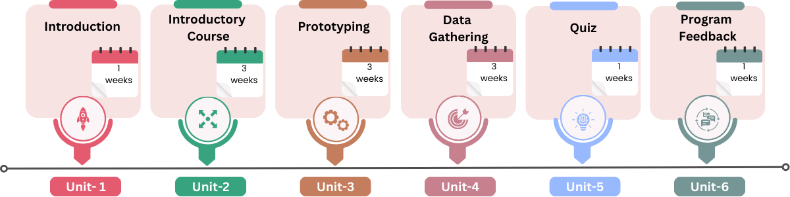

# Overview

The Intel-IrriS Business Capacity Program (IoT irrigation for small farms) (C) gathers everything you need to know about the [PRIMA Intel-IrriS project](https://intel-irris.eu/). We present here a cost-effective soil sensing solution that enables smart irrigation in small-scale farms.

The program is designed to empower local actors into being able to provide hardware, maintenance, and support to small-holders willing to monitor the water resource on their culture fields.  
The program duration is about five weeks, and is articulated in various modules covering the assembly of all the Intel-IrriS devices, gateways, their installation guidelines and usage, the collection of data and its analysis, and links to how to order devices and ask for support.

# Objectives

The objectives of the program are:
- Share the experience and acquired knowledge at/after the end of the project.
- Let people offer support to smallholders for the installation in the field.
- Describe all the possibilities offered by Intel-IrriS so far.
- Let people envision more possibilities.

Units
=====

**Unit 1:** Introduction

**Unit 2:** Introductory Modules

**Unit 3:** Prototype Building

**Unit 4:** Data Collection

**Unit 5:** Quiz

**Unit 6:** Program Feedback

## Timeline

This is the timeline of the program:

Earn certificate
================================

