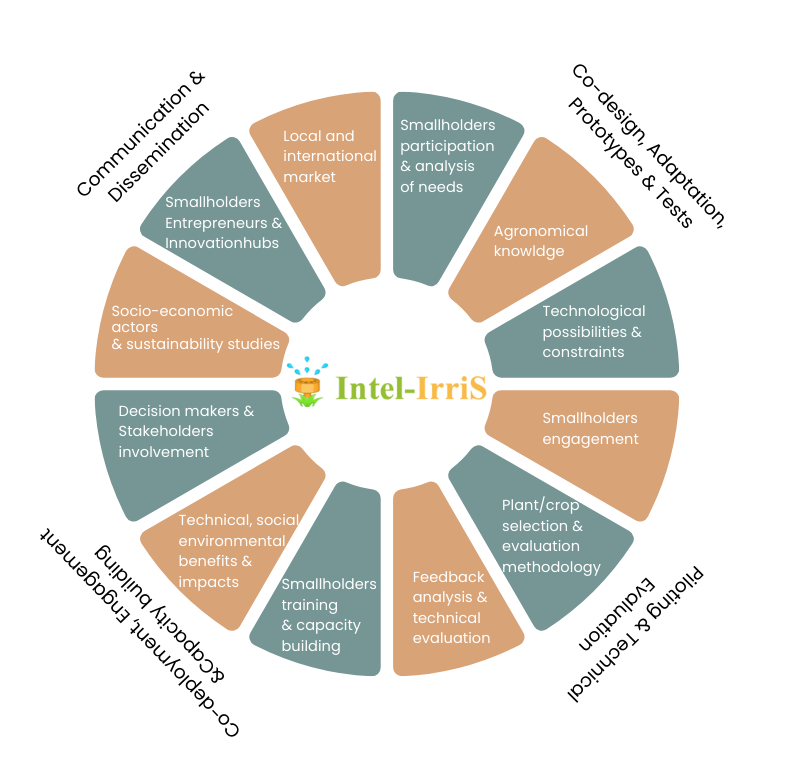
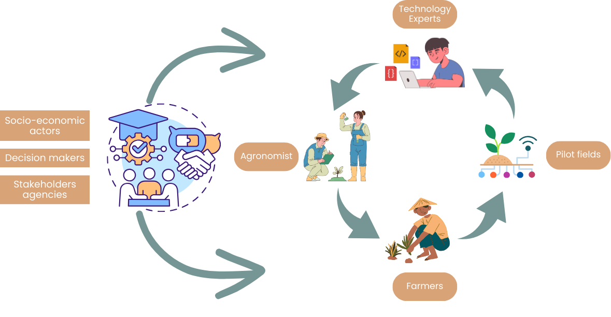

IThe INTEL-IRRIS capacity building program aims to deploy low-cost sensors using a Do-It-Yourself (DIY) approach to address field constraints. This solution has been thoroughly tested, deployed, and validated to ensure effectiveness.

Deliverable D5.3a showcases the INTEL-IRRIS resources designed to build capacity among entrepreneurs and tech communities. The insights in this introduction are inspired by this early deliverable. The main objectives of INTEL-IRRIS include fostering local adaptation of technologies, enhancing local innovation capacity, and facilitating technology appropriation. For more details, see the project's [objectives](https://intel-irris.eu/objectives).

Why INTEL-IRRIS?
=========================
According to the Food and Agriculture Organization (FAO), small-scale farming significantly contributes to food security and rural economies. However, smallholders face challenges that hinder their productivity, profitability, and economic growth, with water resources being a major constraint. Water scarcity, exacerbated by excessive use and climate change, necessitates improved irrigation methods. INTEL-IRRIS aims to provide smallholder farmers with an efficient water management system using an open, low-cost, autonomous irrigation control system based on IoT and smart technologies. This system optimizes water usage for specific crops, times, and soil conditions using predictive algorithms.

The goals of INTEL-IRRIS include:

1. **Water Savings:** Conserve water while increasing usage efficiency.
2. **Cost Reduction:** Lower the cost of smart technologies for smallholders by a factor of 10 to 100.
3. **Adoption Facilitation:** Convert raw data into actionable information for better irrigation decisions.
4. **Sustained Production:** Enhance long-term production and income for smallholders and boost local innovation.

INTEL-IRRIS Objectives
================================================================

INTEL-IRRIS develops an open-source, generic framework that local actors can improve and maintain, fostering the local ICT ecosystem. This approach ensures higher interoperability compared to proprietary solutions. Competitions and challenges will be organized to raise awareness and engage young entrepreneurs. Central to INTEL-IRRIS is the design and implementation of a low-cost sensing platform integrated into the INTEL-IRRIS starter-kit.

**Key Features:**

- Low-Cost: Affordable for smallholders without compromising on precision or user-friendliness.
- Open Source: Enhanced interoperability and local maintenance capabilities.
For detailed information, refer to the introductory tutorial Intro.PDF and the presentation video.

Dissemination Objectives
======================

During the course of the Intel-IrriS project, we ensured the availability of up to date tutorials regarding the use of all the materials, using dedicated technical trainings, tutorials, presentations/slides, videos, github repositories, etc. resulting in a pack of resources through where it may be complex to find your way oout. 

INTEL-IRRIS also set up an [IT online course](https://intel-irris.eu/intel-irris-it-iot-courses) on the project web site to present in a synthetic manner all the resources/tutorials on the INTEL-IRRIS hardware platforms. In addition, it includes additional tutorials to present the Internet-of-Thing ecosystem as well as the smart agriculture/farming concept to make the whole IT courses consistent and allowing tech enthusiasts to increase their technical knowledge in a step-by-step approach. But again, the contents are not focused on Intel-IrriS specificities only, and does not permit a trainee to become independant from the project at its end.

This program summarizes all the material (currently on the device only) with a focus on the very last version of the material at the end of the project. It tends to permit the future reader / learnee to be as much as possible autonomous from the current project members.

Intel-IrriS Structure
=====================

The core technical structure of Intel-IrriS includes the development of a Plug-&-Sense smart irrigation system. This system integrates a low-cost sensor platform with the versatile IoT gateway into the INTEL-IRRIS starter-kit. The IoT gateway, called INTEL-IRRIS WaziGate, is derived from the generic WaziGate framework to provide an out-of-the-box autonomous system. A user-friendly interface is included to simplify the deployment process for smallholders.

Methodology
====================
Intel-IrriS proposes the low-cost sensor design concept where a set of environmental sensors for irrigation control (e.g. soil moisture/ conductivity/ tensiometry, soil & surface temperature, sun exposure, …) will be designed & built from off-the-shelves low-cost physical sensors following an open design approach. The smart control system (i.e. the gateway) will also follow the low-cost approach, taking advantage of powerful embedded computer boards such as the well-known RaspberryPi which costs less than 40€. Such embedded computer boards will be used as a versatile and smart gateway to receive data from low-cost sensor devices – using state-of-the-art long-range LPWAN radio technologies such as LoRa – and to host the control system as well as all the software intelligence that will be developed: Decision Support System (DSS), Artificial Intelligence (AI), user/visual interface, database, … enabling the “in-the-box” concept where all the components to install, set up and start the entire system are already in place, without any mandatory Internet or remote cloud connectivity. Finally, the whole system can be integrated into existing irrigation techniques/infrastructures where available water that can come from several sources (ground water, river, water harvesting, …). This approach along with the “in-a-box” concept will maximize adoption by smallholders.

For more specific information, you can explore the [public presentation slides](github/PRIMA-Intel-IrriS/Tutorials/Intel-Irris-public-presentation-starter-kit-en.pdf) and additional resources on [objectives](https://intel-irris.eu/objectives), [methodology](https://intel-irris.eu/methodology), [consortium](https://intel-irris.eu/consortium), and [pilots](https://intel-irris.eu/pilots).

See also this presentation video for more information:

<youtube>YMGfkLNs624</youtube>

<!--  -->

