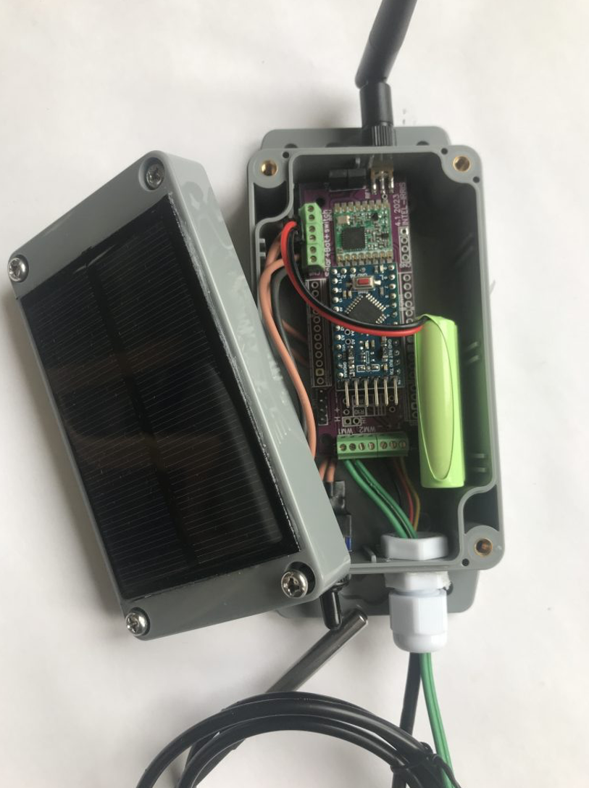

In this unit you need work on developing the prototype yourself. A guid to build the prototype is available in [Wazilab solution.](https://lab.waziup.io/solutions)

[Intel-Irris Solution](http://lab.staging.waziup.io/solutions/waziup/intel-irris) will guide you through this unit.

Collect all the required hardware and software, then with the knolwldge you gained from the courses of previous unit, follow the process build the device successfully. 

After completing this unit and building the device, it will look like the following image.

