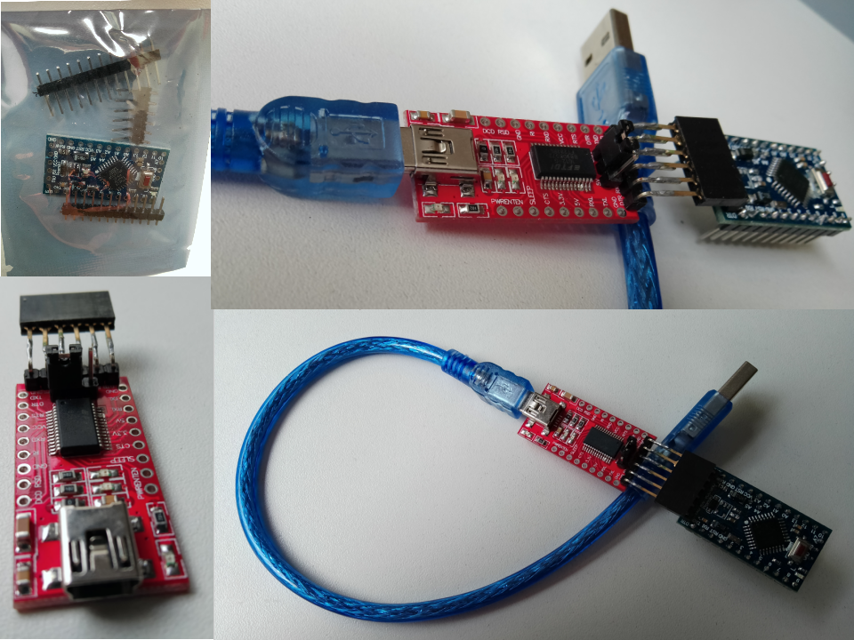
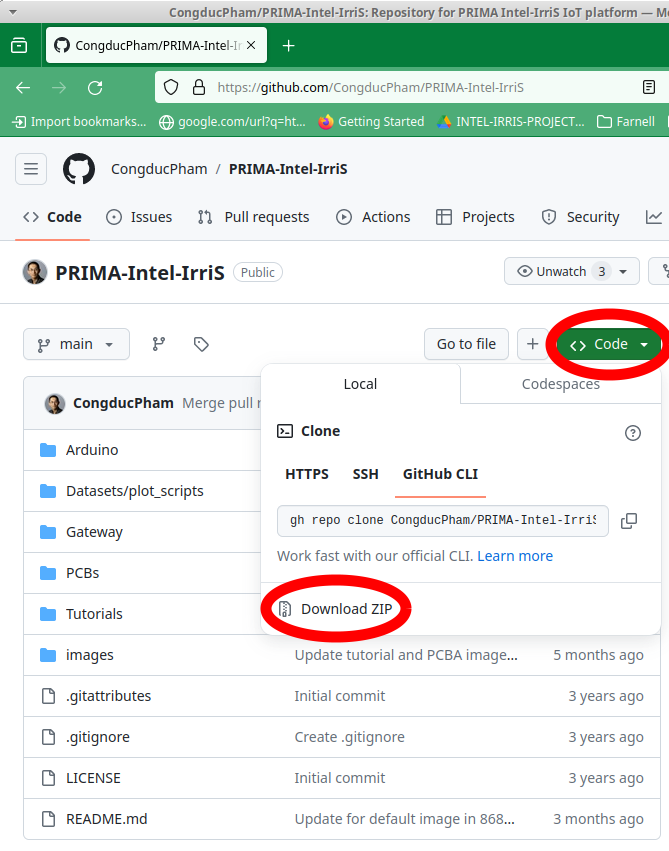
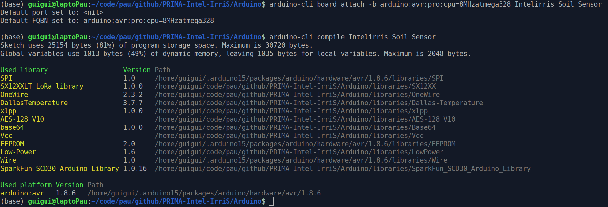
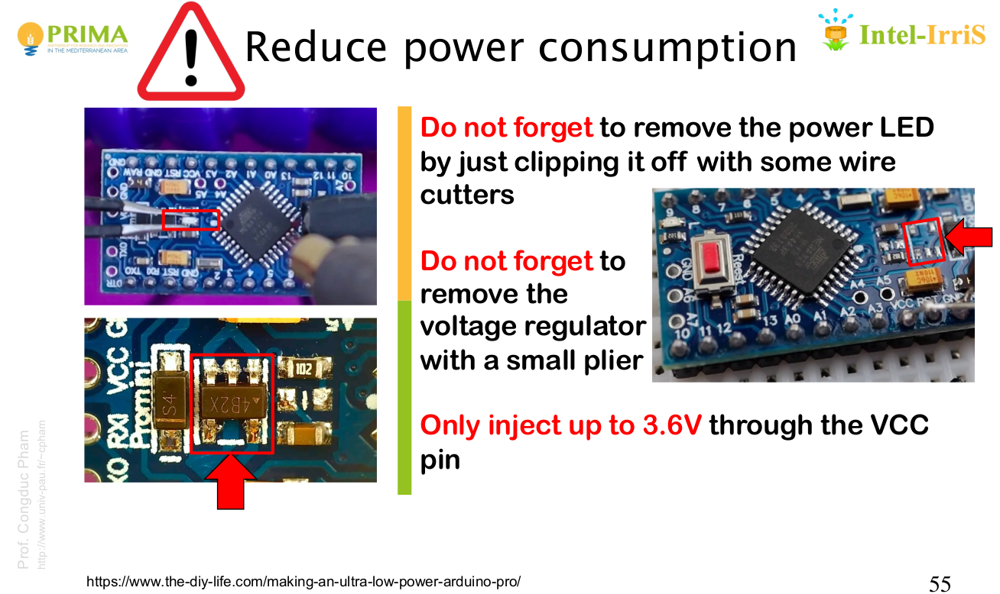

Program the Device
=======
The software managing the device, orchestrating the measurements and the radio transmissions runs on the Atmega microcontroller on the Arduino Pro Mini.

The [Arduino.cc](arduino.cc) community eases the configuration process of the microcontroller, by providing the IDE (integrated development environment), the programming toolchain for all the CPUs and boards in the Arduino family, and plenty of online support.

## 1. Gather the material
Your Arduino usually comes with its 6-pin 90° header, and 2 12-pin male headers. The 6-pin header enables to connect to another board, an *FTDI32*, that creates and manages a Serial communication between the Arduino and a laptop, via USB.

You only need one FTDI32 to program all your boards. 
We tested two different models:
* from Sparkfun [here](https://www.sparkfun.com/products/9873);
* from chinese manufacturer HWA YEH [here](https://fr.aliexpress.com/item/32648254875.html): it can be set either at 5v or 3.3v, and it is much cheaper! 

For the Arduino-FTDI32 connexion, you will need a 6 pin FF adaptor, or 6 FF jumper wires. You can also solder a 6-pin Female long pin header to the FTDI32.

Better choose a short and robust USB cable between the FTDI32 and your laptop.

[comment]: # "One should choose a short USB cable in order not to lose the Serial sync."

## 2. Get the code

The Device's code is available with the other resource of Intel-IrriS on the Github repository: 

**Download** the Arduino folder. You can download all the project (182&thinsp;MiB) using the Github ZIP direct download:

Alternatively, you can download the Arduino folder alone (20&thinsp;MiB) using external tools, e.g. [download-directory](https://download-directory.github.io/?url=https%3A%2F%2Fgithub.com%2FCongducPham%2FPRIMA-Intel-IrriS%2Ftree%2Fmain%2FArduino).

<alert type='success'><b>Extract</b> the obtained ZIP file.</alert>

## 3. Get the IDE

We recommend using the Arduino IDE available [here](https://www.arduino.cc/en/software): it includes the default libraries for the Arduino Pro Minis, a serial monitor, a code editor, it is multi-OS, and it has a broad community of practice.

**Download** and **install** the latest version for your OS.

### Command-line alternative
If you prefer your own text editor, your own serial monitor, but still want to benefit from the Arduino's toolchain, you could use the [Arduino CLI](https://github.com/arduino/arduino-cli) command line tool. I tested and enjoyed [version 0.35.3](https://arduino.github.io/arduino-cli/0.35/installation/) on Xubuntu, with [TIO](https://github.com/tio/tio) as a Serial tool.

[comment]: # "arduino-cli  Version: 0.35.3 Commit: 95cfd654 Date: 2024-02-19T13:24:24Z"

## 4. Set up the code and compile it

### Set up the libraries
The Arduino folder you downloaded and extracted contains a *libraries* sub-folder. In order to make the IDE find and use these libraries, you need to choose the Arduino folder as your sketchbook:

**Go** to `File > Preferences` and **Browse** to choose the Arduino folder as your sketchbook location.

Once done, the IDE will probably ask you to update these libraries:

**Don't do that**, since the Device's code has been validated with this specific version of the compagnion libraries, and is not guaranteed to work with new updates and changes that could be implied.

**Open** the `Arduino/Intelirris_Soil_Sensor.ino` sketch.

-------------------- 
In command-line, Arduino CLI checks the sub-folders for libraries, you just need to navigate to the Arduino folder.

### Choose the board and CPU
You need to **attach** your IDE's window to the Device's board type and CPU:
* `Tools > Boards > Arduino AVR Boards > Arduino Pro or Pro Mini`
* `Tools > Processor > ATmega328P (3.3V, 8 MHz)`
  

-------------------- 
In command-line, use the following command:\
`.../Arduino$ arduino-cli board attach -b arduino:avr:pro:cpu=8MHzatmega328 Intelirris_Soil_Sensor`

### Set up the code
The code is distributed on various C++ modules beside the main INO file. The project encompasses many options regarding different hardware, sensors, radio management, formats, etc. In the scope of Intel-IrriS and this program, you will need to adjust the following files:
* BoardSettings.h
	* **Check** that `#define IRD_PCB` is uncommented (Remove the `//` comment mark if necessary);
	* **Check** that `#define IRD_PCBA` is uncommented (Remove the `//` comment mark if necessary);
	* for devices with a solar panel, **Check** that `#define SOLAR_BAT` is uncommented (Remove the `//` comment mark if necessary).
* RadioSettings.h
	* **Check** that `#define SX127X` is the only uncommented option. The SX127X corresponds to the family of ICs of which the chosen chipsets include a member, or a clone from HopeRF manufacturer.
* Intelirris_Soil_Sensor.ino
	* **Choose** `#define EU868`, `#define EU433`, or the adequate row according to the frequency band you are going to use, as the only uncommented option. Choose this frequency regarding your regional setting and the device's hardware you gathered;
	* for devices with one or two watermarks (W, WT, 2WT types), **uncomment** `#define WITH_WATERMARK`;
	* for devices with two watermarks (2WT types), **uncomment** `#define TWO_WATERMARK`;
	* for devices with a temperature sensor (CT, WT, 2WT types), **uncomment** `#define SOIL_TEMP_SENSOR`.

The code is thought to be generic, i.e. the same for all the Intel-IrriS devices. However, when deploying several devices at the same location, one needs to distinguish their data. In order to identify the devices, the radio frames include a device's address.

Two default (generic) addresses are coded in  `Intelirris_Soil_Sensor.ino`: *26011DAA* for capacitive devices (C or CT), *26011DB1* for watermark devices (W, WT, or 2WT). 

You should **identify extra capacitive devices** using addresses *26011DAB*, *26011DAC*, ..., *26011DAF*. To do so, amend the `Intelirris_Soil_Sensor.ino` program:\
`unsigned char DevAddr[4] = {0x26, 0x01, 0x1D, 0xAA};`
should become for instance:\
`unsigned char DevAddr[4] = {0x26, 0x01, 0x1D, 0xAD};` for the third extra capacitive device.

You should **identify extra watermark devices** using addresses *26011DB2*, *26011DB3*, ..., *26011DBF*. To do so, amend the `Intelirris_Soil_Sensor.ino` program:\
`unsigned char DevAddr[4] = {0x26, 0x01, 0x1D, 0xB1};`
should become for instance:\
`unsigned char DevAddr[4] = {0x26, 0x01, 0x1D, 0xB8};` for the seventh extra watermark device.

[comment]: # "	* for devices without a watermark sensor, the default device address is . If you prepare a deployment involving several devices "

[comment]: # "unsigned char DevAddr[4] = {0x26, 0x01, 0x1D, 0xAA};"
[comment]: # "unsigned char DevAddr[4] = {0x26, 0x01, 0x1D, 0xB1};"
	

### Compile

This compilation step gathers the source code, links them, and produce a program file that is specific to the targeted microcontroller. 
This process involves a complex toolchain with plenty of parameters and linker and compiler pieces of programs such as GCC. All this is made gently user friendly by the Arduino Umbrella, and is quite certainly the plusvalue of Arduino.

In the IDE, the only thing you, the user, need to do, is to press the `Verify/Compile` (&#x2713;) button. 
If the compilation goes as expected, the IDE notificates a `Done compiling`. Otherwise, some error messages appear (in red), that should help resolving the (most commonly programming) issues.

-------------------- 
In command-line, use the following command:\
`.../Arduino$ arduino-cli compile Intelirris_Soil_Sensor
`

The program summarizes the libraries that have been used for the compilation and their version numbers, thus allowing you to check that your Arduino software setup acts as expected.

## 5. Start preparing your Arduino
**Solder** the 6-pin 90° header over the top side of the Arduino. At this point, you don't need to solder the two side headers yet, we are going to check that the Arduino behaves correctly.

Carefully **remove** the power LED and the voltage regulator to make the Arduino ultra-low-power.

## 6. Check your Arduino
In order to check that your Arduino does not have any hardware issue, we recommend to try uploading the program on it using the FTDI32, and check its response on the serial port. If the device acts normally, then most of the possible hardware issues can be discarded.

### Upload
**Connect** the Arduino with the FTDI32. **Check** that both VCC pins are connected (there can be a mismatch in the header orientation).

**Plug** the FTDI32 to your laptop's USB interface. The Power LED of the FTDI32 lights up.

In the IDE, check that a new ungreyed option has appeared in the `Tools>Port` menu: `COM1`, `/dev/ttyUSB0` are some examples. **Select** the new option. **Check** that the Processor and Board settings have not been modified.

Any issue with this step ? => **Check** the OS-specific recommendations [here](https://learn.sparkfun.com/tutorials/how-to-install-ch340-drivers/all). For recent Ubuntu versions, the package `brltty` seems to prevent the use of the serial port for other applications. You could remove it using `sudo apt remove brltty`.

In the IDE, simply **press** the Upload button (=>). The FTDI32 lights start blinking. The IDE will indicate the correct finalization of the Upload.

-------------------- 
In command-line, check which Serial Port the Arduino is connected to using the following command:\
`.../Arduino$ arduino-cli board list`

Correspondingly, upload adapting the following command:\
`.../Arduino$ arduino-cli upload -p /dev/ttyUSB0 Intelirris_Soil_Sensor`

### Check the Serial ouput
In the IDE, just **open** the Serial Monitor by clicking its button on the top right corner.
The Arduino is set to 38400 baud.

-------------------- 
In command-line, you could use Tio like this and save the serial logs to a text file:\
`tio -b 38400 -l --log-file /home/guigui/temp_Arduino.log --timestamp --timestamp-format iso8601 /dev/ttyUSB0`

-------------------- 

If you see something similar, then that means your Arduino works and communicates. No device is responding, because the Arduino is not mounted. We will now connect it to the PCB. 

## 7. Finish preparing your Arduino
**Solder** the two 12-pin side headers over the bottom side of the Arduino. **Solder** also the 3-pin header there on pins GND, A6, A7, (mandatory for solar devices) and the 2-pin header on A4, A5. Use a breadboard as reference to be sure soldering such that the Arduino can be encased into the PCB's female headers.

## 8. Check your Device

Before you plug the Arduino onto the PCB, be **careful**:
- don't overpower your device using at the same time both the battery (switch on) and the USB (FTDI32 on);
- Never transmit without the antenna, you risk damaging the radio chipset.

You can read complementary info in the [PCBv4-PCBA.pdf](https://github.com/CongducPham/PRIMA-Intel-IrriS/blob/main/Tutorials//Intel-Irris-IOT-platform-PCBv4-PCBA.pdf) slides 48-61.

**Check** as previously the serial output (switch off or batteries removed from their holder). You should be able to see a value for each sensor of your device. 

`Sending \!WM1/3276.00/CB1/255.00/WM2/3276.00/CB2/255.00/ST/19.87`

`switch to power saving mode`

If you see these messages, your device is ready. **Close** the Serial Monitor and thus the Serial connection, remove the FTDI32, place the batteries in the holder, and switch on your device.

Normally, you should witness the radio transmission: indeed, during the transmission (around 1.3 seconds at 868&thinsp;MHz) the transmission LED is ON. 

Your device is ready to measure and send data every approximate hour, and sleep in the meantime to preserve batteries. 

[comment]: # "Il faut identifier les étapes que l'on va demander aux 'apprenants' de valider, et ce qu'ils faut qu'ils montrent ou vérifient. Par exemple: 'When flashing the ProMini with the INTEL-IRRIS code, what do you see in the Serial Monitor?'"

[comment]: # "déjà, qu'ils arrivent bien à récupérer le code du github, à configurer l'arduino IDE, à sélectionner le bon board, ..."

# Debug the Device
Most of the issues we faced during the course of Intel-IrriS were addressed (as far as we know, and until new issues get detected).
Nonetheless, I list here the most recurrent issues and how to diagnose and solve them.

## Primary batteries (case without solar panel) 
Most issues are related with the capability of the batteries to powering the device on long-term. 
The cheapest AA batteries will work a few hours and then the device will stop. 
Indeed, the radio transmission is the power-hungriest step of the device's activity. When too little energy remains in the batteries, the voltage decreases during high power demand, below the minimum value tolerated by the microcontroller (around 2.7&thinsp;V), therefore the Arduino shuts down and reboots.

=> **Check** that your device behaves as expected when powered using the FTDI32 connector. See previous Section **Check your Device**;
=> **Check** that your batteries are "heavy duty" AA Alkaline (LR06).

Note that the voltage is not always a good indicator for the batteries' health. A battery can maintain nominal voltage until a high current demand, such as the radio transmission, makes it drop.

There is a debug mode for the voltage, using the capability of the processor to measure voltage itself:
**Compile and upload** the code having `#define TEST_LOW_BAT` uncommented (Remove the `//` comment mark if necessary).
In that case, the sleep time is reduced to 1 minute (this can be modified) to ease the debugging; the voltage at the end of the sleep period, during and after the transmission are reported, both on serial console and in the next radio frame.

## Device does not switch on
=> **Check** that you correctly connect the PCB's H2 header pins according to battery type.
=> **Check** with a volt-meter that the switch cabling is not inverted. There should be no tension between the switch screw terminal screws when switch is off.

## Code configuration mismatch
Check the code, following Section **Set up the code**. Does it match the sensor type and the version of PCB?
Does the chosen frequency band match the antenna and chipset?

## Bad sensor connexion
**Check** wires. Note that a dry watermark gives a default value of 3276.

## Other bugs
If you assume an issue may come from the batteries, you can have both battery powering and a serial connection via the FTDI32. From the 6 pins of the Arduino header, connect 5: **disconnect the VCC pin**. You can then analyze the Serial trace. 

[comment]: # "## range"

