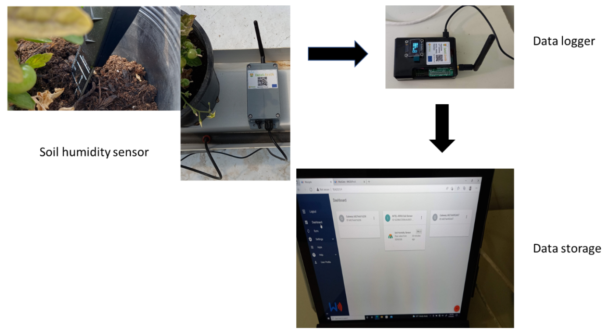

As your IoT prototype get more and more advanced, you need to worry about the data and algorithms at its core. This unit will cover the basics of wazicloud, waziup api, machine learning, computer vision, data analysis, data visualisation and Artificial Intelligence (AI).

The first two course will introduce you to two of waziup technologies. The third course will give you the fundamentals of AI. We then covers two of the main fields of AI: Machine Learning and Computer Vision. The last two courses are more oriented to data analysis than pure AI: data visualization is extremely important to extract insight from you data. The last course gives you insight in data analysis for IoT in particular.

<alert type='success'><b>Task 1:</b> Complete the Wazilab courses and do the exercises</alert>

Data Collection
------------------------

Deliverable D2.2a, D2.2b, D2.2c describes the INTEL-IRRIS starter-kit for smart irrigation systems – v1, v2 and v3 respectively. The starter-kit consists of the low-cost soil sensor device and the versatile edge-enabled IoT gateway with all packaged configuration and add-on software for out-of-the-box deployment.

   - [Deliverable D2.2a - Starter-kit for smart irrigation system – v1](https://intel-irris.eu/wp-content/uploads/2022/06/D2.2a.pdf)
   - [Deliverable D2.2b - Starter-kit for smart irrigation system – v2](https://intel-irris.eu/wp-content/uploads/2023/07/D2.2b.pdf)
   - [Deliverable D2.2c - Starter-kit for smart irrigation system – v3](https://intel-irris.eu/wp-content/uploads/2024/02/D2.2c-lr.pdf)

   
   To perform data extraction get help from the following links:
   - [Gateway-scripts-data-extraction](https://github.com/CongducPham/PRIMA-Intel-IrriS/blob/main/Gateway/scripts/data-extraction/README.md)
   - [Gateway-sensor-backup](https://github.com/CongducPham/PRIMA-Intel-IrriS/blob/main/Gateway/sensor-backup/README.md)

<alert type='success'><b>Task 2:</b> Perform data data collection and extract the datasets in JSON and CSV file</alert>

Data Analysis
----------------------------------------------------------------

For INTEL-IRRIS data, we will program SQL commands modified, near our task. We will use
parameters from weather climate, irrigation data from the system and crop standards. All those will
be fixed with the different soil types properties. With appropriate tests and changes, we will then
proceed to the creation, to the training of the "intel iris" platform. It will be a rubber system, in which
parameters will be incorporated and various types of soils from all countries worldwide can be
analyzed.

D2.3a describes the usage of the INTEL-IRRIS sensing platform to build training dataset. It illustrates how the data from the INTEL-IRRIS sensor are collected, processed, and analyzed. It also gives the
methodology that will be used for building datasets.

- [Deliverable D2.3a - First report on multi-level & multi-stream agricultural
data framework for integration into decision support
system
](https://intel-irris.eu/wp-content/uploads/2023/01/D2.3a.pdf)

Get more help from the following link:
   - [Datasets-plot-scripts](https://github.com/CongducPham/PRIMA-Intel-IrriS/blob/main/Datasets/plot_scripts/README.md)

<alert type='success'><b>Task 3:</b> Perform data analysis  for the construction and use of more economical measuring sensors for further irrigation
decision-making </alert>

Implementing AI prediction tools
------------------------------------------------

The "INTEL-IRRIS AI irrigation model" is a pivotal element within the comprehensive INTEL-IRRIS Edge-AI irrigation system, offering precise and dependable predictions of soil moisture, demonstrating integration of multi-level & multi-stream agricultural data. This model empowers informed
decision-making by farmers, trained using data collected during the data collection phase and external agricultural data. Following its integration into the INTEL-IRRIS Irrigation System, it will undergo real-world testing.
The irrigation model forecasts near-future soil moisture content, facilitating proactive water management. It goes beyond simple moisture prediction, incorporating advanced features like projecting days until critical dryness for a specific crop. Additionally, it estimates
necessary water quantities to maintain optimal soil moisture levels.

D2.4 presents the software framework for
AI processing & D2.5 presents the preliminary work on adding AI-based data processing in INTEL-IRRIS
Plug-&-Sense framework.

- [Deliverable D2.4 - Advanced AI edge-processing framework for
Plug-&-Sense smart irrigation system](https://intel-irris.eu/wp-content/uploads/2024/02/D2.4.pdf)
- [Deliverable D2.5 -
Training procedures for AI processing of collected
agriculture data
](https://intel-irris.eu/wp-content/uploads/2024/02/D2.5.pdf)

<alert type='success'><b>Task 4:</b> Implement AI prediction tools to facilitate the precise calculation of optimal water quantities
and irrigation schedules
</alert>
