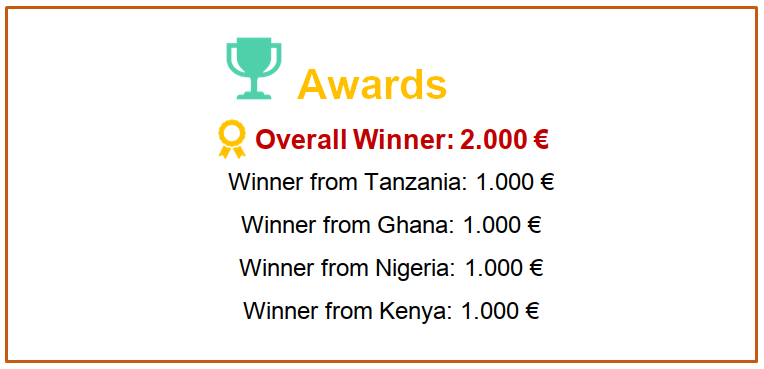

# The Accelerator Program

## What is the HUBIquitous Accelerator Program?

The HUBIquitous Accelerator Program is a **3 month program** aiming at improving your **IoT prototype and business model**.

The objectives of the program are:
- Improve your **IoT prototyping** development skills.
- Support the evolution of your **entrepreneurial project**.
- Facilitate accelerated **business growth**.
- Foster synergies between the selected participants, the mentors and partner.

## Who can participate?

The accelerator is for:
- Entrepreneurs 
- Startups
- Scaleups 
- SMEs

From the folowing countries:
- Ghana
- Nigeria
- Tanzania
- Kenya

## Domains

The following domains of applications will be selected:

# Timeline

This is the timeline of the program:

# Awards

# Documentation

Download the [accelerator handbook](https://hubiquitous.eu/wp-content/uploads/2022/05/Hubiquitous-1st-Open-Call-Guide-for-Applicants.pdf)!
