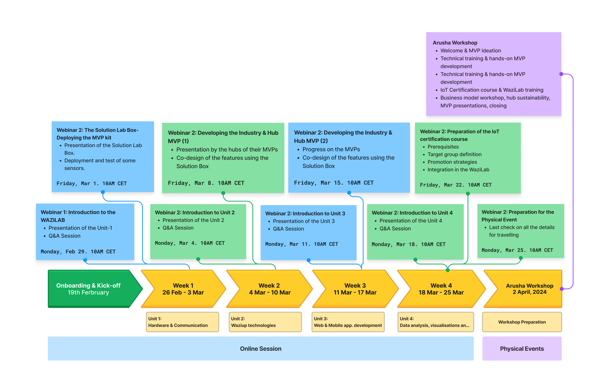

<!--  -->

# Overview

The Deep Virtual Exchange Program facilitates global innovation projects (GIP) with cross-disciplinary teams defining tasks, planning responsibilities, and implementing solutions. Utilizing physical and online infrastructure, teams focus on app development, communication, and marketing tasks. Through virtual exchanges, progress is shared for deploying GIP solutions by university students, showcasing successful outcomes to local stakeholders and policymakers. The students will:

- Acquire IoT skills and knowledge.
- Engage in both virtual and in-person training.
- Receive a "Solution Box" package for setting up or upgrading an in-house IoT labs.
- Develop or enhance GIPs using IoT technologies.

<table>
<thead>
  <tr>
    <th colspan="2">Deep Virtual Exchange</th>
  </tr>
</thead>
<tbody>
  <tr>
    <td>Scope </td>
    <td> 
        <li>Project soft skill training</li> 
        <li>Advanced technical training</li>
        <li>GIP proof of concept implementation in small teams</li> 
    </td>
  </tr>
  <tr>
    <td>Type of online facilitation </td>
    <td>
        <li>Small team meetings</li>
        <li>Technical and hands-on support and training</li>
        <li>Solution lab support for development, implementation, and deployment</li>
    </td>
  </tr>
  <tr>
    <td>Duration </td>
    <td>11 Weeks</td>
  </tr>
  <tr>
    <td>Team size </td>
    <td> Each GIP has max. 10 participants (5 from Europe and 5 Africa) with obligatory mixed teams (EU-Africa). </td>
  </tr>
  <tr>
    <td>Learning outcomes </td>
    <td>
        <li>Project development and management skills</li>
        <li>Emerging digital skills</li>
        <li>Hands-on skills</li>
        <li>Digital transformation technologies application</li>
        <li>GIP development</li> </td>
  </tr>
</tbody>
</table>

# Timeline

# More infos

Please see the [YouthTeamUp Program webpage]

