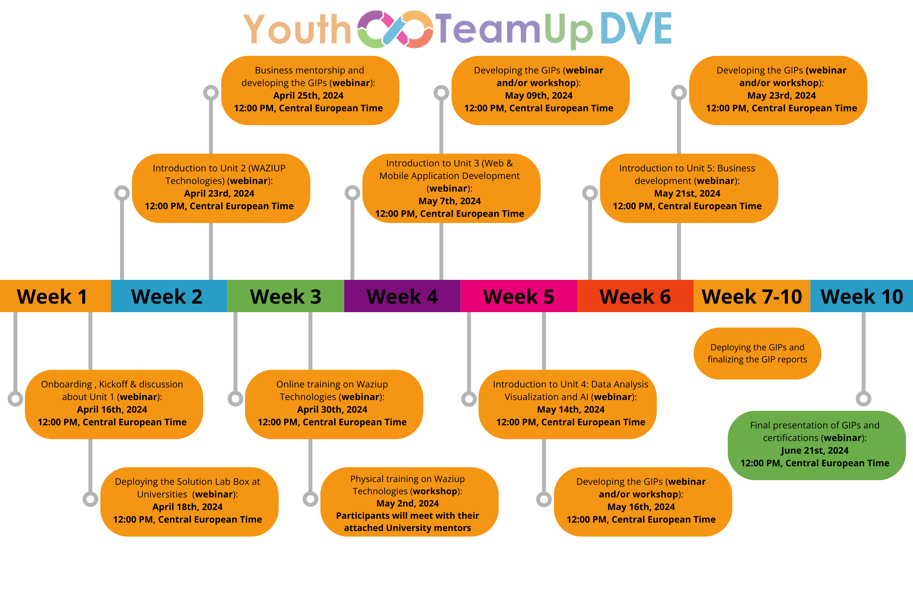

<!--  -->

# Overview

The Deep Virtual Exchange Program facilitates Global Impact Projects (GIPs) with cross-continental and multidisciplinary teams that define tasks, plan responsibilities and implementing solutions. Utilizing physical and online infrastructure, teams focus on projects development (physical prototypes, Web and Mobile applications), communication, and marketing tasks. Through virtual exchanges, progress is shared for deploying GIP solutions by university students, showcasing successful outcomes to local stakeholders and policymakers. The students will:

- Acquire IoT skills and knowledge.
- Engage in both virtual and in-person training.
- Use a "Solution Box", that will be deployed at their Universities, for learning and implementing their GIPs.
- Develop and/or enhance GIPs using IoT technologies.

<table>
<thead>
<tbody>
  <tr>
    <td><b>Scope</b> </td>
    <td> 
        <li>Project soft skill training</li> 
        <li>Advanced technical training</li>
        <li>GIP proof of concept implementation in small teams</li> 
    </td>
  </tr>
  <tr>
    <td><b>Type of online facilitation</b> </td>
    <td>
        <li>Small team meetings</li>
        <li>Technical and hands-on support and training</li>
        <li>Solution lab support for development, implementation, and deployment</li>
    </td>
  </tr>
  <tr>
    <td><b>Duration</b> </td>
    <td>11 Weeks</td>
  </tr>
  <tr>
    <td><b>Team size</b> </td>
    <td> Each GIP has max. 10 participants (5 from Europe and 5 Africa) with obligatory mixed teams (EU-Africa). </td>
  </tr>
  <tr>
    <td><b>Learning outcomes </b></td>
    <td>
        <li>Project development and management skills</li>
        <li>Emerging digital skills</li>
        <li>Hands-on skills on IoT and AI</li>
        <li>Digital transformation technologies application</li>
        <li>GIP development and deployment</li> </td>
  </tr>
</tbody>
</table>

# Timeline

# More infos

Please see the [YouthTeamUp Program webpage](https://www.waziup.io/research-innovation/projects/youthteamup/)

