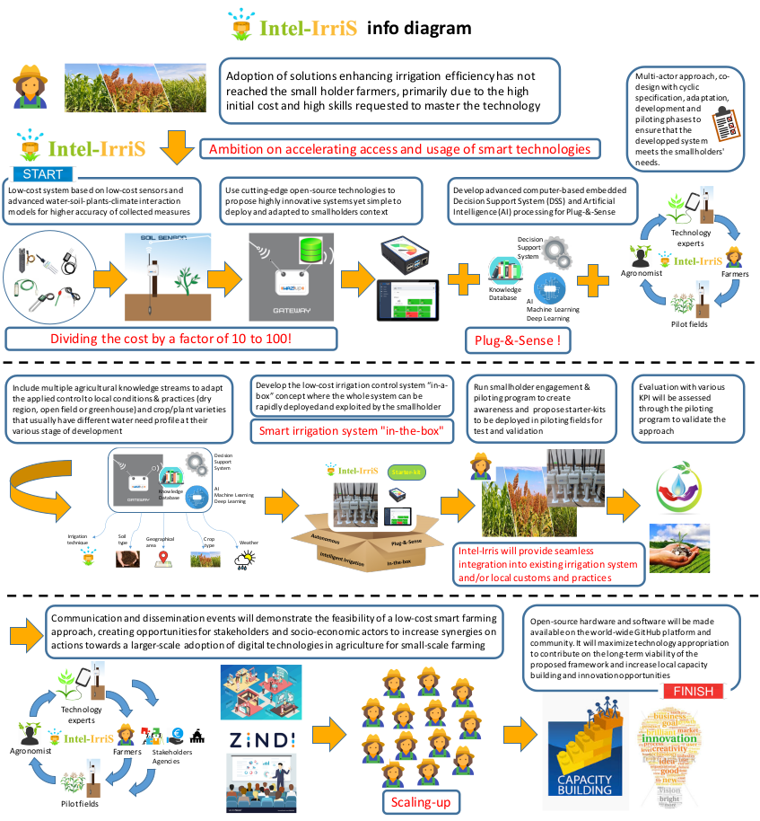
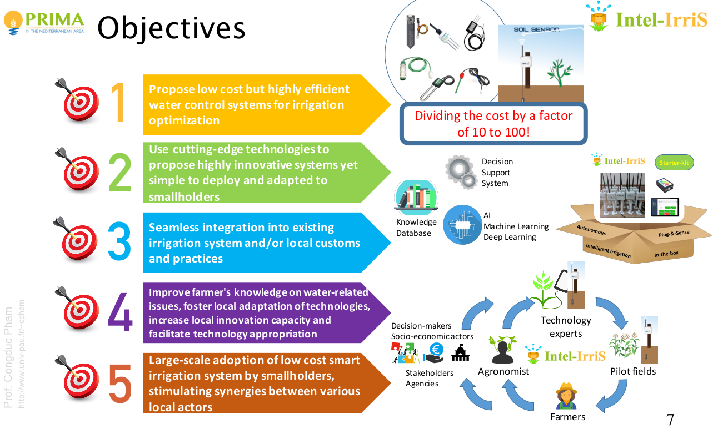
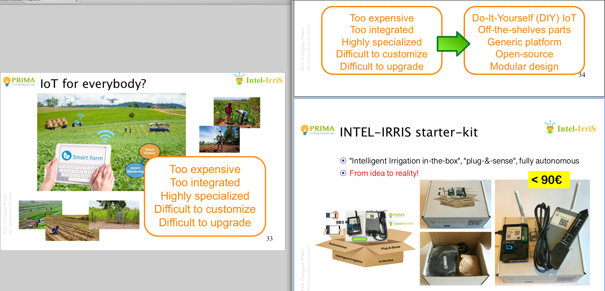
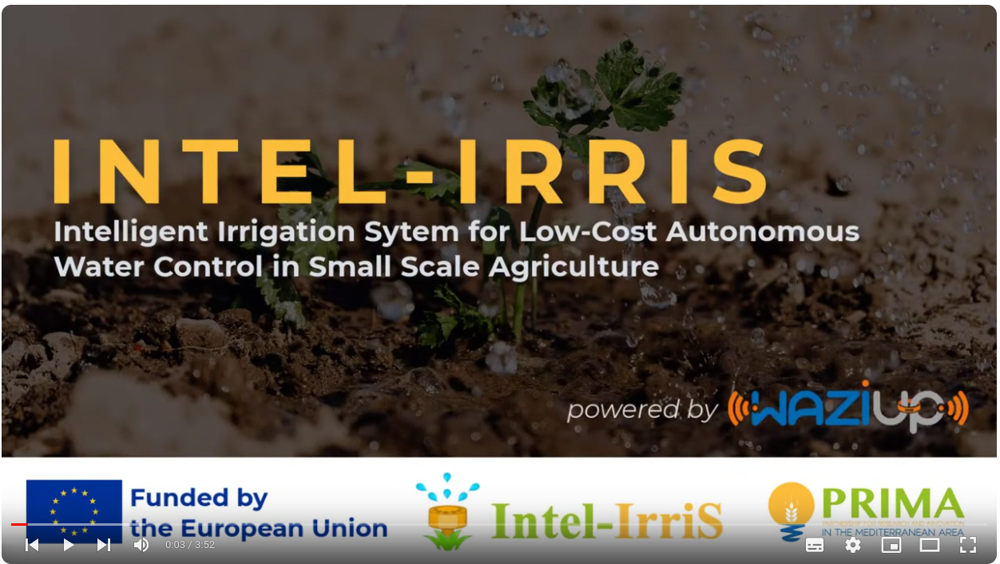
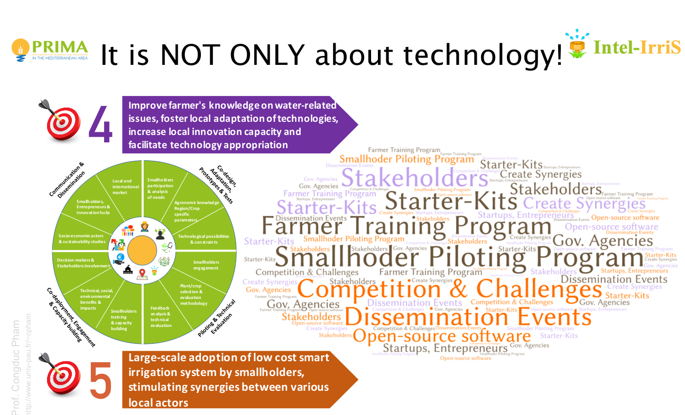

In this intro, we present the objectives of the INTEL-IRRIS capacity building program.
Deploying low-cost sensors in a Do-It-Yourself (DIY) way often faces great difficulties when trying to satisfy concrete field constraints. INTEL-IRRIS provides a solution, presented here, that have been thouroughly tested, deployed, and validated.

Deliverable D5.3a presents the INTEL-IRRIS’s resources towards capacity building of entrepreneurs and tech communities. This introductory content has been inspired from this early deliverable.

One of INTEL-IRRIS main objectives is to foster local adaptation of technologies, increase local innovation capacity and facilitate technology appropriation. See the project's [objectives](https://intel-irris.eu/objectives).

Intel-IrriS why/what for?
=========================

According to FAO, small-scale farming has an enormous contribution to food security and to rural
economy. However, smallholders usually face a number of constraints that are impeding their productivity,
profitability and contribution to economic growth. Water resource is one of the major constraints and the situation
is foreseen to worsen due to water shortage in relation with current excessive use and climate change. Controlled
and improved irrigation can save water while maximising plant growth and yield. The project will provide the
smallholder farmers a more efficient management of its available water by deploying of an open, low-cost and
autonomous irrigation control system based on IoT and smart technologies. The irrigation process to decide/suggest
how much water is needed to maintain the optimal production potential without water wasting can be adapted (i)
for a particular crop, (ii) at a particular moment and (iii) for a given soil type and condition because it will be
seconded by algorithms predicting the behaviour of the complex soil/plant/atmosphere system.

The goal of Intel-IrriS is to contribute in not only saving water but also in increasing the water usage
efficiency, while taking into account the specificities of socio-economic contexts of smallholder farmers as well as
current irrigation practices. Existing solutions are generally very expensive and provide raw data which are not
easy to be used directly by small farmers. Therefore, Intel-IrriS main objectives are (1) to reduce the cost of smart
technologies for smallholders – dividing the cost by a factor between 10 and 100, (2) to increase adoption of
smart technologies by smallholders by "translating" raw data into readable information used for making decision
about irrigation adjustment (reducing total amount of water through improved timing and real-time adaptation to
the agro-environmental conditions) and (3) to increase on a long-term the smallholders' sustained production
and income, as well as the local innovation opportunities and capacities. 

INTEL-IRRIS develops an open source, generic framework that can be improved and maintained by local actors, stimulating the local ICT ecosystem. This open-source approach coupled with the adoption of standards will definitely provide a much higher level of interoperability than proprietary solutions. Finally, calls for Competitions and Challenges will be organized to raise awareness and boost local innovation and engagement from young entrepreneurs.
Central to INTEL-IRRIS’s contribution is the design and implementation of the low-cost sensing platform and its integration in the INTEL-IRRIS’s starter-kit.

From the [introductory tutorial](https://github.com/CongducPham/PRIMA-Intel-IrriS/blob/main/Tutorials/Intel-Irris-introduction-iot.pdf), Intel-IrriS's added value is highlighted there:

It is low-cost in order to be availaible for a maximum of small-holders, without losing precision or user-friendliness compared with the expensive solutions existing on the market.

More info on the [public presentation slides](github/PRIMA-Intel-IrriS/Tutorials/Intel-Irris-public-presentation-starter-kit-en.pdf).
More specific info on the following themes: 
[objectives](https://intel-irris.eu/objectives); 
[methodology](https://intel-irris.eu/methodology); 
[consortium](https://intel-irris.eu/consortium); 
[pilots](https://intel-irris.eu/pilots).

See also this presentation video:

This program what for?
======================

During the course of the Intel-IrriS project, we ensured the availability of up to date tutorials regarding the use of all the materials, using dedicated technical trainings, tutorials, presentations/slides, videos, github repositories, etc. resulting in a pack of resources through where it may be complex to find your way oout. 

INTEL-IRRIS also set up an [IT online course](https://intel-irris.eu/intel-irris-it-iot-courses) on the project web site to present in a synthetic manner all the resources/tutorials on the INTEL-IRRIS hardware platforms. In addition, it includes additional tutorials to present the Internet-of-Thing ecosystem as well as the smart agriculture/farming concept to make the whole IT courses consistent and allowing tech enthusiasts to increase their technical knowledge in a step-by-step approach. But again, the contents are not focused on Intel-IrriS specificities only, and does not permit a trainee to become independant from the project at its end.

This program summarizes all the material (currently on the device only) with a focus on the very last version of the material at the end of the project. It tends to permit the future reader / learnee to be as much as possible autonomous from the current project members.

Intel-IrriS Structure
=====================
Here let's simply sum up the core technical structure of the Intel-IrriS project's feature: the starter kit.

The work conducted to provide a technical proposal has mainly focused on developing the Plug-&-Sense smart irrigation system by integrating the low-cost sensor platform with the versatile IoT gateway into the INTEL-IRRIS starter-kit. The IoT gateway framework, so-called INTEL-IRRIS WaziGate, has been developed from the generic WaziGate framework to provide an autonomous system that can be deployed out-of-the-box. A simple and intuitive user interface has especially been developed and integrated with the generic WaziGate to produce the INTEL-IRRIS starter-kit targeting smallholders.

So basically, you need to go to:

1. Chapter 2 to get all the info on the INTEL-IRRIS Device;
2. Chapter 3 to get more info on the WaziGate.

