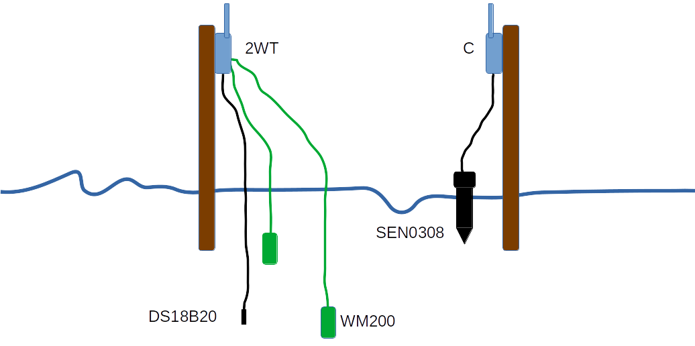
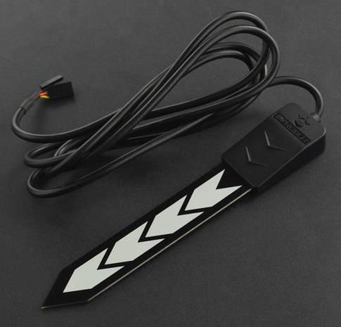

The Intel-IrriS Device is, among the two main components of the system, the most specific of the project. 

Installed in the field, powered by its own batteries, the Intel-IrriS Device works autonomously and periodically: every hour approximately, it gathers the measurements from the ground sensors (soil moisture and temperature) and transmits the values to the [gateway](../3_Gateway/_index.md) using LoRa radio frames. 

The casing is waterproof and shelters the core microprocessor, on an Arduino board, the radio chip, the batteries (whether two non-rechargeable AA alkaline batteries, or 3 AAA NiMh with or without a solar panel), all the connectors and the On/Off switch. 

# Get the Device's components

Different versions of the device exist with different hardware parts. Two developments took place during the project, the Off-the-shelf Waziup design and the DIY UPPA/IRD design. Different versions have been made available at different times of the project.

In this program, we will mainly focus on the most recently updated DIY PCB: the IRD PCBA v4.1. The development approach has been tackling every encountered obstacle both regarding the needed features and the technical challenges. We have simplified the assembly work, and we have included the possibility to autonomously work with a solar panel.

Let's focus on PCBs, radio chipsets, antennas, sensors solar panels, and the other chosen components.

## 1. Order The PCB
### IRD PCBA v4.1, IRD/UPPA's design [this is the current version]

More info:
[IRD PCBA v4.1](https://github.com/CongducPham/PRIMA-Intel-IrriS/blob/main/PCBs/README.md#pcba-ird-v41)

Watch our PDF tutorial, [here](https://github.com/CongducPham/PRIMA-Intel-IrriS/blob/main/Tutorials/Intel-Irris-PCB-update-PCBA.pdf), and our video tutorial:

<!-- [comment]: # "<youtube>ueNRfBzCXiU</youtube>"
 -->
<youtube>ueNRfBzCXiU</youtube>

## 2. Choose the radio chipsets and antennas
[comment]: # "The take-away message here is that "

Before choosing these elements, it is important to note that the allowed frequency band for the LoRa radio communications differs according to local regulations. The band is centered around: 
   1. In Europe: 868 MHz;
   2. In most of the African Countries, e.g. Algeria until recently: 433 Mhz; 
   3. In some other regions: 915MHz;
   4. Traffic is usually allowed on the Wi-Fi band: 2.4 GHz. But this goes with other limitations (range, interferences).

The radio chipset, the antenna, and the software are frequency dependent and must be chosen accordingly. 

### a. Radio chipsets
In Intel-IrriS, we chose two radio modules that are common and easy to find on the market:
- The RFM95W (868MHz)

- The RFM96W (433MHz)

Different versions are available on the market, with different features, most are compatible with the PCBs.
Note that in these pictures, the same Integrated Circuit (IC) is used: HopeRF RF96. 
I took from the datasheets the following tables summarizing frequency compatibilities:
- for ICs:

|Semtech IC| HopeRF IC clone | Frequency Range | Spreading Factor | Bandwidth | Effective Bitrate | Estimated Sensitivity |
| -- | --------- | --------------- | --- |--------------- |--------------- |--------------- |
|SX1276| RF96 | 137 - 1020&thinsp;MHz | 6 - 12 | 7.8 - 500&thinsp;kHz | .018 - 37.5&thinsp;kbps | -111 to -148&thinsp;dBm |
|SX1277| RF97 | 137 - 1020&thinsp;MHz | 6 - 9 | 7.8 - 500&thinsp;kHz | 0.11 - 37.5&thinsp;kbps | -111 to -139&thinsp;dBm |
|SX1278| RF98 | 137 - 525&thinsp;MHz | 6- 12 | 7.8 - 500&thinsp;kHz | .018 - 37.5&thinsp;kbps | -111 to -148&thinsp;dBm |

- for LoRa chipsets:

| Chipset Number | Frequency Band | Spreading Factor | Bandwidth | Effective Bitrate | Estimated Sensitivity |
| --------- | --------------- | --- |--------------- |--------------- |--------------- |
| RFM95W | 868/915&thinsp;MHz | 6 - 12 | 125 - 500&thinsp;kHz | .293 - 37.5&thinsp;kbps | -111 to -136&thinsp;dBm |
| RFM96W/98W | 433/470&thinsp;MHz | 6 - 12 | 62.5 - 500&thinsp;kHz | .1465 - 37.5&thinsp;kbps | -112 to -140&thinsp;dBm |
| RFM98W | 169&thinsp;MHz | 6 - 12 | 31.25 - 125&thinsp;kHz | 73.24- 9375&thinsp;bps | -118 to -143&thinsp;dBm |

<!-- *NB*: the RFM95 chipset contains an RF96 IC. -->
<alert type='info'>The RFM95 chipset contains an RF96 IC.</alert>

### b. LoRa antennae
The antenna model will also depend on the frequency band. The default type for Intel-IrriS devices are simple whip (monopole) antennae. We adopted the following color convention: white antennae for 433 MHz; black antennae for 868 MHz.

The market provides other models, a tradeoff price vs range&sensitivity has to be chosen.
We made some comparisons tests:
[antenna-tests](https://github.com/CongducPham/PRIMA-Intel-IrriS/blob/main/Tutorials/Intel-Irris-antenna-test.pdf)

More info, more models, and market references for both chipsets and antennae here:
[hardware-parts](https://github.com/CongducPham/PRIMA-Intel-IrriS/blob/main/Tutorials/Intel-IrriS-low-cost-sensor-hardware-parts.pdf)

## 3. Choose the sensors
We selected in Intel-IrriS three sensors:
- the *SEN0308 capacitive* soil sensor;
- the *WM200 Irrometer Watermark* water tension sensor;
- the *DS18B20 temperature sensor* for soil temperature.

We further detail them and why we chose them.

The three sensor types can be attached to and confirgured on the devices, in the following combinations or *device type*:

||C|W|CT|WT|2WT|
|-|-|-|-|-|-|
|SEN0308|1|-|1|-|-|
|WM200|-|1|-|1|2|
|DS18B20|-|-|1|1|1|

The most common device type are the Capacitive (C), the Watermark & Temperature (WT) and the 2 Watermarks & Temperature (2WT). 2WT is particularly helpful to obtain information at two different depths in ground, giving insights of the water movements in the soil.

### a. The *SEN0308 capacitive* soil sensor

The cost of capacitive sensors is relatively low (especially when compared to TDR, -time domain reflectometry, probes), which makes it possible to instrument field with a low budget or (if keeping the same budget) by increasing the sensor's density in a given field.
Moreover, their power consumption can be very low and some require low excitation voltages to operate (as low as 3 volts) which allows for a high autonomy with reasonable battery capacities. Finally, they are also relatively easy to install.

The disadvantage of the capacitive method is that the signal is difficult to interpret in the absence of additional information, on the sensor itself and the characteristics of the environment, i.e. soil characteristics (mainly clay content) and the concentration of dissolved minerals. This disadvantage has been compensated in Intel-IrriS by allowing the user and the system to provide contextual information, particularly on soil types, and by recommending a calibration before use. 

Two models of capacitive sensors built by the DFRobot company are commonly used at the moment: SEN0193 & SEN0308 which cost around 5 & 20 euros, respectively. Compared with the SEN0193 version, the SEN0308 sensor has increased waterproof performance; as it can still be used after being immersed in water according to DFRobot. With an increased plate length, the capacitive electrode plate has increased length (12cm approximately) to measure more accurately the soil moisture (in addition, the circuit performances are presented as optimized). Finally, the sensor has a wide input voltage (3.3&thinsp;V-5.5&thinsp;V) and is compatible with Arduino, ESP32, micro:bit, control board, Raspberry Pi and other common control boards.

A complete report about the capacitve measurement method and about this sensor model can be found here:
[Capcitive-KPIs-D3.6b](https://intel-irris.eu/wp-content/uploads/2023/09/D3.6b.pdf)

More info on this sensor can be found here:
[SEN0308-details](https://wiki.dfrobot.com/Waterproof_Capacitive_Soil_Moisture_Sensor_SKU_SEN0308)

### b. The *WM200 Irrometer Watermark* water tension sensor

Intel-IrriS chose this one because it is widespread, and relatively easy to connect to a board (e.g. Arduino). That is, it is less expensive than more sophisticated sensors using other physical processes, but the project can bring and use enough contextual information (soil temperature, soil type), and calibration before use, to overcome the variability and maintenance issues. 

A nice description and basic code example here:
[Watermark-WM200](https://github.com/Waziup/learning-center-content/blob/main/content/en/resources/Sensors/Watermark/index.md).

[comment]: # "you will need a resistor from 7kΩ to 14kΩ (we use 10kΩ)"

### c. The *DS18B20 temperature sensor* for soil temperature

In Intel-IrriS we use the waterproof version of this typical and effective temperature sensor. 

A nice description and basic code example here:
[DS18B20 temperature sensor](https://github.com/Waziup/learning-center-content/blob/main/content/en/resources/Sensors/Temperature_DS18B20/index.md).

## 4. Order all the parts

### a. The solar panels
The Solar panel must fit the casing, Intel-IrriS selected this model: Mini solar panel 6 V 0.6 W 100 mA 60x90mm.
The PCBA has a circuit designed to make the device work with this solar panel and NiMh rechargeable batteries.
The WaziSense v2 however is designed for Li-ion or Li-Po 3.7v batteries. 

Again, since the addition of a solar panel make the device's assembly more complex, costly, and slightly reduce its robustness and watertightness, it is not the default choice of implementation of Intel-IrriS.

### b. List of components
Most of the needed components are listed here:
[hardware-parts](https://github.com/CongducPham/PRIMA-Intel-IrriS/blob/main/Tutorials/Intel-IrriS-low-cost-sensor-hardware-parts.pdf)

Here a brief table summary for the PCBA, with and without a solar panel:

||for PCBA|for solar PCBA |
|-----|--------|----------|
|Arduino ProMini, 3.3&thinsp;V 8&thinsp;MHz with 1 6-pin 90° and 2 12-pin male headers | 1 |1|
|Pack of minimum 5 2.54&thinsp;mm male pin headers (1 3-pin, 1 2-pin) | 1 | 1 |
|ABS waterproof enclosure with screws and joint| 1 | 1|
|2-AA battery holder^|1|-|
|2 AA **Alkaline heavy duty** batteries 1.5&thinsp;V^|1|-|
|3 AAA NiMh 1.2&thinsp;V rechargeable batteries|-|1|
|Mini solar panel 6&thinsp;V 0.6&thinsp;W 100&thinsp;mA 60x90&thinsp;mm|-|1|
|Female (F) or male (M) tipped breadboard/Dupont cables^^ | 1 FF | 2 FF + 2 MM |
|Switch with pre-soldered wires|1|1|
|Waterproof cap for the switch|1|1|
|Cable gland PG7 with nylon joint|1|1|
|3&thinsp;dBi 868&thinsp;MHz or 3&thinsp;dBi 433&thinsp;MHz antenna|1|1|
|Flat-face seal for outer antenna junction (6x11x0.8&thinsp;mm)|1|1|
|DS18B20 for devices of type CT, WT, 2WT|1|1|
|SEN0308 for devices of type C, CT|1|1|
|WM200 for devices of type W, WT, 2WT|1 or 2**|1 or 2**|
|Two-paired screw terminals (dominos)| 1 or 2**|1 or 2**|
|15&thinsp;cm chunks of 2-joint-wire for irometer tensiometer| 1 or 2** |1 or 2**|

<alert type='info'>

- ^ you can equivalently use a non rechargeable 3.6V lithium battery with a 1-AA battery holder.

- ^^ For solar PCBA devices, 2 jumper junctions can be used instead of the 2 FF jumper wires.

- ** 2 for 2WT devices, otherwise 1.

</alert>

[comment]: # "|Nylon joint for pg7 (diameter 12.4)|1|1|1|"

[comment]: # "This table confirms the fact that the PCBA, as compared with the PCBv2, has reduced the complexity of the assembly, and for a start, the ΩΩΩΩΩΩΩΩΩΩΩΩ"

For the device assembly, preparation and programming, you will also need: 
- 1 USB Serial FTDI breakout 3.3&thinsp;V (with 6-pin Female connector and an USB cable to laptop);
- a solder station / soldering iron with thin solder wire;
- a tiny slotted (flat) screwdriver for the screw terminal blocks;
- a comon cruciform screwdriver;
- a drill for the plastic casing, with 7&thinsp;mm and 13&thinsp;mm bits for metal, and a step bit could ease;
- a flat cutter, a wire stripper/cutter, a needle-nose plier, etc.

[comment]: # "8-12&thinsp;mm drill bit for old gw case"

During the project, we provided some links to online webs that had available in 2022, in Pau, France, Europe, the many other components required:
[hardware-parts](https://github.com/CongducPham/PRIMA-Intel-IrriS/blob/main/Tutorials/Intel-IrriS-low-cost-sensor-hardware-parts.pdf).
The provided web links to some vendors were only given as example. An actor willing to order the Intel-IrriS pieces should search from other vendors, available in her region, and catalog items or packs/offer that would allow to optimize cost at the time of ordering.

You could walk the following steps:
1. Parse this components table according to the chosen quantity and types of device, power supply, and to the sensors;
2. Summarize your list of required material, including the sensors, and according to your already available stock;
3. Find the best vendors and offers for your needed quantities and region;
4. Prepare combined orders of different pieces from the same vendors to reduce travel costs and delays;
5. Make the orders :)

[comment]: # "[here](../_index.md#4-list-of-components) or "

