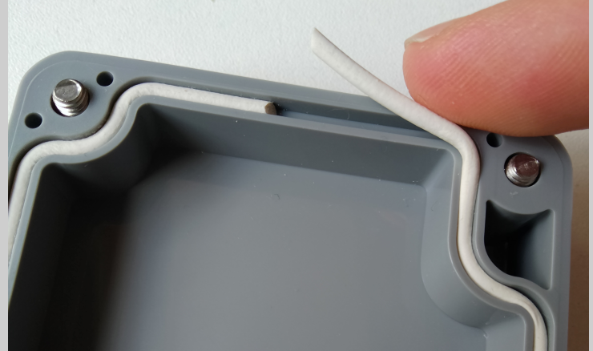
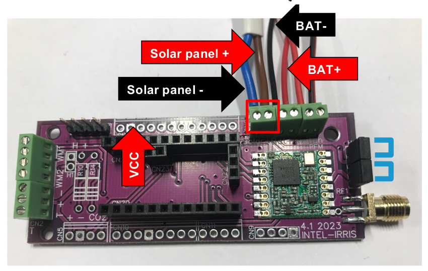

Build the Device
==============

Now that you have all the pieces recieved, let's detail the following steps to put all together and build the device:

[comment]: # "2. Solder a 4-pin on H2 (if not already done);"
1. Drill the case for the cable gland, the switch, the antenna, (the solar panel);  
2. Install the case waterproof joint;
3. Install the switch and cable gland;
4. Connect the switch and the battery holder to the PCB;
5. Connect the sensors' wires to the PCB;
6. (Solder 2 MM wires to the solar panel and connect them to the PCB);
7. Connect H2 pins according to battery type;
8. Connect the antenna.

The following and last three steps should be done after next section (programming the Arduino): 

9. Place the Arduino and test a transmission using a serial connection;
10. Place the batteries in the holder and test;
11. Close the case.

[comment]: # "stick an Intel-IrriS tag on the case "

A complete bunch of detailed material has been made available all along the project, for this section two items are very important:

1. the [PCBv4-PCBA.pdf](https://github.com/CongducPham/PRIMA-Intel-IrriS/blob/main/Tutorials//Intel-Irris-IOT-platform-PCBv4-PCBA.pdf): the Tutorial slides on building the INTEL-IRRIS IoT platform. Part 1: soil sensor device. Focus on the latest IRD PCBv4.1. This tutorial has been updated to focus on the latest IRD PCBv4.1:

2. the [Intel-IrriS video 2](https://youtu.be/zcazzDbXvHk): the YouTube tutorial video showing how to build the outdoor LoRa IoT soil sensor device.  

<!--  -->
<youtube>zcazzDbXvHk</youtube>

[comment]: # ";  
The following dimensions are given for an IP65 box which dimension is 115 x 65 x 40&thinsp;mm.

**Choose** one side of the case for the cable gland and the switch. Leave the other for the SMA connector (antenna).
Use drilling bits for metal (not for wood nor concrete).

**Measure** and prepare the following distances from the flat side of the case, since its corners are rounded.

||from left edge:|from right edge:|from outside bottom edge:|drill bit:|
|--|--|--|--|--|
|SMA connector|-|27&thinsp;mm***|11&thinsp;mm***|7&thinsp;mm|
|Switch|-|20&thinsp;mm|9&thinsp;mm|7&thinsp;mm|
|Cable gland|-|41&thinsp;mm|9&thinsp;mm|13&thinsp;mm*|
|Solar panel|-|-|-|10 to 12&thinsp;mm**|

<alert type='info'>

- *it is recommended to use a step drill bit to first get a 12mm hole before using the 13mm drill bit.
- **in the center of the case's cover.
- ***these dimensions have been updated for the latest PCBA and enable to place three AAA batteries with their holder under the PCB. The video [Intel-IrriS video 2](https://youtu.be/zcazzDbXvHk) mentions a 28 x 9&thinsp;mm dimension compatible with the older PCBv2, but also with the PCBA with 2 AA batteries.

</alert>

**Remove** unwanted plastic part with a flat cutter and/or a small plier for instance, and smooth the inside part of the case to make the interface the most waterproof possible.

More info in the [PCBv4-PCBA.pdf](https://github.com/CongducPham/PRIMA-Intel-IrriS/blob/main/Tutorials//Intel-Irris-IOT-platform-PCBv4-PCBA.pdf) slides 35-43.

More info in the [Intel-IrriS video 2](https://youtu.be/zcazzDbXvHk):

<!--  -->
<yoututbe>zcazzDbXvHk?start=72&end=305</yoututbe>

[comment]: # "1:12 - 5:05"

## 2. Install the case waterproof joint;
Just place it in the case groove and adjust its size to the perimeter.

## 3. Install the switch and cable gland;
The joint (red arrow in figure) for the cable gland is optional but recommended. Do not close the cable gland with its hat, because it would bend its teeth, ensuring imperviousness, before passing cables through it.

The switch has a water-proof rubber cap which should be carefully tightened. The inner nut between the switch box and the case (green) allows to tighten the switch correctly. 

Check the switch is correctly placed. The pin closest to the cable gland is not connected, the switch is open when pointing away from the gland, closed (ON) when pointing to the cable gland.

More info in the [PCBv4-PCBA.pdf](https://github.com/CongducPham/PRIMA-Intel-IrriS/blob/main/Tutorials//Intel-Irris-IOT-platform-PCBv4-PCBA.pdf) slide 44.

More info in the [Intel-IrriS video 2](https://youtu.be/zcazzDbXvHk):  
<!--  -->
<youtube>zcazzDbXvHk?start=305&end=385</youtube>

## 4. Connect the switch and the battery holder to the PCB
Both battery holder and switch have their dedicated screwed connector on the PCB:

## 5. Connect the sensors' wires to the PCB;
Pass the wire through the cable gland and screw or plug them to their dedicated slot on the PCB:

NB: connecting a watermark and a capacitive on the same device is out of the scope of Intel-IrriS; use two devices for this case.

For the watermarks, it is recommended to add a domino connector in order to be able to change the sensor without openning the case and unscrewing the cables inside.

More info in the [PCBv4-PCBA.pdf](https://github.com/CongducPham/PRIMA-Intel-IrriS/blob/main/Tutorials//Intel-Irris-IOT-platform-PCBv4-PCBA.pdf) slides 18-21.
## 6. (Solder 2 MM wires to the solar panel and connect them to the PCB);
This step is only necessary for devices with a Solar panel. The point to note here is that since the cover is drilled you need to renforce the protection against water by completely gluing the solar panel perimeter and center on it.

Follow the recommendations on [PCBv4-PCBA.pdf](https://github.com/CongducPham/PRIMA-Intel-IrriS/blob/main/Tutorials//Intel-Irris-IOT-platform-PCBv4-PCBA.pdf) slides 27-29.

## 7. Connect H2 pins according to battery type;
All explained in slide 26:

You can use two FF jumper wires instead of the jumpers for the case of the NiMh batteries. 

## 8. Connect the antenna.
- **Screw** the antenna in all the way.

- **Waterproof** the junction using flat silicon seals or silicon joint sealant.

More info in slides 45-47.

## 9. Place the Arduino and test a transmission using a serial connection;
See next section.

[comment]: # "slide 31 solder 3-pin header on the Arduino"

## 10. Place the batteries in the holder and test;
See next section.
## 11. Close the case.
Check that the switch, the antenna, and the cable gland are tightly screwed to the case;
Then just screw down the case cover. Make sure all the wires are inside the case so that they suffer no damage when closing the case. 

