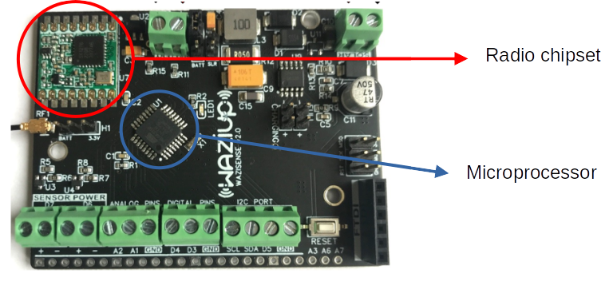
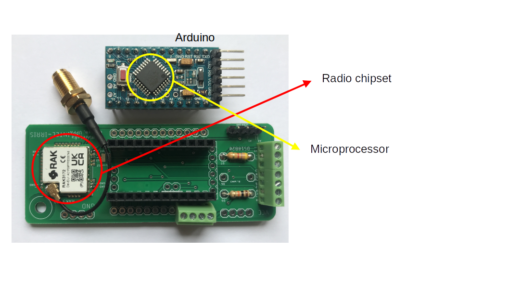

<!-- 2.v. Learn more info
==================== -->

## 1. PCB variants
### a. WaziSense v2.0, Waziup design

More info:
[WaziSense Intro](../../../../resources/Boards/WaziSense/index.md); 
[WaziSense User Manual](../../../../resources/Boards/WaziSense/user_manual.md)

### b. UPPA PCB v2, UPPA's design [this version is outdated]

More info:
[UPPA PCB v2](https://github.com/CongducPham/PRIMA-Intel-IrriS/blob/main/PCBs/README.md#pcb-v2)

#### List of additional components for this PCBv2

||for PCBv2|
|--------------|----|
|12-pin screw terminal block (green)|1^ or 2|
|2-pin or 4-pin screw terminal block (green) | 1 |
|12-pin female header | 2 |
|RFM95W (868&thinsp;MHz) or RFM96W (433&thinsp;MHz)| 1 |
|SMA female PCB connector for 1.6&thinsp;mm PCB| 1 |
|1 4.7&thinsp;kΩ*, 1 or 2** 10&thinsp;kΩ resistor(s) |1|
|10 heat-shrink tubes to isolate wires***|1|

<alert type='info'>

- ^for devices type C (with a capacitive sensor only), see [2.i.3](#3-choose-the-sensors)
- *for devices with temperature sensors, see [2.i.3](#3-choose-the-sensors)
- **for devices with 1 or 2 watermark sensors, see [2.i.3](#3-choose-the-sensors)
***2 tubes for each resistor's end wire.

</alert>

[comment]: # "|Nylon joint for pg7 (diameter 12.4)|1|1|1|"

[comment]: # "This table confirms the fact that the PCBA, as compared with the PCBv2, has reduced the complexity of the assembly, and for a start, the ΩΩΩΩΩΩΩΩΩΩΩΩ"

### c. UPPA PCB RAK3172 v1, UPPA's design [this version is not the common one]

More info:

[UPPA PCB RAK3172 v1](https://github.com/CongducPham/PRIMA-Intel-IrriS/blob/main/PCBs/README.md#pcb-rak3172-v1)

### d. IRD PCB v4.1, IRD/UPPA's design [this is the raw (non assembled) current version]

More info:
[IRD PCBA v4.1](https://github.com/CongducPham/PRIMA-Intel-IrriS/blob/main/PCBs/README.md#pcb-ird-v41)

## 2. Power consumption studies
During Intel-IrriS we have been studying the power consumption of the different device types. Note that the current demand for the different activities of the device are very different (measure from sensors, less than 10&thinsp;mA; transmit, some 100&thinsp;mA; sleep, around 5&thinsp;&#181;A), thus making the study complex:
* short-circuit the Ampere-meter during high current draw to prevent it being damaged;
* isolate the Arduino activity from the others;
* real-time measurements for the device's activities lasting less than one second;
* necessary software debug logs to analyze the measurements.

Assuming a constant voltage 3.0&thinsp;V, we estimate a device would need no more than 450&thinsp;mAh to work during one year.

[comment]: # "<youtube>wgfhedtyjhdt</youtube>"

